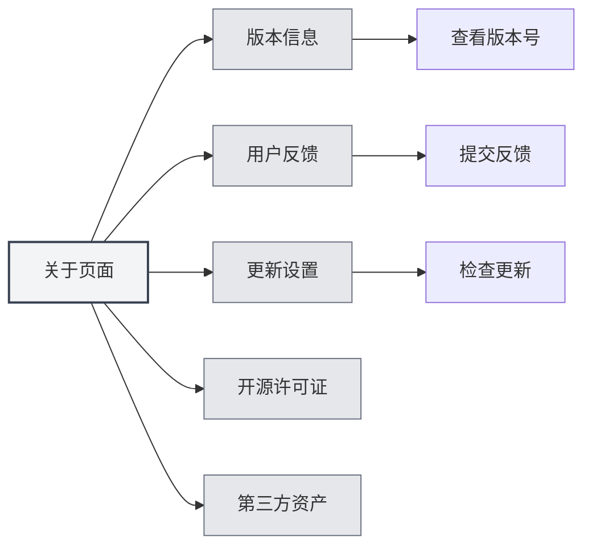
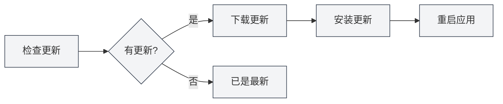

# Über Informationen

## Übersicht

Die Über-Seite bietet Informationen zur MetaDoc-Version, Update-Einstellungen, Open-Source-Lizenzen und Informationen zu Drittanbieter-Assets. Auf dieser Seite können Sie Anwendungsinformationen einsehen, nach Updates suchen, Feedback geben und mehr.

## Versionsinformationen

### Version anzeigen

Auf der Über-Seite können Sie folgende Informationen einsehen:

- **Anwendungsname**: MetaDoc
- **Versionsnummer**: Die installierte Versionsnummer
- **Veröffentlichungsdatum**: Das Veröffentlichungsdatum der aktuellen Version
- **Build-Umgebung**: Entwicklungsversion oder Release-Version

Sie können über die obere Menüleiste auf die Über-Seite zugreifen:

<MenuItemsDemo mode="demo" :items='[{"id": "settings", "items": ["about"]}]' />



### Versionsformat

Die Versionsnummer verwendet das semantische Versionsformat:

```
Hauptversion.Nebenversion.Revisionsnummer
```

Beispiel: `0.12.1`

### Build-Umgebung

- **Entwicklungsversion**: In der Entwicklungsumgebung erstellte Version, kann Debug-Informationen enthalten
- **Release-Version**: Offiziell veröffentlichte Version, getestet und optimiert

<SettingAboutSection mode="demo" />

## Benutzerfeedback

### Feedback geben

Sie können Feedback auf folgende Weise geben:

1. Auf der Über-Seite auf die Schaltfläche "Benutzerfeedback" klicken
2. Auf der Feedback-Seite den Feedback-Inhalt ausfüllen
3. Feedback absenden

### Feedback-Inhalt

Feedback kann folgende Informationen enthalten:

- **Problembeschreibung**: Detaillierte Beschreibung des aufgetretenen Problems
- **Reproduktionsschritte**: Erläuterung, wie das Problem reproduziert werden kann
- **Erwartetes Verhalten**: Beschreibung des erwarteten Verhaltens
- **Tatsächliches Verhalten**: Beschreibung des tatsächlich aufgetretenen Verhaltens
- **Umgebungsinformationen**: Betriebssystem, Versionsnummer usw.

### Feedback-Empfehlungen

- **Detaillierte Beschreibung**: Beschreiben Sie das Problem so detailliert wie möglich
- **Screenshots bereitstellen**: Bei Bedarf Screenshots oder Bildschirmaufnahmen bereitstellen
- **Versionsinformationen**: Versionsnummer und Build-Umgebungsinformationen angeben
- **Reproduktionsschritte**: Klare Reproduktionsschritte angeben

<UserFeedbackView mode="demo" />

## Offizielle QQ-Gruppe

### QQ-Gruppe beitreten

Offizielle MetaDoc QQ-Gruppe: **1079841705**

Der Beitritt zur QQ-Gruppe ermöglicht:

- Erhalt der neuesten Informationen und Update-Benachrichtigungen
- Austausch von Nutzungserfahrungen mit anderen Benutzern
- Erhalt von technischem Support
- Teilnahme an Funktionsdiskussionen

### Ressourcen in der Gruppe

Die QQ-Gruppe bietet folgende Ressourcen:

- **Nutzungsanleitungen**: Nutzungsanleitungen in den Gruppendateien
- **Problemlösungen**: Gegenseitige Hilfe der Gruppenmitglieder
- **Update-Benachrichtigungen**: Sofortiger Erhalt von Update-Informationen
- **Funktionsvorschläge**: Teilnahme an Funktionsdiskussionen und -vorschlägen

## Update-Einstellungen

### Automatische Update-Prüfung

Wenn "Automatisch nach Updates suchen" aktiviert ist, prüft MetaDoc beim Start automatisch auf neue Versionen:

- **Aktiviert**: Beim Start automatisch nach Updates suchen
- **Deaktiviert**: Nicht automatisch nach Updates suchen

### Update-Kanal

Der Update-Kanal kann gewählt werden:

- **Stable-Version**: Verwendet offiziell veröffentlichte Versionen (empfohlen)
- **Entwicklungsversion**: Verwendet Entwicklungsversionen (könnte instabil sein)

<MainTabs mode="demo" />

### Manuelle Update-Prüfung

Sie können jederzeit manuell nach Updates suchen:

1. Auf der Registerkarte "Update-Einstellungen" der Über-Seite
2. Auf die Schaltfläche "Nach Updates suchen" klicken
3. Auf den Abschluss der Prüfung warten

### Update-Status

Nach der Update-Prüfung werden folgende Status angezeigt:

- **Update verfügbar**: Zeigt Informationen zur neuen Version an, Update kann heruntergeladen werden
- **Aktuelle Version ist die neueste**: Die aktuelle Version ist die neueste
- **Prüfung fehlgeschlagen**: Zeigt Fehlermeldungen an

### Update herunterladen und installieren

Wenn ein Update verfügbar ist:

1. **Update herunterladen**: Auf die Schaltfläche "Update herunterladen" klicken
2. **Auf Download warten**: Download-Fortschritt anzeigen
3. **Update installieren**: Nach Abschluss des Downloads auf die Schaltfläche "Installieren und neu starten" klicken
4. **Automatischer Neustart**: Die Anwendung startet automatisch neu und installiert das Update



<QuickStartPanel mode="demo" />

## Open-Source-Lizenzen

### Lizenzen anzeigen

Auf der Registerkarte "Open-Source-Lizenzen" der Über-Seite können Sie einsehen:

- **Open-Source-Lizenzen**: Die von MetaDoc verwendeten Open-Source-Lizenzen
- **Lizenzinhalt**: Vollständiger Lizenztext

### Lizenzinformationen

MetaDoc folgt Open-Source-Lizenzen. Sie können:

- Lizenzinhalte einsehen
- Nutzungsbedingungen verstehen
- Rechte und Pflichten kennenlernen

## Drittanbieter-Assets

### Drittanbieter-Assets anzeigen

Auf der Registerkarte "Drittanbieter-Assets" der Über-Seite können Sie einsehen:

- **Drittanbieter-Bibliotheken**: Von MetaDoc verwendete Open-Source-Bibliotheken von Drittanbietern
- **Asset-Informationen**: Lizenz- und Quellinformationen der Drittanbieter-Assets

### Asset-Liste

Die Drittanbieter-Asset-Liste enthält:

- **Bibliotheksname**: Name der Drittanbieter-Bibliothek
- **Version**: Verwendete Versionsnummer
- **Lizenz**: Lizenztyp der Bibliothek
- **Quelle**: Quelllink der Bibliothek

## Best Practices

1. **Regelmäßig aktualisieren**: Empfehlung, automatische Update-Prüfung zu aktivieren, um zeitnah neue Versionen zu erhalten
2. **Probleme melden**: Bei Problemen zeitnah Feedback geben
3. **QQ-Gruppe beitreten**: Offizieller QQ-Gruppe beitreten, um Support und Informationen zu erhalten
4. **Lizenzen einsehen**: Nutzungsbedingungen der Open-Source-Lizenzen verstehen
5. **Updates verfolgen**: Update-Benachrichtigungen verfolgen, um neue Funktionen und Fehlerbehebungen zu erfahren

## Wichtige Hinweise

1. **Backup vor Updates**: Vor einem Update wird empfohlen, wichtige Daten zu sichern
2. **Netzwerkverbindung**: Update-Prüfung erfordert eine Netzwerkverbindung
3. **Versionskompatibilität**: Nach einem Update müssen möglicherweise einige Einstellungen neu konfiguriert werden
4. **Feedback-Informationen**: Beim Feedback-Geben auf den Schutz privater Informationen achten
5. **Lizenzbefolgung**: Bei der Nutzung von MetaDoc bitte die Open-Source-Lizenzen einhalten

<ResizableDivider mode="demo" />

## Verwandte Dokumentation

- [[settings.basic|Grundeinstellungen]]
- [[settings.logging|Log-Konfiguration]]
- [[quick-start.guide|Schnellstart-Anleitung]]

<SettingAboutSection mode="demo" />

<UserFeedbackView mode="demo" />

<MenuItemsDemo mode="demo" :items='[{"id": "settings", "items": ["about"]}]' />

<MainTabs mode="demo" />