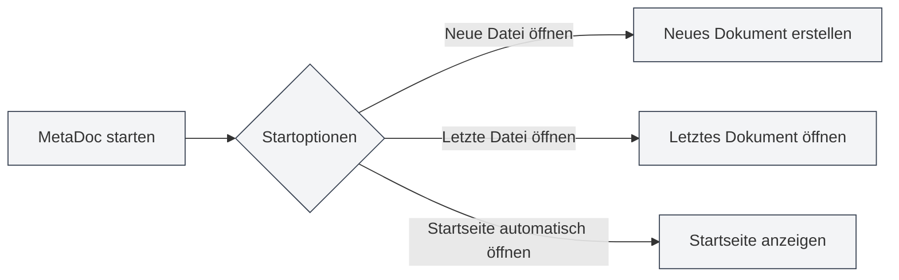
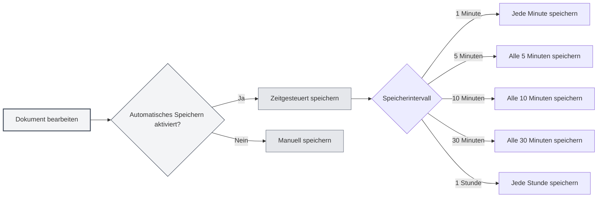
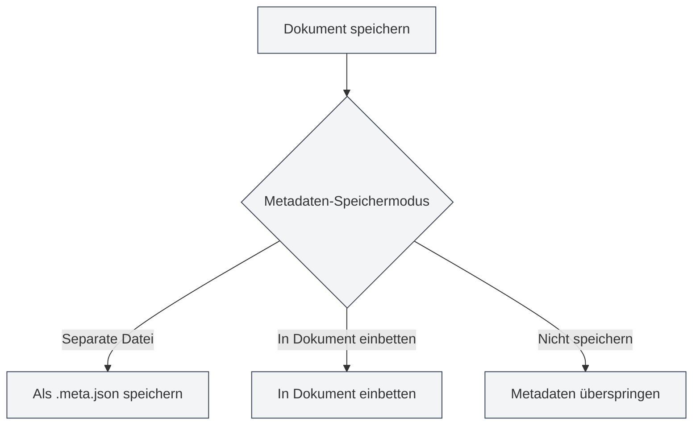

# Grundeinstellungen

## Übersicht

Die Grundeinstellungen sind die Kernkonfigurationsoptionen von MetaDoc und umfassen wichtige Funktionen wie das Startverhalten der Anwendung, automatisches Speichern, Dokumentstatistiken, Metadatenverwaltung usw. Eine sinnvolle Konfiguration dieser Optionen kann Ihre Nutzungserfahrung und Arbeitsproduktivität verbessern.

## Startoptionen

### Startverhalten einstellen

Die Startoptionen bestimmen das Standardverhalten beim Start von MetaDoc:

- **Neue Datei öffnen**: Erstellt bei jedem Start ein neues leeres Dokument.
- **Zuletzt bearbeitete Datei öffnen**: Öffnet automatisch das Dokument, das beim letzten Schließen bearbeitet wurde.

Sie können je nach Nutzungsgewohnheit die passende Startoption wählen. Wenn Sie häufig an vorheriger Arbeit weiterarbeiten müssen, wird die Option "Zuletzt bearbeitete Datei öffnen" empfohlen.

Sie können über die obere Menüleiste auf die Einstellungen zugreifen:

<MenuItemsDemo mode="demo" :items='[{"id": "settings"}]' />

### Oberfläche der Grundeinstellungen

Die folgende Abbildung zeigt die vollständige Oberfläche der Seite für Grundeinstellungen:

<SettingBasicSection mode="demo" />

Die Oberfläche der Grundeinstellungen enthält die folgenden Hauptkonfigurationsbereiche:

- **Startoptionen**: Legt das Standardverhalten beim Start der Anwendung fest (Neue Datei öffnen/Zuletzt bearbeitete Datei)
- **Automatisches Speichern**: Konfiguriert das Zeitintervall für automatisches Speichern, um Datenverlust zu verhindern
- **Metadaten-Speicherung**: Wählt die Speichermethode für Metadaten (im Dokument/separate Datei)
- **Referenzverzeichnis**: Verwaltet den Speicherort externer Dateien, auf die das Dokument verweist
- **Weitere Optionen**: Erweiterte Einstellungen für Codeblock-Verarbeitung, Bildeinbettung, mathematische Formeln usw.

### Startseite automatisch beim Start öffnen

Wenn diese Option aktiviert ist, öffnet MetaDoc beim Start automatisch den Startseiten-Tab. Die Startseite bietet Funktionen wie Schnellstart, Liste der letzten Dokumente usw. und erleichtert Ihnen den schnellen Zugriff auf häufig genutzte Funktionen.

## Automatisches Speichern

<SettingBasicSection mode="demo" />

### Automatisches Speichern konfigurieren

Die Funktion für automatisches Speichern kann Inhaltsverlust durch unerwartete Ereignisse (wie Programmabsturz, Stromausfall usw.) verhindern. MetaDoc unterstützt die folgenden Intervalle für automatisches Speichern:

- **Aus**: Kein automatisches Speichern, manuelles Speichern erforderlich
- **1 Minute**: Automatisches Speichern jede Minute
- **5 Minuten**: Automatisches Speichern alle 5 Minuten
- **10 Minuten**: Automatisches Speichern alle 10 Minuten
- **30 Minuten**: Automatisches Speichern alle 30 Minuten
- **1 Stunde**: Automatisches Speichern jede Stunde

### Nutzungsempfehlungen

- **Häufige Bearbeitung**: Ein kürzeres Intervall für automatisches Speichern (1-5 Minuten) wird empfohlen, um sicherzustellen, dass Inhalte zeitnah gespeichert werden.
- **Längeres Schreiben**: Ein längeres Intervall (10-30 Minuten) kann eingestellt werden, um die Schreibfrequenz auf die Festplatte zu reduzieren.
- **Wichtige Dokumente**: Es wird empfohlen, automatisches Speichern zu aktivieren und mit manuellem Speichern (`Strg+S`) zu kombinieren, um die Datensicherheit zu gewährleisten.

Das automatische Speichern erfolgt im Hintergrund und unterbricht Ihre Bearbeitungsarbeit nicht.

## Dokumentstatistik-Einstellungen

<SettingBasicSection mode="demo" />

### Codeblöcke von der Statistik ausschließen

Wenn diese Option aktiviert ist, werden Inhalte in Codeblöcken bei der Zählung von Wörtern, Worthäufigkeiten usw. im Dokument ausgeschlossen. Dies ist besonders für technische Dokumente nützlich, da Inhalte in Codeblöcken normalerweise nicht in die Textstatistik des Dokuments einfließen sollten.

**Anwendungsfälle**:

- Technische Dokumente enthalten viele Codebeispiele.
- Die tatsächlichen Textinhalte des Dokuments müssen genau gezählt werden.
- Code soll die Ergebnisse der Worthäufigkeitsanalyse nicht beeinflussen.

## Bildeinstellungen

<SettingBasicSection mode="demo" />

### Eingebettete Bilder analysieren (OCR-Funktion)

Wenn diese Option aktiviert ist, führt MetaDoc eine OCR-Verarbeitung (Optical Character Recognition) für in das Dokument eingebettete Bilder durch, um Textinhalte aus den Bildern zu extrahieren. Dies ist besonders nützlich für die Verarbeitung von Dokumenten, die Bilder enthalten (wie PDF-, Word-Dokumente).

**Funktionsbeschreibung**:

- Bilder in hochgeladenen DOCX-, PPTX-, PDF-Dateien werden OCR-verarbeitet.
- Direkt hochgeladene Bilddateien werden weiterhin OCR-verarbeitet (von dieser Option nicht beeinflusst).
- OCR-Ergebnisse können für die Wissensdatenbanksuche und KI-Assistenzfunktionen genutzt werden.

**Hinweise**:

- Die OCR-Verarbeitung benötigt gewisse Rechenressourcen und kann die Dokumentladezeit beeinflussen.
- Wenn die Textextraktion aus Bildern nicht benötigt wird, kann diese Funktion zur Leistungssteigerung deaktiviert werden.

### Mathematische Formeln: Inline-Zahlen

Wenn diese Option aktiviert ist, werden Zahlen in mathematischen Formeln im Inline-Modus anstelle des Blockmodus angezeigt. Dies ermöglicht eine bessere Integration der Formeln in den Textfluss und eignet sich für das Einfügen einfacher mathematischer Ausdrücke in Absätzen.

## Metadaten-Speichermodus

<SettingBasicSection mode="demo" />

### Speichermethode einstellen

Dokument-Metadaten (Titel, Autor, Beschreibung, Schlüsselwörter usw.) können auf drei Arten gespeichert werden:

- **Separate Datei**: Speichert Metadaten in einer separaten Datei (`.meta.json`) im selben Verzeichnis wie das Dokument.
  - Vorteil: Beeinflusst den ursprünglichen Dokumentinhalt nicht, erleichtert die Versionskontrolle.
  - Nachteil: Zwei Dateien müssen gleichzeitig verwaltet werden.
- **In Dokument einbetten**: Bettet Metadaten in die Dokumentdatei selbst ein.
  - Vorteil: Einzeldateiverwaltung, erleichtert das Teilen.
  - Nachteil: Einige Formate unterstützen möglicherweise keine Einbettung.
- **Nicht speichern**: Speichert keine Metadaten.
  - Anwendungsfall: Temporäre Dokumente oder Dokumente, die keine Metadaten benötigen.

### Auswahlempfehlung

- **Technische Dokumente**: Der Modus "Separate Datei" wird empfohlen, um die Verwaltung mit Versionskontrollsystemen wie Git zu erleichtern.
- **Persönliche Notizen**: Der Modus "In Dokument einbetten" kann verwendet werden, um die Einzeldatei übersichtlich zu halten.
- **Temporäre Dokumente**: Der Modus "Nicht speichern" kann gewählt werden.

## Referenzdateiverzeichnis-Verwaltung

<SettingBasicSection mode="demo" />

### Verzeichnisinformationen anzeigen

Das Referenzdateiverzeichnis dient der Speicherung externer Dateien, auf die im Dokument verwiesen wird (wie Bilder, Anhänge usw.). Auf der Seite für Grundeinstellungen können Sie:

- **Verzeichnisgröße anzeigen**: Zeigt den von dem Referenzdateiverzeichnis belegten Festplattenspeicher an.
- **Aktualisieren**: Aktualisiert die Verzeichnisgrößeninformationen.
- **Verzeichnis öffnen**: Öffnet das Referenzdateiverzeichnis im Dateimanager.
- **Verzeichnis leeren**: Löscht alle Dateien im Verzeichnis (Aktion ist nicht wiederherstellbar).

### Anwendungsfälle

Das Referenzdateiverzeichnis wird typischerweise verwendet für:

- Die Speicherung von in Dokumente eingefügten Bildern.
- Das Speichern von Dokumentanhängen.
- Die Verwaltung von dokumentbezogenen Ressourcendateien.

**Hinweise**:

- Die Aktion "Verzeichnis leeren" ist nicht wiederherstellbar. Bitte führen Sie sie mit Vorsicht aus.
- Vor dem Leeren wird empfohlen, wichtige Dateien zu sichern.
- Die Verzeichnisgröße wächst mit der Anzahl der im Dokument referenzierten Dateien.

## Wichtige Hinweise

1.  **Startoptionen**: Änderungen an den Startoptionen werden erst beim nächsten Start der Anwendung wirksam.
2.  **Automatisches Speichern**: Automatisches Speichern überschreibt Ihre manuellen Speicheraktionen nicht; beide können kombiniert werden.
3.  **Metadatenmodus**: Nach Änderung des Metadaten-Speichermodus verwenden neu gespeicherte Dokumente den neuen Modus; bestehende Dokumente sind nicht betroffen.
4.  **Referenzverzeichnis**: Stellen Sie vor dem Leeren des Referenzverzeichnisses sicher, dass keine Dokumente diese Dateien verwenden.

## Verwandte Dokumentation

- [[core.file-operations|Dateioperationen]]
- [[core.document-metadata|Dokument-Metadaten]]
- [[settings.theme|Theme-Einstellungen]]
- [[settings.image|Bildeinstellungen]]

<MenuItemsDemo mode="demo" :items='[{"id": "settings", "items": ["basic"]}]' />
