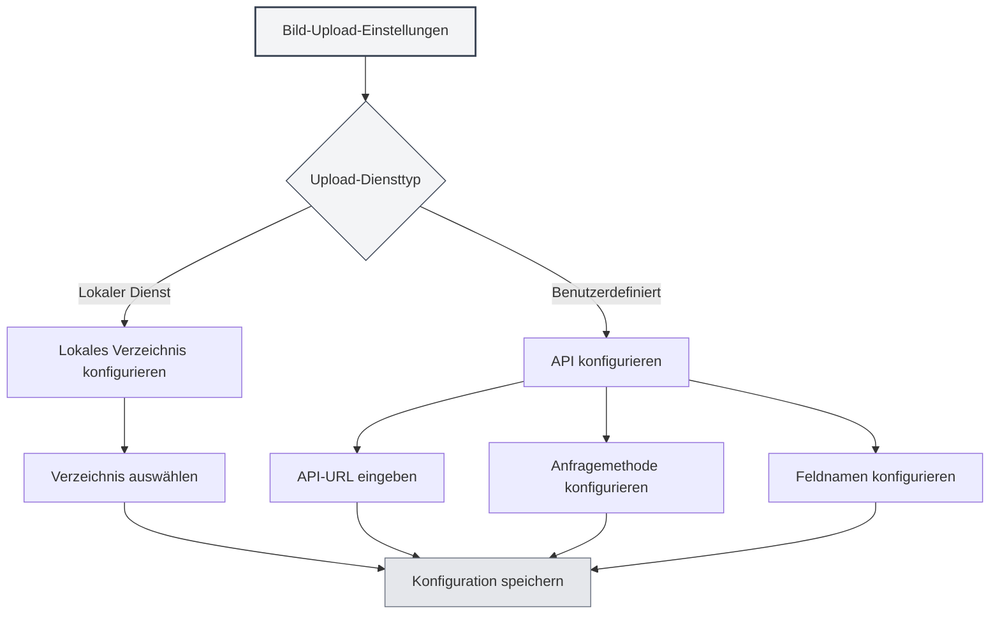

# Upload-Diensteinstellungen

## Übersicht

Die Upload-Diensteinstellungen ermöglichen es Ihnen, den Zielservice für den Bild-Upload zu konfigurieren. MetaDoc unterstützt zwei Upload-Methoden: lokale Dienste und benutzerdefinierte APIs. Sie können je nach Bedarf den passenden Dienst auswählen.

## Upload-Diensttypen

### Dienstauswahl

Auf der Bildeinstellungsseite kann der Upload-Dienst gewählt werden, wenn die "Aktion beim Einfügen von Bildern" auf "Hochladen" gesetzt ist:

- **Lokaler Dienst**: Speichert Bilder in einem lokalen Verzeichnis.
- **Benutzerdefiniert**: Verwendet eine benutzerdefinierte API zum Hochladen von Bildern.

Sie können die Bildeinstellungen über die obere Menüleiste aufrufen:

<MenuItemsDemo mode="demo" :items='[{"id": "settings"}]' />



### Lokaler Dienst

Der lokale Dienst speichert Bilder im lokalen Dateisystem:

- **Vorteile**: Volle lokale Kontrolle, Datensicherheit.
- **Nachteile**: Erfordert die Konfiguration eines lokalen Verzeichnisses.
- **Anwendungsfälle**: Lokale Nutzung, hohe Datenschutzanforderungen.

<SettingImageSection mode="demo" />

### Benutzerdefinierter Dienst

Der benutzerdefinierte Dienst verwendet eine externe API zum Hochladen von Bildern:

- **Vorteile**: Kann in Cloud-Speicher, Image-Hosting usw. hochladen.
- **Nachteile**: Erfordert die Konfiguration einer API-Schnittstelle.
- **Anwendungsfälle**: Cloud-Speicher, Bild-CDN usw. erforderlich.

<MainTabs mode="demo" />

## Konfiguration des lokalen Bildverzeichnisses

### Verzeichnis einrichten

Bei Verwendung des lokalen Dienstes muss das Zielverzeichnis für Bilder konfiguriert werden:

1. Auf der Bildeinstellungsseite "Lokaler Dienst" auswählen.
2. Auf die Schaltfläche "Durchsuchen" klicken, um ein Verzeichnis auszuwählen.
3. Oder den Verzeichnispfad direkt in das Eingabefeld eingeben.
4. Die Schaltfläche "Öffnen" öffnet das Verzeichnis im Dateimanager.

### Verzeichnisauswahl

Bei der Auswahl des Bildverzeichnisses:

- **Schaltfläche 'Durchsuchen'**: Öffnet den Dialog zur Verzeichnisauswahl.
- **Pfadeingabe**: Direkte Eingabe des Verzeichnispfads.
- **Schaltfläche 'Öffnen'**: Öffnet das eingestellte Verzeichnis im Dateimanager.

### Standardverzeichnis

Wenn kein lokales Bildverzeichnis festgelegt ist, verwendet das System ein Standardverzeichnis:

- **Windows**: `%APPDATA%/MetaDoc/images`
- **macOS**: `~/Library/Application Support/MetaDoc/images`
- **Linux**: `~/.config/MetaDoc/images`


### Verzeichnisverwaltung

- **Verzeichnis anzeigen**: Klicken Sie auf "Öffnen", um den Inhalt des Verzeichnisses anzuzeigen.
- **Verzeichnis ändern**: Klicken Sie auf "Durchsuchen", um ein neues Verzeichnis auszuwählen.
- **Verzeichnisvoraussetzungen**: Stellen Sie sicher, dass das Verzeichnis existiert und Schreibrechte vorhanden sind.

## Konfiguration der benutzerdefinierten Upload-API

### API-URL-Konfiguration

Bei Verwendung eines benutzerdefinierten Dienstes muss die API-Adresse konfiguriert werden:

1. Auf der Bildeinstellungsseite den Dienst "Benutzerdefiniert" auswählen.
2. Im Eingabefeld "Benutzerdefinierte Upload-API-URL" die API-Adresse eingeben.
3. Formatbeispiel: `https://api.example.com/upload`

### API-Methodenkonfiguration

Konfigurieren Sie die API-Anfragemethode:

- **POST**: Verwendet die POST-Methode zum Hochladen (empfohlen).
- **PUT**: Verwendet die PUT-Methode zum Hochladen.

Die meisten APIs verwenden die POST-Methode, einige spezielle APIs können PUT verwenden.

### Feldnamenkonfiguration

Konfigurieren Sie den Feldnamen für die hochzuladende Datei:

- **Standardwert**: `file`
- **Benutzerdefiniert**: Feldnamen gemäß API-Anforderungen setzen.

Verschiedene APIs können unterschiedliche Feldnamen verwenden, wie `file`, `image`, `upload` usw.

### API-Konfigurationsbeispiele

**Beispiel 1: Standard-Image-Hosting-API**

```
API URL: https://api.example.com/upload
Methode: POST
Feldname: file
```

**Beispiel 2: API mit benutzerdefiniertem Feldnamen**

```
API URL: https://api.example.com/image
Methode: POST
Feldname: image
```

**Beispiel 3: API mit PUT-Methode**

```
API URL: https://api.example.com/upload
Methode: PUT
Feldname: file
```

<ViewMenuItemsDemo mode="demo" :items='["home", "editor"]'
/>

## API-Antwortformat

### Antwortanforderungen

Die benutzerdefinierte API muss eine JSON-Antwort im folgenden Format zurückgeben:

```json
{
  "success": true,
  "imagePath": "https://example.com/image.png"
}
```

### Antwortfelder

- **success**: Boolescher Wert, gibt an, ob der Upload erfolgreich war.
- **imagePath**: Zeichenkette, gibt die URL oder den Pfad des Bildes zurück.

### Fehlerbehandlung

Wenn der Upload fehlschlägt, sollte die API Folgendes zurückgeben:

```json
{
  "success": false,
  "message": "Fehlermeldung"
}
```

<DialogDemo mode="demo" dialogType="api-config" />

## Konfigurationsvalidierung

### Konfiguration testen

Nach der Konfiguration einer benutzerdefinierten API wird ein Test empfohlen:

1. Ein Bild in ein Dokument einfügen.
2. Das Upload-Ergebnis überprüfen.
3. Bei Fehlern die Konfiguration auf Richtigkeit prüfen.

### Häufige Probleme

**Verbindungsfehler**:

- Prüfen Sie, ob die API-URL korrekt ist.
- Prüfen Sie die Netzwerkverbindung.
- Prüfen Sie, ob der API-Dienst ordnungsgemäß läuft.

**Upload-Fehler**:

- Prüfen Sie, ob die API-Methode korrekt ist.
- Prüfen Sie, ob der Feldname korrekt ist.
- Prüfen Sie, ob das API-Antwortformat den Anforderungen entspricht.

**Berechtigungsprobleme**:

- Prüfen Sie, ob die API eine Authentifizierung erfordert.
- Prüfen Sie, ob der API-Schlüssel oder Token korrekt ist.

<SettingBasicSection mode="demo" />

## Konfiguration des lokalen Dienstes

### Verzeichnisberechtigungen

Bei Verwendung des lokalen Dienstes sicherstellen, dass das Verzeichnis Schreibrechte hat:

- **Windows**: Überprüfen Sie die Ordnerberechtigungseinstellungen.
- **macOS/Linux**: Überprüfen Sie die Verzeichnisberechtigungen (chmod).

### Verzeichnisstruktur

Der lokale Dienst speichert Bilder im angegebenen Verzeichnis:

- **Dateibenennung**: Verwendet Zeitstempel + Originaldateiname.
- **Dateiformat**: Beibehaltung des Originalformats.
- **Verzeichnisstruktur**: Alle Bilder werden im selben Verzeichnis gespeichert.

<OcrWindow mode="demo" />

### Bildzugriff

Bilder des lokalen Dienstes können auf folgende Weise abgerufen werden:

- **HTTP-Dienst**: Über den Pfad `/images/` des Laufzeitservers (Standardadresse durch App-Konfiguration, z.B. `http://127.0.0.1:52521/images/`).
- **Dateipfad**: Direkte Verwendung des Dateisystempfads.

## Best Practices

1. **Lokale Nutzung**: Für lokale Nutzung wird der lokale Dienst empfohlen.
2. **Cloud-Speicher**: Bei Bedarf an Cloud-Speicher eine benutzerdefinierte API verwenden.
3. **Verzeichnisverwaltung**: Das Bildverzeichnis regelmäßig bereinigen, um zu viel Speicherplatz zu vermeiden.
4. **API-Test**: Nach der Konfiguration einer benutzerdefinierten API zuerst testen.
5. **Backup-Strategie**: Wichtige Bilder sollten zusätzlich gesichert werden.

<MenuItemsDemo mode="demo" :items='[{"id": "file", "items": ["new", "open", "save"]}]' />

## Wichtige Hinweise

1. **Konfigurationswirksamkeit**: Änderungen der Konfiguration gelten erst für neu eingefügte Bilder.
2. **API-Kompatibilität**: Sicherstellen, dass die benutzerdefinierte API das erforderliche Antwortformat einhält.
3. **Verzeichnisberechtigungen**: Sicherstellen, dass das lokale Verzeichnis Schreibrechte hat.
4. **Netzwerkverbindung**: Benutzerdefinierte APIs erfordern eine Netzwerkverbindung.
5. **Speicherplatz**: Der lokale Dienst belegt lokalen Speicherplatz.

## Verwandte Dokumentation

- [[settings.image|Bild-Upload-Konfiguration]]
- [[settings.basic|Grundeinstellungen]]
- [[core.file-operations|Dateioperationen]]

<ResizableDivider mode="demo" />
