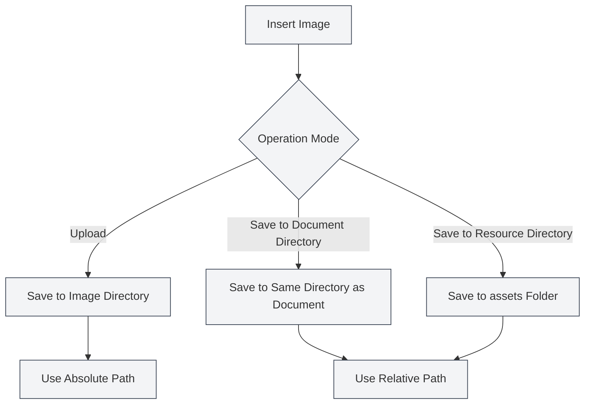

# Bild-Upload-Konfiguration

## Übersicht

Die Bild-Upload-Konfiguration bestimmt, wie Bilder beim Einfügen in Dokumente verarbeitet werden. MetaDoc unterstützt mehrere Bildverarbeitungsmodi. Sie können je nach Bedarf die passende Konfiguration wählen.

## Bild einfügen – Vorgang

### Betriebsmodi

Beim Einfügen eines Bildes können Sie zwischen folgenden Betriebsmodi wählen:

- **Hochladen**: Das Bild wird in das angegebene Bildverzeichnis hochgeladen.
- **Im Dokumentenverzeichnis speichern**: Das Bild wird im Verzeichnis des Dokuments gespeichert.
- **Im Ressourcenverzeichnis speichern**: Das Bild wird im `assets`-Ordner des Dokumentenverzeichnisses gespeichert.

Sie können die Bildeinstellungen über die obere Menüleiste aufrufen:

<MenuItemsDemo mode="demo" :items='[{"id": "settings"}]' />

### Benutzeroberfläche für Bildeinstellungen

Die folgende Abbildung zeigt die vollständige Benutzeroberfläche der Bildeinstellungsseite:

<SettingImageSection mode="demo" />

Die Benutzeroberfläche für Bildeinstellungen umfasst folgende Hauptkonfigurationsbereiche:

- **Bild-Upload-Dienst**: Auswahl zwischen lokaler Speicherung oder externem Bild-Hosting (Third-Party).
- **Lokaler Speicherpfad**: Festlegen des lokalen Verzeichnisses für die Bildspeicherung.
- **Verarbeitung von Web-Bildern**: Konfiguration von Optionen wie Beibehalten der Original-URL, automatisches Speichern usw.

### Upload-Modus

Im Upload-Modus werden Bilder im konfigurierten lokalen Bildverzeichnis gespeichert:

- **Vorteile**: Zentrale Verwaltung aller Bilder, erleichtert Backup und Migration.
- **Nachteile**: Bilder sind vom Dokument getrennt; beim Verschieben des Dokuments müssen auch die Bilder mitbewegt werden.
- **Einsatzszenario**: Mehrere Dokumente teilen sich Bilder, zentrale Verwaltung von Bildressourcen.

<DialogDemo mode="demo" dialogType="image-upload" />

### Im Dokumentenverzeichnis speichern

Speichert das Bild im Verzeichnis des Dokuments:

- **Vorteile**: Bild und Dokument befinden sich im selben Verzeichnis, was die Verwaltung erleichtert.
- **Nachteile**: Jedes Dokumentenverzeichnis enthält Bilder, mögliche Duplikate.
- **Einsatzszenario**: Einzeldokument-Projekte, Dokumente müssen eigenständig gepackt werden.

<DialogDemo mode="demo" dialogType="file-save" />

### Im Ressourcenverzeichnis speichern

Speichert das Bild im `assets`-Ordner des Dokumentenverzeichnisses:

- **Vorteile**: Bilder werden einheitlich im `assets`-Ordner abgelegt, klare Struktur.
- **Nachteile**: Erfordert die Erstellung eines `assets`-Ordners.
- **Einsatzszenario**: Klare Dateistruktur gewünscht, Dokumente müssen exportiert und geteilt werden.

<DialogDemo mode="demo" dialogType="folder-select" />

## Web-Bild-URL beibehalten

### Funktionsbeschreibung

Wenn "Web-Bild-URL beibehalten" aktiviert ist, werden Web-Bilder beim Einfügen nicht heruntergeladen, sondern die Original-URL wird direkt verwendet:

- **Aktiviert**: Behält die Original-URL des Web-Bildes bei, kein Download auf das lokale System.
- **Deaktiviert**: Lädt das Web-Bild lokal herunter und verwendet den lokalen Pfad.

### Anwendungsszenarien

- **Szenarien für Aktivierung**:

  - Bildressourcen sind groß, lokales Backup nicht erforderlich.
  - Bilder werden regelmäßig aktualisiert, es soll stets die neueste Version angezeigt werden.
  - Lokalen Speicherplatz sparen.

- **Szenarien für Deaktivierung**:
  - Bilder müssen offline zugänglich sein.
  - Bildressourcen müssen gesichert werden.
  - Web-Bilder könnten nicht mehr verfügbar sein.

### Wichtige Hinweise

- Bei Beibehaltung der Web-URL ist eine Netzwerkverbindung erforderlich, um Bilder anzuzeigen.
- Wenn ein Web-Bild nicht mehr verfügbar ist, wird es im Dokument nicht angezeigt.
- Für wichtige Bilder wird empfohlen, diese Option zu deaktivieren, um die Verfügbarkeit sicherzustellen.

## Bild-URL automatisch maskieren

### Funktionsbeschreibung

Wenn "Bild-URL automatisch maskieren" aktiviert ist, werden Sonderzeichen in URLs beim Einfügen von Bildern automatisch maskiert:

- **Aktiviert**: Maskiert automatisch Sonderzeichen in URLs (z. B. Leerzeichen, chinesische Zeichen usw.).
- **Deaktiviert**: Belässt die URL im Originalzustand, keine Maskierung.

### Maskierungsregeln

Das System maskiert automatisch folgende Zeichen:

- **Leerzeichen**: Werden in `%20` umgewandelt.
- **Chinesische Zeichen**: Werden URL-kodiert.
- **Sonderzeichen**: Werden in URL-sichere Formate umgewandelt.

### Nutzungsempfehlung

- **Aktivieren**: Empfohlen, um sicherzustellen, dass URLs in allen Umgebungen korrekt geparst werden.
- **Deaktivieren**: Nur deaktivieren, wenn sicher ist, dass das URL-Format korrekt ist und keine Maskierung benötigt wird.

## Pfadformate

### Absoluter Pfad

Im Upload-Modus werden absolute Pfade für Bilder verwendet:

- **Format**: `/pfad/zum/bild.png`
- **Vorteile**: Pfad ist eindeutig, unabhängig vom Dokumentenstandort.
- **Nachteile**: Pfad wird ungültig, wenn Dokument oder Bild verschoben wird.

### Relativer Pfad

Beim Speichern im Dokumenten- oder Ressourcenverzeichnis werden relative Pfade für Bilder verwendet:

- **Format**: `./bild.png` oder `./assets/bild.png`
- **Vorteile**: Dokument und Bilder können gemeinsam verschoben werden.
- **Nachteile**: Pfad muss angepasst werden, wenn sich der Dokumentenstandort ändert.

## Konfiguration wirksam werden lassen

### Zeitpunkt des Wirksamwerdens

Änderungen an der Bild-Upload-Konfiguration werden in folgenden Fällen wirksam:

- **Neu eingefügte Bilder**: Verwenden sofort die neue Konfiguration.
- **Geöffnete Dokumente**: Dokument muss neu geöffnet werden, damit Änderungen wirksam werden.
- **Gespeicherte Dokumente**: Bereits gespeicherte Dokumente sind nicht betroffen.

### Datei neu öffnen

Einige Konfigurationsänderungen erfordern ein erneutes Öffnen der Datei, um wirksam zu werden:

1.  Bild-Upload-Konfiguration ändern.
2.  Aktuelles Dokument schließen.
3.  Dokument erneut öffnen.
4.  Neue Konfiguration ist wirksam.

## Best Practices

1.  **Zentrale Verwaltung**: Verwenden Sie den Upload-Modus für die zentrale Bildverwaltung.
2.  **Dokumentunabhängigkeit**: Verwenden Sie "Im Dokumentenverzeichnis speichern", wenn Dokumente eigenständig sein müssen.
3.  **Klare Struktur**: Verwenden Sie den Ressourcenverzeichnis-Modus, um eine klare Dateistruktur beizubehalten.
4.  **Web-Bilder**: Für wichtige Bilder wird empfohlen, die Option "URL beibehalten" zu deaktivieren.
5.  **Pfadmaskierung**: Empfohlen, automatische Maskierung zu aktivieren, um Kompatibilität sicherzustellen.

## Wichtige Hinweise

1.  **Konfiguration wirksam**: Einige Konfigurationen erfordern ein erneutes Öffnen der Datei.
2.  **Pfadformat**: Beachten Sie den Unterschied zwischen absoluten und relativen Pfaden.
3.  **Web-Bilder**: Bei Beibehaltung der Web-URL ist eine Netzwerkverbindung erforderlich.
4.  **Bild-Backup**: Für wichtige Bilder wird empfohlen, "URL beibehalten" zu deaktivieren, um ein Backup sicherzustellen.
5.  **Speicherplatz**: Der Upload-Modus belegt lokalen Speicherplatz.

## Verwandte Dokumentation

- [[settings.image-upload|Upload-Diensteinstellungen]]
- [[settings.basic|Grundeinstellungen]]
- [[core.file-operations|Dateioperationen]]

<SettingImageSection mode="demo" />

<MenuItemsDemo mode="demo" :items='[{"id": "settings", "items": ["image"]}]' />

<DialogDemo mode="demo" dialogType="image-upload" />

<DialogDemo mode="demo" dialogType="file-save" />