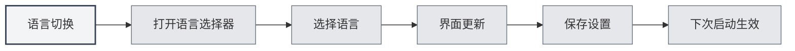

# Mehrsprachige Unterstützung

## Übersicht

MetaDoc unterstützt mehrsprachige Benutzeroberflächen, sodass Sie je nach Nutzungsgewohnheit eine geeignete Sprache auswählen können. Nach dem Wechsel der Sprache wird die Oberfläche sofort in die gewählte Sprache aktualisiert.

## Unterstützte Sprachen

MetaDoc unterstützt derzeit folgende Sprachen:

- **Chinesisch (vereinfacht)** (zh_CN): Standardsprache
- **English** (en_US): Englisch
- **日本語** (ja_JP): Japanisch
- **한국어** (ko_KR): Koreanisch
- **Français** (fr_FR): Französisch
- **Deutsch** (de_DE): Deutsch

## Sprachwechsel

### Sprache wechseln

1. Klicken Sie auf den Sprachauswahl-Button am unteren Rand des linken Menüs
2. Wählen Sie die zu verwendende Sprache aus
3. Die Oberfläche wird sofort in die gewählte Sprache aktualisiert

Sie können die Spracheinstellungen über die obere Menüleiste aufrufen:

<MenuItemsDemo mode="demo" :items='[{"id": "settings"}]' />

<SettingBasicSection mode="demo" />

<SettingLlmSection mode="demo" />



### Sprache speichern

Die gewählte Sprache wird automatisch gespeichert:

- **Automatische Speicherung**: Die Sprache wird sofort nach der Auswahl gespeichert
- **Nächster Start**: Beim nächsten Start der Anwendung wird die zuletzt gewählte Sprache verwendet
- **Mehrfenster-Synchronisation**: Alle Fenster synchronisieren die Spracheinstellung automatisch

<SettingThemeSection mode="demo" />

## Lokalisierung der Benutzeroberfläche

### Lokalisierungsbereich

Der Sprachwechsel beeinflusst folgende Oberflächenelemente:

- **Menüpunkte**: Alle Menüs und Menüeinträge
- **Schaltflächentexte**: Texte aller Schaltflächen
- **Dialogfelder**: Alle Dialogfelder und Hinweismeldungen
- **Einstellungsseiten**: Beschriftungen und Erläuterungen aller Einstellungsseiten
- **Fehlermeldungen**: Fehler- und Warnmeldungen

### Inhalte-Sprache

Die Spracheinstellung betrifft nur die Oberflächensprache, nicht:

- **Dokumenteninhalt**: Der Dokumenteninhalt bleibt unverändert
- **Dateipfade**: Dateipfade bleiben unverändert
- **Benutzereingaben**: Vom Benutzer eingegebene Inhalte sind nicht betroffen

<ViewMenuItemsDemo mode="demo" :items='["settings"]' />

## Empfehlungen zur Sprachauswahl

### Nach Nutzungsgewohnheit

- **Chinesische Nutzer**: Verwenden Sie Chinesisch (vereinfacht) für eine vertrautere Oberfläche
- **Englische Nutzer**: Verwenden Sie English, um der Nutzungsgewohnheit zu entsprechen
- **Andere Sprachen**: Wählen Sie nach persönlicher Präferenz

### Nach Dokumentensprache

- **Chinesische Dokumente**: Chinesische Oberfläche kann verwendet werden
- **Englische Dokumente**: Englische Oberfläche kann verwendet werden
- **Mehrsprachige Dokumente**: Wählen Sie die am häufigsten verwendete Sprache

## Effekt des Sprachwechsels

### Sofortige Wirkung

Der Sprachwechsel tritt sofort in Kraft:

- **Oberflächenaktualisierung**: Alle Oberflächenelemente werden sofort aktualisiert
- **Kein Neustart erforderlich**: Die Anwendung muss nicht neu gestartet werden
- **Status bleibt erhalten**: Der aktuelle Bearbeitungsstatus geht nicht verloren

<MainTabs mode="demo" />

### Mehrfenster-Synchronisation

Alle Fenster synchronisieren die Sprache automatisch:

- **Hauptfenster**: Sprachwechsel im Hauptfenster
- **Hilfsfenster**: Alle Hilfsfenster werden synchron aktualisiert
- **Neue Fenster**: Neu geöffnete Fenster verwenden die aktuelle Sprache

## Sprachdateien

### Speicherort der Sprachdateien

Sprachdateien werden im Anwendungsverzeichnis gespeichert:

- **Dateiformat**: JSON-Format
- **Dateispeicherort**: `src/renderer/src/locales/`
- **Dateibenennung**: Benennung mit Sprachcode (z.B. `zh_cn.json`)

### Struktur der Sprachdateien

Sprachdateien verwenden eine Schlüssel-Wert-Struktur:

```json
{
  "common": {
    "confirm": "确认",
    "cancel": "取消"
  },
  "setting": {
    "basic": "基础设置"
  }
}
```

## Hinweise

1. **Sprachcodes**: Sprachcodes verwenden das Unterstrich-Format (z.B. `zh_CN`)
2. **Übersetzungsvollständigkeit**: Bei einigen neuen Funktionen sind möglicherweise vorübergehend nur Teilübersetzungen verfügbar
3. **Fallback-Sprache**: Bei fehlenden Übersetzungen wird auf Chinesisch (vereinfacht) zurückgegriffen
4. **Dokumenteninhalt**: Die Spracheinstellung beeinflusst nicht den Dokumenteninhalt
5. **Dateipfade**: Die Spracheinstellung beeinflusst nicht die Anzeige von Dateipfaden

## Verwandte Dokumentation

- [[settings.basic|Grundlegende Einstellungen]]
- [[quick-start.guide|Schnellstart-Anleitung]]

<ViewMenuItemsDemo mode="demo" :items='["settings"]' />