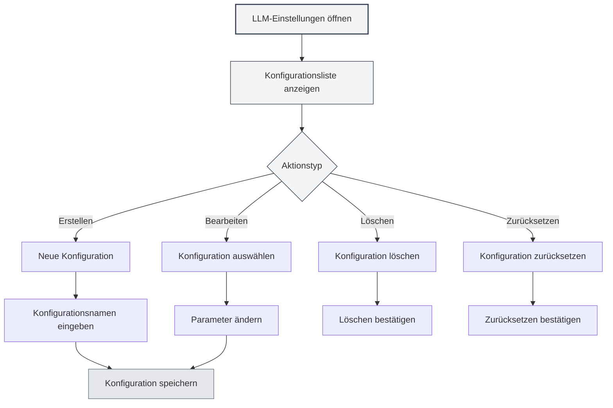

# LLM-Konfigurationsverwaltung

## Übersicht

Die LLM-Konfigurationsverwaltung ermöglicht es Ihnen, mehrere LLM-Konfigurationen zu erstellen, zu bearbeiten, zu löschen und zu verwalten. Durch die Konfigurationsverwaltung können Sie für verschiedene Anwendungsszenarien unterschiedliche LLM-Dienste einrichten und flexibel wechseln, um verschiedene Anforderungen zu erfüllen.

## Konfiguration erstellen

### Neue Konfiguration erstellen

1.  Klicken Sie auf der LLM-Einstellungsseite auf die Schaltfläche "Neue Konfiguration" (+ Symbol) über der Konfigurationsliste auf der linken Seite.
2.  Geben Sie im daraufhin erscheinenden Dialogfeld den Konfigurationsnamen ein.
3.  Das System erstellt eine neue Konfiguration basierend auf den aktuellen Einstellungen.
4.  Nach erfolgreicher Erstellung wird automatisch zur neuen Konfiguration gewechselt.

Sie können über die obere Menüleiste auf die LLM-Einstellungen zugreifen:

<MenuItemsDemo mode="demo" :items='[{"id": "settings"}]' />

### Demo der Konfigurationsoberfläche

Die folgende Abbildung zeigt die Hauptfunktionen der LLM-Konfigurationsverwaltungsoberfläche:

<SettingLlmSection mode="demo" />

**Wichtige Hinweise**:

-   Der Konfigurationsname darf nicht leer sein.
-   Der Konfigurationsname sollte beschreibend sein, um eine einfache Identifizierung zu ermöglichen.
-   Neue Konfigurationen erben alle aktuellen Einstellungen.
-   Der Konfigurationstyp "manuell" (manual) unterstützt das Erstellen neuer Konfigurationen nicht.



### Aus aktuellen Einstellungen erstellen

Beim Erstellen einer neuen Konfiguration führt das System folgende Schritte aus:

-   Kopiert den aktuell ausgewählten LLM-Typ.
-   Kopiert alle aktuellen Konfigurationsparameter (API-URL, API-Schlüssel, Modell usw.).
-   Erstellt eine neue Konfigurations-ID.
-   Fügt die neue Konfiguration zur Konfigurationsliste hinzu.

Sie können eine neue Konfiguration basierend auf einer bestehenden erstellen und dann die Parameter ändern, um so schnell ähnliche Konfigurationen zu erstellen.

<DialogDemo mode="demo" dialogType="llm-config" />

## Konfiguration bearbeiten

### Konfigurationsparameter ändern

1.  Wählen Sie die zu bearbeitende Konfiguration in der Konfigurationsliste aus.
2.  Ändern Sie die verschiedenen Parameter im Formular auf der rechten Seite.
3.  Nach einer Änderung wird die Konfiguration als "Ungespeicherte Änderungen" markiert.
4.  Klicken Sie auf die Schaltfläche "Änderungen speichern", um die Änderungen zu speichern.

<DialogDemo mode="demo" dialogType="api-config" />

### Erklärung der Konfigurationsparameter

Die Konfigurationsparameter unterscheiden sich je nach LLM-Typ:

-   **MetaDoc API**: Modellauswahl
-   **Ollama**: API-URL, Modellauswahl, maximale Token-Anzahl
-   **OpenAI-kompatibel**: API-URL, API-Schlüssel, Modellauswahl, Suffix-Konfiguration
-   **OpenAI offiziell**: API-Schlüssel, Modellauswahl
-   **DeepSeek**: API-Schlüssel, Modellauswahl
-   **Gemini**: API-Schlüssel, Modellauswahl

### Echtzeit-Vorschau

Beim Ändern von Konfigurationsparametern erkennt das System Änderungen in Echtzeit:

-   Bei ungespeicherten Änderungen wird eine Warnmarkierung angezeigt.
-   Sie können jederzeit auf "Änderungen verwerfen" klicken, um zum ursprünglichen Zustand zurückzukehren.
-   Nach dem Speichern treten die Änderungen sofort in Kraft.

<AIChat mode="demo" />

## Konfiguration löschen

### Konfiguration löschen

1.  Klicken Sie auf die Schaltfläche "Mehr" (drei Punkte Symbol) rechts neben dem Konfigurationseintrag.
2.  Wählen Sie "Konfiguration löschen".
3.  Bestätigen Sie den Löschvorgang.

**Einschränkungen**:

-   Mindestens eine Konfiguration muss erhalten bleiben, die letzte Konfiguration kann nicht gelöscht werden.
-   Standardkonfigurationen (isDefault) können nicht gelöscht, sondern nur zurückgesetzt werden.
-   Der Löschvorgang kann nicht rückgängig gemacht werden. Bitte gehen Sie vorsichtig vor.

### Löschbestätigung

Vor dem Löschen einer Konfiguration fordert das System Sie zur Bestätigung auf:

-   Nach der Bestätigung wird die Konfiguration dauerhaft gelöscht.
-   Wenn die aktuell verwendete Konfiguration gelöscht wird, wechselt das System automatisch zu einer anderen Konfiguration.
-   Gelöschte Konfigurationen können nicht wiederhergestellt werden. Stellen Sie sicher, dass Sie die Konfiguration nicht mehr benötigen.

<DialogDemo mode="demo" dialogType="confirm-delete" />

## Konfiguration zurücksetzen

### Standardkonfiguration zurücksetzen

Für Standardkonfigurationen (z. B. "Ollama (Standard)") können Sie diese auf die Ausgangswerte zurücksetzen:

1.  Klicken Sie auf die Schaltfläche "Mehr" rechts neben dem Konfigurationseintrag.
2.  Wählen Sie "Konfiguration zurücksetzen".
3.  Bestätigen Sie den Zurücksetzvorgang.

Nach dem Zurücksetzen wird die Konfiguration auf die Standardwerte zurückgesetzt, die bei der Erstellung galten. Alle benutzerdefinierten Änderungen werden entfernt.

**Anwendungsfälle**:

-   Konfiguration wurde versehentlich geändert und muss auf Standardwerte zurückgesetzt werden.
-   Nach dem Testen einer Konfiguration muss diese zurückgesetzt werden.
-   Bereinigung nicht benötigter benutzerdefinierter Einstellungen.

## Konfiguration exportieren

### Einzelne Konfiguration exportieren

1.  Klicken Sie auf die Schaltfläche "Mehr" rechts neben dem Konfigurationseintrag.
2.  Wählen Sie "Konfiguration exportieren".
3.  Das System generiert eine Konfigurationsdatei im JSON-Format.
4.  Speichern Sie die Datei lokal.

<DialogDemo mode="demo" dialogType="export-config" />

Die exportierte Konfigurationsdatei enthält:

-   Konfigurations-ID und Name
-   LLM-Typ
-   Alle Konfigurationsparameter
-   Erstellungs- und Aktualisierungszeitpunkt

### Alle Konfigurationen exportieren

1.  Klicken Sie auf die Schaltfläche "Alle Konfigurationen exportieren" (Download-Symbol) über der Konfigurationsliste.
2.  Das System exportiert alle Konfigurationen in eine JSON-Datei.
3.  Speichern Sie die Datei lokal.

Das Exportieren aller Konfigurationen kann verwendet werden für:

-   Sicherung aller Konfigurationen
-   Migration auf andere Geräte
-   Teilen von Konfigurationen mit anderen Benutzern

## Konfiguration importieren

### Konfiguration importieren

1.  Klicken Sie auf die Schaltfläche "Konfiguration importieren" (Dokument-Kopieren-Symbol) über der Konfigurationsliste.
2.  Wählen Sie eine zuvor exportierte Konfigurationsdatei aus.
3.  Das System analysiert und importiert die Konfiguration.
4.  Die importierte Konfiguration wird der Konfigurationsliste hinzugefügt.

<DialogDemo mode="demo" dialogType="import-config" />

**Importregeln**:

-   Unterstützt den Import einzelner Konfigurationen oder von Konfigurations-Arrays.
-   Wenn die ID einer importierten Konfiguration bereits existiert, wird eine neue ID erstellt, um Konflikte zu vermeiden.
-   Nach dem Import muss manuell zur neuen Konfiguration gewechselt werden.

### Importformat

Die Konfigurationsdatei sollte im JSON-Format vorliegen und folgende Struktur unterstützen:

```json
{
  "id": "config-xxx",
  "name": "Konfigurationsname",
  "type": "ollama",
  "ollama": {
    "apiUrl": "http://localhost:11434/api",
    "selectedModel": "llama2"
  }
}
```

Oder ein Konfigurations-Array:

```json
[
  { "id": "config-1", ... },
  { "id": "config-2", ... }
]
```

## Konfiguration sortieren

### Drag & Drop-Sortierung

Die Konfigurationsliste unterstützt die Sortierung per Drag & Drop:

1.  Klicken und halten Sie einen Konfigurationseintrag.
2.  Ziehen Sie ihn an die Zielposition.
3.  Lassen Sie die Maustaste los, um die Sortierung abzuschließen.

Die sortierte Reihenfolge wird gespeichert und bleibt beim nächsten Öffnen der Einstellungsseite erhalten.

**Anwendungsfälle**:

-   Häufig verwendete Konfigurationen oben platzieren
-   Sortierung nach Nutzungshäufigkeit
-   Gruppierung nach LLM-Typ

## Konfigurationsstatus

### Aktuelle Konfiguration

Die aktuell verwendete Konfiguration wird:

-   In der Liste hervorgehoben angezeigt.
-   Mit dem Label "Ungespeicherte Änderungen" markiert (falls ungespeicherte Änderungen vorliegen).
-   Von allen KI-Funktionen für den LLM-Dienst verwendet.

### Konfigurationswechsel

Beim Wechseln der Konfiguration:

-   Prüft das System, ob die aktuelle Konfiguration ungespeicherte Änderungen hat.
-   Falls ungespeicherte Änderungen vorliegen, wird empfohlen, diese zuerst zu speichern oder zu verwerfen.
-   Der Wechsel tritt sofort in Kraft, alle KI-Funktionen verwenden die neue Konfiguration.

## Best Practices

1.  **Namenskonvention**: Verwenden Sie klare Konfigurationsnamen wie "Arbeit-Ollama", "Experiment-OpenAI".
2.  **Regelmäßige Sicherung**: Wichtige Konfigurationen regelmäßig exportieren und sichern.
3.  **Konfiguration testen**: Neue Konfigurationen nach der Erstellung zuerst testen und erst nach Bestätigung der Funktionsfähigkeit verwenden.
4.  **Unbenutzte Konfigurationen bereinigen**: Regelmäßig nicht mehr benötigte Konfigurationen löschen, um die Liste übersichtlich zu halten.
5.  **Dokumentation**: Für komplexe Konfigurationen Notizen oder Dokumentation hinzufügen.

## Wichtige Hinweise

1.  **Konfigurationssicherheit**: Konfigurationen mit API-Schlüsseln sicher aufbewahren und nicht teilen.
2.  **Konfigurationskonflikte**: Achten Sie bei Konfigurationsimporten auf ID-Konflikte.
3.  **Standardkonfigurationen**: Standardkonfigurationen können nicht gelöscht, nur zurückgesetzt werden.
4.  **Konfigurationsabhängigkeiten**: Einige Funktionen können von bestimmten Konfigurationen abhängen. Vor dem Löschen überprüfen.
5.  **Multi-Fenster-Synchronisation**: Konfigurationsänderungen werden zwischen allen Fenstern synchronisiert.

## Verwandte Dokumentation

-   [[settings.llm|LLM-Konfiguration]]
-   [[settings.llm-types|LLM-Typ-Konfiguration]]
-   [[ai.chat|KI-Chat-Funktion]]
-   [[agent.config|Agent-Konfigurationsverwaltung]]

<QuickStartPanel mode="demo" />

<MainTabs mode="demo" />