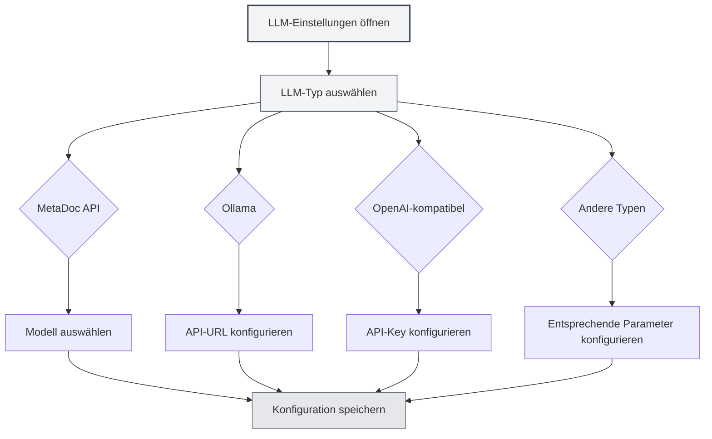

# LLM-Typ-Konfiguration

## Überblick

MetaDoc unterstützt mehrere LLM-Dienstleister, jeder Typ hat unterschiedliche Konfigurationsanforderungen. Dieses Dokument erklärt, wie verschiedene LLM-Typen konfiguriert werden, einschließlich MetaDoc API, Ollama, OpenAI, DeepSeek und Gemini.

## MetaDoc API

### Konfigurationsbeschreibung

Die MetaDoc API ist der offizielle LLM-Dienst von MetaDoc, einfach zu verwenden und erfordert keine API-Schlüssel-Konfiguration.

### Konfigurationsschritte

1. Wählen Sie "MetaDoc" im Dropdown-Menü für den LLM-Typ aus.
2. Wählen Sie ein verfügbares Modell im Dropdown-Menü "Modell auswählen" aus.
3. Konfigurieren Sie die maximale Token-Anzahl (optional).

Sie können die LLM-Einstellungen über die obere Menüleiste aufrufen:

<MenuItemsDemo mode="demo" :items='[{"id": "settings"}]' />

### Demo der LLM-Konfigurationsoberfläche

Die folgende Abbildung zeigt die Hauptfunktionsbereiche der LLM-Konfigurationsseite:

<SettingLlmSection mode="demo" />

### Konfigurationsanforderungen

- **Angemeldetes Konto**: Erfordert ein angemeldetes MetaDoc-Konto.
- **Modellauswahl**: Auswahl aus der Liste verfügbarer Modelle.
- **Maximale Token-Anzahl**: Optional, begrenzt die maximale Token-Anzahl pro Anfrage.

<MainTabs mode="demo" />

### Anwendungsfälle

- Schneller Einstieg in KI-Funktionen
- Keine Konfiguration externer Dienste erforderlich
- Nutzung des offiziellen MetaDoc-Dienstes

<DialogDemo mode="demo" dialogType="llm-config" />

## Ollama

### Konfigurationsbeschreibung

Ollama ist eine lokale LLM-Laufzeitumgebung, die große Sprachmodelle lokal ausführen kann, ohne Netzwerkverbindung.

### Konfigurationsschritte

1. Wählen Sie "Ollama" im Dropdown-Menü für den LLM-Typ aus.
2. Konfigurieren Sie die API-Basis-URL (Standard: `http://localhost:11434/api`).
3. Klicken Sie auf das Dropdown-Menü "Modell auswählen", das System ruft automatisch die Liste der lokal verfügbaren Modelle ab.
4. Wählen Sie das zu verwendende Modell aus.
5. Konfigurieren Sie die maximale Token-Anzahl (optional).

### Konfigurationsanforderungen

- **Ollama installieren**: Ollama muss installiert und der Dienst gestartet sein.
- **API-URL**: Standardmäßig `http://localhost:11434/api`, muss angepasst werden, wenn Ollama unter einer anderen Adresse läuft.
- **Modell herunterladen**: Modelle müssen zuerst mit Ollama heruntergeladen werden (z.B.: `ollama pull llama2`).

### Modellliste abrufen

Wenn Sie auf das Dropdown-Menü "Modell auswählen" klicken, verbindet sich MetaDoc automatisch mit dem Ollama-Dienst und ruft die Liste verfügbarer Modelle ab. Bei Verbindungsfehlern prüfen Sie bitte:

- Ob der Ollama-Dienst läuft.
- Ob die API-URL korrekt ist.
- Ob die Netzwerkverbindung funktioniert.

### Anwendungsfälle

- Lokale Ausführung von LLMs zum Schutz der Datenprivatheit
- Keine Netzwerkverbindung erforderlich
- Ausreichende Rechenressourcen vorhanden (GPU empfohlen)

<DialogDemo mode="demo" dialogType="api-config" />

## OpenAI-kompatibel

### Konfigurationsbeschreibung

Die OpenAI-kompatible API unterstützt alle Dienste, die das OpenAI-API-Format unterstützen, einschließlich der offiziellen OpenAI-API und kompatibler Drittanbieterdienste.

### Konfigurationsschritte

1. Wählen Sie "OpenAI-kompatibel" im Dropdown-Menü für den LLM-Typ aus.
2. Konfigurieren Sie die API-Basis-URL (Standard: `https://api.openai.com/v1`).
3. Geben Sie den API-Key ein.
4. Klicken Sie auf das Dropdown-Menü "Modell auswählen", um die Liste verfügbarer Modelle abzurufen.
5. Wählen Sie das zu verwendende Modell aus.
6. Konfigurieren Sie das Completion-Suffix und das Chat-Suffix (optional, für benutzerdefinierte API-Pfade).
7. Konfigurieren Sie die maximale Token-Anzahl (optional).

### Konfigurationsanforderungen

- **API-URL**: API-Adresse des offiziellen OpenAI-Dienstes oder eines kompatiblen Dienstes.
- **API-Key**: API-Schlüssel vom Dienstanbieter.
- **Modellliste**: Das System ruft automatisch die Liste verfügbarer Modelle ab.

### API-Suffix-Konfiguration

Einige kompatible Dienste erfordern möglicherweise benutzerdefinierte API-Pfade:

- **Completion-Suffix**: Benutzerdefiniertes Pfadsuffix für die Completion-API.
- **Chat-Suffix**: Benutzerdefiniertes Pfadsuffix für die Chat-API.

In den meisten Fällen ist keine Konfiguration erforderlich, Standardwerte können verwendet werden.

### Anwendungsfälle

- Nutzung der offiziellen OpenAI-API
- Nutzung von OpenAI-API-kompatiblen Drittanbieterdiensten
- Dienste, die benutzerdefinierte API-Pfade erfordern

<QuickStartPanel mode="demo" />

<MainTabs mode="demo" />

## OpenAI offiziell

### Konfigurationsbeschreibung

Die offizielle OpenAI-Konfiguration ist speziell für die offizielle OpenAI-API, einfacher zu konfigurieren, die API-URL ist fest.

### Konfigurationsschritte

1. Wählen Sie "OpenAI offiziell" im Dropdown-Menü für den LLM-Typ aus.
2. Geben Sie den OpenAI API-Key ein.
3. Klicken Sie auf das Dropdown-Menü "Modell auswählen", um die Liste verfügbarer Modelle abzurufen.
4. Wählen Sie das zu verwendende Modell aus.
5. Konfigurieren Sie die maximale Token-Anzahl (optional).

### Konfigurationsanforderungen

- **API-Key**: API-Schlüssel von der OpenAI-Website.
- **API-URL**: Festgelegt auf `https://api.openai.com/v1`, kann nicht geändert werden.

### API-Key abrufen

1. Besuchen Sie die [OpenAI-Website](https://platform.openai.com/).
2. Registrieren oder melden Sie sich an.
3. Gehen Sie zur Seite "API Keys".
4. Erstellen Sie einen neuen API-Key.
5. Kopieren Sie den API-Key und fügen Sie ihn in die MetaDoc-Konfiguration ein.

<ResizableDivider mode="demo" />

### Anwendungsfälle

- Nutzung offizieller OpenAI GPT-Modelle
- Stabile offizielle Dienste erforderlich
- OpenAI-Konto und API-Kontingent vorhanden

## DeepSeek

### Konfigurationsbeschreibung

DeepSeek ist ein leistungsstarker LLM-Dienstleister mit starker Chinesisch-Verständnisfähigkeit.

### Konfigurationsschritte

1. Wählen Sie "DeepSeek" im Dropdown-Menü für den LLM-Typ aus.
2. Geben Sie den DeepSeek API-Key ein.
3. Wählen Sie ein Modell (deepseek-chat oder deepseek-reasoner).
4. Konfigurieren Sie die maximale Token-Anzahl (optional).

### Konfigurationsanforderungen

- **API-Key**: API-Schlüssel von der DeepSeek-Website.
- **Modellauswahl**:
  - `deepseek-chat`: Allgemeines Dialogmodell.
  - `deepseek-reasoner`: Reasoning-Modell.

### API-Key abrufen

1. Besuchen Sie die [DeepSeek-Website](https://www.deepseek.com/).
2. Registrieren oder melden Sie sich an.
3. Gehen Sie zur Seite "API Keys".
4. Erstellen Sie einen neuen API-Key.
5. Kopieren Sie den API-Key und fügen Sie ihn in die MetaDoc-Konfiguration ein.

### Anwendungsfälle

- Starke Chinesisch-Verständnisfähigkeit erforderlich
- Reasoning-Fähigkeiten erforderlich (mit deepseek-reasoner)
- Kosten-effektiver LLM-Dienst

<SettingKnowledgeBaseSection mode="demo" />

<CompletionSettingsPanel mode="demo" />

## Gemini

### Konfigurationsbeschreibung

Gemini ist der LLM-Dienst von Google und unterstützt multimodale Fähigkeiten.

### Konfigurationsschritte

1. Wählen Sie "Gemini" im Dropdown-Menü für den LLM-Typ aus.
2. Geben Sie den Gemini API-Key ein.
3. Klicken Sie auf das Dropdown-Menü "Modell auswählen", um die Liste verfügbarer Modelle abzurufen.
4. Wählen Sie das zu verwendende Modell aus.
5. Konfigurieren Sie die maximale Token-Anzahl (optional).

### Konfigurationsanforderungen

- **API-Key**: API-Schlüssel von Google AI Studio.
- **Modellauswahl**: Das System ruft automatisch die Liste verfügbarer Modelle ab.

### API-Key abrufen

1. Besuchen Sie [Google AI Studio](https://makersuite.google.com/app/apikey).
2. Melden Sie sich mit Ihrem Google-Konto an.
3. Erstellen Sie einen neuen API-Key.
4. Kopieren Sie den API-Key und fügen Sie ihn in die MetaDoc-Konfiguration ein.

### Anwendungsfälle

- Nutzung von Googles LLM-Dienst
- Multimodale Fähigkeiten erforderlich
- Google-Konto vorhanden

<AgentView mode="demo" />

## Maximale Token-Anzahl Konfiguration

### Funktionsbeschreibung

Die maximale Token-Anzahl begrenzt die maximale Anzahl an Tokens, die pro Anfrage generiert werden können. Das Aktivieren dieser Funktion ermöglicht:

- Kontrolle der Länge generierter Inhalte
- Einsparung von API-Kosten
- Vermeidung übermäßig langer Inhalte

### Konfigurationsmethode

1. Schalter "Maximale Token-Anzahl" aktivieren.
2. Token-Anzahl festlegen (Bereich: 1-32768).
3. Konfiguration speichern.

### Nutzungsempfehlungen

- **Kurze Texterstellung**: 100-500 Tokens
- **Mittlere Länge**: 500-2000 Tokens
- **Lange Texterstellung**: 2000-8000 Tokens
- **Keine Begrenzung**: Option deaktivieren

## Konfigurationsüberprüfung

### Konfiguration testen

Nach der Konfiguration wird empfohlen zu testen, ob sie funktioniert:

1. Konfiguration speichern.
2. LLM-Funktion aktivieren.
3. KI-Chat-Funktion ausprobieren.
4. Bei Fehlern die Konfiguration überprüfen.

### Häufige Probleme

**Verbindungsfehler**:

- API-URL überprüfen.
- Netzwerkverbindung überprüfen.
- Prüfen, ob der Dienst ordnungsgemäß läuft.

**Authentifizierungsfehler**:

- API-Key auf Richtigkeit überprüfen.
- Prüfen, ob der API-Key abgelaufen ist.
- Prüfen, ob das Konto über ausreichend Kontingent verfügt.

**Modell nicht verfügbar**:

- Modellnamen auf Richtigkeit überprüfen.
- Prüfen, ob das Konto Berechtigungen für das Modell hat.
- Prüfen, ob der Dienst das Modell unterstützt.

## Wichtige Hinweise

1. **API-Schlüssel-Sicherheit**: Bewahren Sie API-Schlüssel sicher auf und teilen Sie sie nicht mit anderen.
2. **Kostenkontrolle**: Die Nutzung externer APIs kann Kosten verursachen, achten Sie auf das Nutzungsvolumen.
3. **Netzwerkanforderungen**: Externe APIs erfordern eine stabile Netzwerkverbindung.
4. **Dienstverfügbarkeit**: Verfügbarkeit und Stabilität können zwischen Diensten variieren.
5. **Modellauswahl**: Unterschiedliche Modelle haben unterschiedliche Fähigkeiten und Einschränkungen, wählen Sie entsprechend Ihrer Anforderungen.

## Verwandte Dokumente

- [[settings.llm|LLM-Konfiguration]]
- [[settings.llm-management|LLM-Konfigurationsverwaltung]]
- [[ai.chat|KI-Chat-Funktion]]
- [[ai.completion|KI-Autovervollständigung]]

<MenuItemsDemo mode="demo" :items='[{"id": "file"}]' />

<ViewMenuItemsDemo mode="demo" :items='["settings"]' />

<SettingLlmSection mode="demo" />

<DialogDemo mode="demo" dialogType="llm-config" />

<MainTabs mode="demo" />