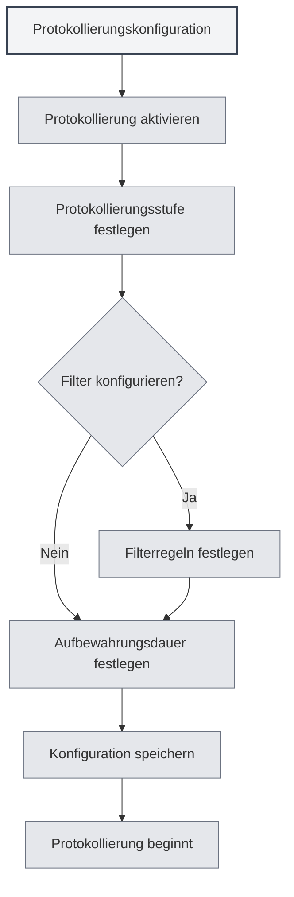

# Protokollierungskonfiguration

## Übersicht

Die Protokollierungskonfiguration ermöglicht es Ihnen, die Protokollierungsfunktionen von MetaDoc zu verwalten. Durch die Konfiguration der Protokollierung können Sie den Betriebszustand der Anwendung aufzeichnen, was die Fehlerbehebung und Leistungsanalyse erleichtert.

<Demo component="SettingLoggerSection" mode="demo" />

## Protokollierung aktivieren

### Protokollierungsfunktion einschalten

Auf der Seite mit den Protokollierungseinstellungen müssen Sie zunächst die Protokollierungsfunktion aktivieren:

1.  Finden Sie den Schalter "Protokollierung aktivieren"
2.  Schalten Sie den Schalter in den Zustand "Aktiviert"
3.  Die Protokollierung beginnt mit der Aufzeichnung in Dateien

Sie können über die obere Menüleiste auf die Protokollierungseinstellungen zugreifen:

<MenuItemsDemo mode="demo" :items='[{"id": "settings"}]' />

Nach der Aktivierung der Protokollierung zeichnet das System Betriebsinformationen der Anwendung auf, darunter:

-   Vorgangsaufzeichnungen
-   Fehlermeldungen
-   Warnmeldungen
-   Debug-Informationen (falls aktiviert)



**Hinweise**:

-   Protokolle belegen Speicherplatz auf der Festplatte
-   Empfohlen wird die Aktivierung bei Bedarf zur Fehlerbehebung
-   In Produktionsumgebungen kann sie deaktiviert werden, um Ressourcen zu sparen

## Protokollierungsstufe

### Stufenbeschreibung

Die Protokollierungsstufe bestimmt, welche Stufen von Protokollen aufgezeichnet werden:

<ConsoleTerminal mode="demo" consoleKey="log-levels" :history='[{"content": "[INFO] 应用启动完成", "type": "out"}, {"content": "[DEBUG] 加载配置文件", "type": "out"}, {"content": "[WARN] 配置项缺失，使用默认值", "type": "warn"}, {"content": "[ERROR] 连接失败，正在重试...", "type": "error"}]' />

-   **DEBUG**: Detaillierte Debug-Informationen, einschließlich aller Vorgangsdetails
-   **INFO**: Allgemeine Informationen, wichtige Vorgänge und Zustände werden aufgezeichnet
-   **WARN**: Warnmeldungen, mögliche Probleme werden aufgezeichnet
-   **ERROR**: Fehlermeldungen, Fehler und Ausnahmen werden aufgezeichnet

### Stufenpriorität

Protokollierungsstufen haben eine Prioritätsbeziehung:

```
DEBUG < INFO < WARN < ERROR
```

Nach Auswahl einer Stufe werden Protokolle dieser Stufe und höherer Stufen aufgezeichnet. Zum Beispiel:

-   INFO auswählen: INFO, WARN, ERROR werden aufgezeichnet
-   WARN auswählen: Nur WARN, ERROR werden aufgezeichnet
-   ERROR auswählen: Nur ERROR wird aufgezeichnet

### Empfehlungen zur Stufenauswahl

-   **Entwicklung/Debugging**: DEBUG-Stufe verwenden, um detaillierte Informationen zu erhalten
-   **Tägliche Nutzung**: INFO-Stufe verwenden, um wichtige Vorgänge aufzuzeichnen
-   **Fehlerbehebung**: WARN-Stufe verwenden, um Warnungen und Fehler zu überwachen
-   **Produktionsumgebung**: ERROR-Stufe verwenden, um nur Fehler aufzuzeichnen

<SettingLoggerSection mode="demo" />

## Protokollfilter

### Filterfunktion

Der Protokollfilter ermöglicht es Ihnen, nur Protokolle eines bestimmten Bereichs aufzuzeichnen:

-   **Nach Scope filtern**: Nur Protokolle bestimmter Module aufzeichnen
-   **Präfix-Matching**: Unterstützt Präfix-Matching, z.B. "ai-graph" matcht alle Scopes, die mit "ai-graph" beginnen
-   **Exaktes Matching**: Unterstützt exaktes Matching, z.B. "[ai-graph][WorkflowTool]"

### Filterregeln

Filterregeln unterstützen folgende Formate:

-   **Einfaches Matching**: `ai-graph` - Matcht alle Scopes, die "ai-graph" enthalten
-   **Präfix-Matching**: `ai-` - Matcht alle Scopes, die mit "ai-" beginnen
-   **Exaktes Matching**: `[ai-graph][WorkflowTool]` - Exaktes Matching für diesen Scope

### Anwendungsszenarien

-   **Bestimmtes Modul debuggen**: Nur Protokolle eines bestimmten Moduls aufzeichnen
-   **Protokollmenge reduzieren**: Nicht relevante Protokolle herausfiltern
-   **Problemlokalisierung**: Auf Protokolle bestimmter Funktionen fokussieren

<SettingDebugSection mode="demo" />

### Filterbeispiele

**Beispiel 1: Nur KI-bezogene Protokolle aufzeichnen**

```
Filterbedingung: ai-
```

**Beispiel 2: Nur Workflow-Protokolle aufzeichnen**

```
Filterbedingung: workflow
```

**Beispiel 3: Nur Protokolle eines bestimmten Tools aufzeichnen**

```
Filterbedingung: [ai-graph][WorkflowTool]
```

## Protokoll-Aufbewahrungsdauer

### Einstellung der Aufbewahrungsdauer

Die Protokoll-Aufbewahrungsdauer bestimmt, wie lange Protokolldateien aufbewahrt werden:

-   **Nicht aufbewahren**: Keine automatische Bereinigung von Protokollen
-   **1 Tag**: Protokolle für 1 Tag aufbewahren
-   **3 Tage**: Protokolle für 3 Tage aufbewahren
-   **7 Tage**: Protokolle für 7 Tage aufbewahren
-   **1 Monat**: Protokolle für 1 Monat aufbewahren
-   **3 Monate**: Protokolle für 3 Monate aufbewahren
-   **6 Monate**: Protokolle für 6 Monate aufbewahren
-   **1 Jahr**: Protokolle für 1 Jahr aufbewahren
-   **Permanent**: Protokolle dauerhaft aufbewahren

### Automatische Bereinigung

Nach Festlegung der Aufbewahrungsdauer bereinigt das System automatisch abgelaufene Protokolldateien:

-   **Bereinigungszeitpunkt**: Bereinigung wird sofort bei Änderung der Aufbewahrungsdauer ausgeführt
-   **Bereinigungsregel**: Löschung von Protokolldateien, die die Aufbewahrungsdauer überschritten haben
-   **Bereinigungsbereich**: Nur Dateien im Protokollverzeichnis werden bereinigt

<ConsoleTerminal mode="demo" consoleKey="cleanup" :history='[{"content": "[INFO] 开始清理过期日志文件...", "type": "out"}, {"content": "[INFO] 删除: 2026-02-10 10-30-45.log (超过保留期限)", "type": "out"}, {"content": "[INFO] 删除: 2026-02-11 14-20-30.log (超过保留期限)", "type": "out"}, {"content": "[INFO] 清理完成，共删除 2 个文件", "type": "out"}]' />

### Auswahl-Empfehlungen

-   **Entwicklungsumgebung**: Kürzere Aufbewahrungsdauer verwenden (1-3 Tage)
-   **Produktionsumgebung**: Mittlere Aufbewahrungsdauer verwenden (7 Tage - 1 Monat)
-   **Wichtige Projekte**: Längere Aufbewahrungsdauer verwenden (3-6 Monate)
-   **Audit-Anforderungen**: Permanente Aufbewahrung verwenden

## Protokolldateipfad

### Protokollpfad anzeigen

Auf der Seite mit den Protokollierungseinstellungen können Sie Folgendes einsehen:

-   **Protokolldateipfad**: Vollständiger Pfad zur aktuellen Protokolldatei
-   **Protokollverzeichnispfad**: Pfad zum Verzeichnis, in dem sich die Protokolldateien befinden

### Protokolldatei öffnen

1.  Auf der Seite mit den Protokollierungseinstellungen "Protokolldateipfad" finden
2.  Auf die Schaltfläche "Protokolldatei öffnen" klicken
3.  Das System öffnet die Protokolldatei mit dem Standard-Texteditor

### Protokollverzeichnis öffnen

1.  Auf der Seite mit den Protokollierungseinstellungen "Protokollverzeichnis" finden
2.  Auf die Schaltfläche "Protokollverzeichnis öffnen" klicken
3.  Das System öffnet das Protokollverzeichnis im Dateimanager

<ViewMenuItemsDemo mode="demo" :items='["home", "editor"]'
/>

## Protokollkonsole

### Protokolle in Echtzeit anzeigen

Die Seite mit den Protokollierungseinstellungen bietet eine Protokollkonsole zur Echtzeitanzeige von Protokollen:

-   **Echtzeitanzeige**: Zeigt die neuesten Protokolleinträge an
-   **Verlauf**: Zeigt den kürzlichen Protokollverlauf an (max. 500 Einträge)
-   **Protokollierungsstufe**: Protokolle unterschiedlicher Stufen werden in verschiedenen Farben angezeigt

<ConsoleTerminal mode="demo" consoleKey="realtime-logs" :history='[{"content": "[2026-02-24 10:30:15] [INFO] [main][App] 应用启动完成", "type": "out"}, {"content": "[2026-02-24 10:30:16] [DEBUG] [renderer][Editor] 编辑器初始化", "type": "out"}, {"content": "[2026-02-24 10:30:18] [INFO] [renderer][Workspace] 加载工作目录", "type": "out"}]' />

### Konsolenfunktionen

-   **Protokolle anzeigen**: Anwendungsprotokolle in Echtzeit anzeigen
-   **Anzeige filtern**: Anzeige nach Protokollierungsstufe filtern
-   **Protokolle durchsuchen**: Protokollinhalt in der Konsole durchsuchen

## Protokolldateiformat

### Dateibenennung

Protokolldateien verwenden folgendes Namensformat:

```
YYYY-MM-DD HH-mm-ss.log
```

Beispiel: `2026-02-19 14-30-45.log`

### Protokollformat

Jeder Protokolleintrag enthält folgende Informationen:

-   **Zeitstempel**: Zeitpunkt der Protokollierung
-   **Stufe**: Protokollierungsstufe (DEBUG/INFO/WARN/ERROR)
-   **Prozesstyp**: main (Hauptprozess) oder renderer (Renderer-Prozess)
-   **Scope**: Modul oder Komponente, von der das Protokoll stammt
-   **Nachricht**: Inhalt der Protokollnachricht

### Protokollbeispiele

```
[2026-02-19 14:30:45] [INFO] [main][Logger] 日志配置更新: enabled=true, level=info
[2026-02-19 14:30:46] [DEBUG] [renderer][Editor] 文档已保存
[2026-02-19 14:30:47] [WARN] [main][RAG] 知识库文件未找到
[2026-02-19 14:30:48] [ERROR] [renderer][LLM] API调用失败
```

<ConsoleTerminal mode="demo" consoleKey="log-examples" :history='[{"content": "[2026-02-19 14:30:45] [INFO] [main][Logger] 日志配置更新: enabled=true, level=info", "type": "out"}, {"content": "[2026-02-19 14:30:46] [DEBUG] [renderer][Editor] 文档已保存", "type": "out"}, {"content": "[2026-02-19 14:30:47] [WARN] [main][RAG] 知识库文件未找到", "type": "warn"}, {"content": "[2026-02-19 14:30:48] [ERROR] [renderer][LLM] API调用失败", "type": "error"}]' />

## Best Practices

1.  **Stufe angemessen setzen**: Passende Protokollierungsstufe je nach Anwendungsszenario wählen
2.  **Filter verwenden**: Filterfunktion nutzen, um die Protokollmenge zu reduzieren
3.  **Regelmäßig bereinigen**: Angemessene Aufbewahrungsdauer setzen, um übermäßigen Speicherverbrauch zu vermeiden
4.  **Fehlerbehebung**: Bei Problemen vorübergehend die Protokollierungsstufe erhöhen, um detaillierte Informationen zu erhalten
5.  **Protokolle sichern**: Wichtige Protokolle zur Sicherung aufbewahren

<MainTabs mode="demo" />

## Wichtige Hinweise

1.  **Festplattenspeicher**: Protokolle belegen Speicherplatz, regelmäßige Bereinigung beachten
2.  **Leistungseinfluss**: DEBUG-Stufe kann die Leistung beeinträchtigen, empfohlen nur beim Debugging zu verwenden
3.  **Privatsphäre und Sicherheit**: Protokolle können sensible Informationen enthalten, Schutz der Protokolldateien beachten
4.  **Dateiberechtigungen**: Sicherstellen, dass das Protokollverzeichnis Schreibberechtigungen hat
5.  **Protokollort**: Der Speicherort von Protokolldateien wird automatisch vom System verwaltet, manuelle Änderungen werden nicht empfohlen

## Verwandte Dokumentation

-   [[settings.basic|Grundeinstellungen]]
-   [[settings.about|Über-Informationen]]

<QuickStartPanel mode="demo" />

<ResizableDivider mode="demo" />