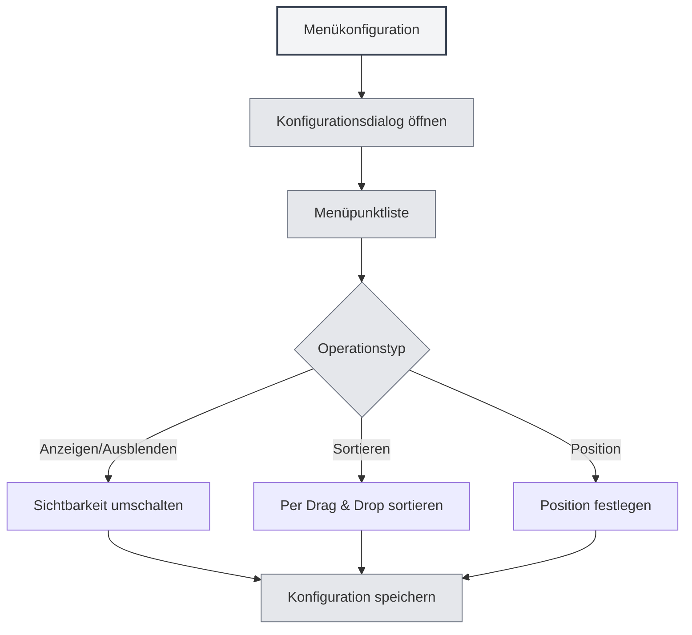

# Menükonfiguration

## Übersicht

Die Menükonfigurationsfunktion ermöglicht es Ihnen, die Anzeige und Reihenfolge des linken Menüs anzupassen. Durch die Menükonfiguration können Sie nicht benötigte Menüpunkte ausblenden, die Menüreihenfolge anpassen, die Position von Menüpunkten festlegen und so ein personalisiertes Interface-Layout erstellen.

## Menükonfiguration öffnen

### Zugriffsmöglichkeiten

Die Menükonfiguration kann auf folgende Weise geöffnet werden:

- **Einstellungsseite**: Möglicherweise gibt es einen Zugang zur Menükonfiguration auf der Einstellungsseite.
- **Menüoption**: Möglicherweise gibt es eine Menükonfigurationsoption im "Weitere Funktionen"-Bereich des linken Menüs.
- **Kontextmenü**: Bestimmte Menüpunkte können Konfigurationsoptionen enthalten.

Sie können über die obere Menüleiste auf die Menükonfiguration zugreifen:

<MenuItemsDemo mode="demo" :items='[{"id": "settings"}]' />

## Menüpunktverwaltung

### Menüpunktliste

Die Menükonfigurationsseite zeigt alle konfigurierbaren Menüpunkte an:

- **Menüpunktname**: Zeigt den Namen des Menüpunkts an.
- **Sichtbarkeit**: Zeigt an, ob der Menüpunkt sichtbar ist.
- **Position**: Zeigt die Position des Menüpunkts an (oben/unten).
- **Kernkennzeichnung**: Kennzeichnet Kernmenüpunkte (können nicht ausgeblendet werden).

### Menüpunkttypen

Menüpunkte werden in zwei Typen unterteilt:

- **Kernmenüpunkte**: Müssen angezeigt werden, können nicht ausgeblendet werden.
  - Startseite
  - Datei
  - Einstellungen
  - Weitere Funktionen
  - Beenden
- **Normale Menüpunkte**: Können ausgeblendet werden.
  - KI-Assistent
  - Zuletzt verwendete Dateien
  - Wissensdatenbank
  - Arbeitsverzeichnis
  - Benutzerhandbuch
  - Benutzerfeedback
  - LLM-Statistiken
  - Debugging-Tools (Entwicklungsumgebung)

## Menüpunkte anzeigen/ausblenden

### Menüpunkte ausblenden

Nicht benötigte Menüpunkte können ausgeblendet werden:

1. **Konfiguration öffnen**: Öffnen Sie den Menükonfigurationsdialog.
2. **Menüpunkt finden**: Finden Sie den auszublendenden Menüpunkt.
3. **Sichtbarkeit umschalten**: Schalten Sie den Sichtbarkeitsschalter des Menüpunkts um.
4. **Konfiguration speichern**: Klicken Sie auf die Schaltfläche "Speichern", um die Konfiguration zu speichern.

<DialogDemo mode="demo" dialogType="menu-config" />

### Menüpunkte anzeigen

Bereits ausgeblendete Menüpunkte können wieder angezeigt werden:

1. **Konfiguration öffnen**: Öffnen Sie den Menükonfigurationsdialog.
2. **Menüpunkt finden**: Finden Sie den anzuzeigenden Menüpunkt.
3. **Sichtbarkeit umschalten**: Schalten Sie den Sichtbarkeitsschalter des Menüpunkts um.
4. **Konfiguration speichern**: Klicken Sie auf die Schaltfläche "Speichern", um die Konfiguration zu speichern.

### Einschränkungen bei Kernmenüpunkten

Kernmenüpunkte können nicht ausgeblendet werden:

- **Erzwungene Anzeige**: Kernmenüpunkte werden immer angezeigt.
- **Nicht ausblendbar**: Der Sichtbarkeitsschalter für Kernmenüpunkte ist deaktiviert.
- **Automatische Wiederherstellung**: Wenn versucht wird, einen Kernmenüpunkt auszublenden, wird er automatisch wieder auf "sichtbar" gesetzt.

## Menüpunkte sortieren

### Drag & Drop-Sortierung

Die Reihenfolge der Menüpunkte kann per Drag & Drop angepasst werden:

1. **Konfiguration öffnen**: Öffnen Sie den Menükonfigurationsdialog.
2. **Menüpunkt ziehen**: Klicken und ziehen Sie den Griff des Menüpunkts.
3. **Position anpassen**: Ziehen Sie den Menüpunkt an die Zielposition.
4. **Konfiguration speichern**: Klicken Sie auf die Schaltfläche "Speichern", um die Konfiguration zu speichern.

### Sortierregeln

Die Sortierung der Menüpunkte folgt diesen Regeln:

- **Positionsgruppierung**: Obere und untere Menüpunkte werden getrennt sortiert.
- **Trennlinie**: Zwischen oberen und unteren Menüpunkten wird eine Trennlinie angezeigt.
- **Automatische Anpassung**: Beim Ziehen in einen anderen Bereich wird die Positionseigenschaft automatisch angepasst.

## Menüpunktposition festlegen

### Positionstypen

Für Menüpunkte können zwei Positionen festgelegt werden:

- **Oben**: Wird im oberen Bereich der Menüleiste angezeigt.
- **Unten**: Wird im unteren Bereich der Menüleiste angezeigt.

### Position festlegen

Die Position eines Menüpunkts kann festgelegt werden:

1. **Konfiguration öffnen**: Öffnen Sie den Menükonfigurationsdialog.
2. **An Position ziehen**: Ziehen Sie den Menüpunkt in den oberen oder unteren Bereich.
3. **Automatische Anpassung**: Das System passt die Positionseigenschaft automatisch an.
4. **Konfiguration speichern**: Klicken Sie auf die Schaltfläche "Speichern", um die Konfiguration zu speichern.

<LeftMenu mode="demo" />

### Positions-Trennlinie

Zwischen dem oberen und unteren Bereich wird eine Trennlinie angezeigt:

- **Automatische Anzeige**: Wenn es sowohl obere als auch untere Menüpunkte gibt, wird die Trennlinie automatisch angezeigt.
- **Nicht verschiebbar**: Die Trennlinie kann nicht gezogen werden und dient der visuellen Trennung.
- **Automatisches Ausblenden**: Wenn es nur obere oder nur untere Menüpunkte gibt, wird die Trennlinie automatisch ausgeblendet.

## Konfiguration speichern

### Automatisches Speichern

Bestimmte Aktionen speichern die Konfiguration automatisch:

- **Sichtbarkeit umschalten**: Automatisches Speichern beim Umschalten der Menüpunktsichtbarkeit.
- **Positionsanpassung**: Automatisches Speichern beim Anpassen der Menüpunktposition.

### Manuelles Speichern

Die Konfiguration kann auch manuell gespeichert werden:

1. **Konfiguration anpassen**: Passen Sie die Reihenfolge und Sichtbarkeit der Menüpunkte an.
2. **Speichern klicken**: Klicken Sie auf die Schaltfläche "Speichern".
3. **Konfiguration wird wirksam**: Die Konfiguration tritt sofort in Kraft.

### Konfiguration zurücksetzen

Die Menükonfiguration kann zurückgesetzt werden:

1. **Konfiguration öffnen**: Öffnen Sie den Menükonfigurationsdialog.
2. **Zurücksetzen klicken**: Klicken Sie auf die Schaltfläche "Zurücksetzen".
3. **Zurücksetzen bestätigen**: Bestätigen Sie den Rücksetzvorgang.
4. **Standard wiederherstellen**: Die Konfiguration wird auf den Standardzustand zurückgesetzt.

**Hinweise**:

- Der Rücksetzvorgang kann nicht rückgängig gemacht werden.
- Nach dem Zurücksetzen bleiben Kernmenüpunkte weiterhin sichtbar.

<DialogDemo mode="demo" dialogType="confirm-reset" />

## Konfigurationspersistenz

### Konfigurationsspeicherung

Die Menükonfiguration wird lokal gespeichert:

- **Lokale Speicherung**: Die Konfiguration wird in den lokalen Einstellungen gespeichert.
- **Automatisches Laden**: Beim nächsten Start der Anwendung wird die Konfiguration automatisch geladen.
- **Synchronisierung über Fenster hinweg**: Die Konfiguration wird zwischen allen Fenstern synchronisiert.

### Konfigurationsmigration

Konfigurationen aus älteren Versionen werden automatisch migriert:

- **Positionsmigration**: Die Position "middle" aus älteren Versionen wird automatisch zu "bottom" migriert.
- **Kompatibilitätsbehandlung**: Das System verarbeitet automatisch Konfigurationsformate älterer Versionen.
- **Reibungsloses Upgrade**: Nach einem Upgrade wird die Konfiguration automatisch an die neue Version angepasst.

## Best Practices

1. **Menü vereinfachen**: Blenden Sie ungenutzte Menüpunkte aus, um die Oberfläche übersichtlich zu halten.
2. **Sinnvoll sortieren**: Platzieren Sie häufig genutzte Menüpunkte vorne für einen einfachen Zugriff.
3. **Positionen gruppieren**: Platzieren Sie zusammengehörige Menüpunkte im selben Positionsbereich.
4. **Regelmäßig anpassen**: Passen Sie die Menükonfiguration regelmäßig an Ihre Nutzungsgewohnheiten an.
5. **Konfiguration sichern**: Wichtige Konfigurationen können gesichert werden, um sie leicht wiederherstellen zu können.

## Wichtige Hinweise

1. **Kernmenüpunkte**: Kernmenüpunkte können nicht ausgeblendet werden und müssen angezeigt werden.
2. **Konfiguration speichern**: Einige Aktionen speichern automatisch, andere erfordern manuelles Speichern.
3. **Rücksetzvorgang**: Der Rücksetzvorgang kann nicht rückgängig gemacht werden. Bitte verwenden Sie ihn mit Bedacht.
4. **Synchronisierung über Fenster hinweg**: Die Konfiguration wird zwischen allen Fenstern synchronisiert.
5. **Entwicklungstools**: Debugging-Tools werden nur in der Entwicklungsumgebung angezeigt.

## Verwandte Dokumentation

- [[settings.basic|Grundeinstellungen]]
- [[core.multi-tab|Multi-Tab-Verwaltung]]

<MainTabs mode="demo" />

<LeftMenu mode="demo" />

<MenuItemsDemo mode="demo" :items='[{"id": "settings"}]' />

<DialogDemo mode="demo" dialogType="menu-config" />

<MenuItemsDemo mode="demo" :items='[{"id": "file", "items": ["new", "open"]}]' />

<DialogDemo mode="demo" dialogType="confirm-reset" />