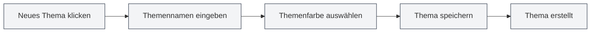

# Benutzerdefinierte Themenverwaltung

## Übersicht

Die benutzerdefinierte Themenverwaltung ermöglicht es Ihnen, benutzerdefinierte Themen zu erstellen, zu bearbeiten, zu löschen und zu duplizieren. Mit benutzerdefinierten Themen können Sie das Erscheinungsbild der Oberfläche nach Ihren persönlichen Vorlieben gestalten und so die Nutzungserfahrung verbessern.

## Neues benutzerdefiniertes Thema erstellen

### Neues Thema anlegen

1.  Auf der Themeneinstellungsseite auf die Karte "Neues Thema" klicken (+ Symbol)
2.  Im daraufhin erscheinenden Dialogfenster:
    -   Themennamen eingeben (optional, standardmäßig wird der Farbwert verwendet)
    -   Themenfarbe auswählen (mit dem Farbwähler)
3.  Auf die Schaltfläche "Speichern" klicken

Sie können über die obere Menüleiste auf die Themeneinstellungen zugreifen:

<MenuItemsDemo mode="demo" :items='[{"id": "settings"}]' />

### Themenfarbauswahl

Der Farbwähler bietet folgende Funktionen:

-   **Farbauswahl**: Auf den Farbbereich klicken, um eine Farbe auszuwählen
-   **Voreingestellte Farben**: Aus einer Liste voreingestellter Farben wählen
-   **Transparenz anpassen**: Die Transparenz der Farbe anpassen (Alpha-Kanal)
-   **Farbwert eingeben**: HEX-Farbwert direkt eingeben

### Benennung des Themas

-   **Automatische Benennung**: Wenn kein Name eingegeben wird, verwendet das System den Farbwert als Namen
-   **Benutzerdefinierter Name**: Einen aussagekräftigen Namen eingeben, um das Thema leichter zu erkennen und zu verwalten
-   **Namensvorschlag**: Beschreibende Namen verwenden, wie z.B. "Arbeitsthema", "Nachtmodus" usw.

<SettingThemeSection mode="demo" />

## Benutzerdefiniertes Thema bearbeiten

### Thema ändern

1.  In der Themenliste das zu bearbeitende benutzerdefinierte Thema finden
2.  Auf die Schaltfläche "Mehr" auf der Themenkarte klicken (drei Punkte Symbol)
3.  "Bearbeiten" auswählen
4.  Im Dialogfenster den Themennamen oder die Farbe ändern
5.  Auf die Schaltfläche "Speichern" klicken

<DialogDemo mode="demo" dialogType="theme-edit" />

### Farbe schnell bearbeiten

Sie können die Farbe auch direkt auf der Themenkarte bearbeiten:

1.  Auf den Farbwähler auf der Themenkarte klicken
2.  Neue Farbe auswählen
3.  Die Farbe wird sofort angewendet

**Zu beachten**:

-   Voreingestellte Themen können nicht bearbeitet werden
-   Nur benutzerdefinierte Themen sind bearbeitbar
-   Änderungen müssen gespeichert werden, um dauerhaft zu wirken

## Benutzerdefiniertes Thema löschen

### Thema löschen

1.  In der Themenliste das zu löschende benutzerdefinierte Thema finden
2.  Auf die Schaltfläche "Mehr" auf der Themenkarte klicken
3.  "Löschen" auswählen
4.  Den Löschvorgang bestätigen

**Zu beachten**:

-   Der Löschvorgang kann nicht rückgängig gemacht werden
-   Wenn das aktuell verwendete Thema gelöscht wird, wechselt das System automatisch zum Standardthema
-   Voreingestellte Themen können nicht gelöscht werden

## Thema duplizieren

### Vorhandenes Thema kopieren

1.  In der Themenliste das zu kopierende Thema finden
2.  Auf die Schaltfläche "Mehr" auf der Themenkarte klicken
3.  "Kopieren" auswählen
4.  Das System erstellt eine Kopie, wobei dem Namen "Kopie" hinzugefügt wird
5.  Die Kopie kann bearbeitet werden, um ein neues Thema zu erstellen

### Anwendungsfälle

-   **Neues Thema basierend auf vorhandenem erstellen**: Nach dem Kopieren die Farbe ändern
-   **Themenvariante erstellen**: Ähnliche, aber leicht unterschiedliche Themen erstellen
-   **Thema sichern**: Kopie als Backup erstellen

## Themenfarbeneinstellung

### Funktionen des Farbwählers

Der Farbwähler bietet umfangreiche Farbauswahlfunktionen:

-   **Farbfeld**: Zum Auswählen einer Farbe klicken
-   **Voreingestellte Farben**: Schnelle Auswahl häufig verwendeter Farben
-   **Farbwerteingabe**: Direkte Eingabe von HEX-, RGB-, HSL-Formaten usw.
-   **Transparenzanpassung**: Anpassen der Transparenz der Farbe

<DialogDemo mode="demo" dialogType="color-picker" />

### Voreingestellte Farben

MetaDoc bietet verschiedene voreingestellte Farben:

-   **Grundfarben**: Rot, Orange, Gelb, Grün, Cyan, Blau, Violett, Grau
-   **Helle Farbtöne**: Hellrot, Hellorange, Hellgelb usw.
-   **Dunkle Farbtöne**: Dunkelrot, Dunkelorange, Dunkelgelb usw.

### Farbformate

Unterstützte Farbformate:

-   **HEX**: `#FF5733` (am gebräuchlichsten)
-   **RGB**: `rgb(255, 87, 51)`
-   **HSL**: `hsl(9, 100%, 60%)`

## Thema anwenden

### Benutzerdefiniertes Thema anwenden

1.  In der Themenliste auf die Karte des gewünschten benutzerdefinierten Themas klicken
2.  Das Thema wird sofort angewendet
3.  Die Oberflächenfarben werden automatisch basierend auf der Themenfarbe generiert

### Einfluss der Themenfarbe

Die Themenfarbe beeinflusst folgende Oberflächenelemente:

-   **Hintergrundfarbe**: Haupt- und Neben-Hintergrund
-   **Textfarbe**: Primärer und sekundärer Text
-   **Seitenleiste**: Hintergrund und Text der Seitenleiste
-   **Editor**: Editor-Hintergrund und Werkzeugleiste
-   **Andere Elemente**: Schaltflächen, Rahmen, Hervorhebungen usw.

### Automatische Farbgebung

MetaDoc generiert automatisch ein Farbschema basierend auf der Themenfarbe:

-   **Helles Thema**: Wenn die Themenfarbe hell ist, wird ein helles Farbschema generiert
-   **Dunkles Thema**: Wenn die Themenfarbe dunkel ist, wird ein dunkles Farbschema generiert
-   **Farbgebungsalgorithmus**: Verwendet Farbmischung und Sättigungsanpassung

## Themenverwaltung

### Themenliste

Die Themeneinstellungsseite zeigt alle verfügbaren Themen an:

-   **Voreingestellte Themen**: Systeminterne Themen
-   **Benutzerdefinierte Themen**: Vom Benutzer erstellte Themen
-   **Aktuelles Thema**: Zeigt die Auswahlmarkierung an

### Sortierung der Themen

Themen werden in folgender Reihenfolge angezeigt:

1.  System-synchronisierte Themen (folgt dem System)
2.  Voreingestellte helle/dunkle Themen
3.  Benutzerdefinierte Themen (nach Erstellungszeit)

### Themenstatus

Jede Themenkarte zeigt:

-   **Vorschau der Themenfarbe**: Zeigt die Hauptfarbe des Themas
-   **Themenname**: Zeigt den Namen des Themas
-   **Farbwert**: Zeigt den HEX-Wert der Farbe
-   **Auswahlmarkierung**: Das aktuell verwendete Thema

## Best Practices

1.  **Themenbenennung**: Verwenden Sie aussagekräftige Namen zur leichteren Erkennung
2.  **Farbauswahl**: Wählen Sie augenschonende Farben, vermeiden Sie zu grelle Farben
3.  **Themensicherung**: Wichtige Themen sollten zur Sicherung dupliziert werden
4.  **Regelmäßige Bereinigung**: Nicht mehr verwendete Themen löschen, um die Liste übersichtlich zu halten
5.  **Testen der Wirkung**: Nach der Erstellung eines Themas die tatsächliche Wirkung testen und basierend auf der Nutzungserfahrung anpassen

## Wichtige Hinweise

1.  **Voreingestellte Themen**: Voreingestellte Themen können nicht bearbeitet oder gelöscht werden
2.  **Themenkompatibilität**: Einige Themen können in verschiedenen Umgebungen unterschiedlich dargestellt werden
3.  **Farbauswahl**: Es wird empfohlen, Farben mit angemessenem Kontrast zu wählen, um die Lesbarkeit zu gewährleisten
4.  **Anzahl der Themen**: Es wird empfohlen, nicht zu viele Themen zu erstellen, um die Liste übersichtlich zu halten
5.  **Themensynchronisation**: Themenänderungen werden zwischen allen Fenstern synchronisiert

## Verwandte Dokumentation

-   [[settings.theme|Themenkonfiguration]]
-   [[settings.basic|Grundeinstellungen]]
-   [[core.editor-settings|Editoreinstellungen]]

<ResizableDivider mode="demo" />

<SettingThemeSection mode="demo" />

<MenuItemsDemo mode="demo" :items='[{"id": "settings", "items": ["theme"]}]' />

<DialogDemo mode="demo" dialogType="color-picker" />

<DialogDemo mode="demo" dialogType="theme-edit" />

<MenuItemsDemo mode="demo" :items='[{"id": "settings"}]' />
