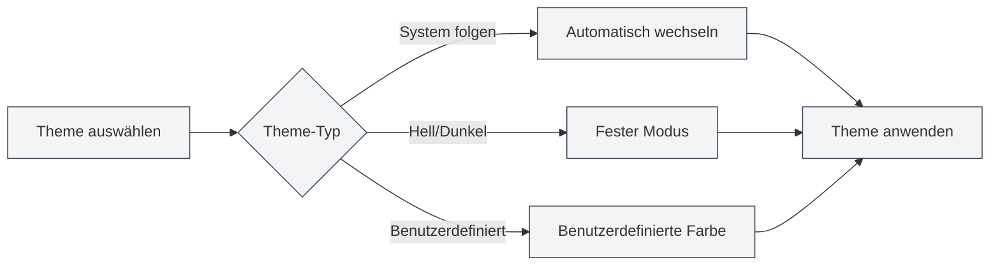

# Theme-Konfiguration

## Übersicht

Die Theme-Konfiguration ermöglicht es Ihnen, das Erscheinungsbild von MetaDoc anzupassen, einschließlich globaler Themes, Inhalts-Themes, Code-Themes usw. Eine sinnvolle Konfiguration kann die Nutzungserfahrung verbessern und visuelle Ermüdung reduzieren.

## Globales Theme

### Theme-Typen

MetaDoc unterstützt die folgenden globalen Theme-Typen:

- **Systemhelligkeit folgen**: Folgt automatisch dem Hell-/Dunkelmodus des Betriebssystems
- **Systemfarbe folgen**: Folgt der Akzentfarbe des Betriebssystems (Windows 11)
- **Hell**: Verwendet fest das helle Theme
- **Dunkel**: Verwendet fest das dunkle Theme
- **Benutzerdefiniert**: Verwendet benutzerdefinierte Theme-Farben

### Theme auswählen

1. Auf der Theme-Einstellungsseite die Theme-Karten durchsuchen
2. Auf die gewünschte Theme-Karte klicken
3. Das Theme wird sofort angewendet

Sie können über die obere Menüleiste auf die Theme-Einstellungen zugreifen:

<MenuItemsDemo mode="demo" :items='[{"id": "settings"}]' />

### Vorschau des hellen Themes

<SettingThemeSection mode="demo" theme="light" />

### Vorschau des dunklen Themes

<SettingThemeSection mode="demo" theme="dark" />

### Theme-Einstellungsoberfläche

Die folgende Abbildung zeigt die vollständige Oberfläche der Theme-Einstellungsseite:

<SettingThemeSection mode="demo" />

<ViewMenuItemsDemo mode="demo" :items='["editor", "outline"]' />

Die Theme-Einstellungsoberfläche umfasst die folgenden Hauptfunktionsbereiche:

- **Globales Theme**: Auswahl zwischen hellem, dunklem, systemfolgendem oder benutzerdefiniertem Theme
- **Inhalts-Theme**: Festlegen des Anzeige-Themes für den Editorbereich
- **Code-Theme**: Auswahl des Syntax-Highlighting-Themes für Codeblöcke
- **Zeilennummern anzeigen**: Steuert, ob Codeblöcke Zeilennummern anzeigen
- **Benutzerdefiniertes Theme**: Erstellen und Verwalten benutzerdefinierter Farbthemes

### Theme-Vorschau

Jede Theme-Karte zeigt:

- **Theme-Farbvorschau**: Zeigt die Hauptfarbe des Themes
- **Theme-Name**: Zeigt den Namen des Themes
- **Auswahlmarkierung**: Das aktuell verwendete Theme zeigt eine Auswahlmarkierung an

## Inhalts-Theme

<SettingThemeSection mode="demo" />

### Inhalts-Theme einstellen

Das Inhalts-Theme steuert das Anzeige-Theme des Dokument-Editorbereichs:

- **Automatisch**: Folgt dem globalen Theme
- **Hell**: Verwendet fest das helle Inhalts-Theme
- **Dunkel**: Verwendet fest das dunkle Inhalts-Theme

### Anwendungsszenarien

- **Global dunkel, Inhalt hell**: Geeignet zum Bearbeiten heller Dokumente in dunkler Umgebung
- **Global hell, Inhalt dunkel**: Geeignet zum Bearbeiten dunkler Dokumente in heller Umgebung
- **Automatischer Modus**: Das Inhalts-Theme folgt automatisch dem globalen Theme

## Code-Theme

<SettingThemeSection mode="demo" />

### Code-Theme einstellen

Das Code-Theme steuert das Syntax-Highlighting-Theme für Codeblöcke:

- **Automatisch**: Wird automatisch basierend auf dem globalen Theme ausgewählt
- **Benutzerdefiniert**: Auswahl aus der Liste der Code-Themes

### Code-Theme-Liste

MetaDoc unterstützt verschiedene Code-Themes, darunter:

- **Helle Themes**: GitHub, VS, OneLight usw.
- **Dunkle Themes**: Monokai, Dracula, OneDark usw.

### Auswahlvorschläge

- **Helles Dokument**: Verwenden Sie ein helles Code-Theme
- **Dunkles Dokument**: Verwenden Sie ein dunkles Code-Theme
- **Automatischer Modus**: Lassen Sie das System automatisch wählen, um Konsistenz zu gewährleisten

## Zeilennummern anzeigen

<SettingThemeSection mode="demo" />

### Zeilennummern anzeigen

Wenn "Zeilennummern im Codeblock anzeigen" aktiviert ist, zeigen Codeblöcke Zeilennummern:

- **Aktiviert**: Zeilennummern werden links neben dem Codeblock angezeigt
- **Deaktiviert**: Zeilennummern werden nicht angezeigt

### Anwendungsszenarien

- **Code-Debugging**: Zeilennummern helfen, Code-Positionen zu lokalisieren
- **Code-Teilen**: Zeilennummern erleichtern das Referenzieren bestimmter Zeilen
- **Code-Lesen**: Zeilennummern helfen, die Code-Struktur zu verstehen

## Theme-Wechsel

<SettingThemeSection mode="demo" />

<ViewMenuItemsDemo mode="demo" :items='["editor", "outline"]' />

### Echtzeit-Wechsel

Der Theme-Wechsel wird sofort wirksam:

1. Neues Theme auswählen
2. Oberfläche aktualisiert sich sofort
3. Wird auf allen Fenstern synchron angewendet

### Theme-Synchronisation

- **Multi-Fenster-Synchronisation**: Alle Fenster synchronisieren das Theme automatisch
- **Einstellungen speichern**: Die Theme-Auswahl wird automatisch gespeichert
- **Nächster Start**: Beim nächsten Start wird das zuletzt gewählte Theme verwendet

## Voreingestellte Themes

<SettingThemeSection mode="demo" />

### Integrierte Themes

MetaDoc bietet verschiedene voreingestellte Themes:

- **Helle Themes**: Geeignet für helle Umgebungen
- **Dunkle Themes**: Geeignet für dunkle Umgebungen
- **System-Synchronisation**: Folgt automatisch den Systemeinstellungen

### Merkmale voreingestellter Themes

- **Optimierte Farbpalette**: Sorgfältig gestaltete Farbschemata
- **Augenschonendes Design**: Reduziert visuelle Ermüdung
- **Konsistenz**: Gewährleistet Einheitlichkeit der Oberflächenelemente

## Best Practices

1. **Umgebung anpassen**: Wählen Sie das Theme basierend auf der Nutzungsumgebung
2. **Inhalt abstimmen**: Stimmen Sie das Inhalts-Theme auf den Dokumenttyp ab
3. **Code-Lesbarkeit**: Wählen Sie ein Code-Theme mit hoher Code-Lesbarkeit
4. **Regelmäßige Anpassung**: Passen Sie die Theme-Einstellungen basierend auf der Nutzungserfahrung an

## Wichtige Hinweise

1. **Systemkompatibilität**: Das Folgen des System-Themes erfordert Betriebssystemunterstützung
2. **Theme-Konsistenz**: Es wird empfohlen, Konsistenz zwischen globalem Theme und Inhalts-Theme beizubehalten
3. **Code-Theme**: Das Code-Theme beeinflusst die Lesbarkeit des Codes
4. **Benutzerdefiniertes Theme**: Benutzerdefinierte Themes müssen manuell erstellt und verwaltet werden

## Verwandte Dokumentation

- [[settings.theme-custom|Benutzerdefinierte Theme-Verwaltung]]
- [[settings.basic|Grundeinstellungen]]
- [[core.editor-settings|Editor-Einstellungen]]