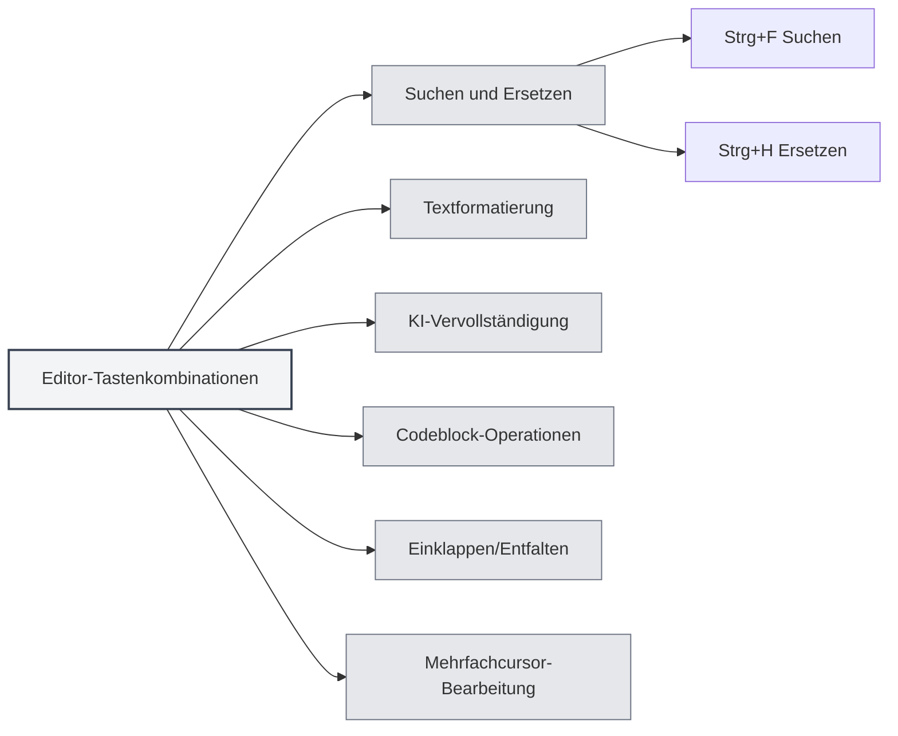

# Editor-Tastenkombinationen

## Übersicht

Editor-Tastenkombinationen sind Tastenkürzel, die in der Editor-Oberfläche verwendet werden, einschließlich Funktionen wie Textbearbeitung, Suchen und Ersetzen sowie Formatierung. Das Beherrschen dieser Tastenkombinationen kann die Bearbeitungseffizienz steigern.

<MenuItemsDemo mode="demo" :items='[{"id": "edit"}]' />

<ViewMenuItemsDemo mode="demo" :items='["editor", "outline"]' />

**Hinweis**: Suchen/Ersetzen (Strg+F, Strg+H) wird global von der Anwendung implementiert; Fett/Kursiv/Link/Codeblock usw. werden vom zugrundeliegenden Editor bereitgestellt (Markdown verwendet Vditor, LaTeX verwendet Monaco). Falls sie nicht funktionieren, orientieren Sie sich bitte am tatsächlichen Editor-Verhalten.

## Suchen und Ersetzen

### Suchen

- **Tastenkombination**: `Strg+F` (Windows/Linux) oder `Cmd+F` (macOS)
- **Funktion**: Suchdialog öffnen
- **Anwendungsfall**: Bestimmten Text im Dokument suchen

### Suchen und Ersetzen

- **Tastenkombination**: `Strg+H` (Windows/Linux) oder `Cmd+H` (macOS)
- **Funktion**: Dialog für Suchen und Ersetzen öffnen
- **Anwendungsfall**: Text suchen und ersetzen

### Suchfunktionen

Der Suchdialog unterstützt die folgenden Funktionen:

- **Text suchen**: Geben Sie den zu suchenden Text ein
- **Text ersetzen**: Geben Sie den Ersatztext ein
- **Reguläre Ausdrücke**: Unterstützt die Suche mit regulären Ausdrücken
- **Groß-/Kleinschreibung beachten**: Unterscheidung zwischen Groß- und Kleinschreibung
- **Ganzes Wort suchen**: Nur vollständige Wörter finden

Die Menüoberfläche für Suchen und Ersetzen sieht wie folgt aus:

<SearchReplaceMenu mode="demo" :position='{"top": 100, "left": 200}' :adapter='null' />

<SearchReplaceMenu mode="demo" :position='{"top": 150, "left": 200}' :adapter='null' />

## Textformatierung

<TextFormatToolbar mode="demo" />

### Fett

- **Tastenkombination**: `Strg+B` (Windows/Linux) oder `Cmd+B` (macOS)
- **Funktion**: Ausgewählten Text fett formatieren
- **Anwendungsfall**: Wichtige Inhalte hervorheben

### Kursiv

- **Tastenkombination**: `Strg+I` (Windows/Linux) oder `Cmd+I` (macOS)
- **Funktion**: Ausgewählten Text kursiv formatieren
- **Anwendungsfall**: Zitate oder Betonung kennzeichnen

### Link einfügen

- **Tastenkombination**: `Strg+K` (Windows/Linux) oder `Cmd+K` (macOS)
- **Funktion**: Link einfügen
- **Anwendungsfall**: Hyperlink hinzufügen

**Wichtiger Hinweis**: Diese Tastenkombination kann mit "Alles speichern" (Strg+K S) kollidieren. Drücken Sie zuerst Strg+K und dann K, nicht gleichzeitig.

## KI-Vervollständigung

<AISuggestionGhost mode="demo" />

<CompletionSettingsPanel mode="demo" />

### Manuelle Vervollständigung auslösen

- **Tastenkombination**: `Umschalt+Tab`
- **Funktion**: KI-Autovervollständigung manuell auslösen
- **Anwendungsfall**: Manuelles Auslösen, wenn KI-Vervollständigung benötigt wird

### Auslösetasten für Vervollständigung

Die KI-Vervollständigung kann auch automatisch durch folgende Tasten ausgelöst werden:

- **Eingabetaste**: Drücken der Eingabetaste löst sie aus
- **Leertaste**: Drücken der Leertaste löst sie aus
- **Semikolon**: Drücken des Semikolons (;) löst sie aus
- **Schrägstrich**: Drücken des Schrägstrichs (/) löst sie aus

Diese Auslösetasten können in den [[settings.llm|LLM-Einstellungen]] konfiguriert werden.

## Codeblock-Operationen

### Codeblock einfügen

- **Tastenkombination**: `Strg+Umschalt+K` (Markdown-Editor)
- **Funktion**: Codeblock einfügen
- **Anwendungsfall**: Codebeispiel hinzufügen

## Einklappen/Entfalten

### Codeblock einklappen

- **Tastenkombination**: `Strg+Umschalt+[` (Windows/Linux) oder `Cmd+Wahl+[` (macOS)
- **Funktion**: Aktuellen Codeblock oder Umgebung einklappen
- **Anwendungsfall**: Nicht benötigten Code ausblenden

### Codeblock entfalten

- **Tastenkombination**: `Strg+Umschalt+]` (Windows/Linux) oder `Cmd+Wahl+]` (macOS)
- **Funktion**: Eingeklappten Codeblock oder Umgebung entfalten
- **Anwendungsfall**: Eingeklappte Inhalte ansehen

## Mehrfachcursor-Bearbeitung

### Alle gleichen Wörter auswählen

- **Tastenkombination**: `Strg+Umschalt+L` (Windows/Linux) oder `Cmd+Umschalt+L` (macOS)
- **Funktion**: Alle gleichen Wörter im Dokument auswählen und Cursor hinzufügen
- **Anwendungsfall**: Gleichen Text stapelweise bearbeiten

## Rückgängig und Wiederholen

### Rückgängig

- **Tastenkombination**: `Strg+Z` (Windows/Linux) oder `Cmd+Z` (macOS)
- **Funktion**: Letzte Aktion rückgängig machen
- **Anwendungsfall**: Fehlerhafte Aktion rückgängig machen

### Wiederholen

- **Tastenkombination**: `Strg+Y` oder `Strg+Umschalt+Z` (Windows/Linux) oder `Cmd+Umschalt+Z` (macOS)
- **Funktion**: Rückgängig gemachte Aktion wiederherstellen
- **Anwendungsfall**: Rückgängig gemachte Aktion wiederholen

## Auswahloperationen

### Alles auswählen

- **Tastenkombination**: `Strg+A` (Windows/Linux) oder `Cmd+A` (macOS)
- **Funktion**: Allen Text auswählen
- **Anwendungsfall**: Gesamten Inhalt zum Kopieren oder Löschen auswählen

### Kopieren

- **Tastenkombination**: `Strg+C` (Windows/Linux) oder `Cmd+C` (macOS)
- **Funktion**: Ausgewählten Text kopieren
- **Anwendungsfall**: Inhalt in die Zwischenablage kopieren

### Einfügen

- **Tastenkombination**: `Strg+V` (Windows/Linux) oder `Cmd+V` (macOS)
- **Funktion**: Inhalt der Zwischenablage einfügen
- **Anwendungsfall**: Kopierten Inhalt einfügen

### Ausschneiden

- **Tastenkombination**: `Strg+X` (Windows/Linux) oder `Cmd+X` (macOS)
- **Funktion**: Ausgewählten Text ausschneiden
- **Anwendungsfall**: Textinhalt verschieben

## Liste der Editor-Tastenkombinationen

### Windows/Linux-Tastenkombinationen

| Funktion                     | Tastenkombination             |
| ---------------------------- | ----------------------------- |
| Suchen                       | `Strg+F`                      |
| Suchen und Ersetzen          | `Strg+H`                      |
| Fett                         | `Strg+B`                      |
| Kursiv                       | `Strg+I`                      |
| Link einfügen                | `Strg+K`                      |
| Codeblock einfügen           | `Strg+Umschalt+K`             |
| Einklappen                   | `Strg+Umschalt+[`             |
| Entfalten                    | `Strg+Umschalt+]`             |
| Alle gleichen Wörter auswählen | `Strg+Umschalt+L`             |
| Rückgängig                   | `Strg+Z`                      |
| Wiederholen                  | `Strg+Y` oder `Strg+Umschalt+Z` |
| Alles auswählen              | `Strg+A`                      |
| Kopieren                     | `Strg+C`                      |
| Einfügen                     | `Strg+V`                      |
| Ausschneiden                 | `Strg+X`                      |
| KI-Vervollständigung         | `Umschalt+Tab`                |

### macOS-Tastenkombinationen

| Funktion                     | Tastenkombination     |
| ---------------------------- | --------------------- |
| Suchen                       | `Cmd+F`               |
| Suchen und Ersetzen          | `Cmd+H`               |
| Fett                         | `Cmd+B`               |
| Kursiv                       | `Cmd+I`               |
| Link einfügen                | `Cmd+K`               |
| Codeblock einfügen           | `Cmd+Umschalt+K`      |
| Einklappen                   | `Cmd+Wahl+[`          |
| Entfalten                    | `Cmd+Wahl+]`          |
| Alle gleichen Wörter auswählen | `Cmd+Umschalt+L`      |
| Rückgängig                   | `Cmd+Z`               |
| Wiederholen                  | `Cmd+Umschalt+Z`      |
| Alles auswählen              | `Cmd+A`               |
| Kopieren                     | `Cmd+C`               |
| Einfügen                     | `Cmd+V`               |
| Ausschneiden                 | `Cmd+X`               |
| KI-Vervollständigung         | `Umschalt+Tab`        |

## Markdown-Editor-spezifische Tastenkombinationen

<LaTeXEditorDemo mode="demo" />

### Vditor-Tastenkombinationen

Der Markdown-Editor basiert auf Vditor und unterstützt folgende Tastenkombinationen:

- **Fett**: `Strg+B`
- **Kursiv**: `Strg+I`
- **Link einfügen**: `Strg+K`
- **Codeblock einfügen**: `Strg+Umschalt+K`

## LaTeX-Editor-spezifische Tastenkombinationen

<LaTeXEditorDemo mode="demo" />

### Monaco-Editor-Tastenkombinationen

Der LaTeX-Editor basiert auf dem Monaco Editor und unterstützt folgende Tastenkombinationen:

- **Einklappen**: `Strg+Umschalt+[`
- **Entfalten**: `Strg+Umschalt+]`
- **Alle gleichen Wörter auswählen**: `Strg+Umschalt+L`
- **Mehrfachcursor-Bearbeitung**: `Alt+Klick` zum Hinzufügen eines Cursors

## Tipps zur Verwendung von Tastenkombinationen

<LaTeXEditorDemo mode="demo" />

<Outline mode="demo" />

### Kombinierte Verwendung

Mehrere Tastenkombinationen können kombiniert werden:

1. **Suchen und Ersetzen**: `Strg+H` zum Öffnen von Suchen/Ersetzen, dann mit der Tabulatortaste zwischen Eingabefeldern wechseln
2. **Text formatieren**: Text auswählen und mit `Strg+B` oder `Strg+I` formatieren
3. **Stapelbearbeitung**: `Strg+Umschalt+L` verwenden, um alle gleichen Wörter auszuwählen, dann einheitlich bearbeiten

### Tastenkombinationen merken

- **Formatierung**: B (Bold), I (Italic) entsprechen Fett und Kursiv
- **Suchen**: F (Find), H (Hunt/Suchen und Ersetzen)
- **Einklappen**: `[` und `]` entsprechen Einklappen und Entfalten

## Best Practices

<MainTabs mode="demo" />

1. **Gewandte Nutzung**: Häufig verwendete Bearbeitungstastenkombinationen sicher beherrschen
2. **Kombinierte Operationen**: Mehrere Tastenkombinationen für komplexe Bearbeitungen kombinieren
3. **Stapelbearbeitung**: Mehrfachcursor-Funktion für stapelweise Bearbeitung nutzen
4. **Schnellformatierung**: Tastenkombinationen für schnelle Textformatierung verwenden
5. **Suchen und Ersetzen**: Such- und Ersetzfunktion zur Effizienzsteigerung nutzen

## Wichtige Hinweise

1. **Plattformunterschiede**: Windows/Linux verwenden Strg, macOS verwendet Cmd
2. **Tastenkombinationskonflikte**: Einige Tastenkombinationen können mit Editor-Funktionen kollidieren
3. **Kontextabhängig**: Einige Tastenkombinationen sind nur in bestimmten Kontexten gültig
4. **Editorunterschiede**: Markdown- und LaTeX-Editor unterstützen möglicherweise unterschiedliche Tastenkombinationen
5. **KI-Vervollständigung**: Umschalt+Tab ist manuell, automatische Auslösung erfordert Konfiguration der Auslösetasten

## Verwandte Dokumentation

- [[shortcuts.global|Globale Tastenkombinationen]]
- [[core.editor-basics|Grundlegende Editor-Operationen]]
- [[markdown.features|Markdown-Editor-Funktionen]]
- [[ai.completion|KI-Autovervollständigung]]

<MenuItemsDemo mode="demo" :items='[{"id": "file"}]' />

<ViewMenuItemsDemo mode="demo" :items='["editor"]' />

<AISuggestionGhost mode="demo" />

<CompletionSettingsPanel mode="demo" />

<LaTeXEditorDemo mode="demo" />