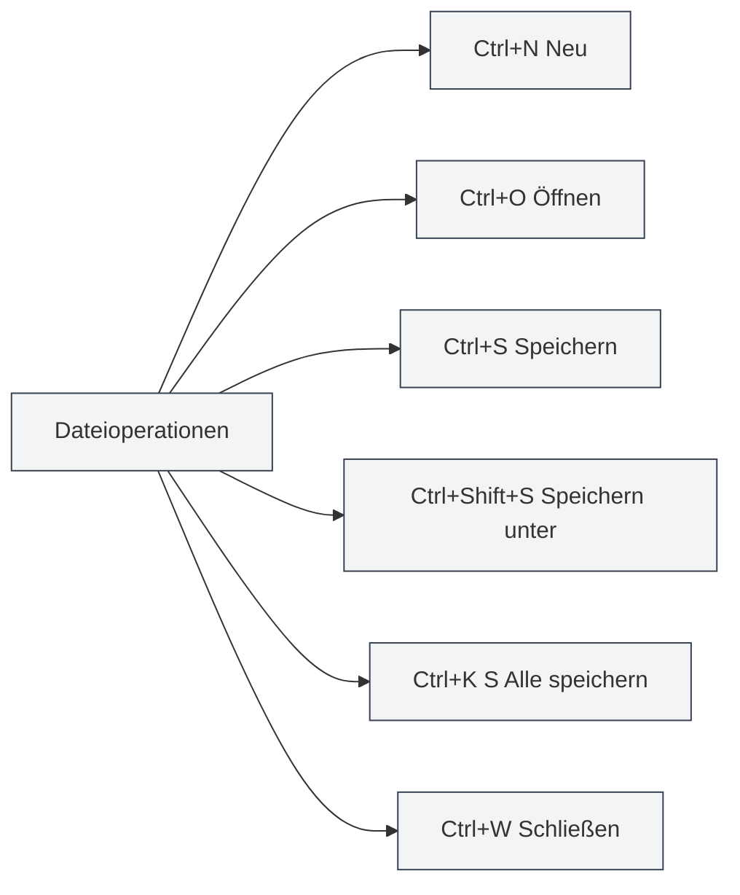

# Globale Tastenkombinationen

## Übersicht

Globale Tastenkombinationen sind in MetaDoc auf jeder Oberfläche verwendbare Shortcuts. Das Beherrschen dieser Tastenkombinationen kann die Arbeitseffizienz erheblich steigern.

**Hinweis**: Die Tastenkombinationen in diesem Dokument wurden mit der aktuellen Code-Implementierung abgeglichen und sind im Hauptprozess oder Renderer-Prozess implementiert und verfügbar.

## Dateioperationen

### Neues Dokument

- **Tastenkombination**: `Ctrl+N` (Windows/Linux) oder `Cmd+N` (macOS)
- **Funktion**: Erstellt ein neues, leeres Dokument
- **Anwendungsfall**: Schneller Start einer neuen Dokumentbearbeitung

### Dokument öffnen

- **Tastenkombination**: `Ctrl+O` (Windows/Linux) oder `Cmd+O` (macOS)
- **Funktion**: Öffnet den Dateiauswahldialog
- **Anwendungsfall**: Öffnen eines vorhandenen Dokuments

### Dokument speichern

- **Tastenkombination**: `Ctrl+S` (Windows/Linux) oder `Cmd+S` (macOS)
- **Funktion**: Speichert das aktuelle Dokument
- **Anwendungsfall**: Speichern von Bearbeitungen, um Datenverlust zu verhindern

### Speichern unter

- **Tastenkombination**: `Ctrl+Shift+S` (Windows/Linux) oder `Cmd+Shift+S` (macOS)
- **Funktion**: Speichert das aktuelle Dokument als neue Datei
- **Anwendungsfall**: Erstellen einer Dokumentkopie oder Ändern des Speicherorts

### Alle Dokumente speichern

- **Tastenkombination**: `Ctrl+K S` (Windows/Linux) oder `Cmd+K S` (macOS)
- **Funktion**: Speichert alle geöffneten Dokumente
- **Verwendung**: Zuerst `Ctrl+K` (oder `Cmd+K`) drücken, dann `S`
- **Anwendungsfall**: Alle Dokumente auf einmal speichern

<MenuItemsDemo mode="demo" :items='[{"id": "file", "items": ["save-all"]}]' />

### Datei schließen

- **Tastenkombination**: `Ctrl+W` (Windows/Linux) oder `Cmd+W` (macOS)
- **Funktion**: Schließt den aktuellen Tab
- **Anwendungsfall**: Schließen eines nicht benötigten Dokuments

## Tab-Operationen

Die Tab-Leiste zeigt alle geöffneten Dokumente an und unterstützt Operationen wie Neu, Wechseln, Schließen usw.:

<MainTabs mode="demo" />

<ViewMenuItemsDemo mode="demo" :items='["editor", "outline"]' />

### Neuen Tab erstellen

- **Tastenkombination**: `Ctrl+T` (Windows/Linux) oder `Cmd+T` (macOS)
- **Funktion**: Erstellt einen neuen Tab
- **Anwendungsfall**: Schnelles Erstellen eines neuen Dokuments

### Tab wechseln

#### Nächster Tab

- **Tastenkombination**: `Ctrl+Tab` (Windows/Linux) oder `Cmd+Tab` (macOS)
- **Funktion**: Wechselt zum nächsten Tab
- **Verwendung**: Halten von `Ctrl+Tab` zeigt ein Tab-Wechsel-Overlay an, mit Tab kann weitergeschaltet oder direkt geklickt werden
- **Anwendungsfall**: Schnelles Wechseln zwischen mehreren Dokumenten

<TabSwitcherOverlay mode="demo" />

#### Vorheriger Tab

- **Tastenkombination**: `Ctrl+Shift+Tab` (Windows/Linux) oder `Cmd+Shift+Tab` (macOS)
- **Funktion**: Wechselt zum vorherigen Tab
- **Anwendungsfall**: Rückwärts durch die Tabs navigieren

### Geschlossenen Tab wieder öffnen

- **Tastenkombination**: `Ctrl+Shift+T` (Windows/Linux) oder `Cmd+Shift+T` (macOS)
- **Funktion**: Öffnet den zuletzt geschlossenen Tab erneut
- **Verwendung**: Kann wiederholt verwendet werden, um die zuletzt geschlossenen Tabs der Reihe nach wiederherzustellen (bis zu 20)
- **Anwendungsfall**: Schnelle Wiederherstellung nach versehentlichem Schließen eines Tabs

<MainTabs mode="demo" />

## Weitere Tastenkombinationen

### Benutzerhandbuch öffnen

- **Tastenkombination**: `F1`
- **Funktion**: Öffnet die Benutzerhandbuch-Seite
- **Anwendungsfall**: Wenn die Hilfedokumentation benötigt wird

<MenuItemsDemo mode="demo" :items='[{"id": "help"}]' />

## Tastenkombinationsliste

### Windows/Linux Tastenkombinationen

| Funktion                     | Tastenkombination     |
| ---------------------------- | --------------------- |
| Neues Dokument               | `Ctrl+N`              |
| Dokument öffnen              | `Ctrl+O`              |
| Dokument speichern           | `Ctrl+S`              |
| Speichern unter              | `Ctrl+Shift+S`        |
| Alle speichern               | `Ctrl+K S`            |
| Tab schließen                | `Ctrl+W`              |
| Neuen Tab erstellen          | `Ctrl+T`              |
| Nächster Tab                 | `Ctrl+Tab`            |
| Vorheriger Tab               | `Ctrl+Shift+Tab`      |
| Geschlossenen Tab wieder öffnen | `Ctrl+Shift+T`      |
| Benutzerhandbuch öffnen      | `F1`                  |

### macOS Tastenkombinationen

| Funktion                     | Tastenkombination    |
| ---------------------------- | -------------------- |
| Neues Dokument               | `Cmd+N`              |
| Dokument öffnen              | `Cmd+O`              |
| Dokument speichern           | `Cmd+S`              |
| Speichern unter              | `Cmd+Shift+S`        |
| Alle speichern               | `Cmd+K S`            |
| Tab schließen                | `Cmd+W`              |
| Neuen Tab erstellen          | `Cmd+T`              |
| Nächster Tab                 | `Cmd+Tab`            |
| Vorheriger Tab               | `Cmd+Shift+Tab`      |
| Geschlossenen Tab wieder öffnen | `Cmd+Shift+T`      |
| Benutzerhandbuch öffnen      | `F1`                 |

## Tipps zur Verwendung von Tastenkombinationen

### Reihenfolge von Tastenkombinationen

Einige Tastenkombinationen müssen nacheinander gedrückt werden:

- **Alle speichern**: Zuerst `Ctrl+K`, dann `S` (nicht gleichzeitig)
- **Tab-Wechsel**: `Ctrl+Tab` gedrückt halten zeigt das Overlay, dann mit Tab weiterwählen

### Tastenkombinationskonflikte

Falls Tastenkombinationen mit dem System oder anderer Software kollidieren:

- **System-Tastenkombinationen**: Einige System-Shortcuts haben möglicherweise Vorrang
- **Andere Software**: Konfliktträchtige Software schließen oder deren Tastenkombinationen ändern
- **Benutzerdefinierte Tastenkombinationen**: Zukünftige Versionen könnten benutzerdefinierte Tastenkombinationen unterstützen

### Merkhilfen

- **Dateioperationen**: Verwenden Sie die standardmäßigen Dateioperationstasten (Ctrl+N/O/S)
- **Tab-Operationen**: Verwenden Sie Tab-bezogene Kombinationen
- **Alle speichern**: Verwenden Sie Ctrl+K als Befehlspräfix

## Best Practices

1.  **Routineaufbau**: Häufig genutzte Tastenkombinationen routiniert beherrschen, um die Effizienz zu steigern
2.  **Kombinierte Nutzung**: Mehrere Tastenkombinationen kombinieren, um komplexe Operationen durchzuführen
3.  **Tab-Wechsel**: Ctrl+Tab für schnelles Wechseln verwenden, Mausoperationen vermeiden
4.  **Regelmäßiges Speichern**: Gewohnheit entwickeln, regelmäßig mit Ctrl+S zu speichern
5.  **Schnelle Wiederherstellung**: Bei versehentlichem Schließen eines Tabs Ctrl+Shift+T zur schnellen Wiederherstellung verwenden

## Wichtige Hinweise

1.  **Plattformunterschiede**: Windows/Linux verwenden Ctrl, macOS verwendet Cmd
2.  **Tastenkombinationskonflikte**: Auf Konflikte mit anderen Programmen achten
3.  **Reihenfolge von Tastenkombinationen**: Einige Tastenkombinationen müssen nacheinander gedrückt werden
4.  **Tab-Wechsel**: Ctrl+Tab zeigt ein Overlay an, aus dem weiter ausgewählt werden kann
5.  **Alle speichern**: Ctrl+K S erfordert zuerst Ctrl+K, dann S

## Verwandte Dokumentation

- [[shortcuts.editor|Editor-Tastenkombinationen]]
- [[core.file-operations|Dateioperationen]]
- [[core.multi-tab|Multi-Tab-Verwaltung]]

<MenuItemsDemo mode="demo" :items='[{"id": "file"}]' />

<MainTabs mode="demo" />

<ViewMenuItemsDemo mode="demo" :items='["editor", "outline", "agent"]' />

<QuickStartPanel mode="demo" />