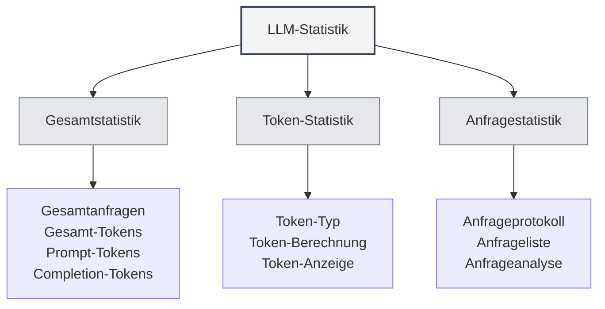

# LLM-Statistik

## Übersicht

Die LLM-Statistikfunktion dient zur Verfolgung und Anzeige der Nutzung der LLM-API, einschließlich Token-Verbrauch, Anzahl der Anfragen, Kostenstatistiken und weiteren Informationen. Diese Statistiken helfen Ihnen, die LLM-Nutzung zu verstehen und Ihre Nutzungsstrategie zu optimieren.

## LLM-Statistik öffnen

### Zugangswege

Die LLM-Statistikseite kann auf folgende Weise geöffnet werden:

- **Einstellungsseite**: Möglicherweise gibt es einen Zugang zur LLM-Statistik auf der Einstellungsseite
- **Menüoption**: In einigen Menüs könnte eine LLM-Statistikoption vorhanden sein
- **Tastenkürzel**: In manchen Fällen könnte es ein Tastenkürzel geben (möglicherweise zukünftig unterstützt)

<SettingLlmSection mode="demo" />

## Statistische Informationen

<LlmStatisticsView mode="demo" />

<LlmStatisticsContent mode="demo" />

### Gesamtstatistik

Die LLM-Statistikseite zeigt folgende Gesamtstatistiken an:

- **Gesamtzahl der Anfragen**: Die Gesamtzahl aller LLM-Anfragen
- **Gesamtzahl der Tokens**: Die Gesamtzahl aller in Anfragen verwendeten Tokens
- **Prompt-Tokens**: Die Gesamtzahl aller Prompt-Tokens über alle Anfragen
- **Completion-Tokens**: Die Gesamtzahl aller Completion-Tokens über alle Anfragen

### Zeitbereichsfilter

Statistiken können nach Zeitraum gefiltert werden:

- **Gesamter Zeitraum**: Statistiken für den gesamten Zeitraum anzeigen
- **Heute**: Statistiken für heute anzeigen
- **Diese Woche**: Statistiken für diese Woche anzeigen
- **Dieser Monat**: Statistiken für diesen Monat anzeigen
- **Benutzerdefinierter Bereich**: Benutzerdefiniertes Start- und Enddatum auswählen

### Statistikdiagramme

<ChartGenerationDisplay mode="demo" />

Die Statistikseite kann folgende Diagramme enthalten:

- **Token-Nutzungstrend**: Zeigt den Trend der Token-Nutzung über die Zeit
- **Anfragehäufigkeitstrend**: Zeigt den Trend der Anzahl der Anfragen über die Zeit
- **Modellnutzungsverteilung**: Zeigt die Nutzung verschiedener Modelle
- **Anfragetypenverteilung**: Zeigt die Verteilung verschiedener Anfragetypen

## Token-Statistik

<DataAnalysisDisplay mode="demo" />

### Token-Typen

Die Token-Statistik umfasst folgende Typen:

- **Prompt-Tokens**: Anzahl der Tokens für die Eingabeaufforderung
- **Completion-Tokens**: Anzahl der Tokens für den generierten Inhalt
- **Gesamt-Tokens**: Gesamtzahl der Tokens (Prompt + Completion)

### Token-Berechnung

Die Token-Berechnung erfolgt wie folgt:

- **Automatische Aufzeichnung**: Der Token-Verbrauch wird nach jeder LLM-Anfrage automatisch aufgezeichnet
- **Echtzeitaktualisierung**: Die Statistiken werden in Echtzeit aktualisiert
- **Kumulative Statistik**: Die Statistiken werden kumulativ berechnet

### Token-Anzeige

Folgende Token-Informationen können eingesehen werden:

- **Gesamtzahl der Tokens**: Die Gesamtzahl aller Tokens über alle Anfragen
- **Durchschnittliche Tokenzahl**: Die durchschnittliche Anzahl von Tokens pro Anfrage
- **Maximale Tokenzahl**: Die maximale Anzahl von Tokens in einer einzelnen Anfrage
- **Minimale Tokenzahl**: Die minimale Anzahl von Tokens in einer einzelnen Anfrage

## Anfragestatistik

<LlmStatisticsContent mode="demo" />

### Anfrageprotokoll

Jede LLM-Anfrage protokolliert folgende Informationen:

- **Zeitstempel**: Zeitpunkt der Anfrage
- **Modellname**: Name des verwendeten Modells
- **Anfragetyp**: Typ der Anfrage (chat/completion)
- **Token-Verbrauch**: Token-Verbrauch für diese Anfrage

### Anfrageliste

Die Anfrageliste kann eingesehen werden:

- **Zeitliche Sortierung**: Sortiert in umgekehrter chronologischer Reihenfolge
- **Detaillierte Informationen**: Detaillierte Informationen zu jeder Anfrage anzeigen
- **Filterfunktion**: Anfragen nach Modell, Typ usw. filtern

### Anfrageanalyse

Anfragen können analysiert werden:

- **Anfragehäufigkeit**: Analyse der Häufigkeit der Anfragen
- **Modellnutzung**: Analyse der Nutzung verschiedener Modelle
- **Typenverteilung**: Analyse der Verteilung verschiedener Anfragetypen

## Kostenstatistik

<LlmStatisticsView mode="demo" />

### Kostenberechnung

Die Kostenstatistik basiert auf folgenden Informationen:

- **Token-Verbrauch**: Kostenberechnung basierend auf dem Token-Verbrauch
- **Modellpreise**: Unterschiedliche Modelle haben unterschiedliche Preise
- **Kostenschätzung**: Bereitstellung einer Kostenschätzung (falls unterstützt)

### Kostenanzeige

Folgende Kosteninformationen können eingesehen werden:

- **Gesamtkosten**: Die Gesamtkosten aller Anfragen
- **Durchschnittliche Tageskosten**: Die durchschnittlichen Kosten pro Tag
- **Modellkosten**: Kostenverteilung nach verschiedenen Modellen
- **Kostentrend**: Entwicklung der Kosten über die Zeit

**Hinweis**: Die Kostenstatistik dient nur als Referenz. Die tatsächlichen Kosten richten sich nach der Rechnung des API-Anbieters.

## Datenexport

<DataAnalysisDisplay mode="demo" />

### Exportfunktion

Statistische Daten können exportiert werden:

- **Exportformat**: Unterstützung mehrerer Formate möglich (JSON, CSV, etc.)
- **Exportbereich**: Es kann gewählt werden, alle oder gefilterte Daten zu exportieren
- **Exportinhalt**: Es kann gewählt werden, welche statistischen Informationen exportiert werden sollen

### Datensicherung

Statistische Daten werden automatisch gespeichert:

- **Lokale Speicherung**: Statistische Daten werden lokal gespeichert
- **Automatisches Speichern**: Automatische Speicherung nach jeder Anfrage
- **Datenpersistenz**: Daten bleiben nach einem Neustart der Anwendung erhalten

## Statistiken löschen

### Löschvorgang

Statistische Daten können gelöscht werden:

1.  Öffnen Sie die LLM-Statistikseite
2.  Finden Sie die Schaltfläche "Statistiken löschen"
3.  Bestätigen Sie den Löschvorgang
4.  Die statistischen Daten werden gelöscht

**Wichtige Hinweise**:

-   Der Löschvorgang kann nicht rückgängig gemacht werden
-   Es wird empfohlen, vor dem Löschen eine Datensicherung zu exportieren
-   Nach dem Löschen gehen alle statistischen Daten verloren

## Statistik-Einstellungen

### Statistik-Schalter

Die Statistikfunktion kann gesteuert werden:

- **Statistik aktivieren**: LLM-Nutzungsstatistik aktivieren
- **Statistik deaktivieren**: Statistikfunktion deaktivieren (keine Datenerfassung)

### Statistikgenauigkeit

Die Statistikgenauigkeit kann eingestellt werden:

- **Detaillierte Aufzeichnung**: Detaillierte Informationen zu jeder Anfrage aufzeichnen
- **Vereinfachte Aufzeichnung**: Nur Gesamtstatistiken aufzeichnen

## Best Practices

1.  **Regelmäßige Überprüfung**: Überprüfen Sie regelmäßig die LLM-Nutzungsstatistiken, um die Nutzung zu verstehen
2.  **Kostenkontrolle**: Kontrollieren Sie die Nutzungsmenge basierend auf der Kostenstatistik
3.  **Strategieoptimierung**: Optimieren Sie Ihre Nutzungsstrategie basierend auf den Statistiken
4.  **Datensicherung**: Exportieren Sie regelmäßig Sicherungskopien der statistischen Daten
5.  **Sinnvolle Nutzung**: Nutzen Sie die LLM-Funktionen basierend auf den statistischen Informationen sinnvoll

## Wichtige Hinweise

1.  **Statistikgenauigkeit**: Die Statistiken basieren auf den von der API zurückgegebenen Token-Informationen
2.  **Kostenschätzung**: Die Kostenstatistik dient nur als Referenz. Die tatsächlichen Kosten richten sich nach der Rechnung
3.  **Datenspeicherung**: Statistische Daten werden lokal gespeichert und nicht hochgeladen
4.  **Datenschutz**: Statistische Daten enthalten keine konkreten Inhalte, sondern nur Nutzungsinformationen
5.  **Leistungsauswirkung**: Die Statistikfunktion hat nur einen sehr geringen Einfluss auf die Leistung und kann bedenkenlos verwendet werden

## Verwandte Dokumentation

- [[settings.llm|LLM-Konfiguration]]
- [[ai.chat|KI-Chat-Funktion]]
- [[ai.completion|KI-Autovervollständigung]]

<LlmStatisticsView mode="demo" />

<LlmStatisticsContent mode="demo" />