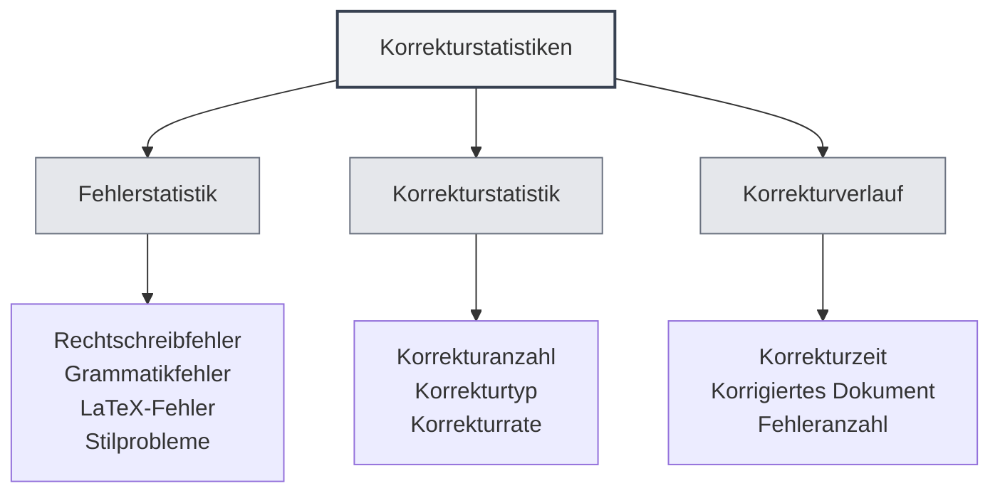

# Korrekturwerkzeug-Statistiken

## Übersicht

Die Korrekturwerkzeug-Statistikfunktion dient zur Verfolgung und Anzeige der Nutzung der Dokumentenkorrektur, einschließlich Statistiken zur Rechtschreibprüfung, Grammatikprüfung usw. Diese statistischen Daten können Ihnen helfen, die Nutzung der Korrekturfunktionen zu verstehen und Ihre Korrekturstrategie zu optimieren.

<ProofreadView mode="demo" />

<ProofreadDisplay mode="demo" />

<DataAnalysisDisplay mode="demo" />

## Einführung in die Korrekturstatistiken

### Was sind Korrekturstatistiken?

Korrekturstatistiken zeichnen relevante Informationen während des Dokumentenkorrekturprozesses auf:

- **Fehlerstatistik**: Erfasst die Anzahl und Art der erkannten Fehler.
- **Korrekturstatistik**: Erfasst die Anzahl der korrigierten Fehler.
- **Korrekturverlauf**: Zeigt den Verlauf der Korrekturvorgänge.

### Statistiktypen

Die Korrekturstatistiken umfassen folgende Typen:

- **Rechtschreibfehler**: Von der Rechtschreibprüfung gefundene Fehler.
- **Grammatikfehler**: Von der Grammatikprüfung gefundene Fehler.
- **LaTeX-Fehler**: Von der LaTeX-Syntaxprüfung gefundene Fehler.
- **Stilprobleme**: Von der Stilprüfung gefundene Probleme.
- **Andere Fehler**: Andere Arten von Fehlern.

## Fehlerstatistik

<DataAnalysisDisplay mode="demo" />

<ChartGenerationDisplay mode="demo" />

### Fehlerklassifizierung

Das Korrekturwerkzeug klassifiziert und zählt Fehler:

- **Rechtschreibfehler**: Anzahl der Wortrechtschreibfehler.
- **Grammatikfehler**: Anzahl der Grammatikfehler.
- **LaTeX-Fehler**: Anzahl der LaTeX-Syntaxfehler.
- **Stilprobleme**: Anzahl der Schreibstilprobleme.
- **Andere Fehler**: Anzahl anderer Fehlertypen.

### Fehlerzählung

Bei jeder Korrektur werden Fehler gezählt:

- **Gesamtfehlerzahl**: Die Gesamtzahl aller Fehler.
- **Fehlerzahl pro Typ**: Die Anzahl der Fehler pro Kategorie.
- **Fehlerverteilung**: Die Verteilung der Fehlertypen.

## Korrekturstatistik

### Korrekturprotokoll

Zeichnet die Korrektur von Fehlern auf:

- **Korrekturanzahl**: Anzahl der korrigierten Fehler.
- **Korrekturtyp**: Typ der korrigierten Fehler.
- **Korrekturrate**: Anteil der korrigierten Fehler.

### Korrekturverlauf

Der Korrekturverlauf kann eingesehen werden:

- **Korrekturzeit**: Zeitpunkt der Fehlerkorrektur.
- **Korrigierter Inhalt**: Der spezifisch korrigierte Inhalt.
- **Korrekturmethode**: Die Methode der Korrektur (manuell/automatisch).

## Korrekturverlauf

### Verlaufsprotokoll

Zeichnet den Verlauf der Korrekturvorgänge auf:

- **Korrekturzeit**: Zeitpunkt des Korrekturvorgangs.
- **Korrigiertes Dokument**: Das korrigierte Dokument.
- **Fehleranzahl**: Anzahl der gefundenen Fehler.
- **Korrekturanzahl**: Anzahl der korrigierten Fehler.

### Verlaufsanzeige

Der Korrekturverlauf kann eingesehen werden:

- **Verlaufsliste**: Zeigt alle Korrekturverlaufsdatensätze an.
- **Detailinformationen**: Zeigt detaillierte Informationen zu jeder Korrektur an.
- **Statistische Analyse**: Führt statistische Analysen der Verlaufsdaten durch.

## Statistikansicht

<ProofreadView mode="demo" />

### Einheitliche Ansicht

Die einheitliche Ansicht zeigt alle Fehler an:

- **Fehlerliste**: Zeigt alle Fehler in der Reihenfolge an.
- **Fehlerdetails**: Zeigt detaillierte Informationen zu jedem Fehler an.
- **Fehlerlokalisierung**: Ermöglicht die Lokalisierung der Fehlerposition.

<DataAnalysisDisplay mode="demo" />

### Kategorisierte Ansicht

Die kategorisierte Ansicht zeigt Fehler nach Typ an:

- **Gruppierung nach Typ**: Fehler werden gruppiert nach Typ angezeigt.
- **Typstatistik**: Zeigt die Fehleranzahl pro Typ an.
- **Typfilter**: Ermöglicht das Filtern nach bestimmten Fehlertypen.

## Statistikexport

### Exportfunktion

Korrekturstatistiken können exportiert werden:

- **Exportformat**: Unterstützt möglicherweise mehrere Formate (JSON, CSV usw.).
- **Exportumfang**: Es können alle oder gefilterte Daten exportiert werden.
- **Exportinhalt**: Es kann ausgewählt werden, welche Statistiken exportiert werden.

<ChartGenerationDisplay mode="demo" />

## Best Practices

1. **Regelmäßige Korrektur**: Nutzen Sie die Korrekturfunktion regelmäßig zur Dokumentenprüfung.
2. **Statistiken beachten**: Achten Sie auf die Fehlerstatistiken, um die Dokumentqualität zu verstehen.
3. **Zeitnahe Korrektur**: Korrigieren Sie gefundene Fehler umgehend.
4. **Trendanalyse**: Analysieren Sie Fehlertrends, um Schreibgewohnheiten zu verbessern.
5. **Verlauf nutzen**: Nutzen Sie den Verlauf, um die Dokumentenverbesserung zu verfolgen.

## Hinweise

1. **Statistikgenauigkeit**: Die Statistiken basieren auf den Erkennungsergebnissen des Korrekturwerkzeugs.
2. **Umgang mit Falschmeldungen**: Einige Erkennungen können Falschmeldungen sein und erfordern manuelle Beurteilung.
3. **Datenspeicherung**: Statistische Daten werden lokal gespeichert und nicht hochgeladen.
4. **Datenschutz**: Statistische Daten enthalten keine spezifischen Inhalte, nur statistische Informationen.
5. **Leistungsauswirkung**: Die Statistikfunktion hat nur geringe Auswirkungen auf die Leistung und kann bedenkenlos genutzt werden.

## Verwandte Dokumentation

- [[ai.proofread|AI-Korrekturfunktion]]
- [[statistics.llm|LLM-Statistiken]]