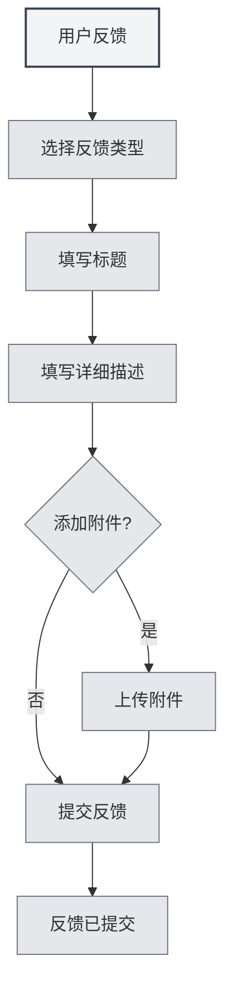

# Nutzerfeedback

## Übersicht

Die Nutzerfeedback-Funktion ermöglicht es Ihnen, Problemberichte, Funktionsvorschläge oder anderes Feedback an das MetaDoc-Team zu senden. Ihr Feedback ist sehr wichtig für uns, um das Produkt zu verbessern.

## Nutzerfeedback öffnen

### Zugangswege

Die Nutzerfeedback-Seite kann auf folgende Weise geöffnet werden:

- **Einstellungsseite**: Klicken Sie auf die Schaltfläche "Nutzerfeedback" auf der Einstellungsseite "Über"
- **Menüoption**: In einigen Menüs gibt es möglicherweise eine Nutzerfeedback-Option
- **Tastenkürzel**: In manchen Fällen gibt es möglicherweise ein Tastenkürzel (künftig möglicherweise unterstützt)

<SettingAboutSection mode="demo" />

## Feedback-Typen

### Auswahl des Feedback-Typs

Beim Senden von Feedback muss ein Feedback-Typ ausgewählt werden:

- **BUG-Feedback**: Melden Sie Softwarefehler oder Probleme
- **Funktionsvorschlag**: Schlagen Sie neue Funktionen oder Verbesserungen vor
- **Sicherheitsfeedback**: Melden Sie Sicherheitsprobleme
- **Sonstiges**: Andere Arten von Feedback

<DialogDemo mode="demo" dialogType="feedback" />

### Typenbeschreibung

- **BUG-Feedback**: Dient zum Melden von Softwarefehlern, Abstürzen, anomalem Verhalten usw.
- **Funktionsvorschlag**: Dient zum Vorschlagen neuer Funktionen oder zur Verbesserung bestehender Funktionen
- **Sicherheitsfeedback**: Dient zum Melden von Sicherheitslücken oder -problemen
- **Sonstiges**: Dient für andere Arten von Feedback, wie Nutzungsprobleme, Dokumentationsprobleme usw.

## Feedback-Inhalt

### Titel

Der Feedback-Titel sollte:

- **Prägnant und klar sein**: Beschreiben Sie das Problem oder den Vorschlag kurz
- **Konkret und eindeutig sein**: Vermeiden Sie vage Titel
- **Ein Pflichtfeld sein**: Der Titel ist ein Pflichtfeld

### Detaillierte Beschreibung

Die detaillierte Beschreibung sollte enthalten:

- **Problembeschreibung**: Beschreiben Sie das aufgetretene Problem klar
- **Erwartetes Ergebnis**: Erläutern Sie das erwartete Ergebnis
- **Weitere Informationen**: Geben Sie weitere Informationen an, die bei der Diagnose helfen
- **Kontaktinformationen**: Optionale Kontaktinformationen für die Nachverfolgung

### Feedback-Vorlage

Das System stellt eine Feedback-Vorlage bereit, die folgende Abschnitte enthält:

- **Systeminformationen**: Automatisch ausgefüllte Systeminformationen
- **Problembeschreibung**: Bereich zur Beschreibung des Problems
- **Erwartetes Ergebnis**: Bereich für das erwartete Ergebnis
- **Weitere Informationen**: Bereich für weitere Informationen
- **Kontaktinformationen**: Optionale Kontaktinformationen

<MenuItemsDemo mode="demo" :items='[{"id": "settings"}]' />

## Anhang hochladen

### Anhang-Unterstützung

Sie können Anhänge hochladen, um Probleme zu veranschaulichen:

- **Dateityp**: Alle Dateitypen werden unterstützt
- **Dateigröße**: Einzelne Datei nicht größer als 10 MB
- **Gesamtgröße**: Die Gesamtgröße aller Anhänge darf 50 MB nicht überschreiten
- **Anzahl der Dateien**: Maximal 5 Anhänge hochladbar

<SettingImageSection mode="demo" />

### Verwendung von Anhängen

Anhänge können verwendet werden für:

- **Screenshots**: Bereitstellung von Problemscreenshots
- **Protokolldateien**: Bereitstellung von Fehlerprotokollen
- **Beispieldateien**: Bereitstellung von Beispieldateien für das Problem
- **Andere Dateien**: Bereitstellung anderer relevanter Dateien

### Anhang-Regeln

- **Einzeldateibegrenzung**: Einzelne Datei nicht größer als 10 MB
- **Gesamtgrößenbegrenzung**: Die Gesamtgröße aller Anhänge darf 50 MB nicht überschreiten
- **Anzahlbegrenzung**: Maximal 5 Anhänge hochladbar
- **Typbegrenzung**: Keine Einschränkung des Dateityps, abhängig von der Gist-Fähigkeit

## Feedback senden

### Sende-Schritte

1. **Typ auswählen**: Wählen Sie den Feedback-Typ
2. **Titel ausfüllen**: Geben Sie den Feedback-Titel ein
3. **Beschreibung ausfüllen**: Geben Sie die detaillierte Beschreibung ein
4. **Anhang hinzufügen**: Optional, fügen Sie Anhänge hinzu
5. **Feedback senden**: Klicken Sie auf die Schaltfläche "Feedback senden"

Sie können über die Einstellungsseite auf das Nutzerfeedback zugreifen:

<MenuItemsDemo mode="demo" :items='[{"id": "settings"}]' />

<QuickStartPanel mode="demo" />

### Sende-Validierung

Vor dem Senden wird eine Validierung durchgeführt:

- **Titelvalidierung**: Sicherstellen, dass der Titel nicht leer ist
- **Beschreibungsvalidierung**: Sicherstellen, dass die Beschreibung nicht leer ist
- **Anhangvalidierung**: Sicherstellen, dass Anhänge den Regeln entsprechen

<DialogDemo mode="demo" dialogType="submit-confirm" />

### Sende-Ergebnis

Nach dem Senden wird ein Ergebnis angezeigt:

- **Erfolgreich gesendet**: Erfolgsmeldung wird angezeigt
- **Senden fehlgeschlagen**: Fehlermeldung und Ursache werden angezeigt

## Andere Kontaktmöglichkeiten

### E-Mail-Feedback

Feedback ist auch per E-Mail möglich:

- **E-Mail-Adresse**: Wird am Ende der Feedback-Seite angezeigt
- **E-Mail kopieren**: Die E-Mail-Adresse kann kopiert werden
- **E-Mail-Betreff**: Ein klarer Betreff wird empfohlen

<ViewMenuItemsDemo mode="demo" :items='["settings"]' />

### QQ-Gruppe

Sie können der offiziellen QQ-Gruppe beitreten:

- **QQ-Gruppennummer**: Wird am Ende der Feedback-Seite angezeigt
- **Gruppennummer kopieren**: Die QQ-Gruppennummer kann kopiert werden
- **Gruppe beitreten**: Nach dem Beitreten zur Gruppe können Sie Feedback in Echtzeit geben

## Feedback-Bearbeitung

### Feedback-Prozess

Der Bearbeitungsprozess nach dem Senden von Feedback:

1. **Feedback empfangen**: Das System empfängt Ihr Feedback
2. **Kategorisierung**: Kategorisierung nach Feedback-Typ
3. **Problemanalyse**: Analyse des Problems oder Vorschlags
4. **Nachverfolgung und Bearbeitung**: Nachverfolgung und Bearbeitung je nach Situation
5. **Feedback-Antwort**: Mögliche Antwort per E-Mail oder in der QQ-Gruppe

### Feedback-Priorität

Dem Feedback wird je nach Typ und Schweregrad eine Priorität zugewiesen:

- **Sicherheitsfeedback**: Höchste Priorität
- **Schwerwiegender BUG**: Hohe Priorität
- **Funktionsvorschlag**: Mittlere Priorität
- **Anderes Feedback**: Allgemeine Priorität

<MainTabs mode="demo" />

## Best Practices

1. **Detaillierte Beschreibung**: Beschreiben Sie das Problem oder den Vorschlag so detailliert wie möglich
2. **Screenshot bereitstellen**: Stellen Sie, wenn möglich, einen Problemscreenshot bereit
3. **Protokoll bereitstellen**: Stellen Sie bei Fehlern ein Fehlerprotokoll bereit
4. **Beispiel bereitstellen**: Stellen Sie, wenn möglich, eine Beispieldatei für das Problem bereit
5. **Kontaktinformationen**: Geben Sie Kontaktinformationen für die Nachverfolgung an

## Wichtige Hinweise

1. **Feedback-Format**: Füllen Sie das Feedback gemäß dem Vorlagenformat aus
2. **Anhangsgröße**: Beachten Sie die Größenbeschränkungen für Anhänge
3. **Kontaktinformationen**: Geben Sie Kontaktinformationen für die Nachverfolgung an
4. **Feedback-Typ**: Wählen Sie den richtigen Feedback-Typ
5. **Systeminformationen**: Systeminformationen werden automatisch ausgefüllt, löschen Sie diese nicht

## Verwandte Dokumentation

- [[settings.about|Über-Informationen]]
- [[user.profile|Nutzerprofil]]

<AIChat mode="demo" />