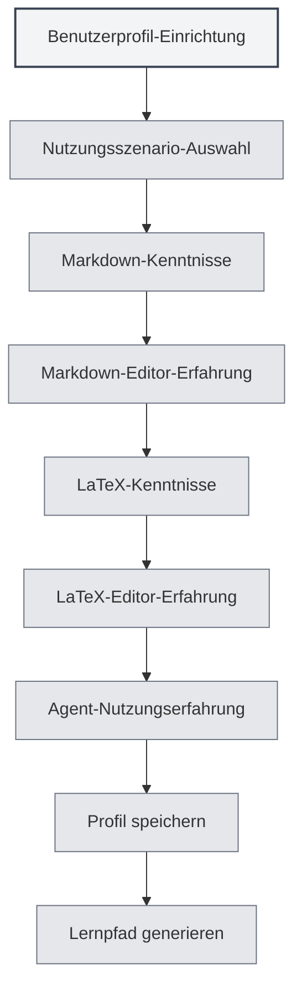

# Benutzerprofil

## Übersicht

Die Benutzerprofil-Funktion ermöglicht es Ihnen, persönliche Informationen und Nutzungspräferenzen festzulegen, um MetaDoc dabei zu unterstützen, Ihre Bedürfnisse besser zu verstehen und eine personalisierte Nutzungserfahrung sowie Lernpfade bereitzustellen.

## Benutzerprofileinstellungen

### Benutzerprofil öffnen

Sie können den Benutzerprofil-Dialog auf folgende Weise öffnen:

- **Hinweis auf der Startseite**: Bei der ersten Nutzung wird möglicherweise auf der Startseite zur Einrichtung des Benutzerprofils aufgefordert.
- **Benutzerhandbuch**: Im Benutzerhandbuch können Sie auf die Benutzerprofileinstellungen zugreifen.
- **Menüoptionen**: In einigen Menüs kann es eine Option für das Benutzerprofil geben.

<QuickStartPanel mode="demo" />

### Benutzerprofil-Oberfläche

Die Benutzerprofil-Oberfläche enthält folgende Hauptbereiche:

<UserProfileView mode="demo" />

### Profil-Einrichtungsassistent

Die Benutzerprofil-Einrichtung erfolgt in Form eines schrittweisen Assistenten:

1.  **Nutzungsszenario**: Wählen Sie das primäre Nutzungsszenario.
2.  **Markdown-Kenntnisse**: Bewerten Sie Ihre Vertrautheit mit der Markdown-Syntax.
3.  **Markdown-Editor-Erfahrung**: Wählen Sie die Art der verwendeten Markdown-Editoren.
4.  **LaTeX-Kenntnisse**: Bewerten Sie Ihre Vertrautheit mit der LaTeX-Syntax.
5.  **LaTeX-Editor-Erfahrung**: Wählen Sie die Art der verwendeten LaTeX-Editoren.
6.  **Agent-Nutzungserfahrung**: Bewerten Sie Ihre Erfahrung mit Agent-Frameworks.

## Nutzungsszenario-Auswahl

### Szenariotypen

Folgende Nutzungsszenarien können ausgewählt werden:

-   **Student**: Geeignet für Studierende, Schwerpunkt auf dem Erlernen grundlegender Bearbeitungs- und Markdown-Funktionen.
-   **Forscher**: Geeignet für Forschende, Schwerpunkt auf dem Erlernen von LaTeX- und wissenschaftlichen Schreibfunktionen.
-   **IT-Fachkraft**: Geeignet für IT-Fachkräfte, Schwerpunkt auf dem Erlernen von Agent-Frameworks und erweiterten Funktionen.
-   **Büroanwender**: Geeignet für Büroanwender, Schwerpunkt auf dem Erlernen grundlegender Funktionen und des Exports.
-   **Sonstiges**: Andere Nutzungsszenarien.

### Szenarioeinfluss

Das gewählte Szenario beeinflusst:

-   **Lernpfad**: Das System empfiehlt einen entsprechenden Lernpfad.
-   **Funktionsempfehlungen**: Relevante Funktionen werden priorisiert empfohlen.
-   **KI-Verständnis**: Hilft der KI, Ihre Bedürfnisse besser zu verstehen.

## Fähigkeitsbewertung

### Markdown-Kenntnisse

Bewerten Sie Ihre Vertrautheit mit der Markdown-Syntax:

-   **Keine Erfahrung**: Noch nie Markdown verwendet.
-   **Grundlagen**: Kennt grundlegende Syntax (Überschriften, Listen, Links usw.).
-   **Mittelstufe**: Vertraut mit gängiger Syntax und erweiterten Funktionen.
-   **Fortgeschritten**: Beherrscht Markdown, kennt verschiedene erweiterte Syntaxen.

<QuickStartLatex mode="demo" />

### LaTeX-Kenntnisse

Bewerten Sie Ihre Vertrautheit mit der LaTeX-Syntax:

-   **Keine Erfahrung**: Noch nie LaTeX verwendet.
-   **Grundlagen**: Kennt grundlegende Syntax und Dokumentstruktur.
-   **Mittelstufe**: Vertraut mit gängigen Umgebungen und Befehlen.
-   **Fortgeschritten**: Beherrscht LaTeX, kann komplexe Dokumente erstellen.

<MenuItemsDemo mode="demo" :items='[{"id": "file"}]' />

### Agent-Nutzungserfahrung

Bewerten Sie Ihre Erfahrung mit Agent-Frameworks:

-   **Keine Erfahrung**: Noch nie Agent-Funktionen verwendet.
-   **Grundlagen**: Kennt grundlegende Konzepte, hat einfache Funktionen genutzt.
-   **Mittelstufe**: Vertraut mit Toolset und Workflow.
-   **Fortgeschritten**: Kann komplexe Agent-Konfigurationen und Workflows erstellen.

<AgentView mode="demo" />

## Editor-Erfahrung

### Markdown-Editor-Erfahrung

Wählen Sie die Art der von Ihnen verwendeten Markdown-Editoren:

-   **WYSIWYG-Editor**: Hat WYSIWYG-Editoren (What You See Is What You Get) verwendet.
-   **Andere Markdown-Editoren**: Hat andere Markdown-Editoren verwendet.

### LaTeX-Editor-Erfahrung

Wählen Sie die Art der von Ihnen verwendeten LaTeX-Editoren:

-   **Online-LaTeX-Editor**: Hat Online-LaTeX-Editoren verwendet.
-   **Lokaler LaTeX-Editor**: Hat lokale LaTeX-Editoren verwendet.

## Nutzungspräferenzen einstellen

### Bearbeitungspräferenzen

Bearbeitungsbezogene Präferenzen können eingestellt werden:

-   **Bearbeitungsmodus**: Bevorzugter Bearbeitungsmodus.
-   **Vorschauweise**: Bevorzugte Vorschauweise.
-   **Automatisches Speichern**: Präferenz für automatisches Speichern.

<MainTabs mode="demo" />

### Funktionspräferenzen

Funktionsbezogene Präferenzen können eingestellt werden:

-   **Häufig genutzte Funktionen**: Häufig genutzte Funktionen markieren.
-   **Funktionspriorität**: Priorität der Funktionen festlegen.
-   **Oberflächenlayout**: Bevorzugtes Oberflächenlayout.

<ViewMenuItemsDemo mode="demo" :items='["settings"]' />

## Benutzerprofil-Erstellung

### Profilgenerierung

Basierend auf Ihren Einstellungen generiert das System ein Benutzerprofil:

-   **Fähigkeitsniveau**: Bewertung der einzelnen Fähigkeitsniveaus.
-   **Nutzungsszenario**: Identifizierung des Hauptnutzungsszenarios.
-   **Lernbedarf**: Analyse des Lernbedarfs.

### Profilanwendung

Das Benutzerprofil wird angewendet für:

-   **Lernpfad**: Empfehlung eines personalisierten Lernpfads.
-   **Funktionsempfehlungen**: Priorisierte Empfehlung relevanter Funktionen.
-   **KI-Unterstützung**: Hilft der KI, Bedürfnisse besser zu verstehen.

## Lernpfad-Empfehlung

### Pfadtypen

Basierend auf dem Benutzerprofil empfiehlt das System entsprechende Lernpfade:

-   **Studentenpfad**: Lernpfad geeignet für Studierende.
-   **Forscherpfad**: Lernpfad geeignet für Forschende.
-   **IT-Fachkraft-Pfad**: Lernpfad geeignet für IT-Fachkräfte.
-   **Büroanwender-Pfad**: Lernpfad geeignet für Büroanwender.

<AIChat mode="demo" />

### Pfadinhalt

Der Lernpfad enthält:

-   **Dokumentenliste**: Geordnete Liste der Lernmaterialien.
-   **Lernziele**: Lernziele für jedes Dokument.
-   **Geschätzte Zeit**: Voraussichtliche Zeit zum Abschluss des Lernens.

## Profilaktualisierung

### Profil ändern

Das Benutzerprofil kann jederzeit geändert werden:

1.  Öffnen Sie den Benutzerprofil-Dialog.
2.  Ändern Sie die einzelnen Einstellungen.
3.  Speichern Sie die Änderungen.

### Profilsynchronisierung

Das Benutzerprofil wird:

-   **Lokal gespeichert**: Auf dem lokalen Gerät gespeichert.
-   **Mehrfenster-synchronisiert**: Zwischen allen Fenstern synchronisiert.
-   **Persistent gespeichert**: Bleibt beim nächsten Start erhalten.

## Best Practices

1.  **Ehrlich ausfüllen**: Füllen Sie alle Informationen wahrheitsgemäß aus, um genauere Empfehlungen zu erhalten.
2.  **Regelmäßig aktualisieren**: Aktualisieren Sie das Profil regelmäßig mit steigenden Fähigkeiten.
3.  **Szenarioauswahl**: Wählen Sie das Szenario, das Ihrer tatsächlichen Nutzung am besten entspricht.
4.  **Fähigkeitsbewertung**: Bewerten Sie Ihr eigenes Fähigkeitsniveau objektiv.
5.  **Empfehlungen nutzen**: Nutzen Sie die vom System empfohlenen Lernpfade voll aus.

## Hinweise

1.  **Profil-Datenschutz**: Das Benutzerprofil wird nur lokal gespeichert und nicht hochgeladen.
2.  **Profil optional**: Die Benutzerprofil-Einrichtung ist optional und kann übersprungen werden.
3.  **Empfehlungen als Referenz**: Die Lernpfad-Empfehlungen dienen nur als Referenz und können bei Bedarf angepasst werden.
4.  **Fähigkeitsänderungen**: Das Fähigkeitsniveau kann sich ändern, regelmäßige Aktualisierungen werden empfohlen.
5.  **Mehrere Szenarien**: Bei Nutzung mehrerer Szenarien wählen Sie das Hauptszenario.

## Verwandte Dokumente

-   [[home.features|Startseiten-Funktionen]]
-   [[user.feedback|Benutzerfeedback]]
-   [[quick-start.guide|Schnellstart-Anleitung]]

<QuickStartPanel mode="demo" />

<MenuItemsDemo mode="demo" :items='[{"id": "settings"}]' />

<MainTabs mode="demo" />