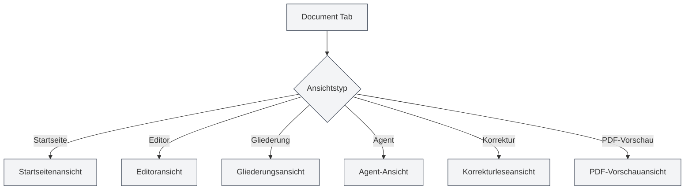

# Ansichtstypen

## Übersicht

MetaDoc unterstützt verschiedene Ansichtstypen, von denen jeder unterschiedliche Funktionen und Benutzeroberflächen bietet. Sie können je nach Bedarf zwischen verschiedenen Ansichten wechseln, um verschiedene Aufgaben zu erledigen.

## Einführung in die Ansichtstypen

### Startseitenansicht

Die Startseitenansicht ist die Einstiegsoberfläche von MetaDoc und bietet Funktionen für einen schnellen Start und kürzlich verwendete Dokumente.

<QuickStartPanel mode="demo" />

**Hauptfunktionen**:

- **Schnellstart**: Dokumentformat auswählen und schnell ein neues Dokument erstellen
- **Letzte Dokumente**: Liste der zuletzt geöffneten Dokumente anzeigen
- **Benutzerhandbuch**: Schneller Zugriff auf das Benutzerhandbuch
- **Benutzerprofil**: Zugriff auf die Benutzerprofileinstellungen

**Anwendungsszenarien**:

- Erste Oberfläche nach dem Start der Anwendung
- Schnelles Erstellen eines neuen Dokuments erforderlich
- Anzeigen kürzlich verwendeter Dokumente

Sie können über die Seitenleiste zwischen verschiedenen Ansichten wechseln.

### Editoransicht

Die Editoransicht ist die Hauptoberfläche für die Dokumentbearbeitung und unterstützt die Bearbeitung von Markdown, LaTeX und reinem Text.

<LaTeXEditor mode="demo" />

**Hauptfunktionen**:

- **Markdown-Bearbeitung**: Markdown-Dokumente mit dem Vditor-Editor bearbeiten
- **LaTeX-Bearbeitung**: LaTeX-Dokumente mit dem Monaco-Editor bearbeiten
- **Textbearbeitung**: Reinen Text mit dem Monaco-Editor bearbeiten
- **Echtzeitvorschau**: Der Markdown-Editor unterstützt eine Echtzeitvorschau

**Anwendungsszenarien**:

- Dokumentinhalte bearbeiten
- Technische Dokumentation verfassen
- Wissenschaftliche Arbeiten verfassen

### Gliederungsansicht

Die Gliederungsansicht zeigt die strukturierte Gliederung eines Dokuments an und erleichtert das Anzeigen und Bearbeiten der Dokumentstruktur.

<Outline mode="demo" />

**Hauptfunktionen**:

- **Gliederungsanzeige**: Dokumentüberschriften als Baumstruktur anzeigen
- **Knotenoperationen**: Knoten hinzufügen, bearbeiten, löschen, verschieben
- **Drag & Drop-Sortierung**: Reihenfolge durch Ziehen von Knoten anpassen
- **KI-Funktionen**: Unterkapitel generieren, Inhalte generieren, Gliederung optimieren

**Anwendungsszenarien**:

- Dokumentstruktur anzeigen
- Schnelle Navigation zu bestimmten Kapiteln
- Dokumentgliederung bearbeiten
- Inhalte mit KI generieren

### Agent-Ansicht

Die Agent-Ansicht bietet eine interaktive Oberfläche für das Agent-Framework zum Erstellen und Verwalten von Agent-Sitzungen.

<AgentView mode="demo" />

**Hauptfunktionen**:

- **Sitzungsverwaltung**: Agent-Sitzungen erstellen, bearbeiten, löschen
- **Werkzeugkonfiguration**: Den vom Agent verwendeten Werkzeugsatz konfigurieren
- **Arbeitsabläufe**: Arbeitsabläufe erstellen und ausführen
- **Nachrichteninteraktion**: Dialog mit dem Agent führen

**Anwendungsszenarien**:

- Komplexe Aufgaben mit einem Agent erledigen
- Automatisierte Dokumentenverarbeitung
- Stapelverarbeitung von Dokumenten

### Korrekturleseansicht

Die Korrekturleseansicht bietet KI-gestützte Korrekturlesefunktionen, prüft Dokumente auf Fehler und gibt Änderungsvorschläge.

<ProofreadView mode="demo" />

**Hauptfunktionen**:

- **Fehlererkennung**: Rechtschreib-, Grammatik- und LaTeX-Syntaxfehler erkennen
- **Fehlerliste**: Alle erkannten Fehler anzeigen
- **Fehlerbehebung**: Einzelne Fehler oder alle Fehler auf einmal beheben
- **Wörterbuchverwaltung**: Wörter zum Wörterbuch hinzufügen

**Anwendungsszenarien**:

- Dokumente auf Fehler überprüfen
- Dokumentqualität verbessern
- Rechtschreib- und Grammatikfehler korrigieren

### PDF-Vorschauansicht

Die PDF-Vorschauansicht zeigt eine Vorschau des kompilierten PDFs eines LaTeX-Dokuments an (nur für LaTeX-Dokumente).

<PdfPreviewPanel mode="demo" pdfUrl="" />

**Hauptfunktionen**:

- **PDF-Anzeige**: Inhalt des kompilierten PDFs anzeigen
- **Zoomsteuerung**: PDF vergrößern, verkleinern
- **PDF aktualisieren**: PDF neu kompilieren und aktualisieren
- **Zu Code navigieren**: Von einer PDF-Position zum entsprechenden LaTeX-Code springen

**Anwendungsszenarien**:

- Effekt eines LaTeX-Dokuments in der Vorschau prüfen
- PDF-Formatierung überprüfen
- Probleme im PDF lokalisieren

## Ansichtswechsel

### Wechselmethoden

Sie können die Ansicht auf folgende Weise wechseln:

<MainTabs mode="demo" />

<ViewMenuItemsDemo mode="demo" :items='["editor", "outline", "agent"]' />

1.  **Ansichtsmenü**: Klicken Sie auf die Ansichtsmenü-Schaltfläche links
2.  **Ansichtsauswahl**: Im Ansichtsmenü die gewünschte Ansicht auswählen
3.  **Tastenkürzel**: Einige Ansichten können Tastenkürzel haben (mögliche zukünftige Unterstützung)

### Ansichtsmenü

Das Ansichtsmenü wird in der linken Seitenleiste angezeigt:

-   **Startseite**: Zur Startseitenansicht wechseln
-   **Editor**: Zur Editoransicht wechseln
-   **Gliederung**: Zur Gliederungsansicht wechseln
-   **Agent**: Zur Agent-Ansicht wechseln
-   **Korrektur**: Zur Korrekturleseansicht wechseln
-   **PDF-Vorschau**: Zur PDF-Vorschauansicht wechseln (nur für LaTeX-Dokumente)

### Ansichtszustand

Jeder Dokumenten-Tab hat einen unabhängigen Ansichtszustand:

-   **Ansichtsgedächtnis**: Nach einem Ansichtswechsel wird der Ansichtszustand gespeichert
-   **Nächstes Öffnen**: Beim nächsten Öffnen des Dokuments wird die letzte Ansicht wiederhergestellt
-   **Mehrere Tabs**: Verschiedene Tabs können unterschiedliche Ansichten verwenden

## Ansichtseigenschaften

### Ansichtsunabhängigkeit

Jede Ansicht ist unabhängig:

-   **Zustandsunabhängig**: Jede Ansicht hat einen unabhängigen Zustand
-   **Datensynchronisierung**: Daten werden automatisch zwischen Ansichten synchronisiert
-   **Schneller Wechsel**: Der Ansichtswechsel ist sehr schnell, kein Neuladen erforderlich

### Ansichtskombination

Einige Ansichten können kombiniert verwendet werden:

-   **Editor + Gliederung**: Editor und Gliederung gleichzeitig anzeigen
-   **Editor + PDF-Vorschau**: LaTeX-Editor kann Code und PDF gleichzeitig anzeigen
-   **Editor + Korrektur**: Korrekturlesen während der Bearbeitung

## Empfehlungen zur Ansichtsnutzung

### Dokument bearbeiten

-   **Editoransicht**: Hauptsächlich die Editoransicht zur Bearbeitung nutzen
-   **Gliederungsansicht**: Bei Bedarf zur Gliederungsansicht wechseln, um die Struktur zu sehen
-   **PDF-Vorschau**: Bei der Bearbeitung von LaTeX-Dokumenten die PDF-Vorschau zur Kontrolle nutzen

### Dokument korrekturlesen

-   **Korrekturleseansicht**: Speziell für das Korrekturlesen von Dokumenten
-   **Editoransicht**: Nach dem Korrekturlesen zur Editoransicht zurückkehren und weiter bearbeiten

### Agent-Aufgaben

-   **Agent-Ansicht**: Agent-Sitzungen erstellen und verwalten
-   **Editoransicht**: Vom Agent verarbeitete Dokumente anzeigen

## Hinweise

1.  **Ansichtswechsel**: Beim Ansichtswechsel wird der aktuelle Zustand gespeichert
2.  **PDF-Vorschau**: Die PDF-Vorschauansicht wird nur für LaTeX-Dokumente unterstützt
3.  **Ansichtszustand**: Der Ansichtszustand jedes Tabs wird unabhängig gespeichert
4.  **Datensynchronisierung**: Daten werden automatisch zwischen Ansichten synchronisiert
5.  **Leistungsaspekte**: Einige Ansichten können mehr Ressourcen beanspruchen

## Verwandte Dokumentation

-   [[core.multi-tab|Verwaltung mehrerer Tabs]]
-   [[outline.basics|Funktionen der Gliederungsansicht]]
-   [[agent.session|Verwaltung von Agent-Sitzungen]]
-   [[ai.proofread|KI-Korrekturlesefunktion]]
-   [[latex.pdf-preview|PDF-Vorschaufunktion]]