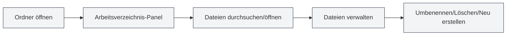

# Arbeitsverzeichnisverwaltung

## Übersicht

Die Arbeitsverzeichnisverwaltung ermöglicht es Ihnen, Ordner in MetaDoc zu öffnen und zu verwalten, und bietet funktionen ähnlich einem Dateimanager. Über das Arbeitsverzeichnis können Sie bequem Projektdateien durchsuchen, öffnen und verwalten.

## Einführung in das Arbeitsverzeichnis

<ViewMenuItemsDemo mode="demo" :items='["workspace"]' />

### Was ist ein Arbeitsverzeichnis?

Ein Arbeitsverzeichnis ist ein in MetaDoc geöffneter Ordner, der Ihnen Folgendes erlaubt:

- **Dateien durchsuchen**: Dateien und Unterordner im Ordner anzeigen
- **Dateien öffnen**: Dateien direkt in MetaDoc öffnen
- **Dateien verwalten**: Operationen wie Umbenennen, Löschen von Dateien
- **Projektorganisation**: Zugehörige Dateien in einem Verzeichnis organisieren

### Anwendungsfälle

Das Arbeitsverzeichnis eignet sich für folgende Szenarien:

- **Projektverwaltung**: Alle Dokumente in einem Projekt verwalten
- **Dateidurchsicht**: Schnelles Durchsuchen und Öffnen von Dateien
- **Dokumentenorganisation**: Zugehörige Dokumente zusammen organisieren
- **Stapeloperationen**: Operationen an mehreren Dateien durchführen

## Arbeitsverzeichnis öffnen

<ViewMenuItemsDemo mode="demo" :items='["workspace", "editor"]' />

### Verzeichnis öffnen

1. Klicken Sie auf das "Arbeitsverzeichnis"-Symbol im linken Menü
2. Falls noch kein Verzeichnis geöffnet ist, erscheint ein Dialog zur Verzeichnisauswahl
3. Wählen Sie den zu öffnenden Ordner aus
4. Das Verzeichnis wird in der Seitenleiste angezeigt

Sie können die Arbeitsverzeichnisansicht über die Seitenleiste aufrufen:

<ViewMenuItemsDemo mode="demo" :items='["workspace"]' />

<ViewMenuItemsDemo mode="demo" :items='["editor", "outline", "home"]' />

### Verzeichnis wechseln

Falls Sie zu einem anderen Verzeichnis wechseln müssen:

1. Klicken Sie auf den Menü-Button in der Titelleiste des Arbeitsverzeichnisses
2. Wählen Sie "Ordner öffnen"
3. Wählen Sie einen neuen Ordner
4. Das neue Verzeichnis ersetzt das aktuelle

### Verzeichnis schließen

Sie können das aktuell geöffnete Arbeitsverzeichnis schließen:

1. Klicken Sie auf den Menü-Button in der Titelleiste des Arbeitsverzeichnisses
2. Wählen Sie "Arbeitsverzeichnis schließen"
3. Das Arbeitsverzeichnis-Panel wird ausgeblendet

## Dateidurchsicht

<ViewMenuItemsDemo mode="demo" :items='["workspace", "editor", "outline"]' />

### Baumstruktur des Verzeichnisses

Das Arbeitsverzeichnis wird als Baumstruktur angezeigt:

- **Ordner**: Zeigen Ordnersymbol an, können erweitert/zugeklappt werden
- **Dateien**: Zeigen Dateisymbol an, zeigen Dateinamen an
- **Hierarchiestruktur**: Unterstützt mehrstufige Ordner-Verschachtelung

### Erweitern und Zuklappen

- **Ordner erweitern**: Auf Ordnersymbol oder Namen klicken
- **Ordner zuklappen**: Erneut auf bereits erweiterten Ordner klicken
- **Alle erweitern**: Im Kontextmenü "Alle erweitern" wählen
- **Alle zuklappen**: Im Kontextmenü "Alle zuklappen" wählen

### Dateityperkennung

Das Arbeitsverzeichnis erkennt Dateitypen:

- **Markdown-Dateien** (.md): Zeigen Markdown-Symbol an
- **LaTeX-Dateien** (.tex): Zeigen LaTeX-Symbol an
- **Bilddateien** (.png, .jpg usw.): Zeigen Bildsymbol an
- **Andere Dateien**: Zeigen allgemeines Dateisymbol an

## Dateioperationen

<ViewMenuItemsDemo mode="demo" :items='["workspace"]' />

<MenuItemsDemo mode="demo" :items='[{"id": "file", "items": ["new", "open"]}]' />

### Dateien öffnen

Es gibt mehrere Möglichkeiten, Dateien zu öffnen:

- **Doppelklick auf Datei**: Doppelklick auf Dateisymbol oder Namen
- **Kontextmenü**: Rechtsklick auf Datei, "Öffnen" wählen
- **Drag & Drop**: Datei in den Editorbereich ziehen

Nach dem Öffnen wird die Datei in einem neuen Tab geöffnet.

### Dateien in der Vorschau anzeigen

<ViewMenuItemsDemo mode="demo" :items='["workspace"]' />

Sie können Dateien ohne vollständiges Öffnen in der Vorschau ansehen:

- **Kontextmenü**: Rechtsklick auf Datei, "Vorschau" wählen
- **Vorschaumodus**: Datei wird in einem Vorschau-Tab geöffnet
- **Zum Editor wechseln**: Im Vorschaumodus kann zum Bearbeitungsmodus gewechselt werden

### Dateien umbenennen

<ViewMenuItemsDemo mode="demo" :items='["workspace"]' />

1. Rechtsklick auf die umzubenennende Datei
2. "Umbenennen" wählen
3. Neuen Dateinamen eingeben
4. Mit Enter bestätigen oder mit Esc abbrechen

**Hinweise**:

- Das Umbenennen ändert den Dateinamen im Dateisystem
- Falls die Datei gerade bearbeitet wird, muss sie zuerst gespeichert werden
- Nach dem Umbenennen ändert sich der Dateipfad

### Dateien löschen

<ViewMenuItemsDemo mode="demo" :items='["workspace"]' />

1. Rechtsklick auf die zu löschende Datei
2. "Löschen" wählen
3. Löschvorgang bestätigen

**Hinweise**:

- Der Löschvorgang kann nicht rückgängig gemacht werden
- Falls die Datei gerade bearbeitet wird, muss sie zuerst geschlossen werden
- Das Löschen eines Ordners löscht alle darin enthaltenen Dateien

### Neue Datei erstellen

1. Rechtsklick auf Ordner oder freien Bereich
2. "Neue Datei" wählen
3. Dateinamen eingeben (mit Erweiterung)
4. Mit Enter bestätigen

Die neue Datei wird sofort im Editor geöffnet.

### Neuen Ordner erstellen

<ViewMenuItemsDemo mode="demo" :items='["workspace"]' />

1. Rechtsklick auf Ordner oder freien Bereich
2. "Neuer Ordner" wählen
3. Ordnernamen eingeben
4. Mit Enter bestätigen

## Erweiterte Dateioperationen

<ViewMenuItemsDemo mode="demo" :items='["workspace", "editor"]' />

### Dateien kopieren

1. Rechtsklick auf die zu kopierende Datei
2. "Kopieren" wählen
3. Rechtsklick auf Zielposition
4. "Einfügen" wählen

### Dateien ausschneiden

1. Rechtsklick auf die auszuschneidende Datei
2. "Ausschneiden" wählen
3. Rechtsklick auf Zielposition
4. "Einfügen" wählen

### Dateien einfügen

1. Nach dem Kopieren oder Ausschneiden einer Datei
2. Rechtsklick auf Zielposition
3. "Einfügen" wählen

**Hinweise**:

- Das Einfügen in einen Ordner erstellt die Datei innerhalb dieses Ordners
- Falls am Ziel bereits eine Datei mit gleichem Namen existiert, wird eine Abfrage zum Überschreiben oder Umbenennen angezeigt

### Stapeloperationen

Mehrere Dateien können gleichzeitig für Operationen ausgewählt werden:

- **Mehrfachauswahl**: Mehrere Dateien mit gedrückter Strg-Taste anklicken
- **Alles auswählen**: Strg+A verwenden, um alle Dateien auszuwählen
- **Stapeloperationen**: Kopieren, Löschen usw. für ausgewählte Dateien ausführen

## Dateisuche

<ViewMenuItemsDemo mode="demo" :items='["workspace"]' />

### Suchfunktion

Das Arbeitsverzeichnis unterstützt die Dateisuche:

1. Im Arbeitsverzeichnis-Panel das Suchfeld verwenden
2. Dateinamen oder Schlüsselwörter eingeben
3. Suchergebnisse werden hervorgehoben angezeigt

### Suchbereich

Die Suche wird in folgenden Bereichen durchgeführt:

- **Aktuelles Verzeichnis**: Das aktuell geöffnete Arbeitsverzeichnis
- **Unterverzeichnisse**: Einschließlich aller Unterordner
- **Dateinamen**: Sucht in Dateinamen, nicht im Dateiinhalt

## Verzeichnisüberwachung

<ViewMenuItemsDemo mode="demo" :items='["workspace", "outline"]' />

### Automatische Aktualisierung

Das Arbeitsverzeichnis überwacht automatisch Änderungen im Dateisystem:

- **Dateierstellung**: Neue Dateien werden automatisch angezeigt
- **Dateilöschung**: Gelöschte Dateien werden automatisch entfernt
- **Dateiumbenennung**: Umbenannte Dateien werden automatisch aktualisiert
- **Dateiänderung**: Geänderte Dateien zeigen ein Aktualisierungssymbol an

### Manuelle Aktualisierung

Falls eine manuelle Aktualisierung des Verzeichnisses erforderlich ist:

1. Rechtsklick auf Ordner oder freien Bereich
2. "Aktualisieren" wählen
3. Das Verzeichnis wird neu geladen

## Dateipfade

### Pfadanzeige

Das Arbeitsverzeichnis zeigt den vollständigen Pfad von Dateien an:

- **Hover-Hinweis**: Mauszeiger über Datei zeigt vollständigen Pfad an
- **Pfadleiste**: Einige Ansichten zeigen möglicherweise eine Pfadleiste an
- **Kontextmenü**: Das Kontextmenü zeigt möglicherweise Pfadinformationen an

### Pfadoperationen

- **Pfad kopieren**: Vollständigen Pfad einer Datei kopieren können
- **Speicherort öffnen**: Dateispeicherort im Dateimanager öffnen können
- **Pfadnavigation**: Schnelle Dateilokalisierung über den Pfad

## Best Practices

1. **Projektorganisation**: Zugehörige Dateien in einem Arbeitsverzeichnis organisieren
2. **Dateibenennung**: Klare Namenskonventionen verwenden
3. **Regelmäßige Sicherung**: Wichtige Dateien regelmäßig sichern
4. **Dateibereinigung**: Nicht benötigte Dateien regelmäßig bereinigen
5. **Verzeichnisstruktur**: Klare Verzeichnisstruktur beibehalten

## Wichtige Hinweise

1. **Dateiberechtigungen**: Sicherstellen, dass Lese-/Schreibberechtigungen für Dateien vorhanden sind
2. **Dateisperrung**: Einige Dateien können von anderen Programmen gesperrt sein
3. **Pfadlänge**: Auf Beschränkungen der Dateipfadlänge achten
4. **Sonderzeichen**: Sonderzeichen in Dateinamen vermeiden
5. **Dateigröße**: Das Öffnen großer Dateien kann Zeit benötigen

## Verwandte Dokumentation

- [[core.file-operations|Dateioperationen]]
- [[core.multi-tab|Multitab-Verwaltung]]
- [[core.multi-window|Multifenster-Verwaltung]]
