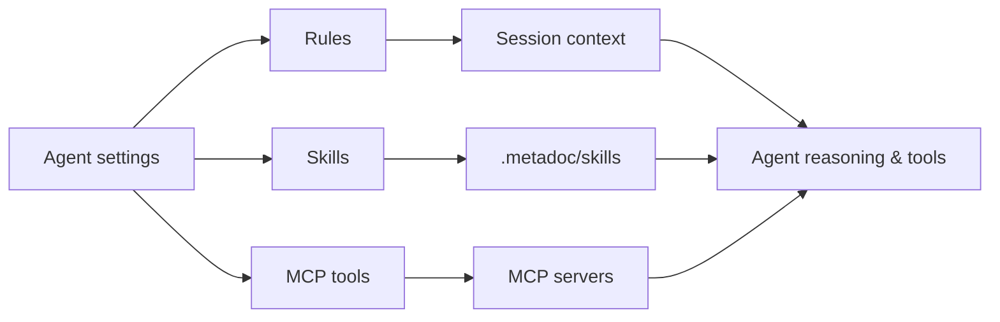

# Rules, Skills & MCP Management

## Overview

Beyond **tool collections**, Agents can be extended with **dynamic rules**, **workspace skills**, and **MCP tools**. All three are opened from the **Agent settings** menu at the bottom-left of the **Agent view** (the same menu is available from the compact sidebar gear icon).

- **Rules**: Constraints and instructions injected into session context. System rules are fixed; user rules can be toggled, edited, or removed, and may go through an approval workflow when created by the Agent via tools.
- **Skills**: `SKILL.md` files (and metadata) under **`.metadoc/skills/<folder>/`** per workspace, indexed for retrieval so the Agent can follow documented procedures.
- **MCP**: External tool servers speaking the MCP protocol. After you refresh the tool list, their tools join the environment’s tool surface; whether a specific Agent can use them still depends on **tool collections** and **Agent configuration**.

The following sections cover entry points, typical workflows, and how this ties to [[agent.tools|Tool Collection Management]] and [[agent.session|Agent Session Management]] (whether a tool is available to an Agent still depends on tool collections and session-side behavior).

## Dynamic rules

Rules add **scope, priority, and body text** at runtime. Built-in system rules cannot be edited. User rules can be enabled/disabled, edited, or deleted. Rules created by the Agent through tools may be **pending approval** until you approve or reject them in the UI.

**Typical steps:**

1. Open **Agent settings → Rule management**.
2. Use **Refresh** to reload the list from the local database.
3. **New rule**: set title, body, priority (higher numbers win), and enabled state; new user rules default to a priority around **90** (adjust as needed).
4. **AI-assisted creation**: describe what you want in natural language, then confirm before saving.
5. For **pending** rules, use **Approve** or **Reject**.

Embedded components below are for layout preview only; clicks do not persist data or call the network.

<AgentCapabilitiesManager mode="demo" initialPanel="rules" />

**Tools:** The app exposes tools such as `create_dynamic_rule` and `update_dynamic_rule` so the Agent can create or update rules from chat (subject to approval). See [[agent.tools|Tool Collection Management]].

## Workspace skills

Skills are **per workspace**, stored under **`.metadoc/skills/<skill-folder>/`** with **`SKILL.md`** as the main file (Front Matter can carry name, description, and other metadata). After indexing/sync, the Agent can retrieve matching skills and follow the instructions inside.

**Typical steps:**

1. Open **Agent settings → Skill management**.
2. **Refresh** to sync the on-disk layout with the database/index (exact steps follow the current product version).
3. Select a skill and edit `SKILL.md` in the built-in editor.
4. **Sync metadata**: use the dropdown to push disk metadata to the index or align the UI from the index—the two actions differ; follow the in-app labels.
5. **Delete skill** removes the skill folder under the workspace; use with care.

<AgentCapabilitiesManager mode="demo" initialPanel="skills" />

**Tip:** Workspace skill tools (create, sync, search, etc.) complement the UI. Clear, actionable `SKILL.md` content greatly improves whether the Agent applies a skill correctly.

## MCP tool management

MCP management configures **connections** to MCP servers (fields such as base URL and transport depend on the UI). After saving, **refresh the tool list** to pull tools from the server. Those tools become available in the environment, but each **Agent** only sees tools allowed by its **tool collections** and **Agent configuration**.

**Typical steps:**

1. Open **Agent settings → MCP tool management**.
2. Add or edit a connection, save, then refresh tools as offered by the UI.
3. If a tool does not appear for an Agent, check tool-collection intersections and session-side settings for that Agent.

<AgentCapabilitiesManager mode="demo" initialPanel="mcp" />

## See also

- [[agent.introduction|Agent Framework Overview]]
- [[agent.tools|Tool Collection Management]]
- [[agent.session|Agent Session Management]]
