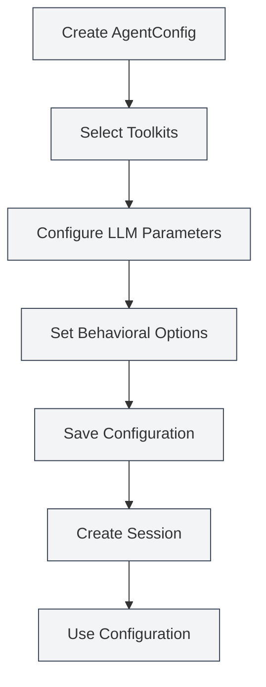

# Agent Configuration Management

## Overview

Agent Configuration (AgentConfig) is a core component of the Agent framework, used to define an Agent's identity and capability scope. Each AgentConfig is associated with a set of toolkits, determining which tools the Agent can use, and allows configuration of LLM parameters and behavioral options.

Through the toolkit intersection mechanism, AgentConfig flexibly controls the Agent's capability scope, enabling you to create specialized Agent configurations for different scenarios.

<AgentView mode="demo" />

## Core Concepts

### AgentConfig Structure

AgentConfig consists of the following main parts:

- **Basic Information**: ID, Name, Description, Version Number
- **Toolkit Association**: List of associated toolkit IDs (intersection is taken)
- **LLM Configuration**: Model, Temperature, Max Tokens, System Prompt, etc.
- **Behavior Configuration**: Whether tool calls are allowed, maximum call count, etc.
- **Scenario Type**: outline, editor, analysis, visualization, custom

### Toolkit Intersection

When an AgentConfig is associated with multiple toolkits, the available tools are the intersection of all toolkits:

- Toolkit A contains: `[tool1, tool2, tool3]`
- Toolkit B contains: `[tool2, tool3, tool4]`
- AgentConfig available tools: `[tool2, tool3]`

This mechanism allows you to precisely control the Agent's capability scope.

<AgentConfigManager mode="demo" />

## Creating an AgentConfig

### Creating a New Configuration

Steps to create an AgentConfig:

1. **Open Agent Management**: Click "Manage" → "Agent Configurations" in the Agent View
2. **Create Configuration**: Click the "New Configuration" button
3. **Fill in Basic Information**:
   - Name: The name of the configuration (supports multiple languages)
   - Description: The description of the configuration (supports multiple languages)
4. **Select Toolkits**: Select one or more toolkits from the dropdown list
5. **Configure LLM** (Optional):
   - System Prompt: Custom system prompt
   - Inject Timestamp: Whether to inject the current time into the system prompt
6. **Set Behavior** (Optional):
   - Max Tool Calls: Limit the number of tool calls for the Agent (null means unlimited)
7. **Save Configuration**: Click the "Save" button

<AgentView mode="demo" />

You can access the Agent View via the sidebar:

### Default Configuration

The system provides a default AgentConfig (`default-agent-config`) containing all built-in tools. It cannot be deleted but can be copied.

## Editing an AgentConfig

### Edit Operation

To edit an existing AgentConfig:

1. **Open Management Interface**: Find the configuration to edit in the Agent Configuration Management interface
2. **Click Edit**: Click the "Edit" button on the configuration card
3. **Modify Configuration**: Modify the name, description, toolkits, LLM configuration, or behavior configuration
4. **Save Changes**: Click the "Save" button

**Note**: The default configuration (`default-agent-config`) cannot be edited, but it can be copied and then edited.

<AgentConfigManager mode="demo" />

## Deleting an AgentConfig

### Delete Operation

To delete an unwanted AgentConfig:

1. **Open Management Interface**: Find the configuration to delete in the Agent Configuration Management interface
2. **Click Delete**: Click the "Delete" button on the configuration card
3. **Confirm Deletion**: Confirm the deletion in the pop-up confirmation dialog

<AgentConfigManager mode="demo" />

**Note**:

- The default configuration (`default-agent-config`) cannot be deleted.
- Deleting a configuration does not affect already created sessions, but new sessions will not be able to use it.
- If the configuration is being used by a session, a warning will be prompted before deletion.

## Copying an AgentConfig

### Copy Operation

To copy an existing AgentConfig:

1. **Open Management Interface**: Find the configuration to copy in the Agent Configuration Management interface
2. **Click Copy**: Click the "Copy" button on the configuration card
3. **Edit the Copy**: The system creates a copy, automatically adding a " (Copy)" suffix to the name
4. **Save Modifications**: Modify the copy as needed and save it

<AgentView mode="demo" />

Copying a configuration duplicates all settings, including toolkit associations, LLM configuration, and behavior configuration.

## Importing/Exporting AgentConfig

### Export Configuration

To export an AgentConfig as a JSON file:

1. **Open Management Interface**: Find the configuration to export in the Agent Configuration Management interface
2. **Click Export**: Click the "Export" button on the configuration card
3. **Select Location**: Choose the save location and filename
4. **Save File**: Click save to export the configuration

The exported JSON file contains all information of the configuration and can be used for backup or sharing.

<AgentConfigManager mode="demo" />

### Import Configuration

To import an AgentConfig from a JSON file:

1. **Open Management Interface**: Go to the Agent Configuration Management interface
2. **Click Import**: Click the "Import Configuration" button
3. **Select File**: Choose the JSON file to import
4. **Validate Data**: The system validates the file format and content
5. **Import Configuration**: A new configuration is created upon successful import

The imported configuration will have a new ID and will not overwrite existing configurations (unless overwrite mode is used).

## LLM Configuration

### System Prompt

AgentConfig can configure a custom system prompt:

- **Default Prompt**: If not set, the Agent framework's default system prompt is used.
- **Custom Prompt**: You can set a specialized system prompt to define the Agent's role and behavior.
- **Timestamp Injection**: You can choose whether to inject the current time into the system prompt.

### LLM Parameters

AgentConfig can override global LLM configuration:

- **Model**: Specify the LLM model to use.
- **Temperature**: Control the randomness of output (0-2).
- **Max Tokens**: Limit the maximum number of tokens per call.

**Note**: If LLM parameters are not set in the AgentConfig, the global LLM configuration will be used.

<AgentConfigManager mode="demo" />

## Behavior Configuration

### Tool Call Control

AgentConfig can control tool call behavior:

- **Allow Tool Calls**: Whether the Agent is allowed to call tools (default is allowed).
- **Max Tool Calls**: Limit the maximum number of tool calls per task (null means unlimited).
- **Allow Workflow Calls**: Whether the Agent is allowed to call workflows (default is allowed).

### Usage Scenarios

Different behavior configurations are suitable for different scenarios:

- **Pure Conversation Scenario**: Disable tool calls, only allow conversation.
- **Limited Tool Scenario**: Limit the number of tool calls to avoid excessive usage.
- **Full-Featured Scenario**: Allow all tool calls without restrictions.

<AgentConfigManager mode="demo" />

## Scenario Types

AgentConfig can set scenario types for categorization and management:

- **outline**: Outline scenario, used for document structure-related tasks.
- **editor**: Editor scenario, used for document editing tasks.
- **analysis**: Analysis scenario, used for document analysis tasks.
- **visualization**: Visualization scenario, used for chart generation tasks.
- **custom**: Custom scenario.

Scenario types are mainly used for categorization and do not affect the Agent's actual behavior.

## Usage Tips

### Configuration Organization

1. **Naming Convention**: Use clear names, such as "Data Analysis Agent", "Document Editing Agent".
2. **Scenario Categorization**: Use scenario types for categorized management.
3. **Toolkit Selection**: Choose appropriate toolkit combinations based on task requirements.

<AgentConfigManager mode="demo" />

### Toolkit Intersection

1. **Precise Control**: Use the intersection of multiple toolkits to precisely control Agent capabilities.
2. **Toolkit Design**: Design specialized toolkits and combine them using intersections.
3. **Test Verification**: After creating a configuration, test if the toolkit intersection is correct.

<AgentConfigManager mode="demo" />

### LLM Configuration

1. **System Prompt**: Write specialized system prompts for different scenarios.
2. **Parameter Tuning**: Adjust temperature and max tokens based on task characteristics.
3. **Timestamp Injection**: Enable timestamp injection for tasks requiring time awareness.

## Frequently Asked Questions

### Q: How to create a specialized Agent configuration?

A: Create a new configuration, select specialized toolkits, and set a custom system prompt and behavior configuration. For example, create a "Data Analysis Agent", associate it with data analysis toolkits, and set a specialized system prompt.

### Q: What does toolkit intersection mean?

A: When an AgentConfig is associated with multiple toolkits, the available tools are the intersection of all toolkits. For example, if Toolkit A contains `[tool1, tool2, tool3]` and Toolkit B contains `[tool2, tool3, tool4]`, then the AgentConfig's available tools are `[tool2, tool3]`.

### Q: Can the default configuration be modified?

A: The default configuration (`default-agent-config`) cannot be edited, but it can be copied and then edited. Copy the default configuration and modify the copy.

### Q: What is the relationship between LLM configuration and global configuration?

A: If LLM parameters are set in the AgentConfig, the AgentConfig's settings will be used; otherwise, the global LLM configuration is used. The AgentConfig's settings have higher priority.

### Q: How to limit the number of tool calls for an Agent?

A: In the AgentConfig's behavior configuration, set the "Max Tool Calls". Set it to a specific number (e.g., 10) to limit calls, or set it to null for unlimited calls.

### Q: Does deleting a configuration affect existing sessions?

A: Deleting a configuration does not affect already created sessions, but new sessions will not be able to use it. If the configuration is being used by a session, a warning will be prompted before deletion.

<AgentView mode="demo" />

## Related Documentation

- [[agent.introduction|Agent Framework Overview]]
- [[agent.tools|Toolkit Management]]
- [[agent.session|Agent Session Management]]
- [[agent.engine|Agent Engine Management]]