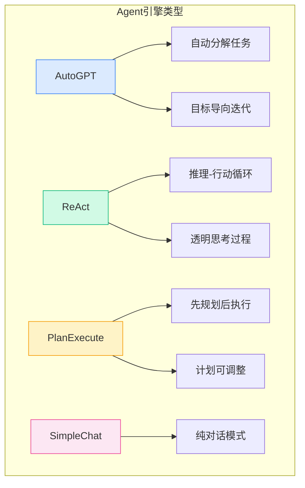
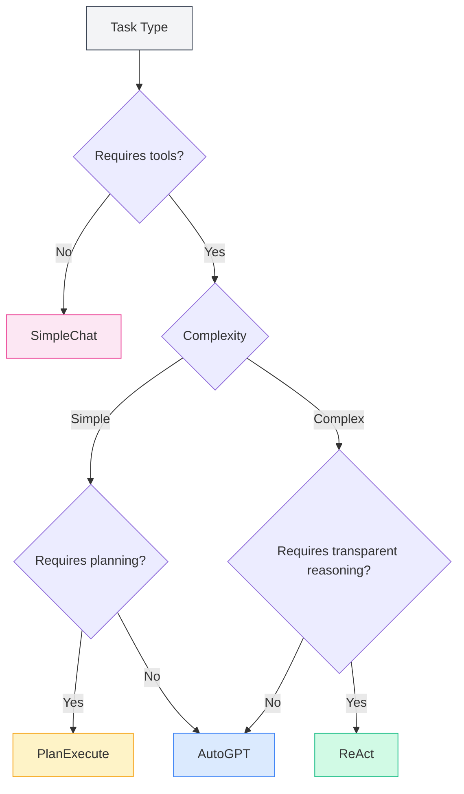
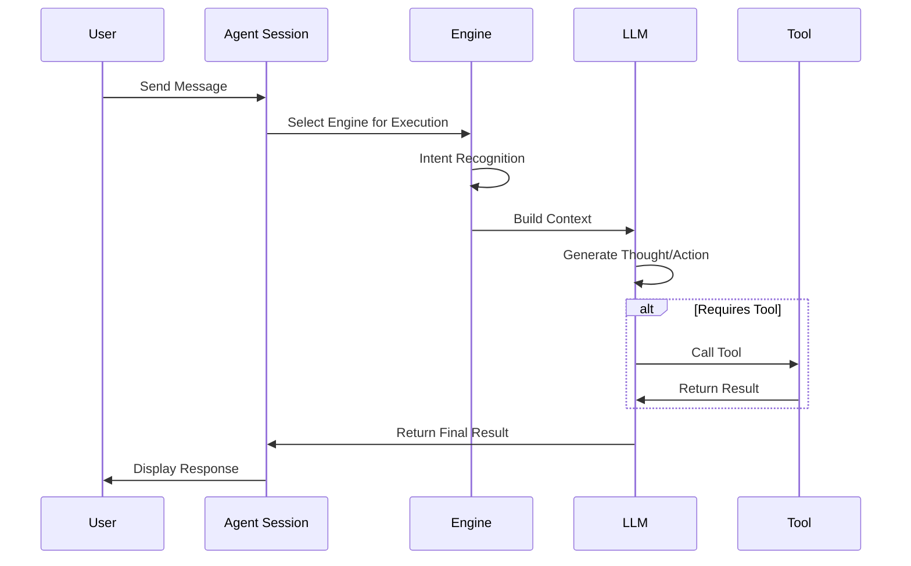

# Agent Engine Management

## Overview

The Agent engine defines the execution strategy and behavior of an Agent. MetaDoc provides multiple built-in engines, each employing a different AI execution paradigm suitable for various task scenarios. By selecting the appropriate engine, you can enable the Agent to complete specific tasks in the most suitable manner.

<AgentView mode="demo" />

## Engine Types

MetaDoc supports the following Agent engines:

| Engine Name     | Characteristics                                   | Suitable Scenarios       |
| --------------- | ------------------------------------------------- | ------------------------ |
| **AutoGPT**     | Automatic task decomposition, goal-oriented iteration | Complex multi-step tasks |
| **ReAct**       | Reasoning-Action loop, transparent thought process   | Tasks requiring detailed reasoning |
| **PlanExecute** | Plan first then execute, adjustable plan            | Structured tasks         |
| **SimpleChat**  | Pure dialogue, no tool calls                        | Simple Q&A               |



## Engine Details

### AutoGPT Engine

**Characteristics**:

- **Automatic Task Decomposition**: Automatically breaks down complex tasks into subtasks.
- **Goal-Oriented**: Iteratively executes around the final goal.
- **Autonomous Decision-Making**: The Agent autonomously decides the next action.

<AgentView mode="demo" />
<AgentEngineManager mode="demo" />

**Suitable Scenarios**:

- Research and information gathering.
- Multi-step document processing.
- Open-ended creative tasks.

**Example**:

```
User: Help me write a review article about artificial intelligence.
Agent: [Automatically decomposes into: 1. Collect materials 2. Organize outline 3. Write content 4. Polish and revise]
```

### ReAct Engine

**Characteristics**:

- **Reasoning-Action Loop**: Explicitly displays the thought process (Reasoning) and actions (Action).
- **Traceable**: Each step has clear reasoning.
- **Transparent and Controllable**: Users can see the Agent's thought logic.

<AgentView mode="demo" />
<AgentEngineManager mode="demo" />

**Suitable Scenarios**:

- Tasks requiring explanation of the reasoning process.
- Logical analysis tasks.
- Teaching and demonstration scenarios.

**Example**:

```
Thought: The user needs me to explain the function of this code.
Action: Call the code analysis tool.
Observation: [Tool returns result]
Thought: Based on the analysis result, I can explain...
```

### PlanExecute Engine

**Characteristics**:

- **Plan First, Execute Later**: First creates a complete plan, then executes according to it.
- **Adjustable Plan**: The plan can be modified during execution.
- **Structured Output**: Output format is standardized and easy to understand.

<AgentView mode="demo" />
<AgentEngineManager mode="demo" />

**Suitable Scenarios**:

- Project management tasks.
- Structured document generation.
- Process-oriented work.

**Example**:

```
Plan:
1. Analyze requirements.
2. Design solution.
3. Implement functionality.
4. Test and verify.

Execution: Complete each phase step by step.
```

### SimpleChat Engine

**Characteristics**:

- **Pure Dialogue Mode**: Only engages in conversation, does not call any tools.
- **Fast Response**: No need to wait for tool execution.
- **Simple and Direct**: Suitable for simple Q&A.

**Suitable Scenarios**:

- General Q&A.
- Concept explanation.
- Simple conversation.

**Note**: This engine does not call tools, therefore it cannot perform functions like file operations or data analysis.

<AgentEngineManager mode="demo" />

## Selecting an Engine

### How to Choose the Right Engine

Select an engine based on task characteristics:



<AgentView mode="demo" />

### Selection Recommendations

| Task Scenario | Recommended Engine         |
| ------------- | -------------------------- |
| Daily Q&A     | SimpleChat                 |
| Document Editing | AutoGPT or ReAct       |
| Data Analysis | ReAct or PlanExecute       |
| Code Writing  | ReAct                      |
| Research      | AutoGPT                    |
| Project Management | PlanExecute            |

<AgentView mode="demo" />

## Configuring Engines

### Selecting an Engine in Agent Configuration

1. Go to [[agent.introduction|Agent Framework Overview]].
2. Create or edit an Agent configuration.
3. Select the desired engine type in the "Engine" option.
4. Save the configuration.

### Engine Parameter Settings

Different engines may have specific parameter settings:

**General Parameters**:

- **Max Iterations**: Limits the number of thinking and action cycles for the Agent.
- **Timeout**: Maximum wait time for a single call.
- **Temperature**: Controls the creativity level of the output.

**Engine-Specific Parameters**:

- **AutoGPT**: Goal decomposition depth.
- **ReAct**: Thought process display options.
- **PlanExecute**: Plan adjustment permissions.

## Engine Execution Flow

### General Execution Flow



### Execution Characteristics of Different Engines

**AutoGPT Execution Characteristics**:

1. Analyze user goal.
2. Automatically decompose into subtasks.
3. Execute subtasks one by one.
4. Aggregate results and return.

**ReAct Execution Characteristics**:

1. Generate thought process.
2. Determine next action.
3. Execute action (call tool or generate response).
4. Observe result.
5. Loop until task is complete.

**PlanExecute Execution Characteristics**:

1. Analyze requirements.
2. Create a complete plan.
3. Execute step by step.
4. Return structured result.

## Customizing Engines

### Engine Configuration Customization

Advanced users can customize engine behavior:

1. **Modify System Prompts**: Adjust the Agent's role and behavior.
2. **Set Tool Preferences**: Specify preferred tools.
3. **Adjust Reasoning Parameters**: Temperature, max tokens, etc.

### Creating a Custom Engine (Advanced)

Developers can create new engine types:

1. Inherit the base engine interface.
2. Implement specific execution logic.
3. Register with the engine manager.
4. Select for use in configuration.

## Best Practices

### Engine Selection Principles

1. **Start Simple**: Use SimpleChat for testing when unsure.
2. **Choose Based on Complexity**: Use AutoGPT or ReAct for complex tasks.
3. **Consider Explainability**: Use ReAct when explanations are needed.

### Optimizing Engine Performance

1. **Describe Requirements Clearly**: Engine effectiveness largely depends on input clarity.
2. **Use Tools Appropriately**: Configure a suitable toolset for the Agent.
3. **Set Reasonable Limits**: Control costs via parameters like max iterations.
4. **Provide Timely Feedback**: Give feedback on Agent responses to help improvement.

## Frequently Asked Questions

### Q: Why isn't the Agent executing as expected?

A: Possible reasons:

- Inappropriate engine selection.
- Insufficient toolset configuration.
- Unclear task description.
- Reached the maximum iteration limit.

### Q: Can I switch engines during a conversation?

A: Currently, switching engines within a single conversation is not supported. To change engines, it is recommended to:

1. End the current session.
2. Create a new session.
3. Select an Agent configuration using a different engine.

### Q: Which engine is best for beginners?

A: Recommendations:

- Start with SimpleChat to familiarize yourself with the dialogue function.
- Then try ReAct to observe the reasoning process.
- Use AutoGPT for complex tasks once proficient.

### Q: Does the engine affect answer quality?

A: Yes. Different engines have different thinking modes and execution strategies:

- The same task may yield different answers from different engines.
- Choosing the right engine can significantly improve effectiveness.
- It is recommended to configure different Agents for different types of tasks.

## Related Documentation

- [[agent.introduction|Agent Framework Overview]]
- [[agent.introduction|Agent Framework Overview]]
- [[agent.session|Agent Session Management]]
- [[agent.tools|Toolset Management]]