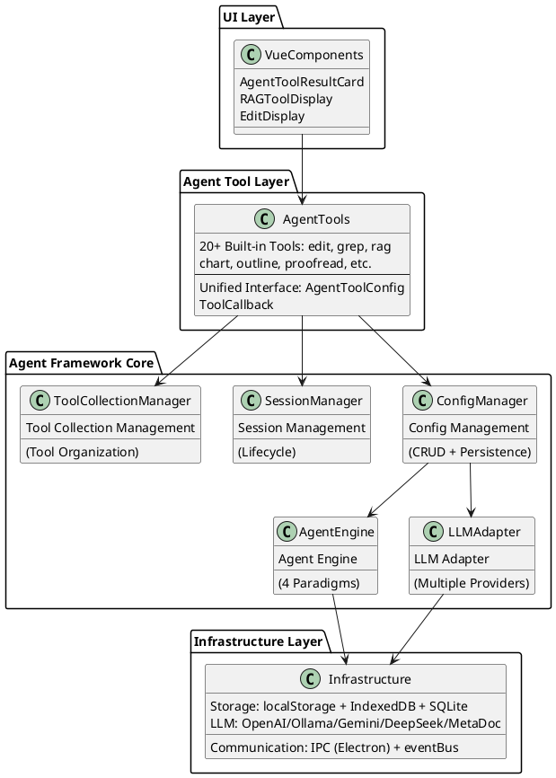
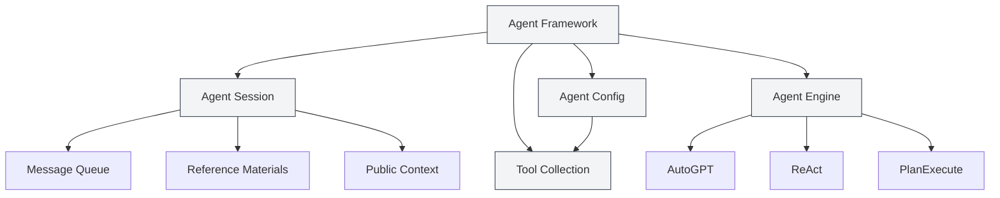
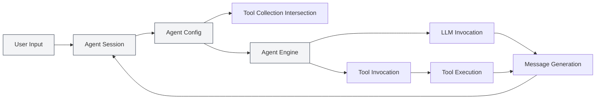
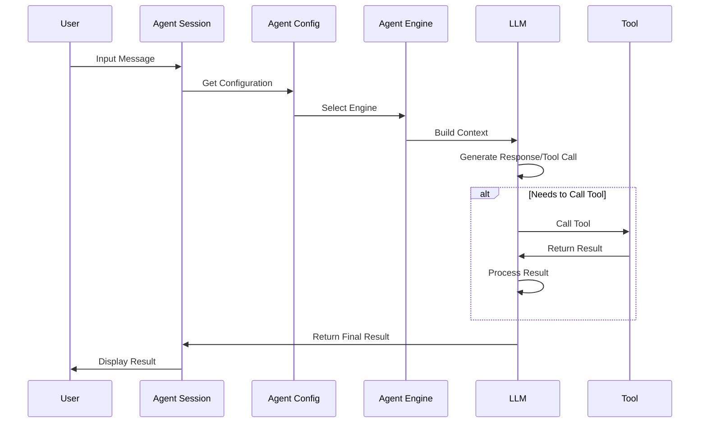

# Agent Framework Overview

## Overview

The Agent Framework is the core framework in MetaDoc for building and managing intelligent Agent systems, employing a **layered architecture design**. It provides complete Agent lifecycle management, including features such as session management, configuration management, toolset management, and engine management.

The Agent Framework is built upon the existing Tool system. Through core components like Agent configuration (AgentConfig), toolset (ToolCollection), and Agent session (AgentSession), it implements a flexible and extensible Agent system.

<AgentSessionManager mode="demo" />

## Interface Preview

The Agent Framework provides an intuitive interface for managing Agent sessions and tools:

<AgentView mode="demo" />

## Technical Architecture

### Architecture Layers



### Core File Paths

| Category           | File Path                                                              | Description                      |
| ------------------ | ----------------------------------------------------------------------- | -------------------------------- |
| **Type Definitions**   | `src/renderer/src/types/agent-framework.ts`                         | Core type definitions for the Agent Framework     |
| **Type Definitions**   | `src/renderer/src/types/agent-tool.ts`                              | Agent tool type definitions         |
| **Configuration Management**   | `src/renderer/src/utils/agent-framework/agent-config-manager.ts`    | CRUD and persistence for AgentConfig |
| **Session Management**   | `src/renderer/src/utils/agent-framework/agent-session-manager.ts`   | AgentSession lifecycle management  |
| **Tool Collection Management** | `src/renderer/src/utils/agent-framework/tool-collection-manager.ts` | Organization and management of tool collections        |
| **Engine Management**   | `src/renderer/src/utils/agent-framework/agent-engine-manager.ts`    | Agent engine configuration management         |
| **Engine Execution**   | `src/renderer/src/utils/agent-framework/agent-engine-executor.ts`   | Implementation of 4 execution paradigms           |
| **Tool Execution**   | `src/renderer/src/utils/agent-framework/tool-runner.ts`             | Unified tool invocation entry point          |
| **LLM Adaptation**    | `src/renderer/src/utils/agent-framework/llm-adapter.ts`             | Multi-LLM provider adaptation           |



## Core Concepts

### Agent Session (AgentSession)

<AgentView mode="demo" />

An Agent Session is an instance of an AgentConfig, representing an independent, contextual Agent execution environment. Implemented based on `agent-session-manager.ts`, each session maintains its own message history, reference materials, public context space, and supports advanced features like message queueing, retry, and Duplicate.

**Type Definition** (`types/agent-framework.ts` lines 387-424):

```typescript
export interface AgentSession {
  entityType: 'agent-session'
  id: string
  title: string
  agentConfigId: string // Associated AgentConfig
  messages: AgentMessage[] // Message history
  messageQueue: QueuedMessage[] // Message queue
  referenceStore: Reference[] // Reference materials
  publicContext: PublicContext // Public context
  executionNodes: ExecutionNode[] // Execution nodes (for retry)
  status: AgentSessionStatus // Session status
}
```

**Session State Machine**:

```
idle → thinking → generating → tool-calling → waiting-input → error
```

For details, see [[agent.session|Agent Session Management]].

### Agent Configuration (AgentConfig)

<CompletionSettingsPanel mode="demo" />

AgentConfig defines the Agent's identity and capability scope, implemented based on `agent-config-manager.ts`.

**Type Definition** (`types/agent-framework.ts` lines 242-289):

```typescript
export interface AgentConfig {
  entityType: 'agent-config'
  id: string
  name: LocalizedText // i18n-supported name
  description: LocalizedText // i18n-supported description
  toolCollectionIds: string[] // Associated tool collection IDs (intersection)
  maxToolCalls?: number | null // Maximum number of tool calls
  llmConfig?: {
    model?: string
    temperature?: number
    systemPrompt?: string // System prompt
    injectTimestamp?: boolean
  }
  behavior?: {
    allowToolCalls?: boolean
  }
  scenario?: 'outline' | 'editor' | 'analysis' | 'visualization' | 'custom'
}
```

**Core Features**:

- **Default Configuration**: `default-agent-config` (built-in, cannot be deleted)
- **Tool Collection Intersection**: When multiple tool collections are associated, the available tools are the intersection of all collections.
- **LLM Parameter Override**: Can override global LLM configuration.
- **Persistence**: Stored in `localStorage` with the key `'agent-configs'`.

Agent-related management is consolidated under the **Agent view** menu. Start with [[agent.tools|Tool Collection Management]] and [[agent.capabilities|Rules, Skills & MCP Management]]. (The standalone “Agent Configuration” manual entry has been removed from the index; the article file remains for reference only.)

### Tool Collection (ToolCollection)

<DataAnalysisDisplay mode="demo" />

A Tool Collection is a set of Agent tools used to organize and manage the tools available to an Agent. An AgentConfig can be associated with multiple tool collections; the available tools are the intersection of all associated collections.

For details, see [[agent.tools|Tool Collection Management]].

### Reference Materials (Reference)

<RAGToolDisplay mode="demo" />

Reference Materials are documents and files referenced within an Agent session. The Agent can perceive this content and reason or operate based on it. Supports various types of references such as files, URLs, and knowledge bases.

References are used and managed within sessions—see [[agent.session|Agent Session Management]]. (The standalone “Reference Materials Management” entry has been removed from the index.)

### Agent Engine (AgentEngine)

<DiffDisplay mode="demo" />

The Agent Engine defines the Agent's execution strategy and behavior mode, including various paradigms such as AutoGPT, ReAct, and PlanExecute. Different engines are suitable for different task scenarios.

Execution paradigms are selected automatically from session context; see [[agent.session|Agent Session Management]]. (The standalone “Agent Engine Management” entry has been removed from the index.)

## System Architecture

The system architecture of the Agent Framework is as follows:



## Execution Flow

The basic execution flow of an Agent:

1.  **User Input**: The user inputs a message in an Agent session.
2.  **Intent Recognition**: The system recognizes user intent and updates available tool descriptions.
3.  **Engine Selection**: Selects an execution engine based on the Agent configuration.
4.  **Context Construction**: Builds context containing historical messages, reference materials, and tool descriptions.
5.  **LLM Invocation**: Invokes the LLM to generate a response or tool call.
6.  **Tool Execution**: If the LLM decides to call a tool, executes the corresponding tool.
7.  **Result Processing**: Returns the tool execution result as an Observation to the LLM.
8.  **Iteration Loop**: Depending on the engine type, multiple iterations may occur until the task is complete.
9.  **Result Output**: Presents the final result to the user.



## Features

### Core Features

- **Session Management**: Create, delete, copy, export/import sessions.
- **Configuration Management**: Flexible Agent configuration supporting multi-tool collection intersection.
- **Tool Collection Management**: Organize and manage Agent tools.
- **Reference Materials Management**: Manage referenced documents and files within sessions.
- **Engine Management**: Support for multiple execution paradigms; engines can be customized.

### Advanced Features

- **Message Queue**: Insert messages during Agent execution.
- **Retry Mechanism**: Supports retrying failed execution nodes.
- **Duplicate Function**: Duplicate sessions or execution nodes.
- **Public Context**: Session-level shared context space.
- **Execution Node Tracking**: Record the status and results of each execution node.

## Use Cases

The Agent Framework is suitable for the following scenarios:

- **Document Editing**: Use Agent tools for document editing and optimization.
- **Data Analysis**: Use data analysis tools for data processing and visualization.
- **Content Generation**: Use Agent engines with tool collections to generate structured content.
- **Knowledge Retrieval**: Perform intelligent retrieval and analysis combined with knowledge bases.
- **Automated Tasks**: Implement multi-step tasks through Agents and tool collections.

## Quick Start

To start using the Agent Framework, it is recommended to learn in the following order:

1.  [[agent.introduction|Agent Framework Overview]] (this document)
2.  [[agent.tools|Tool Collection Management]]: Learn how to manage tool collections.
3.  [[agent.capabilities|Rules, Skills & MCP Management]]: Rules, workspace skills, and MCP.
4.  [[agent.session|Agent Session Management]]: Create and manage sessions.

## Frequently Asked Questions

### Q: What is the difference between the Agent Framework and AI Chat?

A: AI Chat is a simple conversational feature, while the Agent Framework provides a complete Agent system with advanced features like tool invocation and reference materials management. The Agent Framework can perform complex tasks, not just conversation.

### Q: How do I choose the appropriate Agent Engine?

A:

- **AutoGPT Engine**: Suitable for most intelligent tasks, strong autonomous decision-making capability.
- **ReAct Engine**: Suitable for tasks requiring detailed reasoning steps, explicit thought process.
- **PlanExecute Engine**: Suitable for tasks requiring structured execution, plan first then execute.
- **SimpleChat Engine**: Suitable for pure conversational tasks, does not call tools.

### Q: What does "Tool Collection Intersection" mean?

A: When an AgentConfig is associated with multiple tool collections, the available tools are the intersection of all collections. For example, if Tool Collection A contains `[tool1, tool2, tool3]` and Tool Collection B contains `[tool2, tool3, tool4]`, then the AgentConfig's available tools are `[tool2, tool3]`.

## Related Documentation

- [[agent.session|Agent Session Management]]
- [[agent.tools|Tool Collection Management]]
- [[agent.capabilities|Rules, Skills & MCP Management]]
- [[ai.llm-config|LLM Configuration]]

