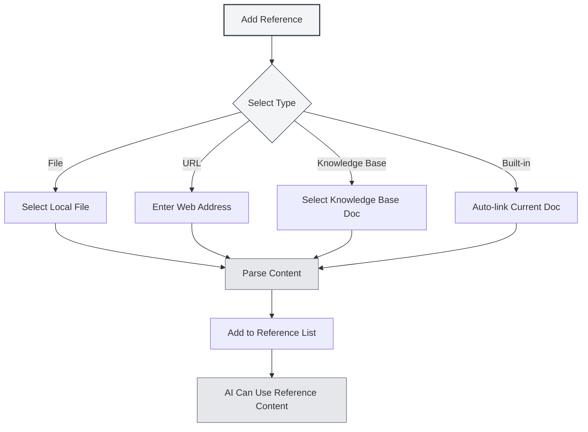

# Reference Material Management

## Overview

Reference materials are a key feature in Agent conversations, allowing you to bring external documents, web pages, files, and other content into the dialogue. The Agent can reason and respond based on these reference materials, making AI answers more accurate and relevant.

With reference materials, you can:

- Have the AI refer to specific document content
- Discuss based on web page information
- Analyze the content of local files
- Conduct in-depth Q&A combined with knowledge base content

## Opening Reference Management

In the Agent conversation interface, click the "References" tab to open the reference material management panel.

The reference panel displays all reference materials added to the current conversation, including:

- File name or URL
- Reference type (File/URL/Knowledge Base/Built-in Document)
- Enabled status
- Content preview

You can access the Agent view via the sidebar:

<ReferenceManager mode="demo" />
<ReferenceDisplay mode="demo" />

## Adding References

### Adding File References

Add local files as reference materials:

1. Click the "Add Reference" button in the reference panel
2. Select the "File" type
3. Choose the file to reference in the file picker
4. Confirm the addition

**Supported File Formats**:

- Markdown documents (.md)
- LaTeX documents (.tex)
- PDF files (.pdf)
- Word documents (.docx)
- Plain text files (.txt)
- Image files (.png, .jpg)

<ReferenceManager mode="demo" />

### Adding URL References

Reference web page content:

1. Click the "Add Reference" button in the reference panel
2. Select the "URL" type
3. Enter the web page address to reference
4. Click confirm

MetaDoc will automatically fetch the web page content and add it to the references.

<ReferenceManager mode="demo" />
<ReferenceDisplay mode="demo" />

### Adding Knowledge Base References

Reference documents from the knowledge base:

1. Click the "Add Reference" button in the reference panel
2. Select the "Knowledge Base" type
3. Select the document to reference from the knowledge base list
4. Confirm the addition

<ReferenceDisplay mode="demo" />

### Built-in Document Reference

Each Agent conversation has the "Built-in Document Reference" (Reference #0) enabled by default. It dynamically fetches the content of the currently open document as reference material.



## Managing References

### Enabling/Disabling References

Each reference material can have its enabled status controlled independently:

- **Enabled**: The referenced content participates in the AI's reasoning process
- **Disabled**: The referenced content temporarily does not participate in reasoning but remains in the list

Click the toggle switch next to a reference material to change its enabled status.

<ReferenceDisplay mode="demo" />

### Previewing Reference Content

Click on a reference material to preview its content:

- **File Reference**: Shows a text preview of the file content
- **URL Reference**: Shows the fetched web page content
- **Knowledge Base Reference**: Shows relevant snippets from the knowledge base
- **Built-in Reference**: Shows the content of the current document

### Deleting References

Remove references that are no longer needed from the reference list:

1. Find the reference to delete in the reference panel
2. Click the delete button (× icon)
3. Confirm deletion

**Note**: Deleting a reference only removes the reference relationship; it does not affect the original file.

<ReferenceManager mode="demo" />

## The Role of References in Conversation

### Reference Awareness

When you activate references, the Agent will, when responding:

1. **Analyze Reference Content**: Understand the content of the referenced documents, web pages, or files
2. **Combine Context**: Integrate reference content with conversation history
3. **Generate Response**: Generate more accurate answers based on the reference content

### Usage Examples

**Scenario 1: Q&A Based on a Document**

```
User: [Added a technical document as a reference]
User Question: What are the best practices mentioned in this document?
AI: According to the document you referenced, the best practices include...
```

**Scenario 2: Multi-Document Comparison**

```
User: [Added two research papers as references]
User Question: Compare the research methods of these two papers
AI: The first paper uses... while the second paper employs...
```

**Scenario 3: Web Content Analysis**

```
User: [Added a news webpage as a reference]
User Question: Summarize the main points of this report
AI: Based on the webpage content, it mainly reports...
```

## Best Practices

### Using References Efficiently

1. **Select Relevant Materials**: Only add references relevant to the current topic to avoid information overload
2. **Control Reference Quantity**: It is recommended to have no more than 5 active references simultaneously to ensure processing efficiency
3. **Clean Up Promptly**: After a conversation ends, delete references that are no longer needed to keep the list tidy

### Reference Strategies

1. **Document Analysis**: When analyzing long documents, add the document as a reference and ask specific questions
2. **Knowledge Retrieval**: Use knowledge base references for knowledge base-based Q&A
3. **Real-time Information**: Obtain the latest web information via URL references
4. **Context Continuation**: Use built-in references to help the AI understand the document currently being edited

## Usage Tips

### Quick Addition

- **Drag and Drop**: Drag files directly onto the reference panel
- **Right-click Addition**: Right-click on a file or webpage and select "Add to References"
- **Keyboard Shortcuts**: Use shortcuts to quickly open the reference panel

<ReferenceManager mode="demo" />

### Reference Combinations

You can add multiple references of different types simultaneously:

- One PDF document + One webpage link
- Multiple knowledge base documents
- Local file + Built-in document reference

The AI will comprehensively analyze all enabled reference content.

<ReferenceDisplay mode="demo" />

### Temporary Disabling

If you are unsure whether a reference is useful, you can disable it first:

1. Observe the AI's response without that reference
2. Then enable the reference and compare the response difference
3. Decide whether to keep it based on the effect

## Frequently Asked Questions

### Q: Is there a size limit for reference content?

A: Yes. Very large files may be truncated. It is recommended to:

- Add large documents in sections by chapter
- Use the knowledge base to handle large volumes of documents
- Extract key parts from long documents first

### Q: Why does the AI seem not to use a reference after I added it?

A: Possible reasons:

- The reference is not enabled (check the toggle status)
- The reference content is irrelevant to the question
- Reference parsing failed (check the file format)

### Q: What should I do if a URL reference fails?

A: Possible reasons:

- The webpage requires login access
- The webpage has anti-crawling mechanisms
- Network connection issues
  Recommendation: Save the webpage content as a file and then add it as a file reference

### Q: Do references take up storage space?

A: References themselves are just links and do not occupy extra space. However, the parsed results of references are cached locally.

## Related Documentation

- [[agent.session|Agent Session Management]]
- [[agent.config|Agent Configuration Management]]
- [[knowledge-base.usage|Knowledge Base Usage]]
- [[agent.introduction|Agent Framework Overview]]