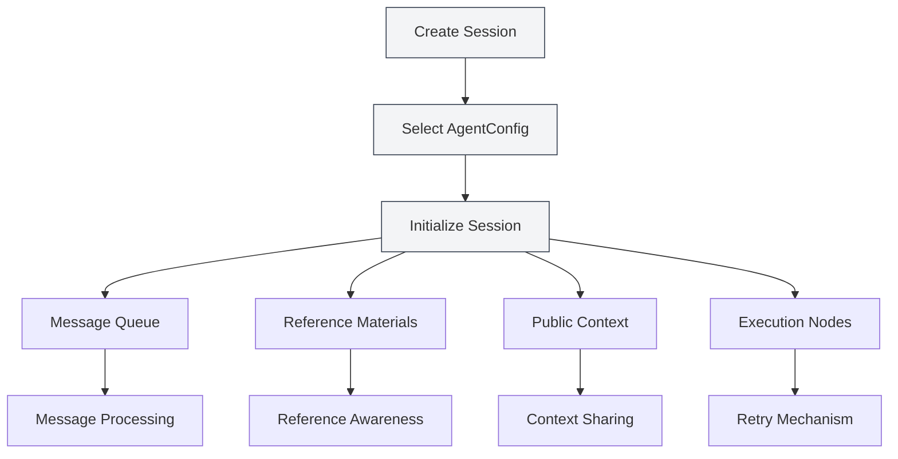
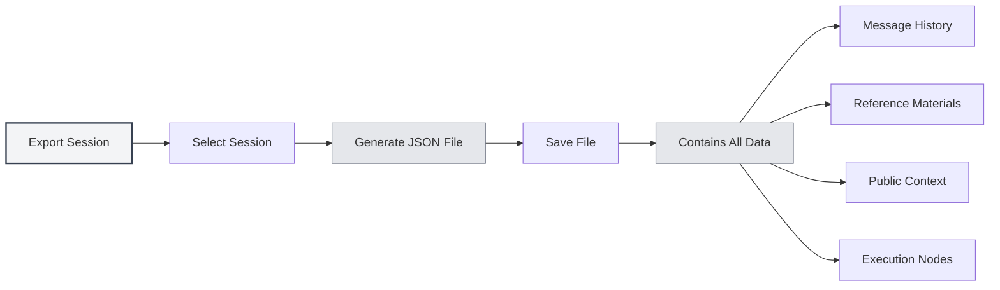
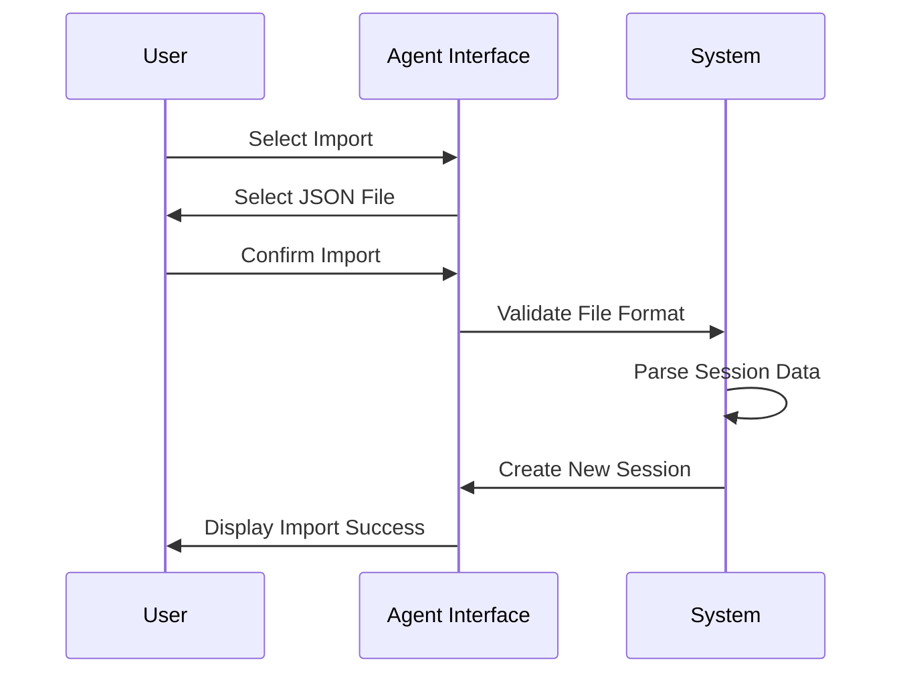
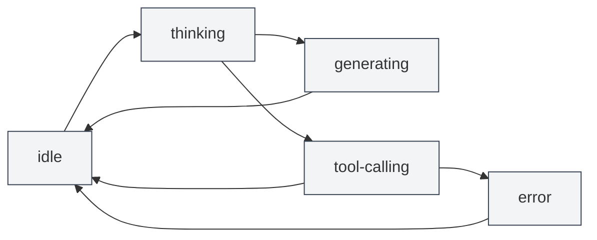

# Agent Session Management

## Overview

Agent sessions are the core component of the Agent framework, representing an independent, contextual Agent execution environment. Each session maintains its own message history, reference materials, public context space, and supports advanced features such as message queues, retries, and duplication.

<AgentView mode="demo" />

Agent sessions are created based on an AgentConfig, inheriting its toolset and capability scope, but each session has independent execution state and history.

## Creating a Session

### Creating a New Session

Steps to create an Agent session:

<AgentView mode="demo" />

1.  **Open Agent View**: Click "AI" → "Agent" in the menu bar to open the Agent view.
2.  **Select AgentConfig**: Select the AgentConfig to use from above the session list.
3.  **Create Session**: Click the "New Session" button.
4.  **Enter Title**: Optionally enter a session title (the first message is used as the default title).
5.  **Start Conversation**: Enter the first message to begin interacting with the Agent.

### Session Initialization

When creating a session, the system automatically:

<AgentSessionManager mode="demo" />

-   **Creates Session ID**: Generates a unique session identifier.
-   **Associates AgentConfig**: Binds to the specified AgentConfig.
-   **Initializes Message Queue**: Creates an empty message queue.
-   **Initializes Reference Materials**: Creates empty storage for reference materials.
-   **Initializes Public Context**: Creates a public context space containing information like the current time.
-   **Creates Greeting**: Automatically adds the Agent's greeting message.
-   **Enables Built-in Reference**: Enables the built-in reference #0 by default (dynamically fetches current document content).

## Renaming a Session

### Rename Operation

To rename an existing session:

<AgentView mode="demo" />

1.  **Right-click Menu**: Right-click on the session and select "Rename".
2.  **Enter New Name**: Enter the new session name in the pop-up dialog.
3.  **Confirm Save**: Click confirm to save the new name.

Session names are used to identify and distinguish different sessions; descriptive names are recommended.

## Deleting a Session

### Delete Operation

To delete an unwanted session:

<AgentSessionManager mode="demo" />

1.  **Right-click Menu**: Right-click on the session and select "Delete".
2.  **Confirm Deletion**: Confirm the deletion in the pop-up confirmation dialog.

**Note**: Deleting a session will also delete all its message history, reference materials, and execution nodes. This operation cannot be undone.

### Batch Deletion

Batch deletion is currently not supported; sessions must be deleted one by one.

## Duplicating a Session

### Duplicate Operation

To duplicate an existing session:

<AgentView mode="demo" />

1.  **Right-click Menu**: Right-click on the session and select "Duplicate".
2.  **Create Copy**: The system will create a new copy of the session.

Duplicating a session copies:

-   **Message History**: All message records.
-   **Reference Materials**: All reference materials.
-   **Public Context**: The content of the public context space.
-   **Execution Nodes**: All execution node records.

The duplicated session is independent; modifications will not affect the original session.

### Use Cases

Duplicating a session is suitable for:

-   **Branching Discussions**: Continuing discussions on different topics based on an existing conversation.
-   **Experimental Testing**: Testing different Agent configurations or toolsets.
-   **Backup Preservation**: Saving important session states.

## Exporting/Importing Sessions

### Exporting a Session

<AgentView mode="demo" />

To export a session as a JSON file:

<AgentView mode="demo" />

1.  **Right-click Menu**: Right-click on the session and select "Export".
2.  **Choose Location**: Select the save location and filename.
3.  **Save File**: Click save to export the session.

The exported JSON file contains:

-   Basic session information (ID, title, description, etc.)
-   Message history
-   Reference materials
-   Public context
-   Execution nodes

### Importing a Session

<AgentSessionManager mode="demo" />

To import a session from a JSON file:

1.  **Open Import**: Find the import function in the Agent view.
2.  **Select File**: Select the JSON file to import.
3.  **Validate Data**: The system validates the file format and content.
4.  **Import Session**: Creates a new session upon successful import.

The imported session will have a new session ID and will not overwrite existing sessions.

## Retrying a Session

### Retry Function

The retry function allows you to re-execute failed Agent tasks:

1.  **View Execution Nodes**: View the list of execution nodes in the session.
2.  **Select Node**: Select the execution node to retry.
3.  **Retry Execution**: Click the "Retry" button to re-execute.

Retrying starts re-execution from the selected execution node, preserving previous message history.

### Execution Nodes

Execution nodes record each step in the Agent's execution process:

-   **Message Node**: User message or AI reply.
-   **Tool Call Node**: Tool invocation and execution result.
-   **Workflow Call Node**: Workflow execution process.
-   **LLM Call Node**: LLM invocation and response.

Each node has a status (pending, running, succeeded, failed, cancelled) and a result.

## Session Message Management

### Message Operations

The following operations can be performed on session messages:

-   **Edit Message**: Edit a user message and resend it.
-   **Regenerate**: Regenerate an AI reply.
-   **Copy Message**: Copy message content.
-   **Delete Message**: Delete a message (this will delete all messages after it).

### Message Queue

<AgentView mode="demo" />

The message queue allows inserting messages during Agent execution:

1.  **Insertion Timing**: When the Agent is generating a reply or calling a tool, messages are temporarily stored in the queue.
2.  **Processing Timing**: After the current task finishes and before the next step, messages in the queue are processed.
3.  **Annotation Information**: Queue messages are annotated with the insertion timestamp and the message ID at insertion time, helping the Agent understand the context.

The message queue feature allows you to provide additional information or instructions during Agent execution.

## Reference Material Management

### Adding References

<ReferenceManager mode="demo" />

To add reference materials to a session:

1.  **Open Reference Manager**: Click the "References" tab in the session.
2.  **Add Reference**: Click the "Add Reference" button.
3.  **Select Type**: Choose the reference type (File, URL, Text, etc.).
4.  **Select Content**: Select the content to reference.

For details, see [[agent.references|Reference Material Management]].

### Reference Types

The following reference types are supported:

-   **File Reference**: References local files (Markdown, LaTeX, PDF, Word, images, etc.).
-   **URL Reference**: References webpage URLs.
-   **Text Reference**: References custom text content.
-   **Knowledge Base Reference**: References content from the knowledge base.
-   **Built-in Reference**: Dynamically fetches current document content (enabled by default).

### Activating References

<ReferenceManager mode="demo" />

Reference materials can be activated or deactivated:

-   **Activate Reference**: Activated references are used during Agent execution.
-   **Deactivate Reference**: Deactivated references do not affect Agent execution.

The Agent can perceive the content of reference materials and reason and operate based on them.

## Public Context

### Context Space

The public context is a session-level shared context space containing:

<AgentView mode="demo" />

-   **Current Time**: Automatically updated timestamp.
-   **Document Information**: Information about the currently open document (if enabled).
-   **Custom Data**: User-defined context data.

### Use Cases

Public context is suitable for:

-   **Time Awareness**: Letting the Agent know the current time.
-   **Document Awareness**: Letting the Agent know the currently open document.
-   **State Sharing**: Sharing state information within workflows.

## Session State

<AgentSessionManager mode="demo" />

### State Types

Sessions have the following states:

-   **idle**: Idle state, waiting for user input.
-   **thinking**: Agent is thinking.
-   **generating**: Agent is generating a reply.
-   **tool-calling**: Agent is calling a tool.
-   **waiting-input**: Waiting for user input.
-   **error**: An error occurred.

### State Transitions

## Usage Tips

<AgentView mode="demo" />

### Session Organization

1.  **Categorize Management**: Create different sessions for different topics.
2.  **Naming Convention**: Use clear session names.
3.  **Regular Cleanup**: Periodically delete unnecessary sessions.

### Message Management

1.  **Edit Messages**: If an AI reply is unsatisfactory, you can edit the user message and resend it.
2.  **Use References**: Add reference materials to provide more context.
3.  **Message Queue**: Use the message queue to insert additional information during Agent execution.

### Retry Mechanism

1.  **View Nodes**: View execution nodes to understand the Agent's execution process.
2.  **Select Retry**: Select failed nodes for retry.
3.  **Adjust Configuration**: If failures are frequent, consider adjusting the AgentConfig or toolset.

## Frequently Asked Questions

<AgentView mode="demo" />

### Q: How do I create a new session?

A: In the Agent view, select an AgentConfig, then click the "New Session" button. After creating the session, enter the first message to start the conversation.

### Q: Is session message history saved?

A: Yes, session message history is automatically saved to the document's metadata. All sessions are restored when the document is reopened.

### Q: How do I delete a session?

A: Right-click on the session, select "Delete", then confirm the deletion in the confirmation dialog. This operation cannot be undone.

### Q: What is copied when duplicating a session?

A: Duplicating a session copies the message history, reference materials, public context, and execution nodes. The duplicated session is independent.

### Q: How do I export a session?

A: Right-click on the session, select "Export", then choose the save location. The exported JSON file contains all the session's information.

### Q: What is the message queue?

A: The message queue allows inserting messages during Agent execution. Messages in the queue are processed after the current task finishes.

### Q: How do I retry a failed execution?

A: In the session, view the list of execution nodes, select the failed node, then click the "Retry" button.

### Q: How do reference materials affect the Agent?

A: The Agent can perceive the content of reference materials and reason and operate based on them. Activated references are used during Agent execution.

## Related Documentation

-   [[agent.introduction|Agent Framework Overview]]
- [[agent.capabilities|Rules, Skills & MCP Management]]
-   [[agent.references|Reference Material Management]]
-   [[agent.engine|Agent Engine Management]]
