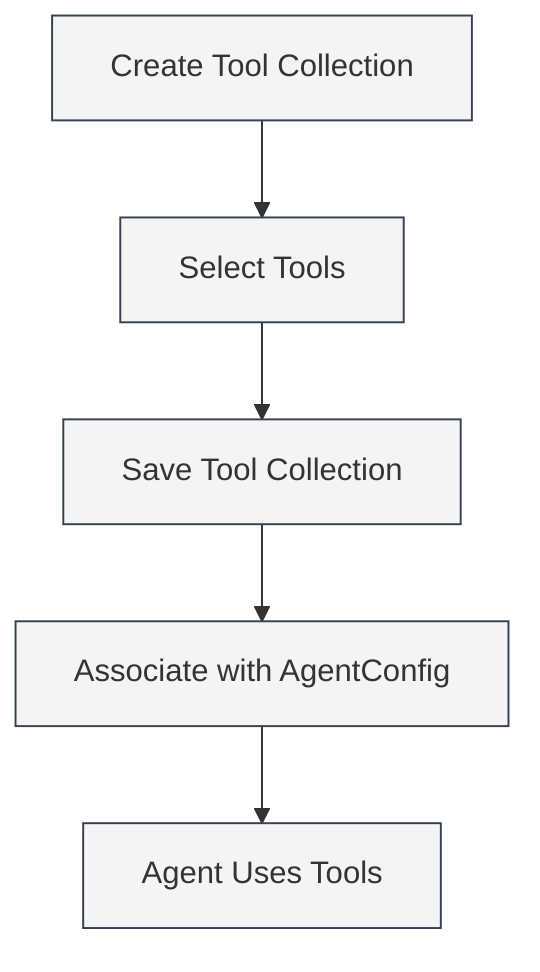

# Tool Collection Management

## Overview

A Tool Collection is a set used within the Agent framework to organize and manage Agent tools. It groups related tools together for easier management and reuse. An AgentConfig determines which tools an Agent can use by associating with one or more tool collections.

Tool collections support the dynamic addition and removal of tools. You can create collections for specialized purposes or combine multiple collections for use.

## Core Concepts

### Tool Collection Structure

<AgentView mode="demo" />

A tool collection consists of the following main parts:

- **Basic Information**: ID, Name, Description, Version Number
- **Tool List**: List of included tool IDs (including internal tools, external tools)
- **Enabled Status**: Whether the collection is enabled
- **Tags**: Labels for categorization and searching
- **Built-in Flag**: Indicates if it's a built-in tool collection (cannot be deleted)

### Tool Types

<GrepDisplay mode="demo" />

A tool collection can contain the following types of tools:

- **Internal Tools**: Agent tools built into MetaDoc (e.g., edit-tool, proofread-tool, etc.)
- **External Tools**: User-defined external tools

### Default Tool Collection

The system provides a default tool collection (`default-tool-set`) containing all built-in Agent tools. It cannot be deleted but can be copied.

## Creating a Tool Collection

<AgentView mode="demo" />

### Creating a New Tool Collection

Steps to create a tool collection:

1.  **Open Tool Collection Management**: In the Agent view, click "Manage" → "Tool Collections"
2.  **Create Tool Collection**: Click the "New Tool Collection" button
3.  **Fill in Basic Information**:
    - Name: The name of the tool collection (supports multiple languages)
    - Description: The description of the tool collection (supports multiple languages)
4.  **Select Tools**: Choose one or more tools from the dropdown list
    - You can search for tool names
    - Multiple selection is supported
    - Tool type and description are displayed
5.  **Save Tool Collection**: Click the "Save" button

You can access the Agent view via the sidebar:

### Agent Tool Collection Interface

The following diagram shows the main features of the tool collection management interface:

<AgentView mode="demo" />

### Tool Selection

When selecting tools, the system displays:

- **Tool Name**: The display name of the tool
- **Tool ID**: The unique identifier of the tool
- **Tool Type**: Internal tool, external tool, or workflow tool
- **Tool Description**: A brief description of the tool

<DialogDemo mode="demo" dialogType="tool-select" />

## Editing a Tool Collection

<AgentView mode="demo" />

### Edit Operation

To edit an existing tool collection:

1.  **Open Management Interface**: Find the tool collection to edit in the tool collection management interface
2.  **Click Edit**: Click the "Edit" button on the tool collection card
3.  **Modify Information**: Change the name, description, or tool list
4.  **Save Changes**: Click the "Save" button

**Note**: The default tool collection (`default-tool-set`) cannot be edited, but it can be copied and then the copy can be edited.

### Adding Tools

To add tools to a tool collection:

1.  **Open Edit Interface**: Edit the tool collection
2.  **Select Tools**: Choose the tools to add from the tool dropdown list
3.  **Save Changes**: Click the "Save" button

### Removing Tools

To remove tools from a tool collection:

1.  **Open Edit Interface**: Edit the tool collection
2.  **Deselect**: Deselect the tools to remove from the tool list
3.  **Save Changes**: Click the "Save" button

## Deleting a Tool Collection

<AgentView mode="demo" />

### Delete Operation

To delete an unwanted tool collection:

1.  **Open Management Interface**: Find the tool collection to delete in the tool collection management interface
2.  **Click Delete**: Click the "Delete" button on the tool collection card
3.  **Confirm Deletion**: Confirm the deletion in the pop-up confirmation dialog

**Note**:

- The default tool collection (`default-tool-set`) cannot be deleted.
- Deleting a tool collection does not affect already created AgentConfigs, but AgentConfigs associated with that collection will no longer be able to use it.
- If the tool collection is currently in use by an AgentConfig, a warning will be shown before deletion.

## Copying a Tool Collection

### Copy Operation

<OutlineTreeDisplay mode="demo" />

To copy an existing tool collection:

1.  **Open Management Interface**: Find the tool collection to copy in the tool collection management interface
2.  **Click Copy**: Click the "Copy" button on the tool collection card
3.  **Edit the Copy**: The system creates a copy, with "(Copy)" automatically appended to the name
4.  **Save Modifications**: Modify the copy as needed and save it

Copying a tool collection duplicates all tools, including the tool list and configurations.

## Importing/Exporting Tool Collections

### Exporting a Tool Collection

To export a tool collection as a JSON file:

1.  **Open Management Interface**: Find the tool collection to export in the tool collection management interface
2.  **Click Export**: Click the "Export" button on the tool collection card
3.  **Choose Location**: Select the save location and filename
4.  **Save File**: Click save to export the tool collection

<DialogDemo mode="demo" dialogType="export-config" />

The exported JSON file contains all information about the tool collection and can be used for backup or sharing.

### Importing a Tool Collection

<DataAnalysisDisplay mode="demo" />

To import a tool collection from a JSON file:

1.  **Open Management Interface**: Go to the tool collection management interface
2.  **Click Import**: Click the "Import Tool Collection" button
3.  **Select File**: Choose the JSON file to import
4.  **Validate Data**: The system validates the file format and content
5.  **Import Tool Collection**: A new tool collection is created upon successful import

<DialogDemo mode="demo" dialogType="import-config" />

The imported tool collection receives a new ID and will not overwrite an existing one (unless overwrite mode is used).

## Tool Collections and AgentConfig

### Associating Tool Collections

An AgentConfig determines its available tools by associating with tool collections:

1.  **Create AgentConfig**: Create a new AgentConfig
2.  **Select Tool Collection(s)**: Choose one or more tool collections within the AgentConfig
3.  **Tool Intersection**: If multiple tool collections are selected, the available tools are the intersection of all selected collections

### Tool Collection Intersection

<DiffDisplay mode="demo" />

When an AgentConfig is associated with multiple tool collections:

- Tool Collection A contains: `[tool1, tool2, tool3]`
- Tool Collection B contains: `[tool2, tool3, tool4]`
- The AgentConfig's available tools are: `[tool2, tool3]` (the intersection)

This mechanism allows you to precisely control the scope of an Agent's capabilities.

## Usage Tips

### Organizing Tool Collections

1.  **Categorize by Function**: Create tool collections categorized by function, such as "Document Editing Tool Collection", "Data Analysis Tool Collection"
2.  **Categorize by Scenario**: Create tool collections categorized by usage scenario, such as "Academic Writing Tool Collection", "Code Analysis Tool Collection"
3.  **Naming Conventions**: Use clear names for easy identification and management

### Designing Tool Collections

1.  **Single Responsibility**: Each tool collection should focus on a specific function or scenario
2.  **Tool Combination**: Reasonably combine related tools, avoiding overly large collections
3.  **Reusability**: Design reusable tool collections for easy use across different AgentConfigs

### Managing Tool Collections

1.  **Regular Cleanup**: Delete tool collections that are no longer in use
2.  **Version Management**: Back up important tool collections using the export feature
3.  **Documentation**: Explain the purpose and usage scenarios in the tool collection description

## Frequently Asked Questions

### Q: How do I create a specialized tool collection?

A: Create a new tool collection, select the relevant tools, and set a clear name and description. For example, create a "Data Analysis Tool Collection" and select data analysis-related tools.

### Q: What is the relationship between tool collections and AgentConfig?

A: An AgentConfig determines its available tools by associating with tool collections. One AgentConfig can be associated with multiple tool collections, and the available tools are the intersection of all associated collections.

### Q: Can I modify the default tool collection?

A: The default tool collection (`default-tool-set`) cannot be edited, but it can be copied and the copy can be edited. Copy the default tool collection and then modify the copy.

### Q: How do I add a custom tool to a tool collection?

A: First, you need to register the custom tool. Then, select that tool when creating or editing a tool collection. Custom tools must comply with the Agent tool specification.

### Q: Does deleting a tool collection affect AgentConfigs?

A: Deleting a tool collection does not affect already created AgentConfigs, but AgentConfigs associated with that collection will no longer be able to use it. If the tool collection is currently in use, a warning will be shown before deletion.

## Related Documentation

- [[agent.introduction|Agent Framework Overview]]
- [[agent.config|Agent Configuration Management]]
- [[agent.session|Agent Session Management]]