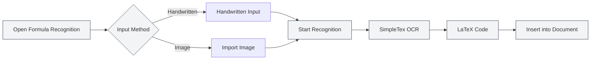

# AI Assistant Features

## Overview

The AI Assistant feature provides a variety of intelligent auxiliary tools to help you complete tasks such as document creation, formula recognition, chart generation, and data analysis. With the AI Assistant, you can efficiently handle various document processing tasks.

AI Assistant features include: AI Chat, Handwritten Formula Recognition, Intelligent Drawing Assistant, Data Analysis Tool, OCR Text Recognition, Attachment Parsing Tool, AIGC Detection, and more.

<AgentView mode="demo" />

## AI Chat

### Feature Introduction

The AI Chat feature provides an intelligent conversational assistant that can engage in dialogue based on the current document content:

- **Context Understanding**: Understands the content and context of the current document.
- **Intelligent Responses**: Answers related questions based on the document content.
- **Document Analysis**: Analyzes document structure, content, style, etc.

You can access the AI Chat feature via the AI Assistant menu:

<MenuItemsDemo mode="demo" :items='[{"id": "ai-assistant", "items": ["ai-chat"]}]' />

### Interface Preview

The AI Chat interface includes a conversation list and a chat area, supporting multi-conversation management and reference materials:

<AIChat mode="demo" />

For details, see [[ai.chat|AI Chat]].

## Handwritten Formula Recognition

### Feature Introduction

The Handwritten Formula Recognition feature can convert handwritten mathematical formulas into LaTeX code:

<FormulaRecognition mode="demo" />

- **Handwritten Input**: Supports mouse/touchscreen handwritten input.
- **Image Import**: Supports importing formula images for recognition.
- **Real-time Recognition**: Uses the SimpleTex OCR API for recognition.
- **LaTeX Output**: Automatically converts to standard LaTeX format.

### How to Use

1.  **Open Formula Recognition**: Open the formula recognition window from the AI Assistant menu.
2.  **Handwritten Input**: Handwrite the mathematical formula on the canvas.
3.  **Or Import Image**: Click the import button and select a formula image.
4.  **Start Recognition**: Click the recognition button.
5.  **View Results**: View the recognized LaTeX code.
6.  **Insert into Document**: Insert the LaTeX code into the document.

You can access the Handwritten Formula Recognition feature via the AI Assistant menu:

<MenuItemsDemo mode="demo" :items='[{"id": "ai-assistant", "items": ["formula-recognition"]}]' />

### Recognition Accuracy

- **High Accuracy Recognition**: The SimpleTex OCR API provides high-accuracy mathematical formula recognition.
- **Supports Complex Formulas**: Supports complex formulas such as fractions, radicals, integrals, summations, etc.
- **Automatic Error Correction**: Recognition results can be manually edited and corrected.

## Intelligent Drawing Assistant

### Feature Introduction

The Intelligent Drawing Assistant uses AI to generate chart code, supporting multiple chart formats:

- **Mermaid Charts**: Flowcharts, sequence diagrams, class diagrams, state diagrams, etc.
- **PlantUML Charts**: UML diagrams, sequence diagrams, activity diagrams, etc.
- **ECharts Charts**: Line charts, bar charts, pie charts, scatter plots, etc.
- **Direct Insertion**: Generated charts can be directly inserted into the document.

### Interface Preview

The Intelligent Drawing Assistant supports multi-conversation management, automatic chart engine selection, and generates visual charts:

<GraphWindow mode="demo" />

<MenuItemsDemo mode="demo" :items='[{"id": "ai-assistant"}]' />

### How to Use

1.  **Open Drawing Assistant**: Open the drawing assistant from the menu or toolbar.
2.  **Describe Requirement**: Use natural language to describe the chart you want to generate.
3.  **Select Type**: Choose the chart type (Mermaid, PlantUML, ECharts, etc.).
4.  **Generate Chart**: The AI generates chart code based on the description.
5.  **Preview Chart**: Preview the generated chart.
6.  **Insert into Document**: Insert the chart into the document.

### Supported Chart Types

- **Mermaid**: Flowcharts, sequence diagrams, class diagrams, state diagrams, ER diagrams, Gantt charts, pie charts, Git graphs, journey maps, mind maps, timelines, etc.
- **PlantUML**: UML diagrams, sequence diagrams, activity diagrams, component diagrams, deployment diagrams, etc.
- **ECharts**: Line charts, bar charts, pie charts, scatter plots, radar charts, heatmaps, tree diagrams, treemaps, sunburst charts, etc.

For details, see [[charts.introduction|Chart Feature Introduction]].

## Data Analysis Tool

### Feature Introduction

The Data Analysis Tool can analyze data tables within documents and generate visual charts:

- **Table Recognition**: Automatically recognizes table data in documents.
- **Data Analysis**: Analyzes statistical information of table data.
- **Chart Generation**: Generates visual charts based on the data.
- **Chart Insertion**: Inserts the generated charts into the document.

<DataAnalysisWindow mode="demo" />

### How to Use

1.  **Open Data Analysis**: Open the data analysis window from the menu or toolbar.
2.  **Select Table**: Select the table to analyze in the document.
3.  **Analyze Data**: Click the analyze button; the AI analyzes the table data.
4.  **Generate Chart**: Generates visual charts based on the analysis results.
5.  **Insert into Document**: Inserts the chart into the document.

## OCR Text Recognition

### Feature Introduction

The OCR Text Recognition feature can recognize text in images and extract the text content:

- **Image Recognition**: Recognizes text content in images.
- **Multi-language Support**: Supports multiple languages such as Chinese, English, etc.
- **Text Extraction**: Extracts the recognized text content.
- **Insert into Document**: Inserts the extracted text into the document.

### Interface Preview

The OCR recognition window supports multi-image management, image preprocessing parameter adjustment, and recognition result editing:

<OcrWindow mode="demo" />

<MenuItemsDemo mode="demo" :items='[{"id": "ai-assistant", "items": ["proofread"]}]' />

### How to Use

1.  **Open OCR Recognition**: Open the OCR recognition window from the menu or toolbar.
2.  **Import Image**: Import the image to be recognized.
3.  **Start Recognition**: Click the recognition button.
4.  **View Results**: View the recognized text content.
5.  **Insert into Document**: Insert the text into the document.

## Attachment Parsing Tool

### Feature Introduction

The Attachment Parsing Tool can parse attachment files such as PDFs and Word documents, extracting their content:

- **File Parsing**: Parses file formats like PDF, Word, etc.
- **Content Extraction**: Extracts text and images from files.
- **Add to Knowledge Base**: Adds the extracted content to the knowledge base.
- **Document Reference**: References attachment content within documents.

<KnowledgeBase mode="demo" />

### How to Use

1.  **Open Attachment Parsing**: Open the attachment parsing window from the menu or toolbar.
2.  **Select File**: Select the PDF or Word file to parse.
3.  **Start Parsing**: Click the parse button.
4.  **View Results**: View the parsed content.
5.  **Add to Knowledge Base**: Add the content to the knowledge base (optional).

## AIGC Detection

### Feature Introduction

The AIGC Detection feature can detect whether text is AI-generated content:

- **Text Detection**: Detects if text is AI-generated.
- **Confidence Score**: Provides a probability score for AI generation.
- **Detection Report**: Generates a detailed detection report.

<AigcDetectionWindow mode="demo" />

### How to Use

1.  **Open AIGC Detection**: Open the AIGC detection window from the menu or toolbar.
2.  **Select Text**: Select the text to be detected.
3.  **Start Detection**: Click the detection button.
4.  **View Results**: View the detection results and confidence score.

## Usage Tips

### Using the AI Assistant Efficiently

1.  **Define Requirements Clearly**: Describe your needs clearly for better results.
2.  **Provide Context**: Provide sufficient contextual information.
3.  **Iterate and Optimize**: Iteratively optimize your requirements based on the results.

### Formula Recognition Tips

1.  **Write Clearly**: Keep handwriting clear and avoid scribbling.
2.  **Use Correct Format**: Use the correct format for mathematical symbols.
3.  **Check Results**: Check the recognition results and manually correct if necessary.

### Chart Generation Tips

1.  **Describe in Detail**: Describe your chart requirements in detail, including data types, styles, etc.
2.  **Choose the Right Type**: Select the appropriate chart type for your needs.
3.  **Preview and Adjust**: Preview the chart and make adjustments as needed.

## Frequently Asked Questions

### Q: Formula recognition is inaccurate?

A: Formula recognition is based on the SimpleTex OCR API and may be inaccurate. It is recommended to write clearly when handwriting or use image import.

### Q: The generated chart does not meet expectations?

A: You can describe your requirements in more detail or manually edit the generated chart code for adjustments.

### Q: Which languages does OCR recognition support?

A: OCR recognition supports multiple languages such as Chinese, English, etc., depending on the OCR service used.

### Q: Which formats does attachment parsing support?

A: Attachment parsing supports common formats like PDF, Word, etc., depending on the capabilities of the parsing service.

<AgentView mode="demo" />

## Related Documentation

- [[ai.chat|AI Chat]]
- [[charts.introduction|Chart Feature Introduction]]
- [[knowledge-base.usage|Knowledge Base Usage]]