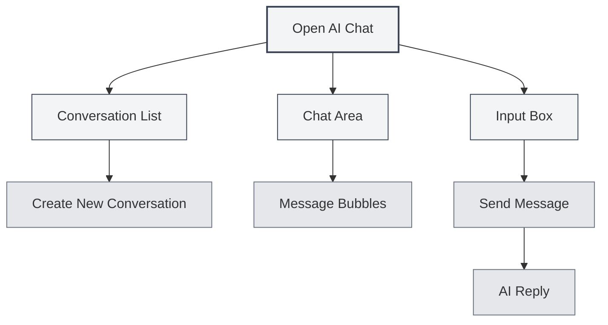
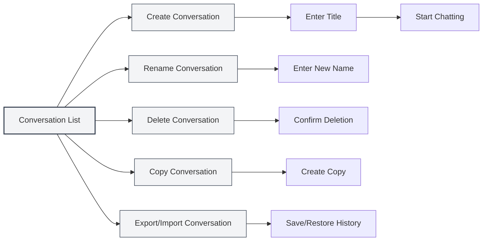
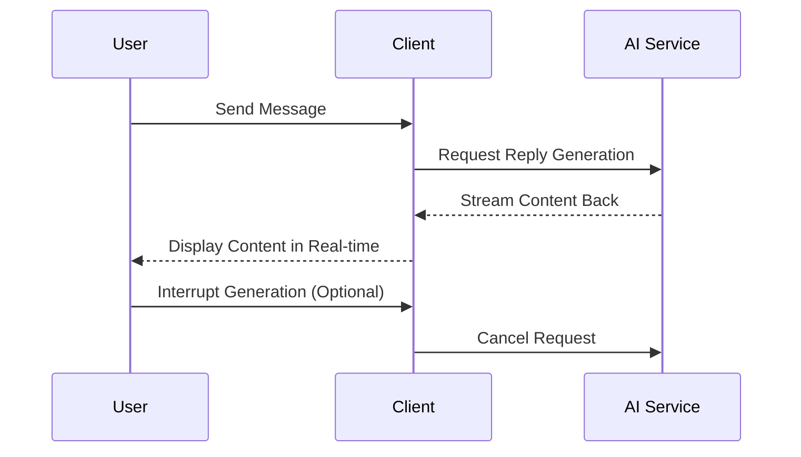
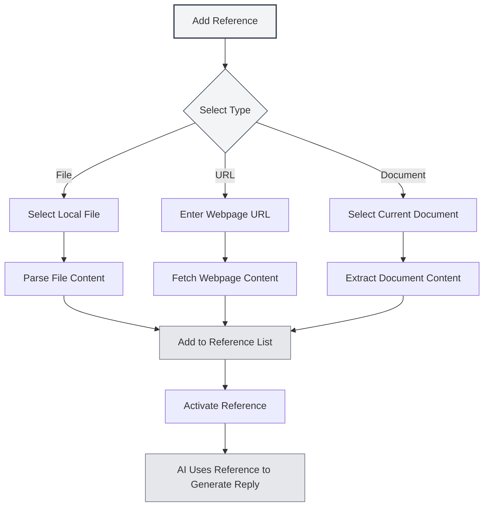

# AI Chat

## Overview

The AI Chat feature provides an intelligent conversational assistant that can help you answer questions, generate content, analyze documents, and more. Through AI Chat, you can interact with the AI using natural language to receive intelligent help and suggestions.

AI Chat supports multi-conversation management, reference materials, knowledge base integration, and other functions, enabling you to efficiently use AI assistance to complete various tasks.

## Opening AI Chat

### Opening Methods

There are several ways to open AI Chat:

- **Menu Bar**: Click the "AI" menu and select "AI Chat"
- **Keyboard Shortcut**: Use a keyboard shortcut to open quickly (if configured)
- **Sidebar**: Open the AI Chat panel from the sidebar

You can access the AI Chat feature via the AI Assistant menu in the top menu bar:

<MenuItemsDemo mode="demo" :items='[{"id": "ai-assistant", "items": ["ai-chat"]}]' />

### Interface Introduction

The AI Chat interface consists of the following parts:

<AIChat mode="demo" />

- **Conversation List**: Displays all conversation lists on the left
- **Chat Area**: Displays chat messages in the middle
- **Input Box**: Input messages at the bottom
- **Reference Management**: Manage reference materials

## Conversation Management

AI Chat supports multi-conversation management. You can create, rename, delete, and copy conversations.

<AIChat mode="demo" />

### Creating a Conversation

Create a new AI Chat conversation:

1. **Click New**: Click the "New Conversation" button above the conversation list
2. **Enter Title**: Optionally enter a conversation title (the first message is used by default)
3. **Start Chatting**: Enter the first message to start the conversation

### Conversation Operations

### Renaming a Conversation

Rename an existing conversation:

1. **Right-click Menu**: Right-click on the conversation and select "Rename"
2. **Enter New Name**: Enter the new conversation name
3. **Confirm Save**: Save the new name after confirmation

### Deleting a Conversation

Delete unwanted conversations:

1. **Right-click Menu**: Right-click on the conversation and select "Delete"
2. **Confirm Deletion**: Delete the conversation after confirmation

Deleting a conversation will also delete all message history for that conversation.

### Copying a Conversation

Copy an existing conversation:

1. **Right-click Menu**: Right-click on the conversation and select "Copy"
2. **Create Copy**: The system will create a new copy of the conversation

Copying a conversation duplicates all message history, making it easy for you to continue discussions based on existing conversations.

### Exporting/Importing Conversations

Export and import conversations:

- **Export Conversation**: Right-click on the conversation, select "Export", and save as a JSON file
- **Import Conversation**: Import a conversation from a file to restore message history

The export/import feature allows you to easily back up and share conversation content.

<MenuItemsDemo mode="demo" :items='[{"id": "file", "items": ["save", "open"]}]' />

## Sending Messages

AI Chat provides rich message-sending functionality.

<AIChat mode="demo" />

### Inputting Messages

Enter messages in the input box:

1. **Enter Text**: Type your question or request in the input box
2. **Formatting**: Supports Markdown formatting for text styling
3. **Send Message**: Click the send button or press `Enter` to send

### Message Types

The following message types are supported:

- **Text Messages**: Plain text messages
- **Markdown Messages**: Messages supporting Markdown formatting
- **Code Messages**: Messages containing code

### Keyboard Shortcuts

Shortcuts for sending messages:

- **Enter**: Send message
- **Shift+Enter**: New line (do not send)
- **Ctrl+Enter**: Send message (under certain configurations)

## AI Replies

The AI reply feature provides streaming output and message operation capabilities.

<AIChat mode="demo" />

<AIChat mode="demo" />

### Streaming Output

AI replies use streaming output:

- **Real-time Display**: AI-generated content is displayed in real-time
- **Incremental Generation**: Content is generated incrementally; no need to wait for completion
- **Interruptible**: AI generation can be interrupted at any time

### Message Operations

The following operations can be performed on AI replies:

- **Copy**: Copy AI reply content
- **Regenerate**: Regenerate the AI reply
- **Edit**: Edit the AI reply (if supported)
- **Delete**: Delete the AI reply

### Message Editing

Edit user messages:

1. **Click Edit**: Click the edit button next to the message
2. **Modify Content**: Modify the message content
3. **Resend**: Resend the modified message

Editing a message will delete all messages after it and restart the conversation from that point.

## Reference Materials

You can add reference materials to AI Chat to help the AI better understand the context.

<AIChat mode="demo" />

### Adding References

Add reference materials to a conversation:

1. **Open Reference Management**: Click the reference tab above the chat area
2. **Add Reference**: Click the "Add Reference" button
3. **Select Type**: Choose the reference type (file, URL, etc.)
4. **Select Content**: Select the content to reference

### Reference Types

The following reference types are supported:

- **File Reference**: Reference local files
- **URL Reference**: Reference webpage URLs
- **Document Reference**: Reference currently open documents

### Activating References

Activate and deactivate references:

- **Activate Reference**: Click the reference tab to activate it
- **Deactivate Reference**: Click again to deactivate it
- **Active Status**: Activated references are used when the AI generates replies

After activating a reference, the AI will consider the referenced content when generating replies.

### Reference Preview

Preview reference content:

- **Click to Preview**: Click the reference tab to view its content
- **View Details**: View detailed content of the reference
- **Edit Reference**: Edit or delete the reference

## Knowledge Base Integration

AI Chat can integrate with a knowledge base to automatically retrieve relevant knowledge.

<KnowledgeBase mode="demo" />

<AIChat mode="demo" />

### Enabling Knowledge Base

Enable knowledge base queries:

1. **Open Settings**: Find the knowledge base toggle below the input box
2. **Enable Query**: Toggle the switch to enable knowledge base queries
3. **Automatic Retrieval**: The AI will automatically retrieve from the knowledge base when replying

### Knowledge Base Retrieval

Knowledge base retrieval features:

- **Automatic Retrieval**: Automatically retrieves relevant knowledge when sending messages
- **Context Understanding**: Retrieves related content based on conversation context
- **Result Integration**: Integrates retrieval results into AI replies

### Retrieval Settings

Knowledge base retrieval settings:

- **Confidence Threshold**: Set the confidence threshold for retrieval
- **Retrieval Count**: Set the number of retrieval results
- **Retrieval Scope**: Set the scope for retrieval

For details, see [[knowledge-base.config|Knowledge Base Configuration]].

## Message Management

Manage messages within AI Chat.

<AIChat mode="demo" />

### Message Operations

The following operations can be performed on messages:

- **Copy Message**: Copy message content
- **Edit Message**: Edit user messages
- **Delete Message**: Delete messages
- **Regenerate**: Regenerate AI replies

### Message History

Message history management:

- **Auto-save**: Message history is automatically saved
- **Conversation Isolation**: Each conversation's message history is independent
- **History Restoration**: History is restored when reopening a conversation

### Message Formats

Messages support the following formats:

<AIChat mode="demo" />

- **Markdown**: Supports Markdown formatting
- **Code Blocks**: Supports code block highlighting
- **Mathematical Formulas**: Supports LaTeX mathematical formulas
- **Tables**: Supports table display

## Usage Tips

Use the following tips to utilize the AI Chat feature more efficiently.

<AIChat mode="demo" />

### Efficient Chatting

1. **Ask Clear Questions**: Pose clear questions to get better replies
2. **Provide Context**: Provide sufficient contextual information
3. **Use References**: Use reference materials to provide more information

### Conversation Organization

1. **Categorize Management**: Create separate conversations for different topics
2. **Naming Conventions**: Use clear conversation names
3. **Regular Cleanup**: Periodically delete unnecessary conversations

### Knowledge Base Usage

1. **Add Relevant Documents**: Add relevant documents to the knowledge base
2. **Enable Queries**: Enable knowledge base queries for better replies
3. **Adjust Settings**: Adjust retrieval settings according to your needs

## Frequently Asked Questions

<AIChat mode="demo" />

<MenuItemsDemo mode="demo" :items='[{"id": "ai-assistant"}]' />

### Q: AI replies are inaccurate?

A: AI replies are based on training data and may be inaccurate. You can provide more contextual information or use reference materials to improve accuracy.

### Q: How to interrupt AI generation?

A: Click the "Cancel" button to interrupt AI generation. Already generated content will not be lost.

### Q: Message history is lost?

A: Message history is automatically saved. If lost, check if you deleted the conversation or cleared data.

### Q: How to improve reply quality?

A: Providing clear context, using reference materials, and enabling knowledge base queries can all improve reply quality.

### Q: Which LLMs are supported?

A: Supports various LLMs, including OpenAI, Ollama, DeepSeek, etc. For details, see [[ai.llm-config|LLM Configuration]].

## Related Documentation

- [[ai.proofread|AI Proofreading]]
- [[ai.completion|AI Auto-completion]]
- [[knowledge-base.config|Knowledge Base Configuration]]
- [[ai.llm-config|LLM Configuration]]
