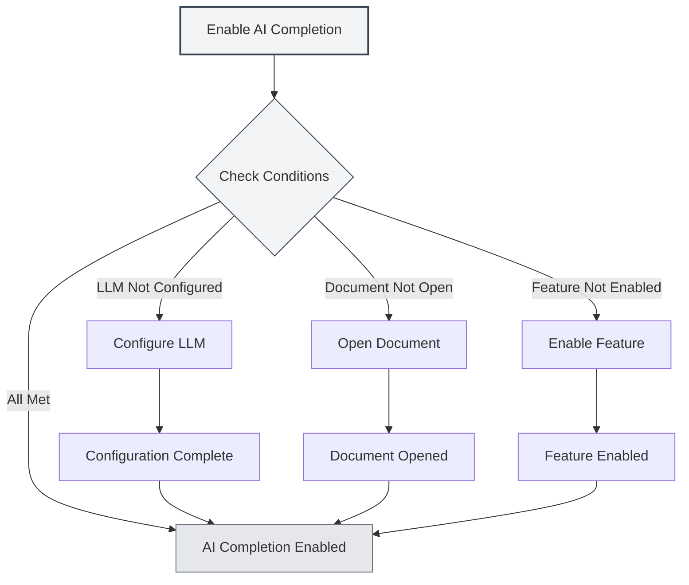
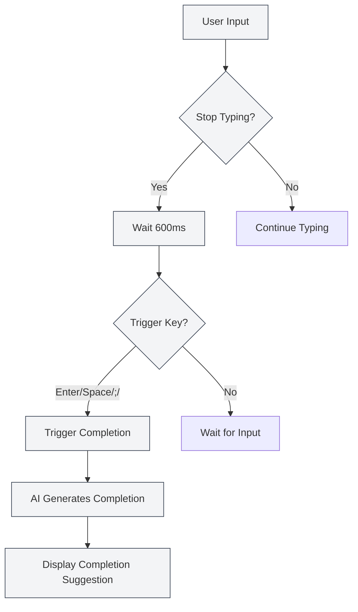
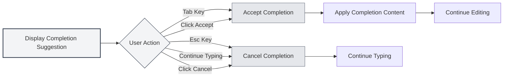

# AI Auto-Completion

## Overview

The AI auto-completion feature uses AI technology to automatically complete the content you are typing. When you stop typing, the AI generates completion suggestions based on the context to help you quickly finish document writing.

AI auto-completion supports multiple document formats (Markdown, LaTeX, plain text) and can intelligently understand the context to generate completion suggestions that match the document's style and content.

## Enabling AI Completion

### Enabling Methods

There are several ways to enable AI auto-completion:

- **Right-click Menu**: Right-click in the editor and select "Enable AI Auto-Completion"
- **Settings Page**: Enable the AI auto-completion function in the settings
- **Keyboard Shortcut**: Use a keyboard shortcut to toggle quickly (if configured)

You can access the settings via the top menu bar:

<MenuItemsDemo mode="demo" :items='[{"id": "settings"}]' />

<CompletionSettingsPanel mode="demo" />

### Enabling Conditions

The following conditions must be met to enable AI auto-completion:

- **LLM Configured**: An LLM service needs to be configured
- **Document Open**: A document must be open in the editor
- **Feature Enabled**: The AI completion feature must be enabled in the settings

For details, see [[ai.llm-config|LLM Configuration]].

<CompletionSettingsPanel mode="demo" />

## Auto-Trigger

<AISuggestionGhost mode="demo" />

### Trigger Conditions

AI auto-completion automatically triggers under the following circumstances:

- **Stop Typing**: Automatically triggers 600ms after you stop typing
- **Trigger Keys**: Triggers after typing specific keys (Enter, Space, `;`, `,`, etc.)

### Trigger Delay

Trigger delay settings:

- **Default Delay**: 600ms (0.6 seconds)
- **Configurable**: The delay time can be adjusted in the settings
- **Balance Consideration**: Too short a delay triggers too frequently; too long a delay affects the experience

<CompletionSettingsPanel mode="demo" />

### Trigger Keys

Supported trigger keys:

- **Enter**: Enter key triggers
- **Space**: Space key triggers
- **;**: Semicolon triggers
- **,**: Comma triggers

Trigger keys can be configured in the settings, supporting enabling multiple keys simultaneously.

## Manual Trigger

<AISuggestionGhost mode="demo" />

### Trigger Methods

Methods to manually trigger completion:

- **Keyboard Shortcut**: Press `Shift+Tab` to manually trigger completion
- **Right-click Menu**: Right-click and select "Manually Trigger Completion"

Manual triggering immediately initiates completion, bypassing the auto-trigger delay.

<CompletionSettingsPanel mode="demo" />

### Usage Scenarios

Scenarios suitable for manual triggering:

- **Immediate Completion Needed**: Need to get completion suggestions immediately
- **Auto-Trigger Failed**: Auto-trigger did not activate
- **Specific Location**: Need completion at a specific location

## Completion Content

<AISuggestionGhost mode="demo" />

### Context Understanding

AI completion understands the following context:

- **Current Paragraph**: Understands the content of the current paragraph
- **Document Structure**: Understands the overall structure of the document
- **Document Style**: Understands the writing style of the document
- **Document Theme**: Understands the theme and content of the document

### Completion Modes

AI completion supports two modes:

- **Full Generation**: Generates complete completion content
- **Partial Generation**: Only generates partial content (based on settings)

The completion mode can be configured in the settings.

<CompletionSettingsPanel mode="demo" />

### Completion Length

Completion content length control:

- **Maximum Tokens**: Can set the maximum number of tokens for completion
- **Default Value**: 50 Tokens
- **Range**: 20 Tokens to unlimited (0 means unlimited)

A higher token count results in more completion content, but generation time will also be longer.

<CompletionSettingsPanel mode="demo" />

## Accepting Completion

<AISuggestionGhost mode="demo" />

### Acceptance Methods

Methods to accept completion suggestions:

- **Tab Key**: Press the `Tab` key to accept the completion suggestion
- **Click Accept**: Click the "Accept" button on the completion suggestion

### Canceling Completion

Methods to cancel completion suggestions:

- **Esc Key**: Press the `Esc` key to cancel the completion suggestion
- **Continue Typing**: Continuing to type automatically cancels completion
- **Click Cancel**: Click the "Cancel" button on the completion suggestion

### Editing Completion

You can continue editing after accepting a completion:

- **Direct Editing**: Can directly edit the completion content after accepting
- **Partial Acceptance**: Can accept only part of the completion content
- **Modify Completion**: Can modify the completion content before using it

## Knowledge Base Integration

### Enabling Knowledge Base

To enable knowledge base integration:

1. **Open Settings**: Enable knowledge base integration in the settings
2. **Configure Knowledge Base**: Configure knowledge base related settings
3. **Automatic Retrieval**: Automatically retrieves from the knowledge base during completion

For details, see [[knowledge-base.config|Knowledge Base Configuration]].

### Context Retrieval

Knowledge base retrieval features:

- **Automatic Retrieval**: Automatically retrieves relevant knowledge during completion
- **Semantic Matching**: Matches related content based on semantic similarity
- **Result Integration**: Integrates retrieval results into completion suggestions

### Retrieval Settings

Knowledge base retrieval settings:

- **Confidence Threshold**: Set the confidence threshold for retrieval
- **Retrieval Count**: Set the number of retrieval results
- **Retrieval Scope**: Set the scope for retrieval

## Completion Settings

### Basic Settings

Basic AI completion settings:

- **Enable/Disable**: Enable or disable the AI completion function
- **Trigger Delay**: Set the delay time for auto-trigger
- **Trigger Keys**: Configure trigger keys
- **Maximum Tokens**: Set the maximum number of tokens for completion

<CompletionSettingsPanel mode="demo" />

### Advanced Settings

Advanced AI completion settings:

- **Completion Mode**: Choose the completion mode (Full Generation/Partial Generation)
- **Context Length**: Set the context length used for completion
- **Temperature Setting**: Set the temperature parameter for AI generation
- **Knowledge Base Integration**: Configure knowledge base integration options

<CompletionSettingsPanel mode="demo" />

### Format Settings

Completion settings for different formats:

- **Markdown**: Completion settings for Markdown format
- **LaTeX**: Completion settings for LaTeX format
- **Plain Text**: Completion settings for plain text format

Different formats may have different completion strategies and settings.

## Usage Tips

### Improving Completion Quality

1. **Provide Context**: Provide sufficient contextual information in the document
2. **Enable Knowledge Base**: Enabling knowledge base integration can improve completion quality
3. **Adjust Settings**: Adjust completion settings according to your needs

### Efficient Usage

1. **Use Appropriately**: Do not over-rely on AI completion
2. **Check Content**: Check if the content is correct after accepting a completion
3. **Manual Adjustment**: Manually adjust completion content when necessary

### Avoiding Issues

1. **Avoid Frequent Triggers**: Avoid frequent triggering of completion, which can affect the typing experience
2. **Check Accuracy**: Check the accuracy of the completion content
3. **Cancel Promptly**: Cancel unwanted completions promptly

## Frequently Asked Questions

### Q: Completion is inaccurate?

A: AI completion is based on context and training data, so it may be inaccurate. You can provide more contextual information or enable knowledge base integration to improve accuracy.

### Q: Completion is slow?

A: Completion speed depends on the AI service response time. You can adjust completion settings or use a faster LLM service.

### Q: How to turn off auto-completion?

A: Disable the AI auto-completion function in the settings, or use the right-click menu to turn it off.

### Q: Can I customize trigger keys?

A: Yes. Configure trigger keys in the settings, supporting enabling multiple keys simultaneously.

### Q: Completion content is too long?

A: You can adjust the maximum token count for completion in the settings to limit the length of the completion content.

## Related Documents

- [[ai.chat|AI Chat]]
- [[ai.proofread|AI Proofreading]]
- [[knowledge-base.config|Knowledge Base Configuration]]
- [[ai.llm-config|LLM Configuration]]