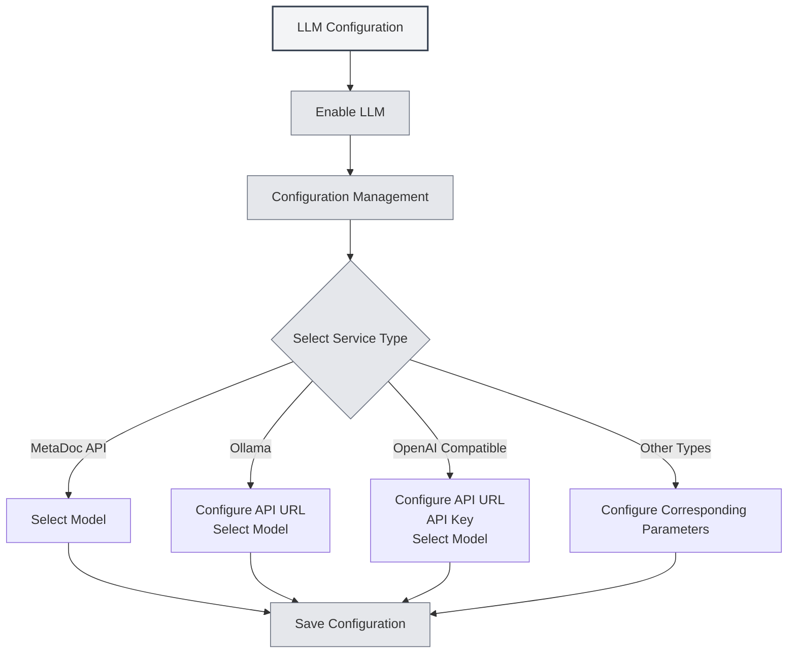

# LLM Configuration Guide

## Overview

LLM (Large Language Model) is the common foundation for AI conversation, proofreading, completion, assistant, and Agent functionalities within MetaDoc. This document explains why LLM configuration is needed, which features it affects, and how to access the specific configuration interface.

**Distribution channel**: If you use MetaDoc via **Steam**, read the **Steam / MetaDoc Cloud** section in **[[settings.llm|LLM Configuration]]** first (top-up, balance, switching models). Only if you need **your own third-party API**, enable **experimental connectivity** under **Experimental options**, then continue below and see **[[settings.llm-types|LLM provider types]]**.

<Demo component="SettingLlmSection" mode="demo" />

## Why Configure LLM

- **API Calls**: Features like conversation, completion, and proofreading will request the LLM interface you select, requiring correct configuration of the address and key.
- **Model Differences**: Different models vary significantly in quality, speed, and cost. Choosing the appropriate model for the scenario can improve the experience and control costs.
- **Unified Entry Point**: Centrally manage settings like enabled status, temperature, and reasoning tags in [[settings.llm|LLM Configuration]]. One-time configuration affects all AI features.

## Which Features Are Affected by Configuration

After configuring and enabling LLM, the following capabilities will be affected:

| Feature         | Description                                                                          |
| --------------- | ------------------------------------------------------------------------------------ |
| **AI Chat**     | [[ai.chat            | AI Chat Feature]]: Multi-turn conversations with AI, context-based answers |
| **AI Proofread**| [[ai.proofread       | AI Proofreading Feature]]: Grammar and spelling checks, revision suggestions         |
| **AI Completion**| [[ai.completion      | AI Auto-completion]]: Intelligent continuation and completion while writing          |
| **AI Assistant** | [[ai.assistants      | AI Assistant Feature]]: Formula recognition, drawing assistant, data analysis, etc.  |
| **Agent**       | [[agent.introduction | Agent Framework]]: Conversation, tool calling, workflow execution                     |

When LLM is disabled or no available service is configured, the above features will be unavailable or will prompt you to complete the configuration first.

## How to Configure LLM

### Access the Configuration Page

1. Open **Settings** → **LLM Configuration** (or the equivalent in-app entry point).
2. On the **[[settings.llm|LLM Configuration]]** page, you can:
   - Enable/Disable LLM
   - Set global options like temperature and whether to automatically remove reasoning tags
   - Manage multiple LLM configurations (create, edit, delete, reorder)

You can access LLM settings via the top menu bar:

<MenuItemsDemo mode="demo" :items='[{"id": "settings"}]' />

<MenuItemsDemo mode="demo" :items='[{"id": "ai"}]' />

### Configure a Specific Service

In **LLM Configuration Management**, select or create a new configuration, and fill in the details according to the service type:

- **MetaDoc API / Ollama / OpenAI Compatible / OpenAI Official / DeepSeek / Gemini**, etc.  
  For detailed fields and steps, refer to [[settings.llm-types|LLM Type Configuration]] (API address, API Key, model name, max tokens, etc.).

### Usage Recommendations

- **First-time Use**: First complete one usable LLM configuration and save it, then turn on **Enable LLM**.
- **Multiple Configurations**: You can create multiple configurations for different scenarios (e.g., "Daily Chat", "Proofreading Only") and select which one to use in the corresponding feature or Agent configuration.
- **Cost and Privacy**: Using cloud APIs incurs costs and may upload content. For local and private needs, prioritize local deployment methods like Ollama (see [[settings.llm-types|LLM Type Configuration]]).

## Related Documentation

- [[settings.llm|LLM Configuration]]
- [[settings.llm-types|LLM Type Configuration]]
- [[settings.llm-management|LLM Configuration Management]]
- [[ai.chat|AI Chat Feature]]
- [[agent.introduction|Agent Framework Overview]]

<AIChat mode="demo" />
