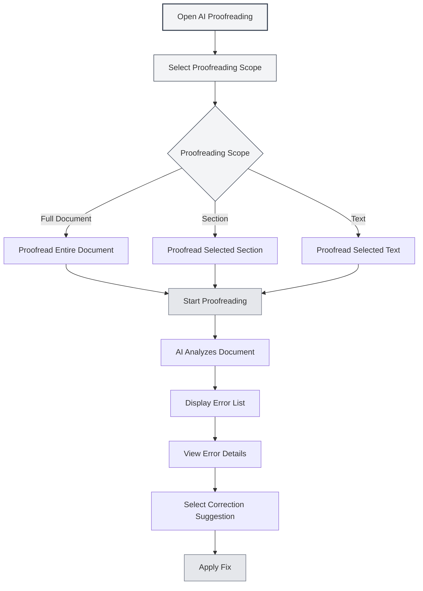
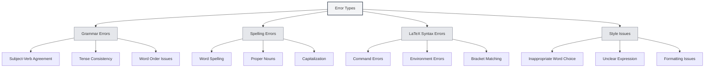
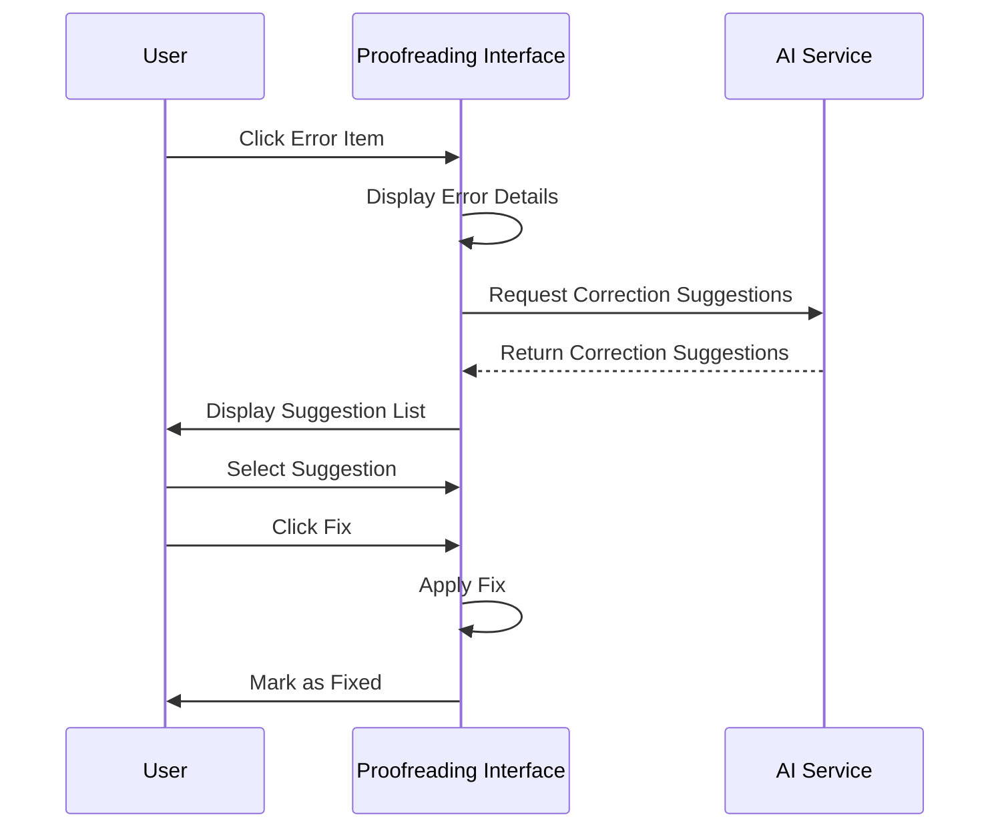

# AI Proofreading

## Overview

The AI Proofreading feature uses AI technology to automatically check documents for grammatical errors, spelling mistakes, LaTeX syntax errors, and other issues, providing correction suggestions. With AI Proofreading, you can quickly identify and fix errors in your documents, improving their quality.

AI Proofreading supports multiple document formats (Markdown, LaTeX, plain text), can proofread the entire document or specific sections, and provides detailed error information and correction suggestions.

## Opening AI Proofreading

### Opening Methods

There are several ways to open AI Proofreading:

- **Menu Bar**: Click the "AI" menu and select "AI Proofreading"
- **Keyboard Shortcut**: Use a keyboard shortcut to open quickly (if configured)
- **Sidebar**: Open the AI Proofreading panel from the sidebar

You can access the AI Proofreading feature via the AI Assistant menu in the top menu bar:

<MenuItemsDemo mode="demo" :items='[{"id": "ai-assistant", "items": ["proofread"]}]' />

### Interface Introduction

The AI Proofreading interface consists of the following parts:

- **Error List**: Displays all errors on the left side
- **Document Preview**: Shows the document content on the right side
- **Error Statistics**: Displays error statistics at the top
- **Action Buttons**: Provides action buttons at the top

<ProofreadView mode="demo" />

<ProofreadDisplay mode="demo" />

## Proofreading Scope

### Proofreading Full Document

Proofread the entire document:

1. **Open Proofreading**: Open the AI Proofreading panel
2. **Click Start**: Click the "Start Proofreading" button
3. **Wait for Completion**: Wait for the AI to finish proofreading

Proofreading the full document automatically checks all content within the document.

<ProofreadView mode="demo" />

<ProofreadDisplay mode="demo" />

### Proofreading Specific Sections

Proofread specific sections of a document:

1. **Select Section**: Select the section to proofread in the Outline view
2. **Open Proofreading**: Open the AI Proofreading panel
3. **Specify Section**: Specify the section path in the proofreading settings
4. **Start Proofreading**: Click the "Start Proofreading" button

Proofreading a specific section only checks the content of the selected section and its subsections.

<ProofreadView mode="demo" />

<ProofreadDisplay mode="demo" />

### Proofreading Specified Text

Proofread specified text content:

1. **Select Text**: Select the text to proofread in the editor
2. **Open Proofreading**: Open the AI Proofreading panel
3. **Paste Text**: Paste the text into the proofreading input box
4. **Start Proofreading**: Click the "Start Proofreading" button

<ProofreadDisplay mode="demo" />

## Error Types

AI Proofreading can detect the following types of errors:

### Grammar Errors

Check for grammar errors in the document:

<ProofreadDisplay mode="demo" />

- **Subject-Verb Agreement**: Check for subject-verb agreement issues
- **Tense Consistency**: Check for tense consistency issues
- **Word Order Issues**: Check for word order issues
- **Other Grammar**: Check for other grammar problems

### Spelling Errors

Check for spelling errors in the document:

- **Word Spelling**: Check for word spelling errors
- **Proper Nouns**: Check proper noun spelling
- **Capitalization**: Check for capitalization issues

### LaTeX Syntax Errors

Check for syntax errors in LaTeX documents:

- **Command Errors**: Check for LaTeX command errors
- **Environment Errors**: Check for LaTeX environment errors
- **Bracket Matching**: Check for bracket matching issues
- **Other Syntax**: Check for other LaTeX syntax problems

### Style Issues

Check for style issues in the document:

- **Inappropriate Word Choice**: Check if word choice is appropriate
- **Unclear Expression**: Check if expression is clear
- **Formatting Issues**: Check for formatting problems

## Error Information

### Error Display

Error information includes the following:

<ProofreadDisplay mode="demo" />

- **Error Type**: Displays the error type (grammar, spelling, LaTeX, etc.)
- **Error Location**: Shows the line number and column number of the error
- **Error Text**: Displays the erroneous text content
- **Correction Suggestion**: Shows correction suggestions
- **Severity Level**: Indicates the severity of the error

### Severity Levels

Errors are categorized by severity:

- **Error**: Errors that must be fixed
- **Warning**: Issues recommended for fixing
- **Info**: Information for reference only

### Error Navigation

Quickly navigate to error locations:

1. **Click Error**: Click on an error item in the error list
2. **Auto-Navigate**: The editor automatically scrolls to the error location
3. **Highlight**: The error location is highlighted

## Correction Suggestions

### Viewing Suggestions

View correction suggestions provided by the AI:

<ProofreadDisplay mode="demo" />

- **Single Suggestion**: If there's only one suggestion, it's displayed directly
- **Multiple Suggestions**: If there are multiple suggestions, they're displayed as tags
- **Select Suggestion**: Click a suggestion tag to select it

### Applying Fixes

Apply correction suggestions:

<ProofreadDisplay mode="demo" />

1. **Select Suggestion**: Click a suggestion tag to select it
2. **Click Fix**: Click the "Fix" button
3. **Confirm Fix**: Apply the fix after confirmation

After fixing, the error is marked as "Fixed".

### One-Click Fix All

Fix all errors with one click:

1. **Click Fix All**: Click the "One-Click Fix All" button
2. **Confirm Fix**: Confirm to fix all errors

One-click fix uses the first suggestion to fix all errors.

## Error Management

### Ignoring Errors

Ignore errors that don't need fixing:

1. **Select Error**: Select the error to ignore
2. **Click Ignore**: Click the "Ignore" button
3. **Confirm Ignore**: Confirm to ignore the error

Ignored errors are removed from the error list.

### Adding to Dictionary

Add words to the dictionary:

1. **Select Error**: Select a spelling error
2. **Add to Dictionary**: Click the "Add to Dictionary" button
3. **Confirm Addition**: Confirm to add to the dictionary

After adding to the dictionary, the word will no longer be flagged as a spelling error.

### Clearing Fixed Errors

Clear fixed errors:

1. **Click Clear**: Click the "Clear Fixed" button
2. **Confirm Clear**: Confirm to clear fixed errors

Clearing fixed errors makes the error list clearer.

## Usage Tips

<ProofreadView mode="demo" />

### Efficient Proofreading

1. **Proofread Full Document First**: Start by proofreading the entire document to understand the overall situation
2. **Then Proofread Sections**: Perform detailed proofreading on problematic sections
3. **Batch Fixing**: Use one-click fix to quickly fix common errors

### Error Handling

1. **Prioritize Errors**: Handle severe errors first
2. **Check Suggestions**: Carefully review correction suggestions
3. **Manual Adjustment**: Manually adjust corrections when necessary

### Dictionary Management

1. **Add Technical Terms**: Add technical terms to the dictionary
2. **Regular Updates**: Regularly update dictionary content
3. **Export Dictionary**: Export the dictionary for backup

## Frequently Asked Questions

### Q: Proofreading results are inaccurate?

A: AI Proofreading is based on AI models and may be inaccurate. It is recommended to manually check proofreading results, especially for technical terms and special expressions.

### Q: How to proofread specific sections?

A: Specify the section path (e.g., "1.1") in the proofreading settings, or use the Outline view to select a section.

### Q: Can I ignore certain errors?

A: Yes. Click the "Ignore" button to ignore errors that don't need fixing.

### Q: How to add to the dictionary?

A: Select a spelling error and click the "Add to Dictionary" button to add the word to the dictionary.

### Q: Proofreading is slow?

A: Proofreading speed depends on document size and AI service response time. For large documents, it's recommended to proofread in segments.

## Related Documentation

- [[ai.chat|AI Chat]]
- [[ai.completion|AI Auto-Completion]]
- [[outline.basics|Outline View Features]]
