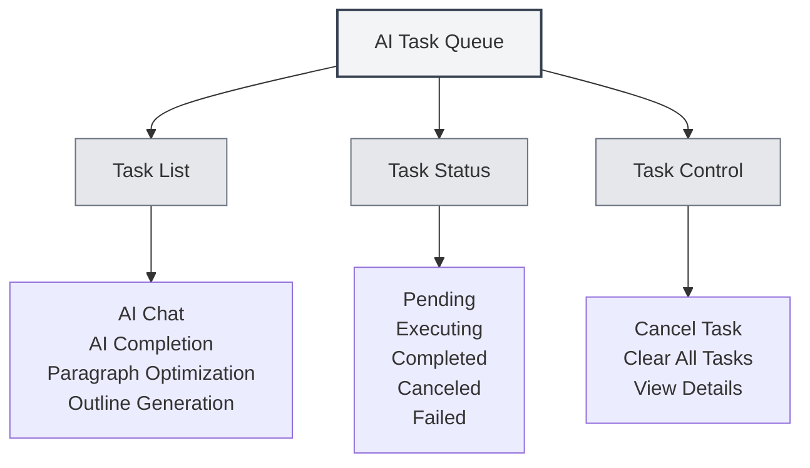

# AI Task Queue

## Overview

The AI Task Queue is used to manage and monitor all executing AI tasks. Through the task queue, you can view task statuses, cancel tasks, and check task progress to ensure the efficient operation of AI functionalities.

## Introduction to Task Queue

<AITaskQueue mode="demo" />

### What is a Task Queue

The AI Task Queue is a management interface that displays all AI tasks that are executing or waiting to be executed:

- **Task List**: Displays all tasks and their statuses.
- **Task Status**: Shows the execution status of tasks.
- **Task Progress**: Indicates the execution progress of tasks.
- **Task Control**: Allows tasks to be canceled or managed.

### Task Types

The task queue may contain the following types of tasks:

- **AI Chat**: AI conversation tasks.
- **AI Completion**: AI auto-completion tasks.
- **Paragraph Optimization**: Paragraph optimization tasks.
- **Outline Generation**: Outline generation tasks.
- **Other AI Tasks**: Other AI-related tasks.

## Opening the Task Queue

### Access Methods

You can open the task queue in the following ways:

- **Sidebar**: There may be a task queue entry in the sidebar.
- **Menu Options**: Some menus may have a task queue option.
- **Keyboard Shortcut**: In some cases, a keyboard shortcut may be available (may be supported in the future).

### Task Queue Panel

<AITaskQueue mode="demo" />

The task queue is typically displayed as a side panel:

- **Task List**: Displays all tasks.
- **Task Details**: Shows detailed information for the selected task.
- **Control Buttons**: Provides task control functions.

## Viewing Tasks

<AITaskQueue mode="demo" />

### Task List

The task list displays all tasks:

- **Task Name**: Shows the name of the task.
- **Task Status**: Shows the current status of the task.
- **Task Progress**: Shows the execution progress of the task.
- **Task Time**: Shows the creation time of the task.

### Task Status

A task may be in one of the following statuses:

- **Pending**: Task has been created and is waiting to execute.
- **Executing**: Task is currently executing.
- **Completed**: Task execution has finished.
- **Canceled**: Task has been canceled.
- **Failed**: Task execution has failed.

### Task Details

You can view detailed information about a task:

- **Task Name**: The name of the task.
- **Task Type**: The type of the task.
- **Task Parameters**: The parameters of the task.
- **Task Result**: The result of the task (if completed).
- **Error Information**: The error information for the task (if failed).

## Task Control

<AITaskQueue mode="demo" />

### Canceling a Task

You can cancel a task that is executing:

1. **Select Task**: Select the task to cancel in the task list.
2. **Click Cancel**: Click the "Cancel" button.
3. **Confirm Cancellation**: Confirm the cancel operation.
4. **Task Canceled**: The task will be canceled and removed.

<AITaskQueue mode="demo" />

### Clearing All Tasks

You can clear all tasks:

1. **Open Task Queue**: Open the task queue panel.
2. **Click Clear**: Click the "Clear" button.
3. **Confirm Clear**: Confirm the clear operation.
4. **Tasks Cleared**: All tasks will be canceled and removed.

### Task Priority

Some tasks may have priority:

- **High Priority**: Important tasks are executed first.
- **Normal Priority**: Normal tasks are executed in order.
- **Low Priority**: Low-priority tasks are executed last.

## Task Progress Display

<AITaskQueue mode="demo" />

### Progress Bar

Task progress is displayed via a progress bar:

- **Progress Percentage**: Shows the percentage of task completion.
- **Progress Bar**: Visually displays task progress.
- **Progress Updates**: Progress updates in real-time.

### Progress Information

You can view progress information for a task:

- **Current Step**: Shows the step currently being executed.
- **Completed Steps**: Shows the steps that have been completed.
- **Total Steps**: Shows the total number of steps.
- **Estimated Time**: Shows the estimated completion time.

<AITaskQueue mode="demo" />

## Task Delay

<AITaskQueue mode="demo" />

### Delayed Completion

You can delay AI completion tasks:

1. **Open Task Queue**: Open the task queue panel.
2. **Select Delay Time**: Select a delay time (in minutes).
3. **Apply Delay**: Apply the delay setting.
4. **Task Delayed**: The completion task will be executed after the delay.

### Delay Display

The delay time is displayed in the task queue:

- **Remaining Time**: Shows the remaining delay time.
- **Countdown**: Real-time countdown display.
- **Auto-execution**: Automatically executes after the delay time ends.

## Task History

<AITaskQueue mode="demo" />

### History Records

The task queue may save task history:

- **Completed Tasks**: Displays completed tasks.
- **Failed Tasks**: Displays failed tasks.
- **Canceled Tasks**: Displays canceled tasks.

### Viewing History

You can view task history:

- **History List**: Displays the list of historical tasks.
- **Task Details**: View detailed information for historical tasks.
- **Result Viewing**: View the results of tasks.

## Best Practices

<AITaskQueue mode="demo" />

1. **Regular Review**: Regularly check the task queue to understand task execution status.
2. **Timely Cancellation**: Cancel unnecessary tasks promptly to free up resources.
3. **Monitor Progress**: Pay attention to task progress to ensure tasks execute normally.
4. **Error Handling**: Handle failed tasks promptly to avoid impacting subsequent tasks.
5. **Resource Management**: Manage tasks reasonably to avoid resource waste.

## Notes

1. **Number of Tasks**: Too many tasks may affect performance.
2. **Task Cancellation**: Canceling a task may affect ongoing operations.
3. **Task Status**: Task status may change in real-time.
4. **Resource Usage**: Tasks consume system resources.
5. **Network Dependency**: Some tasks require a network connection.

## Related Documents

- [[ai.chat|AI Chat Feature]]
- [[ai.completion|AI Auto-completion]]
- [[features.paragraph-optimization|Paragraph Optimization Feature]]