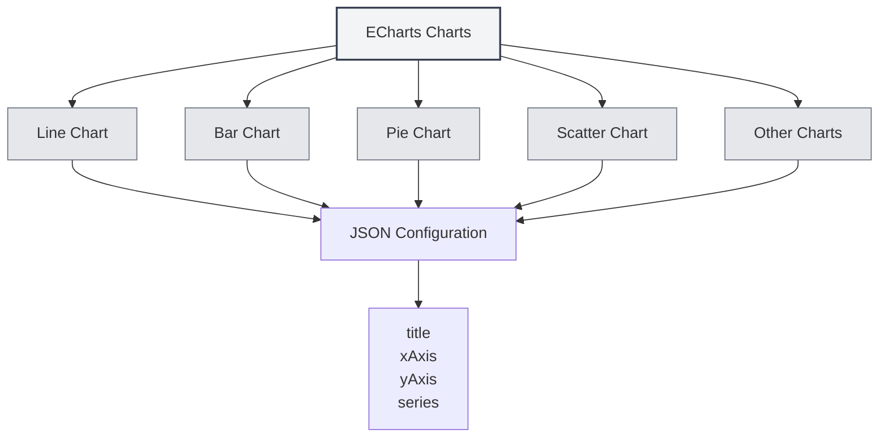

# ECharts Charts

## Overview

ECharts is a powerful data visualization chart library that supports multiple chart types. MetaDoc supports ECharts charts, allowing you to create various data visualizations within Markdown documents using ECharts configurations.

<DataAnalysisWindow mode="demo" />

## ECharts Syntax

<ChartGenerationDisplay mode="demo" />

### Basic Syntax

ECharts uses a JSON configuration format:

````markdown
```echarts
{
  "title": {
    "text": "Sample Chart"
  },
  "xAxis": {
    "type": "category",
    "data": ["A", "B", "C"]
  },
  "yAxis": {
    "type": "value"
  },
  "series": [{
    "data": [10, 20, 30],
    "type": "bar"
  }]
}
```
````

### Configuration Format

ECharts configurations must be valid JSON:

- **JSON Format**: Use standard JSON format.
- **English Punctuation**: Use English commas, colons, and quotation marks.
- **Complete Configuration**: Include all necessary configuration items.



## Supported Chart Types

<DataAnalysisDisplay mode="demo" />

### Line Chart

Create a line chart:

````markdown
```echarts
{
  "xAxis": {
    "type": "category",
    "data": ["Mon", "Tue", "Wed"]
  },
  "yAxis": {
    "type": "value"
  },
  "series": [{
    "data": [120, 200, 150],
    "type": "line"
  }]
}
```
````

### Bar Chart

<ChartGenerationDisplay mode="demo" />

Create a bar chart:

````markdown
```echarts
{
  "xAxis": {
    "type": "category",
    "data": ["A", "B", "C"]
  },
  "yAxis": {
    "type": "value"
  },
  "series": [{
    "data": [10, 20, 30],
    "type": "bar"
  }]
}
```
````

### Pie Chart

<DataAnalysisDisplay mode="demo" />

Create a pie chart:

````markdown
```echarts
{
  "series": [{
    "type": "pie",
    "data": [
      {"value": 335, "name": "Category A"},
      {"value": 310, "name": "Category B"},
      {"value": 234, "name": "Category C"}
    ]
  }]
}
```
````

### Scatter Chart

<ChartGenerationDisplay mode="demo" />

Create a scatter chart:

````markdown
```echarts
{
  "xAxis": {
    "type": "value"
  },
  "yAxis": {
    "type": "value"
  },
  "series": [{
    "type": "scatter",
    "data": [[10, 20], [15, 25], [20, 30]]
  }]
}
```
````

### Radar Chart

<OutlineTreeDisplay mode="demo" />

Create a radar chart:

````markdown
```echarts
{
  "radar": {
    "indicator": [
      {"name": "Indicator 1", "max": 100},
      {"name": "Indicator 2", "max": 100}
    ]
  },
  "series": [{
    "type": "radar",
    "data": [{
      "value": [80, 90]
    }]
  }]
}
```
````

### Heatmap

<DataAnalysisDisplay mode="demo" />

Create a heatmap:

````markdown
```echarts
{
  "xAxis": {
    "type": "category",
    "data": ["A", "B", "C"]
  },
  "yAxis": {
    "type": "category",
    "data": ["X", "Y", "Z"]
  },
  "series": [{
    "type": "heatmap",
    "data": [[0, 0, 10], [0, 1, 20], [1, 0, 30]]
  }]
}
```
````

## Chart Configuration

<OutlineTreeDisplay mode="demo" />

### Title Configuration

Set the chart title:

```json
{
  "title": {
    "text": "Chart Title",
    "subtext": "Subtitle"
  }
}
```

### Axis Configuration

Configure the axes:

```json
{
  "xAxis": {
    "type": "category",
    "data": ["A", "B", "C"]
  },
  "yAxis": {
    "type": "value"
  }
}
```

### Series Configuration

Configure data series:

```json
{
  "series": [
    {
      "name": "Series Name",
      "type": "bar",
      "data": [10, 20, 30]
    }
  ]
}
```

### Legend Configuration

Configure the legend:

```json
{
  "legend": {
    "data": ["Series 1", "Series 2"]
  }
}
```

### Tooltip Configuration

Configure the tooltip:

```json
{
  "tooltip": {
    "trigger": "axis"
  }
}
```

## Advanced Features

<ChartGenerationDisplay mode="demo" />

### Multi-Series Charts

Create multi-series charts:

````markdown
```echarts
{
  "xAxis": {
    "type": "category",
    "data": ["Mon", "Tue", "Wed"]
  },
  "yAxis": {
    "type": "value"
  },
  "series": [
    {
      "name": "Series 1",
      "type": "bar",
      "data": [10, 20, 30]
    },
    {
      "name": "Series 2",
      "type": "line",
      "data": [15, 25, 35]
    }
  ]
}
```
````

### Data Zoom

Add data zoom:

```json
{
  "dataZoom": [
    {
      "type": "slider",
      "start": 0,
      "end": 100
    }
  ]
}
```

### Visual Mapping

Add visual mapping:

```json
{
  "visualMap": {
    "min": 0,
    "max": 100,
    "inRange": {
      "color": ["#50a3ba", "#eac736", "#d94e5d"]
    }
  }
}
```

## Rendering Method

### Main Process Rendering

ECharts uses main process rendering:

- **Server-Side Rendering**: Charts are rendered in the main process.
- **SVG Format**: Rendered as SVG by default.
- **PNG Format**: Can be converted to PNG format.

### Rendering Performance

ECharts rendering characteristics:

- **Rendering Speed**: Main process rendering is relatively fast.
- **Resource Usage**: Consumes main process resources during rendering.
- **Error Handling**: Rendering errors are displayed in the console.

## Notes

### Syntax Notes

1. **JSON Format**: Must use valid JSON format.
2. **English Punctuation**: Use English commas, colons, and quotation marks.
3. **Complete Configuration**: Include all necessary configuration items.
4. **Correct Syntax**: Ensure JSON syntax is correct; otherwise, rendering will fail.

### Rendering Notes

1. **Configuration Validation**: Configuration format is validated before rendering.
2. **Syntax Errors**: Charts will not render if there are JSON syntax errors.
3. **Complex Charts**: Excessively complex charts may impact rendering performance.
4. **Export Compatibility**: Ensure charts display correctly in the target format when exporting.

## Best Practices

1. **Configuration Standards**: Follow the official ECharts configuration standards.
2. **JSON Format**: Ensure the JSON format is correct.
3. **Clear Code**: Keep configuration code clear and readable.
4. **Test Rendering**: Test chart rendering after editing.
5. **Reference Documentation**: Refer to the official ECharts documentation and examples.

## Related Documents

- [[charts.introduction|Chart Feature Introduction]]
- [[charts.mermaid|Mermaid Charts]]
- [[charts.plantuml|PlantUML Charts]]
