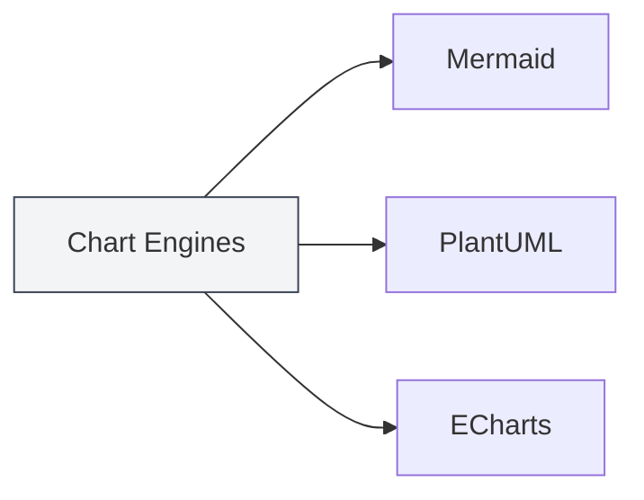
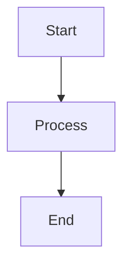

# Chart Feature Introduction

## Overview

MetaDoc supports multiple chart rendering engines, allowing you to insert and render various types of charts within Markdown documents. The chart feature enables you to create flowcharts, UML diagrams, data visualizations, and more, enriching your document content.

<GraphWindow mode="demo" />

## Supported Chart Engines

<ChartGenerationDisplay mode="demo" />

### Chart Types

MetaDoc supports the following chart engines:

- **Mermaid**: Flowcharts, UML diagrams, Gantt charts, etc.
- **PlantUML**: Professional UML modeling diagrams
- **ECharts**: Data visualization charts
- **Flowchart**: Basic flowcharts
- **Graphviz**: Graph visualizations
- **Mindmap**: Mind maps
- **Markmap**: Markdown mind maps
- **SMILES**: Chemical structure formulas
- **ABC**: Musical notation

### Engine Comparison

<DataAnalysisDisplay mode="demo" />

| Engine     | Use Case                                   | Rendering Method |
| ---------- | ------------------------------------------ | ---------------- |
| Mermaid    | Flowcharts, Sequence Diagrams, Class Diagrams, Gantt Charts | Browser Rendering |
| PlantUML   | Professional UML Modeling                  | Main Process Rendering |
| ECharts    | Data Visualization (Line Charts, Bar Charts, etc.) | Main Process Rendering |
| Flowchart  | Basic Flowcharts                           | Vditor Rendering |
| Graphviz   | Graph Visualization                        | Vditor Rendering |
| Mindmap    | Mind Maps                                  | Vditor Rendering |

### Engine Comparison Chart

<OutlineTreeDisplay mode="demo" />



## Inserting Charts

<DataAnalysisWindow mode="demo" />

### Code Block Syntax

Use code blocks in Markdown documents to insert charts:

````markdown

````

### Chart Type Identifiers

Different chart types use different code block identifiers:

- **Mermaid**: ` ```mermaid `
- **PlantUML**: ` ```plantuml `
- **ECharts**: ` ```echarts `
- **Flowchart**: ` ```flowchart `
- **Graphviz**: ` ```graphviz `
- **Mindmap**: ` ```mindmap `

## Chart Rendering

<ChartGenerationDisplay mode="demo" />

### Live Rendering

Charts are rendered live in the editor:

- **Automatic Rendering**: Charts render automatically after code is entered.
- **Live Preview**: Charts are displayed in real-time in the preview window.
- **Error Indication**: Syntax errors are indicated with error messages.

### Rendering Methods

Different charts use different rendering methods:

- **Browser Rendering**: Engines like Mermaid use browser APIs for rendering.
- **Main Process Rendering**: PlantUML and ECharts are rendered by the main process.
- **Vditor Rendering**: Flowchart and others are rendered by Vditor.

### Rendering Formats

Charts can be rendered in different formats:

- **SVG**: Vector graphics format (default).
- **PNG**: Raster graphics format (convertible).

## Chart Export

<OutlineTreeDisplay mode="demo" />

### Export Support

Charts can be exported to multiple formats:

- **PDF Export**: Charts are included in the PDF.
- **HTML Export**: Charts are included in the HTML.
- **Image Export**: Charts can be exported individually as images.

### Export Quality

Chart quality is maintained during export:

- **Vector Graphics**: SVG format maintains clarity.
- **Raster Graphics**: PNG format is suitable for printing.
- **Resolution**: Resolution is adjusted based on the export format.

## Chart Editing

<DataAnalysisDisplay mode="demo" />

### Code Editing

You can edit chart code directly:

- **Syntax Highlighting**: Code blocks support syntax highlighting.
- **Auto-completion**: Some editors support auto-completion.
- **Error Checking**: Syntax errors are checked in real-time.

### Preview Updates

The preview updates automatically after editing the code:

- **Live Updates**: The preview updates immediately after code modifications.
- **Error Display**: Error messages are displayed for syntax errors.
- **Rendering Status**: The chart's rendering status is shown.

## Multilingual Support

<DataAnalysisWindow mode="demo" />

### Multilingual Chart Code

Chart code supports multiple languages:

- **Chinese Support**: Chinese labels and text can be used.
- **English Support**: English labels and text can be used.
- **Mixed Usage**: Chinese and English can be mixed.

### Internationalization

The chart feature supports internationalization:

- **Interface Language**: Chart-related interfaces follow the system language.
- **Error Messages**: Error messages use the current language.
- **Help Documentation**: Help documentation supports multiple languages.

## Best Practices

1. **Choose the Appropriate Engine**: Select the suitable chart engine based on your needs.
2. **Follow Syntax Standards**: Adhere to the syntax specifications of each engine.
3. **Keep Code Clear**: Maintain clear and readable chart code.
4. **Test Rendering**: Test the chart rendering effect after editing.
5. **Test Export**: Test how the chart appears in the target format before exporting.

## Notes

1. **Correct Syntax**: Ensure chart code syntax is correct; otherwise, it will not render.
2. **Rendering Performance**: Complex charts may impact rendering performance.
3. **Export Compatibility**: Some chart formats may not be compatible with certain export formats.
4. **Code Security**: Be mindful of chart code security to avoid malicious code.
5. **Version Compatibility**: Different versions of chart engines may have syntax differences.

## Related Documentation

- [[charts.mermaid|Mermaid Charts]]
- [[charts.plantuml|PlantUML Charts]]
- [[charts.echarts|ECharts Charts]]
- [[markdown.features|Markdown Editor Features]]