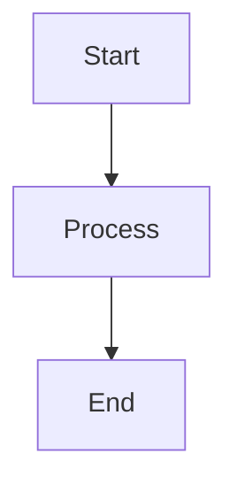
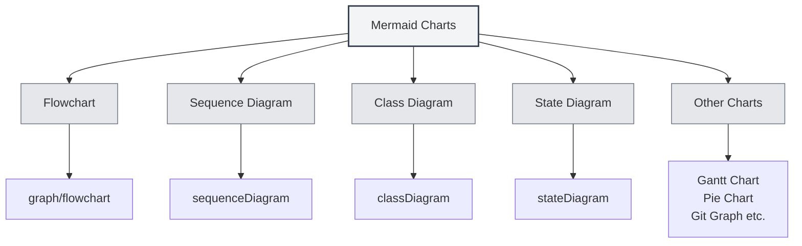
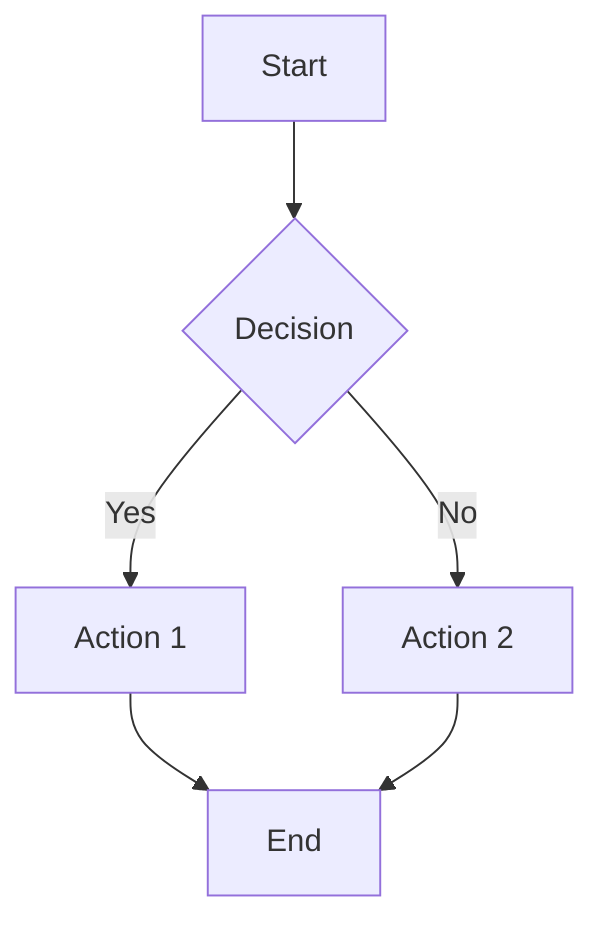
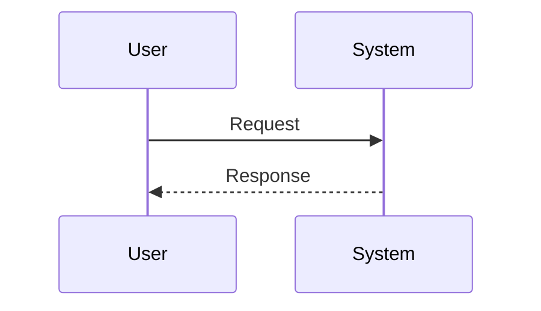
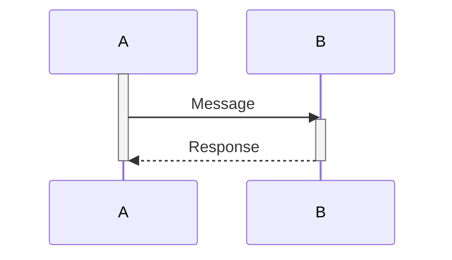
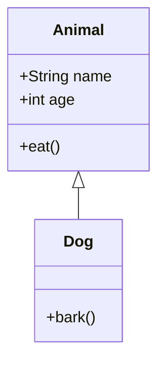
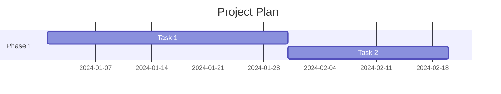
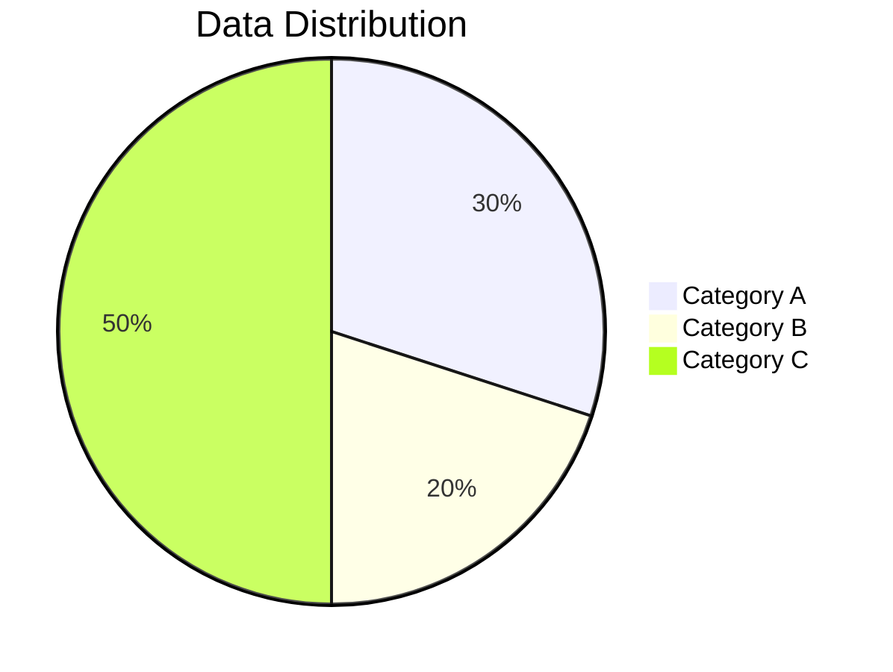
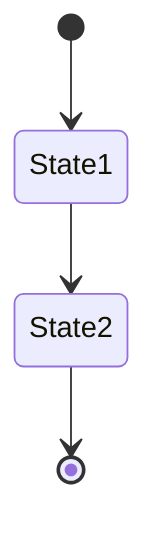
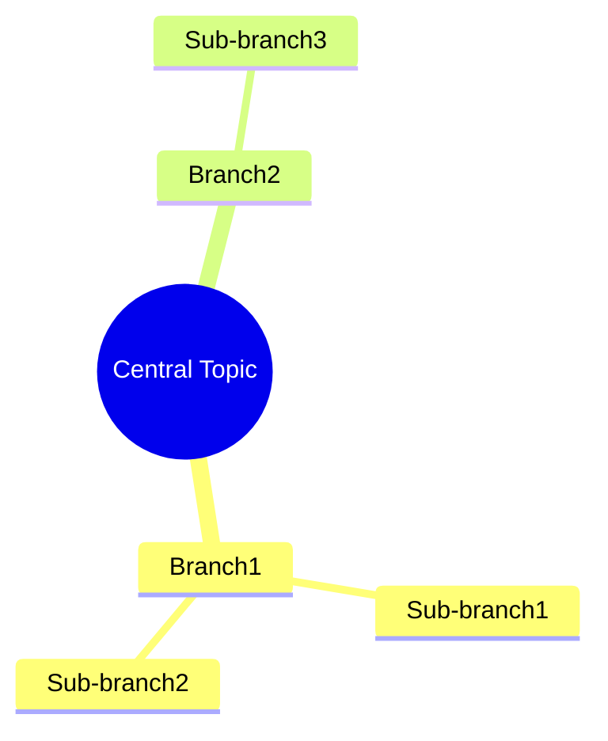

# Mermaid Charts

## Overview

Mermaid is a popular charting tool suitable for quickly creating flowcharts, sequence diagrams, class diagrams, Gantt charts, and more. MetaDoc supports Mermaid charts, allowing you to directly use Mermaid syntax within Markdown documents to create various diagrams.

<GraphWindow mode="demo" initialTool="mermaid" />

## Mermaid Syntax

<OutlineTreeDisplay mode="demo" />

### Basic Syntax

Mermaid uses simple text syntax to describe charts:

````markdown

````

### Chart Types

<ChartGenerationDisplay mode="demo" />

Mermaid supports various chart types:

- **Flowchart** (graph/flowchart)
- **Sequence Diagram** (sequenceDiagram)
- **Class Diagram** (classDiagram)
- **State Diagram** (stateDiagram)
- **Entity Relationship Diagram** (erDiagram)
- **Gantt Chart** (gantt)
- **Pie Chart** (pie)
- **Git Graph** (gitgraph)
- **User Journey Diagram** (journey)
- **Mind Map** (mindmap)
- **Timeline** (timeline)



## Flowchart

<OutlineTreeDisplay mode="demo" />

### Basic Flowchart

Create a basic flowchart:

````markdown

````

### Flowchart Direction

You can set the direction of the flowchart:

- **TD**: Top to Bottom (Top Down)
- **BT**: Bottom to Top (Bottom Top)
- **LR**: Left to Right (Left Right)
- **RL**: Right to Left (Right Left)

### Node Shapes

You can use different node shapes:

- **Rectangle**: `[Text]`
- **Rounded Rectangle**: `(Text)`
- **Diamond**: `{Text}`
- **Circle**: `((Text))`
- **Hexagon**: `{{Text}}`
- **Trapezoid**: `[/Text\]`
- **Inverted Trapezoid**: `[\Text/]`

## Sequence Diagram

<DataAnalysisDisplay mode="demo" />

### Basic Sequence Diagram

Create a sequence diagram:

````markdown

````

### Message Types

You can use different types of messages:

- **Solid Arrow**: `->>` Synchronous message
- **Dashed Arrow**: `-->>` Asynchronous message
- **Solid Line**: `->` Synchronous message (no return)
- **Dashed Line**: `-->` Asynchronous message (no return)

### Activation Boxes

You can add activation boxes to represent object activity:

````markdown

````

## Class Diagram

<ChartGenerationDisplay mode="demo" />

### Basic Class Diagram

Create a class diagram:

````markdown

````

### Class Relationships

You can represent different class relationships:

- **Inheritance**: `<|--` or `--|>`
- **Implementation**: `<|..` or `..|>`
- **Composition**: `*--` or `--*`
- **Aggregation**: `o--` or `--o`
- **Association**: `-->` or `<--`
- **Dependency**: `..>` or `<..`

### Class Members

You can define class members:

- **Attributes**: `+name: String` (public), `-name: String` (private)
- **Methods**: `+method()` (public), `-method()` (private)

## Gantt Chart

<OutlineTreeDisplay mode="demo" />

### Basic Gantt Chart

Create a Gantt chart:

````markdown

````

### Date Format

You can set the date format:

- **YYYY-MM-DD**: Year-Month-Day
- **MM/DD/YYYY**: Month/Day/Year
- **Other Formats**: Supports various date formats

### Task Relationships

You can set task relationships:

- **after**: After a specific task
- **Milestone**: Use `milestone` to mark milestones

## Pie Chart

<DataAnalysisDisplay mode="demo" />

### Basic Pie Chart

Create a pie chart:

````markdown

````

## State Diagram

<ChartGenerationDisplay mode="demo" />

### Basic State Diagram

Create a state diagram:

````markdown

````

## Mind Map

<OutlineTreeDisplay mode="demo" />

### Basic Mind Map

Create a mind map:

````markdown

````

## Notes

<DataAnalysisDisplay mode="demo" />

### Syntax Notes

1.  **String Wrapping**: It is recommended to wrap strings with `["..."]` to avoid escape errors.
2.  **Identifiers**: Avoid using identifiers with spaces or special characters in class diagrams.
3.  **Chinese Support**: Chinese can be used, but English identifiers are recommended.
4.  **Syntax Version**: Pay attention to the Mermaid syntax version, as there may be differences between versions.

### Rendering Notes

1.  **Syntax Errors**: Charts will not render if there are syntax errors.
2.  **Complex Charts**: Excessively complex charts may impact rendering performance.
3.  **Browser Compatibility**: Some browsers may not support certain Mermaid features.
4.  **Export Compatibility**: Ensure charts display correctly in the target format when exporting.

## Best Practices

1.  **Syntax Standards**: Follow the official Mermaid syntax specifications.
2.  **Clear Code**: Keep chart code clear and readable.
3.  **Test Rendering**: Test the chart rendering after editing.
4.  **Use Examples**: Refer to examples in the official Mermaid documentation.
5.  **Version Compatibility**: Pay attention to Mermaid version compatibility.

## Related Documentation

-   [[charts.introduction|Chart Feature Introduction]]
-   [[charts.plantuml|PlantUML Charts]]
-   [[charts.echarts|ECharts Charts]]