# PlantUML Diagrams

## Overview

PlantUML is a professional UML modeling tool that supports various UML diagram types. MetaDoc supports PlantUML diagrams, allowing you to create professional UML diagrams using PlantUML syntax within Markdown documents.

<GraphWindow mode="demo" initialTool="plantuml" />

## PlantUML Syntax

<OutlineTreeDisplay mode="demo" />

### Basic Syntax

PlantUML uses specific markup and syntax:

````markdown
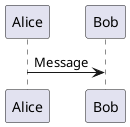
````

### Required Markup

<ChartGenerationDisplay mode="demo" />

PlantUML diagrams must include:

- **@startuml**: Diagram start marker
- **@enduml**: Diagram end marker

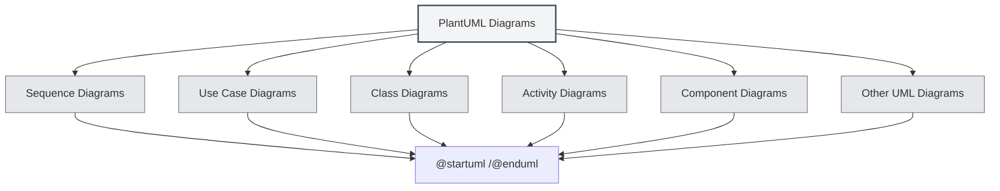

## Supported Diagram Types

<DataAnalysisDisplay mode="demo" />

### Sequence Diagrams

Create sequence diagrams:

````markdown
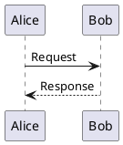
````

### Use Case Diagrams

<OutlineTreeDisplay mode="demo" />

Create use case diagrams:

````markdown
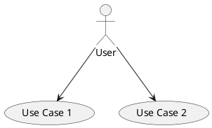
````

### Class Diagrams

<ChartGenerationDisplay mode="demo" />

Create class diagrams:

````markdown
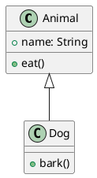
````

### Activity Diagrams

<DataAnalysisDisplay mode="demo" />

Create activity diagrams:

````markdown
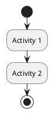
````

### Component Diagrams

<OutlineTreeDisplay mode="demo" />

Create component diagrams:

````markdown
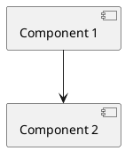
````

### Deployment Diagrams

<ChartGenerationDisplay mode="demo" />

Create deployment diagrams:

````markdown
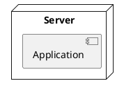
````

### State Diagrams

<DataAnalysisDisplay mode="demo" />

Create state diagrams:

````markdown
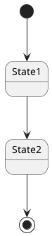
````

## Sequence Diagrams in Detail

<OutlineTreeDisplay mode="demo" />

### Participants

Define participants:

````markdown
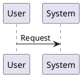
````

### Message Types

Different types of messages can be used:

- **Synchronous message**: `->`
- **Asynchronous message**: `-->`
- **Return message**: `<-` or `<--`
- **Self-call**: `->` pointing to self

### Activation Boxes

Add activation boxes:

````markdown
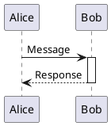
````

## Class Diagrams in Detail

<ChartGenerationDisplay mode="demo" />

### Class Definition

Define classes:

````markdown
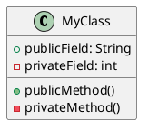
````

### Class Relationships

Represent class relationships:

- **Inheritance**: `<|--` or `--|>`
- **Implementation**: `<|..` or `..|>`
- **Composition**: `*--` or `--*`
- **Aggregation**: `o--` or `--o`
- **Association**: `-->` or `<--`
- **Dependency**: `..>` or `<..`

### Interfaces and Abstract Classes

Define interfaces and abstract classes:

````markdown
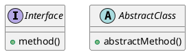
````

## Activity Diagrams in Detail

### Basic Activities

Define activities:

````markdown

````

### Decision Nodes

Add decisions:

````markdown
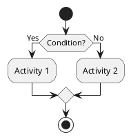
````

### Loops

Add loops:

````markdown
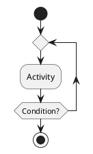
````

## Styling and Themes

### Theme Settings

You can set themes:

````markdown
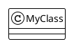
````

### Color Settings

You can set colors:

````markdown
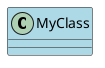
````

## Rendering Methods

### Main Process Rendering

PlantUML uses main process rendering:

- **Server-side rendering**: Diagrams are rendered in the main process
- **SVG format**: Rendered as SVG format by default
- **PNG format**: Can be converted to PNG format

### Rendering Performance

PlantUML rendering characteristics:

- **Rendering speed**: Main process rendering is relatively fast
- **Resource usage**: Occupies main process resources during rendering
- **Error handling**: Rendering errors are displayed in the console

## Notes

### Syntax Notes

1. **Required markup**: Must include `@startuml` and `@enduml`
2. **Syntax specification**: Follow the official PlantUML syntax specification
3. **Chinese support**: Chinese can be used, but English identifiers are recommended
4. **Version compatibility**: Pay attention to PlantUML version compatibility

### Rendering Notes

1. **Code extraction**: Ensure correct code extraction to avoid including XML tags
2. **Syntax errors**: Diagrams cannot be rendered if there are syntax errors
3. **Complex diagrams**: Excessively complex diagrams may affect rendering performance
4. **Export compatibility**: Ensure diagrams display correctly in the target format when exporting

## Best Practices

1. **Syntax specification**: Follow the official PlantUML syntax specification
2. **Clear code**: Keep diagram code clear and readable
3. **Use markup**: Always use `@startuml` and `@enduml` markers
4. **Test rendering**: Test diagram rendering after editing
5. **Reference documentation**: Refer to the official PlantUML documentation

## Related Documentation

- [[charts.introduction|Chart Features Introduction]]
- [[charts.mermaid|Mermaid Charts]]
- [[charts.echarts|ECharts Charts]]
