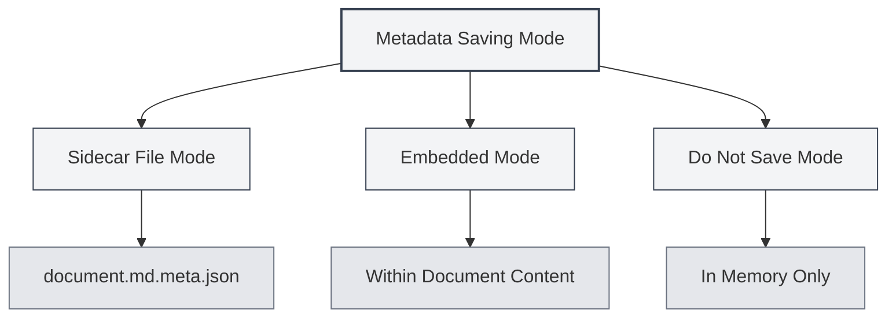

# Document Metadata

## Overview

Document metadata refers to data that describes the basic attributes of a document, including title, author, description, keywords, etc. Properly setting metadata aids in document management and retrieval, and this information is automatically included when exporting the document.

MetaDoc supports setting metadata for each document. This information can be saved in a sidecar file, embedded within the document content, or not saved at all. You can also use AI to automatically generate metadata.

<MetaInfoPanel mode="demo" :meta='{"title": "", "author": "", "description": "", "keywords": []}' :outlineJson='""' />

## Introduction to Metadata

### Title

The title of the document, typically displayed at the top of the document and in browser tabs.

- **Purpose**: Identifies the main content of the document.
- **Display Location**: Browser tab title, title page of exported documents.
- **Example**: `"MetaDoc User Manual"`

<MetaInfoPanel mode="demo" :meta='{"title": "MetaDoc User Manual", "author": "", "description": "", "keywords": []}' :outlineJson='""' />

### Author

The author or creator of the document.

- **Purpose**: Identifies the creator of the document.
- **Display Location**: Author information in exported documents.
- **Example**: `"Zhang San"`

<MetaInfoPanel mode="demo" :meta='{"title": "Example Document", "author": "Zhang San", "description": "", "keywords": []}' :outlineJson='""' />

### Description

A brief description or summary of the document.

- **Purpose**: Summarizes the main content of the document.
- **Display Location**: Summary section of exported documents.
- **Example**: `"This document introduces the basic usage of MetaDoc."`

<MetaInfoPanel mode="demo" :meta='{"title": "Example Document", "author": "Author Name", "description": "This document introduces the basic usage of MetaDoc.", "keywords": []}' :outlineJson='""' />

### Keywords

A list of keywords for the document, used for document retrieval and categorization.

- **Purpose**: Assists in document retrieval and categorization.
- **Format**: Array of strings.
- **Example**: `["MetaDoc", "User Manual", "Document Editing"]`

<MetaInfoPanel mode="demo" :meta='{"title": "Example Document", "author": "Author Name", "description": "Document Description", "keywords": ["MetaDoc", "User Manual", "Document Editing"]}' :outlineJson='""' />

## Setting Metadata

### Manual Setting

1. **Open the Metadata Panel**:
   - Click the "Metadata" button in the editor toolbar.
   - Or use the configured shortcut key (if any).

2. **Fill in the Metadata**:
   - **Title**: Enter the document title.
   - **Author**: Enter the author's name.
   - **Description**: Enter the document description (supports multiple lines).
   - **Keywords**: Enter keywords, separating multiple keywords with commas.

3. **Save**: Click the "Save" button to save the metadata.

The metadata panel interface is as follows:

<MetaInfoPanel mode="demo" :meta='{"title": "Example Document", "author": "Author Name", "description": "Document Description", "keywords": ["Keyword1", "Keyword2"]}' :outlineJson='""' />

### Batch Setting

You can set all metadata fields at once:

1. Open the metadata panel.
2. Fill in all fields.
3. Click the "Save" button.

<MetaInfoPanel mode="demo" :meta='{"title": "Batch Setting Example", "author": "Administrator", "description": "Example of batch setting all metadata fields", "keywords": ["Batch", "Setting", "Metadata"]}' :outlineJson='""' />

### Editing Metadata

Existing metadata can be modified at any time:

1. Open the metadata panel.
2. Modify the fields you wish to change.
3. Click the "Save" button.

Modified metadata takes effect immediately and is saved the next time the document is saved.

## Metadata Saving Modes

MetaDoc supports three metadata saving modes, configurable in [[settings.basic|Basic Settings]]:



### Sidecar File Mode

Metadata is saved in a sidecar file with the same name as the document (`.meta.json`).

<MetaInfoPanel mode="demo" :meta='{"title": "Sidecar File Mode Example", "author": "System", "description": "Metadata saved in .meta.json file", "keywords": ["Sidecar File", "Metadata"]}' :outlineJson='""' />

**Advantages**:
- Does not modify the original document content.
- The original document can be restored by deleting the sidecar file at any time.
- Suitable for version control.

**Disadvantages**:
- Creates additional files.
- Requires moving the sidecar file along with the document.

**Example**:
- Document: `document.md`
- Metadata file: `document.md.meta.json`

### Embedded Mode

Metadata is embedded within the document content (Markdown front matter or LaTeX comments).

<MetaInfoPanel mode="demo" :meta='{"title": "Embedded Mode Example", "author": "Embedded Author", "description": "Metadata embedded in the document", "keywords": ["Embedded", "front matter"]}' :outlineJson='""' />

**Advantages**:
- Document and metadata are together, easy to manage.
- No additional files needed.

**Disadvantages**:
- Modifies the original document content.
- Some formats may not support embedding.

**Example** (Markdown):

```markdown
---
title: Document Title
author: Author Name
description: Document Description
keywords: [Keyword1, Keyword2]
---

Document content...
```

### Do Not Save Mode

Metadata is used only during editing and is not saved to a file.

<MetaInfoPanel mode="demo" :meta='{"title": "Do Not Save Mode", "author": "Temporary", "description": "Metadata saved only in memory", "keywords": ["Temporary", "Do Not Save"]}' :outlineJson='""' />

**Advantages**:
- Does not affect the original document.
- Does not create additional files.

**Disadvantages**:
- Metadata is lost after closing the document.
- Cannot use metadata during export.

## AI-Generated Metadata

MetaDoc supports using AI to automatically generate document metadata, intelligently creating it based on document content and outline structure.

### Generating a Single Field

Generate metadata for a specific field:

1. Open the metadata panel.
2. Click the "AI Generate" button next to the field.
3. Wait for the AI to generate the result.
4. Review the generated content; you can accept it or regenerate.

### Generating All Fields

Generate all metadata fields at once:

1. Open the metadata panel.
2. Click the "AI Generate All" button.
3. Wait for the AI to generate the result.
4. Review the generated content; you can accept, modify, or regenerate it.

<MetaInfoPanel mode="demo" :meta='{"title": "AI Generation Example", "author": "AI Assistant", "description": "Metadata automatically generated using AI", "keywords": ["AI", "Auto-generation", "Intelligent"]}' :outlineJson='""' />

### Generation Principle

AI-generated metadata is based on:
- **Document Outline**: Analyzes the heading structure of the document.
- **Document Content**: Analyzes the main content of the document.
- **Contextual Understanding**: Understands the document's theme and purpose.

The generated results are automatically adjusted based on the document content to ensure the metadata accurately reflects it.

## Application of Metadata in Export

Exported documents automatically include metadata:

### PDF Export
- **Title**: Displayed in PDF document properties.
- **Author**: Displayed in PDF document properties.
- **Description**: Used as the PDF Subject.
- **Keywords**: Displayed in PDF document properties.

### DOCX Export
- **Title**: Displayed in Word document properties.
- **Author**: Displayed in Word document properties.
- **Description**: Used as the Word summary.
- **Keywords**: Displayed in Word document properties.

### HTML Export
- **Title**: Displayed in the HTML `<title>` tag.
- **Author**: Displayed in HTML `<meta>` tags.
- **Description**: Displayed in HTML `<meta>` tags.
- **Keywords**: Displayed in HTML `<meta>` tags.

## Usage Tips

### Setting a Proper Title
- **Be Clear and Concise**: The title should concisely summarize the document content.
- **Avoid Being Too Long**: Overly long titles can affect display.
- **Use Keywords**: Include important keywords in the title.

### Setting Keywords
- **Moderate Quantity**: It is recommended to set 3-10 keywords.
- **High Relevance**: Keywords should be highly relevant to the document content.
- **Avoid Repetition**: Avoid setting duplicate or similar keywords.

### Optimizing AI Generation
- **Check After Generation**: AI-generated content requires manual review.
- **Modify Appropriately**: Adjust the generated content according to actual needs.
- **Generate Multiple Times**: If unsatisfied, generate multiple times to select the best result.

<MetaInfoPanel mode="demo" :meta='{"title": "Complete Metadata Example", "author": "Demo User", "description": "Showcasing a complete metadata configuration example", "keywords": ["Metadata", "Configuration", "Example"]}' :outlineJson='""' />

## Frequently Asked Questions

### Q: Where is metadata saved?

A: Depending on the saving mode, metadata may be saved in a sidecar file, embedded in the document content, or not saved. The saving mode can be configured in the settings.

### Q: How do I delete metadata?

A: Clear all fields in the metadata panel and save to delete the metadata.

### Q: What if the AI-generated content is inaccurate?

A: AI-generated content is for reference only. You can manually modify it or regenerate it. It is recommended to check and adjust after generation.

### Q: Does metadata affect the document content?

A: If using Embedded Mode, metadata is embedded into the document content. If using Sidecar File Mode or Do Not Save Mode, the original document content is not affected.

### Q: Is metadata lost during export?

A: No. Metadata is automatically included during export and displayed in the properties of the exported document.

## Related Documents

- [[core.file-operations|File Operations]]
- [[core.export|Export Function]]
- [[settings.basic|Basic Settings]]
- [[ai.assistants|AI Assistant Function]]
