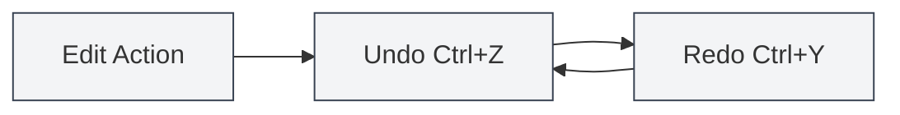
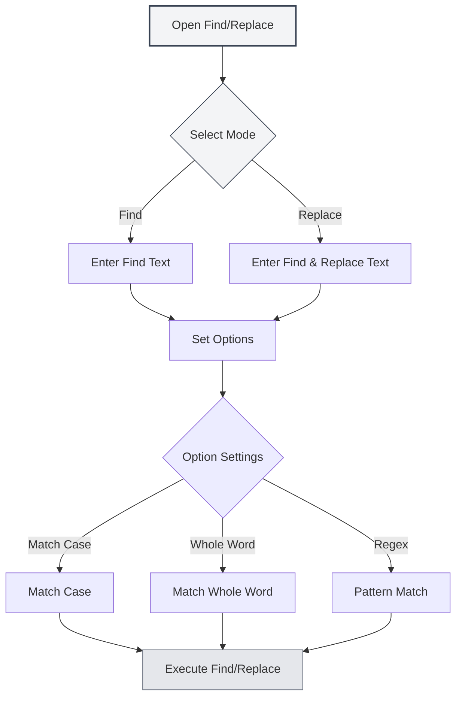

# Basic Editor Operations

## Overview

Basic editor operations are fundamental skills for editing documents in MetaDoc. Mastering these operations can significantly enhance your editing efficiency.

MetaDoc's editor supports standard text editing operations, including undo, redo, copy, paste, cut, select all, and find/replace.

<SearchReplaceMenu mode="demo" :position='{"top": 100, "left": 200}' :adapter='null' />

<MenuItemsDemo mode="demo" :items='[{"id": "edit"}]' />

## Undo and Redo

### Undo Operation

Undo the last editing action:

- **Shortcut**: `Ctrl+Z` (Windows/Linux) or `Cmd+Z` (macOS)
- **Menu**: Click "Edit" → "Undo"

You can undo multiple consecutive actions until the document returns to its initial state.

### Redo Operation

<MenuItemsDemo mode="demo" :items='[{"id": "edit"}]' />

Restore an action that was undone:

- **Shortcut**: `Ctrl+Y` or `Ctrl+Shift+Z` (Windows/Linux) or `Cmd+Shift+Z` (macOS)
- **Menu**: Click "Edit" → "Redo"

Redo operations restore actions in the reverse order of the undo sequence.

## Copy, Paste, Cut

<MenuItemsDemo mode="demo" :items='[{"id": "edit"}]' />

### Copy

Copy the selected text to the clipboard:

- **Shortcut**: `Ctrl+C` (Windows/Linux) or `Cmd+C` (macOS)
- **Menu**: Click "Edit" → "Copy"
- **Right-click Menu**: Right-click on selected text and choose "Copy"

### Paste

<MenuItemsDemo mode="demo" :items='[{"id": "edit"}]' />

Paste the content from the clipboard to the current position:

- **Shortcut**: `Ctrl+V` (Windows/Linux) or `Cmd+V` (macOS)
- **Menu**: Click "Edit" → "Paste"
- **Right-click Menu**: Right-click and choose "Paste"

The paste operation inserts content at the cursor position. If text is already selected, it replaces the selected content.

### Cut

<MenuItemsDemo mode="demo" :items='[{"id": "edit"}]' />

Cut the selected text to the clipboard (removing it from its original location):

- **Shortcut**: `Ctrl+X` (Windows/Linux) or `Cmd+X` (macOS)
- **Menu**: Click "Edit" → "Cut"
- **Right-click Menu**: Right-click on selected text and choose "Cut"

The cut operation deletes the text from its original location and saves it to the clipboard, allowing you to paste it elsewhere.

## Select All

<MenuItemsDemo mode="demo" :items='[{"id": "edit"}]' />

Select all content in the document:

- **Shortcut**: `Ctrl+A` (Windows/Linux) or `Cmd+A` (macOS)
- **Menu**: Click "Edit" → "Select All"

After selecting all, you can:

- Copy the entire document content
- Delete the entire document content
- Apply uniform formatting to all text

## Find and Replace

### Find

<SearchReplaceMenu mode="demo" :position='{"top": 100, "left": 200}' :adapter='null' />

Find specified text within the document:

- **Shortcut**: `Ctrl+F` (Windows/Linux) or `Cmd+F` (macOS)
- **Menu**: Click "Edit" → "Find"

The find function supports:

- **Case Matching**: Case-sensitive search
- **Whole Word Matching**: Match only complete words
- **Regular Expressions**: Advanced search using regex
- **Highlighting**: Search results are highlighted in the document

### Replace

<SearchReplaceMenu mode="demo" :position='{"top": 100, "left": 200}' :adapter='null' />

Find and replace text:

- **Shortcut**: `Ctrl+H` (Windows/Linux) or `Cmd+H` (macOS)
- **Menu**: Click "Edit" → "Find and Replace"

The replace function supports:

- **Replace One**: Replace matched text one by one
- **Replace All**: Replace all matched text at once
- **Preview Replace**: Preview the replacement result before applying

### Find and Replace Options

The find and replace dialog provides the following options:

- **Match Case**: Match only text with identical casing
- **Whole Word**: Match only complete words (not parts of words)
- **Regular Expression**: Use regex for pattern matching
- **Wrap Around**: Automatically restart search from the beginning after reaching the document end

The find and replace menu interface is as follows:

<SearchReplaceMenu mode="demo" :position='{"top": 100, "left": 200}' :adapter='null' />

## Text Selection

### Basic Selection

- **Click**: Position the cursor at the clicked location
- **Drag**: Select text from the start to end position
- **Double-click**: Select the entire word
- **Triple-click**: Select the entire line

### Extended Selection

- **Shift+Click**: Extend the selection range to the clicked position
- **Ctrl+Click**: Add multiple discontinuous selection areas (if supported by the editor)
- **Alt+Drag**: Column selection mode (if supported by the editor)

## Cursor Movement

### Basic Movement

- **Arrow Keys**: Move the cursor up, down, left, right
- **Home/End**: Move to the beginning/end of the line
- **Ctrl+Home/End**: Move to the beginning/end of the document
- **Page Up/Page Down**: Scroll up/down one page

### Word Movement

- **Ctrl+Left/Right Arrow**: Move the cursor by word
- **Ctrl+Up/Down Arrow**: Move up/down by paragraph

## Deletion Operations

### Basic Deletion

- **Backspace**: Delete the character before the cursor
- **Delete**: Delete the character after the cursor
- **Ctrl+Backspace**: Delete the entire word before the cursor
- **Ctrl+Delete**: Delete the entire word after the cursor

## Editor Differences

MetaDoc provides two main editors:

### Markdown Editor (Vditor)

- Supports real-time preview
- Provides a formatting toolbar
- Supports multiple editing modes (IR/WYSIWYG/SV)
- For details, see [[markdown.editor|Markdown Editor User Guide]]

### LaTeX Editor (Monaco)

- Professional code editing experience
- Syntax highlighting and auto-completion
- Supports code folding
- For details, see [[latex.editor|LaTeX Editor User Guide]]

The basic operations for both editors are largely the same, but they differ in advanced features.

## Shortcut Reference

### Common Shortcuts

| Operation | Windows/Linux              | macOS         |
| --------- | -------------------------- | ------------- |
| Undo      | `Ctrl+Z`                   | `Cmd+Z`       |
| Redo      | `Ctrl+Y` or `Ctrl+Shift+Z` | `Cmd+Shift+Z` |
| Copy      | `Ctrl+C`                   | `Cmd+C`       |
| Paste     | `Ctrl+V`                   | `Cmd+V`       |
| Cut       | `Ctrl+X`                   | `Cmd+X`       |
| Select All| `Ctrl+A`                   | `Cmd+A`       |
| Find      | `Ctrl+F`                   | `Cmd+F`       |
| Find/Replace | `Ctrl+H`                | `Cmd+H`       |

## Notes

1. **Undo History**: The undo history is cleared after closing the document. It is recommended to save the document promptly.
2. **Clipboard**: Content copied or cut is stored in the system clipboard and may be lost after closing the application.
3. **Find/Replace**: When using regular expressions, be mindful of escaping special characters.
4. **Large Documents**: Find and replace operations may take some time when processing large documents.

## Related Documents

- [[core.file-operations|File Operations]]
- [[core.editor-settings|Editor Settings]]
- [[markdown.editor|Markdown Editor User Guide]]
- [[latex.editor|LaTeX Editor User Guide]]