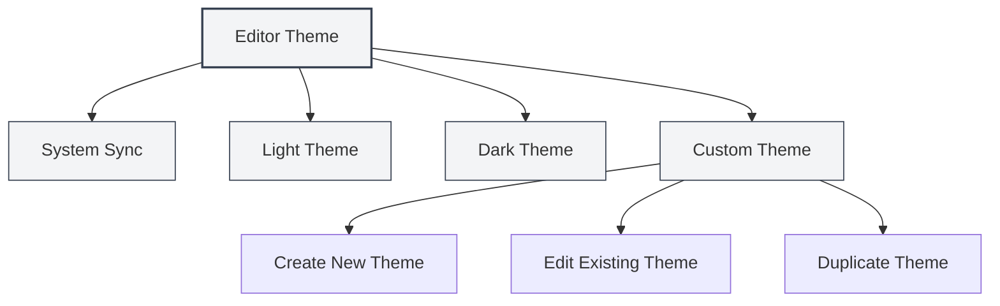
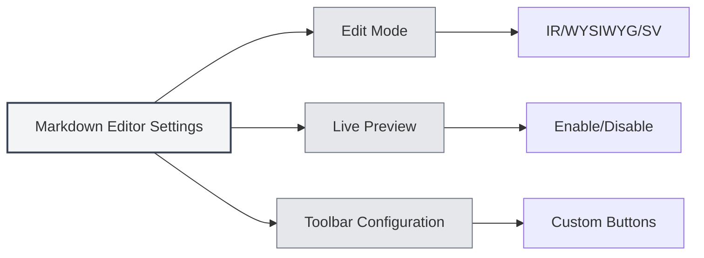

# Editor Settings

## Overview

Editor settings allow you to customize the appearance and behavior of the editor, including themes, fonts, line number display, and more. Proper configuration can enhance your editing experience and productivity.

Editor settings are divided into global settings and editor-specific settings. Global settings affect all editors, while certain settings may only apply to specific types of editors (such as Markdown editors or LaTeX editors).

<MenuItemsDemo mode="demo" :items='[{"id": "settings"}]' />

## Editor Theme

<MenuItemsDemo mode="demo" :items='[{"id": "settings"}]' />

### Theme Types

MetaDoc supports multiple theme modes:

- **System Sync**: Automatically follows the system theme (light/dark)
- **Light Theme**: Always uses a light theme
- **Dark Theme**: Always uses a dark theme
- **Custom Theme**: Uses custom color configurations

### Setting the Theme

<SettingThemeSection mode="demo" />

1. Open the Settings page (click the "Settings" menu or use the shortcut key)
2. Navigate to the "Theme Settings" section
3. Select your preferred theme

You can access settings via the top menu bar:

Clicking the "Settings" menu in the top menu bar opens the settings panel, where you can configure options like editor theme, content theme, code theme, etc.

<MenuItemsDemo mode="demo" :items='[{"id": "settings"}]' />

Theme settings take effect immediately; no application restart is required.

### Custom Themes

<SettingThemeSection mode="demo" />

You can create and edit custom themes:

1. Click "New Theme" on the Theme Settings page
2. Set the theme name and colors
3. Save and the theme will be ready for use

Custom themes support:

- **Edit**: Modify theme name and colors
- **Duplicate**: Copy an existing theme as a starting point for a new one
- **Delete**: Remove unwanted custom themes

## Content Theme

<SettingThemeSection mode="demo" />

The content theme controls the display style of the document preview area:

- **Auto**: Automatically selects based on the global theme
- **Light**: Always uses a light preview style
- **Dark**: Always uses a dark preview style

The content theme primarily affects the display of Markdown previews and PDF previews.

## Code Theme

<SettingThemeSection mode="demo" />

The code theme controls the syntax highlighting style for code blocks:

- **Auto**: Automatically selects based on the global theme
- **Preset Themes**: Choose from preset code themes (e.g., GitHub, Monokai, Solarized, etc.)

The code theme affects:

- Syntax highlighting in Markdown code blocks
- Code highlighting in the LaTeX editor
- Display style of console output

## Font Settings

<SettingBasicSection mode="demo" />

### Editor Font

The font used by the editor can be configured in the system settings. It defaults to monospaced fonts, such as:

- JetBrains Mono
- Consolas
- Courier New
- Microsoft YaHei Mono

### Font Size

- **Zoom In**: Use `Ctrl+=` or `Ctrl+Mouse Wheel Up`
- **Zoom Out**: Use `Ctrl+-` or `Ctrl+Mouse Wheel Down`
- **Reset**: Use `Ctrl+0` to reset to the default size

Font size adjustments take effect immediately but are not saved to the settings.

## Line Number Display

<SettingBasicSection mode="demo" />

### Show/Hide Line Numbers

The line number display setting controls whether the editor shows line numbers:

- **Enable**: Show line numbers for easy code location
- **Disable**: Hide line numbers for a larger editing area

### Setting Line Number Display

1. Open the Settings page
2. Find "Line Number Display" in the "Editor Settings" section
3. Toggle the switch to enable or disable line numbers

Line number settings affect:

- LaTeX editor
- Plain text editor
- Code preview area

Note: Line number display for the Markdown editor (Vditor) is controlled by its own configuration.

## Minimap Display

The Minimap is a code thumbnail on the right side of the editor, helping you quickly browse and locate content within a document.

### Show/Hide Minimap

Minimap display settings:

- **Enable**: Show the minimap for easy browsing of long documents
- **Disable**: Hide the minimap for a larger editing area

### Setting the Minimap

Minimap settings are typically found in the editor's right-click menu or toolbar:

1. Right-click in the editor
2. Look for the "Minimap" option
3. Toggle the display state

The minimap feature is primarily applicable to:

- LaTeX editor (Monaco)
- Plain text editor (Monaco)

## Editor-Specific Settings

### Markdown Editor Settings

Specific settings for the Markdown editor (Vditor):

- **Edit Mode**: IR mode, WYSIWYG mode, SV mode
- **Live Preview**: Enable/disable live preview
- **Toolbar Configuration**: Customize toolbar buttons

See [[markdown.editor|Markdown Editor User Guide]] for details.

### LaTeX Editor Settings

Specific settings for the LaTeX editor (Monaco):

- **Code Folding**: Enable/disable code folding
- **Word Wrap**: Control how long lines are displayed
- **Syntax Checking**: Enable/disable LaTeX syntax checking

See [[latex.editor|LaTeX Editor User Guide]] for details.

## Settings Synchronization

Editor settings are saved in the local configuration, including:

- Theme selection
- Line number display preference
- Font size (current session)
- Minimap display state

Settings are automatically restored after the application restarts.

## Shortcut Key Reference

### Font Adjustment

| Action               | Windows/Linux | macOS        |
| -------------------- | ------------- | ------------ |
| Zoom In Font         | `Ctrl+=`      | `Cmd+=`      |
| Zoom Out Font        | `Ctrl+-`      | `Cmd+-`      |
| Reset Font           | `Ctrl+0`      | `Cmd+0`      |
| Mouse Wheel Zoom     | `Ctrl+Wheel`  | `Cmd+Wheel`  |

## Best Practices

1. **Theme Selection**:

   - Use a dark theme for long editing sessions to reduce eye strain
   - Use a light theme for print previews for better printing results

2. **Line Number Display**:

   - Enable line numbers when writing code for easy error location
   - Disable line numbers for plain text editing to gain a larger editing area

3. **Minimap**:

   - Enable the minimap when editing long documents for quick browsing of structure
   - Disable the minimap when editing short documents

4. **Font Size**:
   - Adjust font size based on screen size and personal preference
   - A font size of 14-16px is recommended to balance readability and screen space

## Notes

1. **Theme Sync**: After selecting "System Sync," the theme will automatically switch following the system settings
2. **Setting Scope**: Some settings only affect specific editors and not others
3. **Performance Impact**: Enabling certain features (like live preview) may affect editing performance
4. **Custom Themes**: Colors in custom themes affect the entire application's color scheme

## Related Documents

- [[core.editor-basics|Editor Basic Operations]]
- [[settings.basic|Basic Settings]]
- [[settings.theme|Theme Settings]]
- [[markdown.editor|Markdown Editor User Guide]]
- [[latex.editor|LaTeX Editor User Guide]]