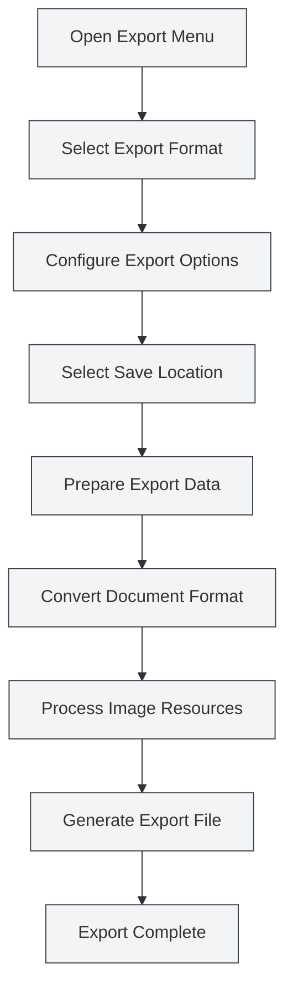

# Export Function

## Overview

MetaDoc supports exporting documents to multiple formats, including PDF, HTML, DOCX, LaTeX, Markdown, JSON, and more. The export function provides different export options based on the document format, ensuring the exported document retains its original formatting and style.

The export function automatically includes document metadata (title, author, description, keywords) and processes elements such as images, tables, and mathematical formulas during the export process.

<MenuItemsDemo mode="demo" :items='[{"id": "file", "items": ["export"]}]' />

<MetaInfoPanel mode="demo" :meta='{"title": "Export Example", "author": "Author", "description": "Document Description", "keywords": ["Export", "PDF"]}' :outlineJson='""' />

<MenuItemsDemo mode="demo" :items='[{"id": "file", "items": ["export"]}]' />

<MetaInfoPanel mode="demo" :meta='{"title": "Export Formats", "author": "MetaDoc", "description": "Introduction to Supported Export Formats", "keywords": ["Export", "Format"]}' :outlineJson='""' />

## Supported Export Formats

<MenuItemsDemo mode="demo" :items='[{"id": "file", "items": ["export"]}]' />

### Markdown Document Export

Markdown documents (`.md`) can be exported to the following formats:

- **PDF**: Suitable for printing and sharing
- **HTML**: Suitable for web display
- **DOCX**: Suitable for Word editing
- **LaTeX**: Suitable for academic papers
- **JSON**: Suitable for program processing

<MetaInfoPanel mode="demo" :meta='{"title": "LaTeX Export", "author": "System", "description": "LaTeX Document Export Options", "keywords": ["LaTeX", "Export"]}' :outlineJson='""' />

### LaTeX Document Export

LaTeX documents (`.tex`) can be exported to the following formats:

- **PDF**: Generated by compiling LaTeX
- **Markdown**: Converted to Markdown format
- **HTML**: Converted to HTML format
- **DOCX**: Converted to Word format

<MenuItemsDemo mode="demo" :items='[{"id": "file", "items": ["export"]}]' />

### JSON Document Export

JSON documents (`.json`) can be exported as:

- **JSON**: Preserving the JSON format

## Export Operations

### Basic Export

1. **Open the Export Menu**:
   - Click "File" → "Export" in the menu bar
   - Or use the shortcut key (if configured)

The export options in the File menu are as follows:

<MenuItemsDemo mode="demo" :items='[{"id": "file", "items": ["export"]}]' />

2. **Select Export Format**:

   - Choose the target format in the export menu
   - The system will display available export options based on the current document format

3. **Select Save Location**:

   - Choose the save location in the file save dialog
   - Enter a file name (the system will automatically add the correct extension)

4. **Wait for Export to Complete**:
   - A progress bar will be displayed during export
   - A success notification will be shown upon completion

### Quick Export

For commonly used formats, you can use shortcut keys for quick export:

- **Export to PDF**: `Ctrl+Shift+E` (if configured)
- **Export to HTML**: Select via menu

## Detailed Markdown Export

<MenuItemsDemo mode="demo" :items='[{"id": "file", "items": ["export"]}]' />

### Export to PDF

PDF export converts Markdown to PDF format:

- **Includes**: Document body, images, tables, mathematical formulas
- **Includes Metadata**: Title, author, description, keywords
- **Styling**: Uses PDF-specific styling, suitable for printing
- **Image Processing**: Images are automatically resized to fit the page

**Use Cases**:

- Printing documents
- Sharing documents with others
- Archiving and saving

### Export to HTML

<MetaInfoPanel mode="demo" :meta='{"title": "HTML Export", "author": "System", "description": "HTML Export Settings and Options", "keywords": ["HTML", "Export"]}' :outlineJson='""' />

HTML export converts Markdown to web page format:

- **Includes**: Document body, images, tables, mathematical formulas
- **Includes Metadata**: Title, author, description, keywords (in HTML meta tags)
- **Styling**: Uses HTML styling, suitable for web display
- **Image Processing**: You can choose to keep original URLs, convert to base64, or save to a folder

**Use Cases**:

- Publishing to a website
- Viewing in a browser
- Sharing with others

### Export to DOCX

<MenuItemsDemo mode="demo" :items='[{"id": "file", "items": ["export"]}]' />

DOCX export converts Markdown to Word format:

- **Includes**: Document body, images, tables, mathematical formulas
- **Includes Metadata**: Title, author, description, keywords (in Word document properties)
- **Styling**: Uses Word styles, allowing for further editing in Word
- **Image Processing**: Images are embedded into the Word document

**Use Cases**:

- Further editing in Word
- Collaborative editing with others
- Submitting documents

### Export to LaTeX

<MetaInfoPanel mode="demo" :meta='{"title": "LaTeX Export", "author": "Academic", "description": "Markdown to LaTeX Export", "keywords": ["LaTeX", "Academic"]}' :outlineJson='""' />

LaTeX export converts Markdown to LaTeX format:

- **Includes**: Document body, images, tables, mathematical formulas
- **Includes Metadata**: Title, author, description, keywords (in the LaTeX document)
- **Format Conversion**: Markdown syntax is converted to corresponding LaTeX commands
- **Mathematical Formulas**: LaTeX math formula format is preserved

**Use Cases**:

- Academic paper writing
- Scenarios requiring LaTeX format
- Further editing of LaTeX documents

### Export to JSON

<MenuItemsDemo mode="demo" :items='[{"id": "file", "items": ["export"]}]' />

JSON export saves the document in JSON format:

- **Includes**: All document data (content, metadata, outline, etc.)
- **Format**: Structured JSON data
- **Purpose**: Program processing, data backup

## Detailed LaTeX Export

<MetaInfoPanel mode="demo" :meta='{"title": "Detailed LaTeX Export", "author": "System", "description": "Detailed Explanation of LaTeX Document Export", "keywords": ["LaTeX", "PDF", "Export"]}' :outlineJson='""' />

### Export to PDF

Exporting LaTeX documents to PDF requires LaTeX compilation:

1. **Compile LaTeX**: The system automatically compiles the LaTeX document
2. **Generate PDF**: A PDF file is generated upon successful compilation
3. **Includes Metadata**: PDF document properties include metadata

**Notes**:

- A LaTeX distribution (e.g., TeX Live) needs to be installed
- Compilation may take some time
- If compilation fails, error messages will be displayed

### Export to Markdown

LaTeX documents can be converted to Markdown format:

- **Format Conversion**: LaTeX commands are converted to Markdown syntax
- **Mathematical Formulas**: LaTeX formulas are converted to Markdown math formula format
- **Tables**: LaTeX tables are converted to Markdown tables

### Export to HTML

LaTeX documents can be converted to HTML format:

- **Format Conversion**: LaTeX commands are converted to HTML tags
- **Mathematical Formulas**: Rendered using MathJax or KaTeX
- **Styling**: Displayed using HTML styling

### Export to DOCX

LaTeX documents can be converted to Word format:

- **Format Conversion**: LaTeX commands are converted to Word format
- **Mathematical Formulas**: Converted to Word math formula format
- **Tables**: Converted to Word table format

## Export Options Configuration

### Image Processing Options

You can configure image processing methods during export:

- **Keep Original URL**: Maintains the image's original URL (suitable for HTML export)
- **Convert to Base64**: Embeds images into the document (suitable for HTML, DOCX export)
- **Save to Folder**: Saves images to a specified folder (suitable for HTML export)

### PDF Export Options

PDF export supports the following options:

- **Page Size**: A4, Letter, etc.
- **Margins**: Custom margins
- **Font**: Select font and font size
- **Image Quality**: Adjust image quality

### HTML Export Options

HTML export supports the following options:

- **Style**: Select HTML style theme
- **Math Formula Rendering**: Choose MathJax or KaTeX
- **Code Highlighting**: Enable or disable code highlighting

## Export Progress

A progress bar is displayed during export:

- **Preparation Phase**: Preparing export data
- **Conversion Phase**: Converting document format
- **Processing Images**: Processing images in the document
- **Generating File**: Generating the final file

If the export takes a long time, you can:

- **Check Progress**: View the current progress in the progress bar
- **Cancel Export**: Click the "Cancel" button to abort the export operation

## Export File Naming

Exported files are automatically named:

- **Default Name**: Uses the document title or file name
- **Automatic Extension**: Automatically adds the correct extension based on the export format
- **Custom Name**: You can choose a custom name in the save dialog

## Usage Tips

### Choosing the Right Format

- **PDF**: Suitable for printing and formal sharing
- **HTML**: Suitable for web display and online viewing
- **DOCX**: Suitable for scenarios requiring further editing
- **LaTeX**: Suitable for academic writing and scenarios requiring LaTeX format

### Image Processing Recommendations

- **HTML Export**: If displaying on a webpage, it is recommended to use Base64 or save to a folder
- **DOCX Export**: Images are automatically embedded; no additional processing is needed
- **PDF Export**: Images are automatically resized to ensure they fit the page

### Batch Export

If you need to export multiple documents:

1. Open documents one by one
2. Export each to the required format separately
3. Or use scripts for batch processing (for advanced users)

## Frequently Asked Questions

### Q: What should I do if the export fails?

A: Check if the document has any errors and ensure all images and resources are accessible. If PDF export fails, check for LaTeX compilation errors.

### Q: The exported PDF format is incorrect?

A: Check the PDF export option settings and adjust the page size and margins. Ensure the document content is correctly formatted.

### Q: Images are not displayed after export?

A: Check if the image paths are correct and ensure the image files exist. For HTML export, choose an appropriate image processing method.

### Q: Can I customize the export style?

A: Some formats support custom styles, which can be configured in the export options. PDF and HTML exports support style customization.

### Q: Will metadata be included in the export?

A: Yes, document metadata (title, author, description, keywords) is automatically included during export and displayed in the exported document's properties.

## Related Documents

- [[core.file-operations|File Operations]]
- [[core.document-metadata|Document Metadata]]
- [[markdown.basics|Markdown Syntax]]
- [[latex.basics|LaTeX Syntax]]
- [[latex.compilation|LaTeX Compilation and Preview]]