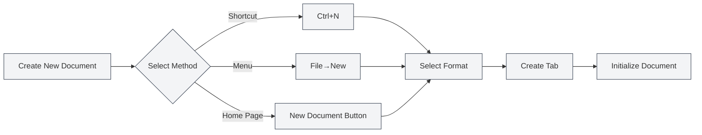
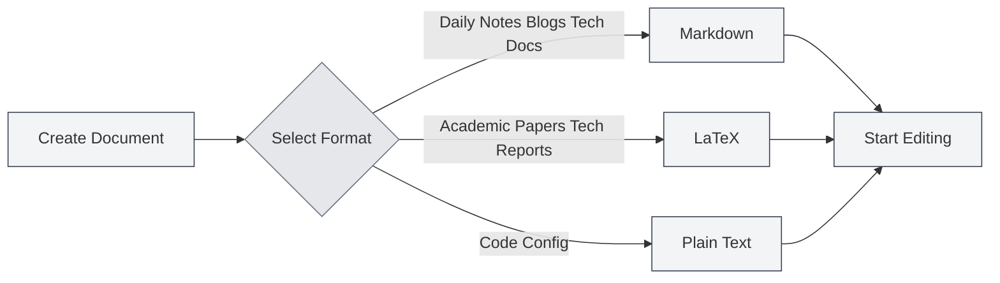
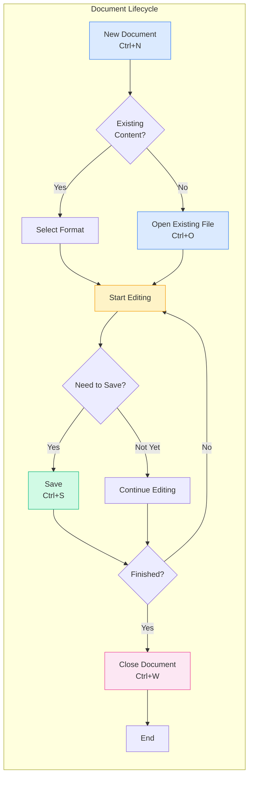

# File Operations

## Overview

File operations are fundamental functions of MetaDoc. Whether you're writing technical documentation, academic papers, or daily notes, proficiency in file operations can make the creation process smoother. This article details how to create, open, save, and manage documents.

## New Document

<MainTabs mode="demo" />

<MenuItemsDemo mode="demo" :items='[{"id": "file", "items": ["new"]}]' />

### Create a Blank Document

MetaDoc provides several convenient ways to create a new document. You can choose the method that best suits your current workflow:

**Method 1: Keyboard Shortcut (Fastest)**

- Press `Ctrl+N` to create a new document immediately.
- Ideal for quickly creating a new document while editing.

**Method 2: File Menu**

- Click the "File" icon in the left menu bar.
- Select "New" from the expanded menu.

**Method 3: Home Page Entry**

- Click the "New Document" button on the home page.
- Ideal for starting a new creation when you first open the application.

The interface of the file menu, including common operations like New, Open, and Save, is shown below:

<MenuItemsDemo mode="demo" :items='[{"id": "file", "items": ["new", "open", "save", "save-as", "save-all", "close"]}]' />

<MainTabs mode="demo" />

**State After Creating a Document**:

After creating a new document, you will see:

- A new tab appears at the top, titled "Untitled".
- The system will prompt you to select a document format (Markdown, LaTeX, or Plain Text).
- The document currently exists only in memory and needs to be saved to disk to be retained.

### Select Document Format

When creating a document, you need to select a format. Different formats are suitable for different scenarios:

**Markdown (.md)** — The most commonly used lightweight format.

- Suitable for: Daily notes, blog posts, technical documentation, project documentation.
- Advantages: Simple syntax, easy to read, rich export formats.
- Example use cases: Recording meeting minutes, writing technical blogs, organizing study notes.

**LaTeX (.tex)** — Professional academic typesetting format.

- Suitable for: Academic papers, theses, technical reports, mathematical documents.
- Advantages: Beautiful typesetting, excellent formula support, automatic generation of table of contents and references.
- Example use cases: Writing research papers, compiling math textbooks, preparing academic presentations.

**Plain Text (.txt)** — The simplest text format.

- Suitable for: Code snippets, configuration files, temporary notes.
- Advantages: High compatibility, can be opened by any editor.
- Example use cases: Saving code snippets, recording temporary information.

## Open Document

<MenuItemsDemo mode="demo" :items='[{"id": "file", "items": ["open"]}]' />

### Open an Existing File

1.  **Keyboard Shortcut**: Press `Ctrl+O` to open the file selection dialog.
2.  **Menu Method**: Click "File" → "Open".
3.  **Home Page Method**: Click the "Open File" button on the home page.

### Supported File Formats

MetaDoc supports opening files in the following formats:

-   `.md` - Markdown documents
-   `.tex` - LaTeX documents
-   `.txt` - Plain text files
-   `.json` - JSON format files

### Recent Files List

The home page displays a list of recently opened documents for quick access:

-   Click on a recent document card to open it quickly.
-   Right-click to remove a document from the recent list.
-   A maximum of 12 recent documents are displayed.

### File Association

MetaDoc supports file association:

-   Double-clicking a `.md` or `.tex` file in the system will automatically open it with MetaDoc.
-   If a file is already open in another window, you will be prompted that the file is already open elsewhere.

## Save Document

<MenuItemsDemo mode="demo" :items='[{"id": "file", "items": ["save", "save-as", "save-all"]}]' />

### Save the Current Document

Developing a habit of saving frequently can prevent loss of work due to unexpected situations.

**Save Methods**:

-   **Keyboard Shortcut** (Recommended): `Ctrl+S` — The most common saving method, keeping your hands on the keyboard.
-   **Menu Operation**: Click the "File" menu → "Save".

**First Save**:
If the document is new, the "Save As" dialog will appear on the first save. You need to:

1.  Choose a save location (e.g., "Documents" folder).
2.  Enter a file name (e.g., "Project Plan.md").
3.  Click the "Save" button.

**Saving Updates to a Previously Saved Document**:
If the document has been saved before, pressing `Ctrl+S` will directly overwrite the original file without a dialog.

### Save As — Create a Document Copy

Use the "Save As" function when you need to create a new version while keeping the original document.

**Use Cases**:

-   Creating a backup copy before modifying a document.
-   Saving a document to a different location.
-   Saving different versions of a document under different names.

**Operation Methods**:

-   **Keyboard Shortcut**: `Ctrl+Shift+S`
-   **Menu**: Click "File" → "Save As"

**Example**:
You are editing "Report v1.md" and want to save a backup before making major changes:

1.  Press `Ctrl+Shift+S`.
2.  Enter a new file name, e.g., "Report v1_backup.md".
3.  Click Save.
4.  Continue editing the original document with peace of mind.

### Save All — Save All Documents with One Click

When you have multiple documents open simultaneously, you can use the "Save All" function to save all documents at once.

**Operation Methods**:

-   **Keyboard Shortcut**: `Ctrl+K S` (Press `Ctrl+K`, then press `S`).
-   **Menu**: Click "File" → "Save All".

**Use Cases**:

-   Quickly saving all open documents at the end of a work session.
-   Ensuring all modifications are saved.

### Auto-Save — Let the System Save for You

MetaDoc supports auto-save, which can automatically save documents while you focus on creation.

**Setup Method**:
Go to [[settings.basic|Basic Settings]], find the "Auto-save" option, and select an appropriate time interval:

-   **Off**: Manual control over save timing.
-   **1 minute**: Most secure, but increases disk writes.
-   **5 minutes**: Balanced option (Recommended).
-   **10 minutes / 30 minutes / 1 hour**: Suitable for long documents, reduces save frequency.

**How it Works**:

-   Auto-save runs silently in the background without interrupting your editing.
-   When auto-saving occurs, the "unsaved" indicator on the tab disappears.
-   You can manually save (`Ctrl+S`) at any time, unaffected by auto-save.

**Recommendations**:

-   For important documents, enabling 5-minute auto-save is recommended.
-   Even with auto-save enabled, manual saving is still recommended at key milestones (e.g., completing a chapter).

## Close File

<MainTabs mode="demo" />

### Close the Current Tab

-   **Keyboard Shortcut**: `Ctrl+W`
-   **Click the Tab Close Button**: Click the × button on the right side of the tab.

### Prompt Before Closing

If a document has unsaved changes, you will be prompted when closing:

-   **Save**: Save changes and close.
-   **Don't Save**: Close directly, discarding changes.
-   **Cancel**: Cancel the close operation.

### Reopen a Closed Tab

-   **Keyboard Shortcut**: `Ctrl+Shift+T`

This can restore recently closed tabs (up to 20 tabs can be restored).

## Multi-Tab Management

<MainTabs mode="demo" />

MetaDoc supports opening multiple documents simultaneously, each displayed in an independent tab:

The tab bar shows all open documents and supports operations like switching, closing, and dragging:

<MainTabs mode="demo" />

-   **Switch Tabs**: Use `Ctrl+Tab` to switch to the next tab, `Ctrl+Shift+Tab` to switch to the previous one.
-   **Drag to Reorder**: Drag tabs to rearrange their order.
-   **Pin Tab**: Right-click a tab and select "Pin". Pinned tabs are always displayed on the left and cannot be closed.

For more tab operations, see [[core.multi-tab|Multi-Tab Management]].

## File Status Indicators

Tabs display the status of documents:

-   **Unsaved**: A dot (●) appears next to the tab title, indicating unsaved changes.
-   **Saved**: No special marker.
-   **Read-Only**: A lock icon is displayed, indicating the file is in read-only mode.

## Notes

1.  **File Path**: When saving a file, ensure you have sufficient disk space and write permissions.
2.  **File Format**: Pay attention to selecting the appropriate file format when saving to avoid compatibility issues.
3.  **Backup**: It is recommended to regularly back up important documents. You can use the "Save As" function to create copies.
4.  **File Conflict**: If a file is modified externally, MetaDoc will detect and prompt you to handle the conflict.

## Related Documents

-   [[core.editor-basics|Editor Basics]]
-   [[core.multi-tab|Multi-Tab Management]]
-   [[core.document-metadata|Document Metadata]]
-   [[core.export|Export Function]]
-   [[settings.basic|Basic Settings]]