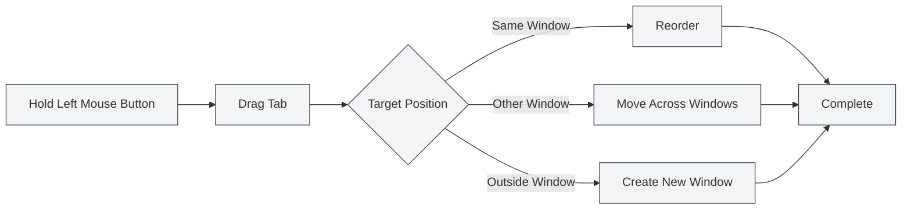

# Multi-Tab Management

## Overview

MetaDoc supports multi-tab management, allowing you to open multiple documents simultaneously, with each document displayed in an independent tab. Mastering tab operations can significantly improve your work efficiency.

Tab management includes functions such as creating new tabs, switching, closing, drag-and-drop sorting, and pinning, enabling you to flexibly organize and manage multiple documents.

<MainTabs mode="demo" />

<AIChat mode="demo" />

<KnowledgeBase mode="demo" />

<ProofreadView mode="demo" />

<QuickStartPanel mode="demo" />

<GraphWindow mode="demo" />

<OcrWindow mode="demo" />

<DataAnalysisWindow mode="demo" />

<AgentView mode="demo" />

<MenuItemsDemo mode="demo" :items='[{"id": "file", "items": ["new", "open", "save"]}]' />

<ViewMenuItemsDemo mode="demo" :items='["editor", "outline"]' />

<Outline mode="demo" />

<ResizableDivider mode="demo" />

<TitleMenu mode="demo" title="Tab Example" :position='{"top": 100, "left": 200}' path="1" :tree='{}' />

## Creating New Tabs

### Creating a New Tab

There are several ways to create a new tab:

1.  **Keyboard Shortcut**: Press `Ctrl+T` to quickly create a new tab.
2.  **Click Button**: Click the "+" button on the right side of the tab bar.
3.  **Menu**: Click "File" → "New".

The tab bar displays all open documents and supports operations like creating new tabs, switching, and closing:

<MainTabs mode="demo" />

A new tab opens a blank document. You can choose the document format (Markdown/LaTeX/Plain Text).

### Creating a Tab from a File

Opening a file automatically creates a new tab:

1.  **Keyboard Shortcut**: Press `Ctrl+O` to open the file selection dialog.
2.  **Menu**: Click "File" → "Open".
3.  **Home Page**: Click the "Open File" button on the home page.

The opened file will be displayed in a new tab.

## Switching Tabs

### Switching with Keyboard Shortcuts

-   **Next Tab**: `Ctrl+Tab` switches to the next tab.
-   **Previous Tab**: `Ctrl+Shift+Tab` switches to the previous tab.

Switching cycles through tabs; after reaching the last tab, it automatically returns to the first.

### Switching with Mouse

-   **Click Tab**: Click directly on a tab's title to switch to it.
-   **Mouse Wheel**: Scroll the mouse wheel over the tab bar to switch tabs.
    -   **Scroll Down**: Switch to the next tab.
    -   **Scroll Up**: Switch to the previous tab.

### Tab Switch Indicator

When using keyboard shortcuts to switch tabs, a switch indicator is displayed, showing the currently selected tab for quick positioning.

## Closing Tabs

### Closing the Current Tab

-   **Keyboard Shortcut**: `Ctrl+W` closes the currently active tab.
-   **Click Close Button**: Click the × button on the right side of the tab.
-   **Middle-Click**: Click the tab with the mouse middle button to close it.

### Prompt Before Closing

If a document in a tab has unsaved changes, you will be prompted when closing:

-   **Save**: Save changes and close the tab.
-   **Don't Save**: Discard changes and close the tab directly.
-   **Cancel**: Cancel the close operation and continue editing.

### Reopening Closed Tabs

-   **Keyboard Shortcut**: `Ctrl+Shift+T` reopens the most recently closed tab.

The system saves the last 20 closed tabs. You can restore them in reverse order of closure.

## Dragging Tabs

### Reordering

You can drag tabs to change their order:

1.  **Hold Left Mouse Button**: Hold the left mouse button on a tab's title.
2.  **Drag**: Drag the tab to the target position.
3.  **Release**: Release the left mouse button to complete the sorting.

Visual feedback is provided during dragging, showing the target position of the tab.

### Dragging Across Windows

Tabs can be dragged to other windows:

1.  **Drag Tab**: Hold the left mouse button and drag the tab.
2.  **Move to Other Window**: Drag the tab to another MetaDoc window.
3.  **Release**: Release the mouse button in the target window; the tab will move to that window.

Dragging across windows allows you to flexibly organize documents between multiple windows.

### Creating a New Window

Dragging a tab outside a window creates a new window:

1.  **Drag Tab**: Hold the left mouse button and drag the tab.
2.  **Move Outside Window**: Drag the tab outside the current window.
3.  **Release**: Release the mouse button; the system will create a new window and open the tab in it.

## Pinning Tabs

### Pinning a Tab

A pinned tab is always displayed on the far left of the tab bar and cannot be closed:

-   **Double-Click Tab**: Double-click a tab's title to pin it.
-   **Right-Click Menu**: Right-click a tab and select "Pin".

A pinned tab:
-   Is displayed on the far left of the tab bar.
-   Shows a lock icon.
-   Cannot be closed by normal means.
-   Cannot be dragged to change position.

### Unpinning

-   **Right-Click Menu**: Right-click a pinned tab and select "Unpin".

After unpinning, the tab returns to its normal state where it can be closed and dragged.

## Tab Status

### Unsaved Status

Tabs display the save status of the document:

-   **Unsaved**: A dot (●) is displayed next to the tab title, indicating unsaved changes.
-   **Saved**: No special marker.

### Read-Only Status

If a document is read-only, the tab displays a lock icon:

-   **Read-Only Document**: Displays a lock icon, indicating the document is not editable.
-   **Editable Document**: No special marker.

### Preview Status

Tabs in preview status:

-   **Preview Mode**: Files opened with a single click are displayed in preview mode.
-   **Double-Click to Activate**: Double-click a preview tab to activate it as a regular tab.
-   **Auto-Activate**: Automatically activates after editing or switching views.

## Tab Right-Click Menu

Right-clicking a tab displays a context menu with the following operations:

-   **Close**: Close the current tab.
-   **Close Others**: Close all tabs except the current one.
-   **Close to the Right**: Close all tabs to the right of the current tab.
-   **Pin/Unpin**: Pin or unpin the tab.
-   **Move to New Window**: Move the tab to a new window.
-   **Copy Path**: Copy the document path to the clipboard.

## Tab Limit

MetaDoc does not impose a strict limit on the number of simultaneously open tabs, but it is recommended:

-   **Reasonable Number**: Having 10-20 tabs open simultaneously is reasonable.
-   **Performance Impact**: Opening too many tabs may affect application performance.
-   **Memory Usage**: Each tab consumes a certain amount of memory.

If there are too many tabs, it is recommended to close unnecessary ones.

## Keyboard Shortcut Reference

### Tab Operation Shortcuts

| Operation                | Windows/Linux    | macOS           |
| ------------------------ | ---------------- | --------------- |
| New Tab                  | `Ctrl+T`         | `Cmd+T`         |
| Close Tab                | `Ctrl+W`         | `Cmd+W`         |
| Switch to Next           | `Ctrl+Tab`       | `Cmd+Tab`       |
| Switch to Previous       | `Ctrl+Shift+Tab` | `Cmd+Shift+Tab` |
| Reopen Closed            | `Ctrl+Shift+T`   | `Cmd+Shift+T`   |

### Mouse Operations

| Operation        | Method                               |
| ---------------- | ------------------------------------ |
| Switch Tab       | Click tab title                      |
| Close Tab        | Click × button or middle-click       |
| Pin Tab          | Double-click tab title               |
| Drag to Reorder  | Hold left button and drag            |
| Wheel Switch     | Scroll mouse wheel over tab bar      |

## Usage Tips

### Organizing Tabs

1.  **Pin Frequently Used Documents**: Pin documents you use often for quick access.
2.  **Group by Project**: Keep related documents together and organize them using drag-and-drop sorting.
3.  **Use Multiple Windows**: Place documents from different projects in separate windows.

### Quick Switching

1.  **Use Keyboard Shortcuts**: Master using `Ctrl+Tab` for quick tab switching.
2.  **Use Mouse Wheel**: Scroll the mouse wheel over the tab bar to quickly browse.
3.  **Use Switch Indicator**: The switch indicator displayed when using shortcuts helps with positioning.

### Batch Operations

1.  **Close Multiple Tabs**: Use the "Close Others" or "Close to the Right" functions in the right-click menu.
2.  **Save All Tabs**: Use `Ctrl+K S` to save all open documents.
3.  **Reopen**: Use `Ctrl+Shift+T` to quickly restore closed tabs.

## Frequently Asked Questions

### Q: How do I quickly find a specific tab?

A: Use the `Ctrl+Tab` shortcut. The switch indicator will appear, showing all tabs. You can continue pressing Tab to select or click directly.

### Q: What should I do if I have too many tabs?

A: You can pin frequently used tabs, close unnecessary ones, or use multiple windows to group documents.

### Q: How do I restore a tab I closed by mistake?

A: Use the `Ctrl+Shift+T` shortcut to reopen the most recently closed tab.

### Q: Can I close a pinned tab?

A: Pinned tabs cannot be closed by normal means; you must unpin them first. Right-click the pinned tab and select "Unpin".

### Q: Can I drag tabs across windows?

A: Yes. Drag a tab to another MetaDoc window to move the tab to that window.

## Related Documents

-   [[core.file-operations|File Operations]]
-   [[core.multi-window|Multi-Window Management]]
-   [[core.editor-basics|Editor Basic Operations]]