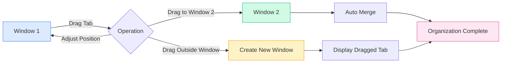

# Multi-Window Management

## Overview

MetaDoc supports multi-window management, allowing you to open different documents in separate windows. Through multi-window management, you can view and edit multiple documents simultaneously, enhancing work efficiency.

## Multi-Window Support

### Window Types

MetaDoc supports two types of windows:

- **Main Window**: Hosts primary functions like document editing and the home page, supporting multi-tab management.
- **Auxiliary Window**: Tool windows for settings, AI chat, OCR, etc., which are single-instance windows.

### Window Features

Features of the main window:

- **Multiple Tabs**: Each window has its own independent tab list.
- **Independent State**: Each window maintains its own document state.
- **Drag-and-Drop Support**: Supports splitting and merging tabs via drag-and-drop.
- **Window Pool**: Pre-creates idle windows for fast display.

## Creating a New Window

### Creating via Drag-and-Drop

You can create a new window by dragging a tab:

1. **Drag a Tab**: Drag a tab outside the boundaries of its current window.
2. **Create Window**: The system will automatically create a new window.
3. **Display Content**: The new window will display the content of the dragged tab.

The tab bar supports drag-and-drop operations, allowing you to drag a tab out of a window to create a new one:

<MainTabs mode="demo" />

**Notes**:

- A window with only one tab cannot be used to create a new window via drag-and-drop.
- When dragging, the system automatically retrieves a pre-loaded window from the window pool for instant display.

### Creating via Right-Click Menu

You can create a new window using the right-click menu:

1. **Right-Click a Tab**: Right-click on the tab you want to move.
2. **Select Option**: Choose "Open in New Window".
3. **Create Window**: The system will create a new window and move the tab to it.

### Window Pool Mechanism

MetaDoc uses a window pool mechanism to optimize window creation:

- **Pre-loaded Windows**: The system pre-creates 2 idle windows.
- **Fast Display**: Using a pre-loaded window enables near-instant display (<100ms).
- **Automatic Replenishment**: After use, a new window is automatically added back to the pool.

## Dragging Tabs Between Windows

### Drag-and-Drop Merging

You can drag a tab from one window to another for flexible window organization:

**Steps**:

1. **Drag a Tab**: Drag a tab within the source window.
2. **Drag to Target Window**: Drag the tab to the tab bar of the target window.
3. **Auto Merge**: The tab will automatically be added to the target window.

### Drop Position

You can specify the insertion position while dragging:

- **Auto Positioning**: The insertion point is automatically determined based on the mouse position.
- **Specific Position**: You can drag to a specific location to insert.
- **Insert at End**: Dragging to the end will insert the tab at the end.

### Merging Single-Tab Windows

If the source window contains only one tab:

- **Auto Merge**: It will automatically merge when dragged to another window.
- **Window Closure**: The source window will close automatically after merging.
- **Avoid Empty Windows**: Prevents the occurrence of empty windows.

## Window Management

### Switching Windows

You can switch between windows using system shortcuts:

- **Alt+Tab** (Windows/Linux): Switch windows.
- **Cmd+Tab** (macOS): Switch windows.

### Window State

Each window maintains an independent state:

- **Tab List**: Each window has its own independent tab list.
- **Document State**: Each window has its own independent document state.
- **View State**: Each window has its own independent view state.

### Closing Windows

Ways to close a window:

- **Close Button**: Click the window's close button.
- **Shortcut**: Use the system shortcut to close the window.
- **Menu Option**: Close the window via the menu.

**Notes**:

- You will be prompted to save unsaved documents before closing a window.
- Auxiliary windows are hidden rather than truly closed when you close them.

## Window Synchronization

### State Synchronization

Certain states are synchronized across windows:

- **Language Settings**: Language changes are synchronized to all windows.
- **Theme Settings**: Theme changes are synchronized to all windows.
- **System Settings**: System settings are synchronized to all windows.

### File Association

File association features:

- **Prevent Duplication**: The same file cannot be opened simultaneously in multiple windows.
- **Window Location**: If a file is already open in another window, you will be prompted and directed to that window.
- **File Locking**: Files are temporarily locked during transfer to prevent conflicts.

## Best Practices

1. **Rational Screen Splitting**: Use multiple windows for split-screen editing to improve efficiency.
2. **Window Organization**: Keep related documents in the same window and separate unrelated ones.
3. **Tab Management**: Use tab drag-and-drop effectively to organize window layouts.
4. **Window Switching**: Master the use of Alt+Tab for quick window switching.
5. **State Saving**: Ensure important documents are saved before closing a window.

## Notes

1. **Number of Windows**: Too many windows may affect performance; it is recommended to manage them reasonably.
2. **File Locking**: Files are temporarily locked during transfer to avoid conflicts.
3. **Independent State**: Each window's state is independent and does not affect others.
4. **Window Pool**: The window pool mechanism is managed automatically and requires no manual intervention.
5. **Auxiliary Windows**: Auxiliary windows are single-instance and are hidden when closed.

## Related Documents

- [[core.multi-tab|Multi-Tab Management]]
- [[core.file-operations|File Operations]]

<ViewMenuItemsDemo mode="demo" :items='["home", "outline"]' />

<ViewMenuItemsDemo mode="demo" :items='["chat", "agent"]' />

<MenuItemsDemo mode="demo" :items='[{"id": "file"}]' />

<MenuItemsDemo mode="demo" :items='[{"id": "edit"}]' />

<MenuItemsDemo mode="demo" :items='[{"id": "view"}]' />

<QuickStartPanel mode="demo" />

<LeftMenu mode="demo" />