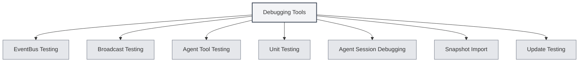

# Debugging Tools

## Overview

Debugging tools are development environment features provided by MetaDoc, used for testing and debugging application functionalities. These tools are only available in the development environment, helping developers quickly test and debug code.

<SettingDebugSection mode="demo" />

## Introduction to Debugging Tools

<SettingDebugSection mode="demo" />

<ConsoleTerminal mode="demo" consoleKey="debug" :history='[]' />

### Accessing Debugging Tools

Debugging tools are only available in the development environment:

1.  **Development Environment**: Ensure you are running in the development environment.
2.  **Settings Page**: Open the settings page.
3.  **Debugging Tools**: Find the "Debugging Tools" option on the settings page.
4.  **Open Tools**: Click to open the debugging tools interface.

You can access debugging tools via the top menu bar (only in the development environment):

<MenuItemsDemo mode="demo" :items='[{"id": "settings"}]' />

### Tool Types

The debugging tools include the following functional modules:

-   **EventBus Testing**: Test EventBus events.
-   **Broadcast Testing**: Test broadcast events.
-   **Agent Tool Testing**: Test Agent tools.
-   **Unit Testing**: Run unit tests.
-   **Agent Session Debugging**: Debug Agent sessions.
-   **Snapshot Import**: Import document snapshots.
-   **Update Testing**: Test update functionality.

<SettingDebugSection mode="demo" />

## EventBus Testing

### Sending Events

You can send EventBus events for testing:

1.  **Event Name**: Enter the name of the event to send.
2.  **Event Data**: Optional. Enter event data in JSON format.
3.  **Send Event**: Click the "Send Event" button.
4.  **View Result**: View the event sending result.

<ConsoleTerminal mode="demo" consoleKey="debug" :history='[]' />

### Event Listening

You can listen for EventBus events:

-   **Event List**: Displays all sent events.
-   **Event Details**: View detailed information about an event.
-   **Event Data**: View the data content of an event.

## Broadcast Testing

### Sending Broadcasts

You can send broadcast events for testing:

1.  **Target Window**: Select the broadcast target (all/home/ai-chat, etc.).
2.  **Event Name**: Enter the name of the event to broadcast.
3.  **Event Data**: Optional. Enter event data in JSON format.
4.  **Send Broadcast**: Click the "Send Broadcast" button.
5.  **View Result**: View the broadcast sending result.

<ConsoleTerminal mode="demo" consoleKey="debug" :history='[]' />

### Broadcast Listening

You can listen for broadcast events:

-   **Broadcast List**: Displays all sent broadcasts.
-   **Broadcast Details**: View detailed information about a broadcast.
-   **Target Window**: View the target window of the broadcast.

## Agent Tool Testing

### Testing Tools

You can test Agent tools:

1.  **Select Tool**: Choose the Agent tool to test.
2.  **Input Parameters**: Enter test parameters for the tool (JSON format).
3.  **Select Context**: Choose the context Tab ID for testing.
4.  **Execute Test**: Click the "Execute Test" button.
5.  **View Result**: View the test result.

### Test History

You can view test history:

-   **History List**: Displays all test history.
-   **Test Result**: View the result of each test.
-   **Error Information**: View error information from tests.

## Unit Testing

### Single Test

You can run a single unit test:

1.  **Select Module**: Choose the module to test.
2.  **Select Test**: Choose the test function to run.
3.  **Edit Parameters**: Edit the parameters for the test function.
4.  **Execute Test**: Click the "Execute Test" button.
5.  **View Result**: View the test result.

<ConsoleTerminal mode="demo" consoleKey="debug" :history='[]' />

### Batch Testing

You can run unit tests in batches:

1.  **Select Module**: Select one or more modules.
2.  **Select Context**: Choose the context Tab ID for testing.
3.  **Start Test**: Click the "Start Batch Test" button.
4.  **View Progress**: View the test progress.
5.  **View Result**: View all test results.

### Test Results

Test results include:

-   **Test Status**: Indicates whether the test passed.
-   **Test Output**: Displays the output information from the test.
-   **Error Information**: Displays error information from the test (if any).
-   **Execution Time**: Displays the execution time of the test.

## Agent Session Debugging

### Session Debugging

You can debug Agent sessions:

1.  **Select Session**: Choose the Agent session to debug.
2.  **View Messages**: View the message history of the session.
3.  **Send Message**: Send a test message.
4.  **View Response**: View the Agent's response.

<ConsoleTerminal mode="demo" consoleKey="debug" :history='[]' />

### Debug Information

You can view debug information:

-   **Session Status**: Displays the current status of the session.
-   **Tool Calls**: View the history of tool calls.
-   **Error Information**: View error information.

## Snapshot Import

### Importing Snapshots

You can import document snapshots:

1.  **Select Snapshot**: Choose the snapshot file to import.
2.  **Import Snapshot**: Click the "Import Snapshot" button.
3.  **View Result**: View the import result.

<ConsoleTerminal mode="demo" consoleKey="debug" :history='[]' />

### Snapshot Format

Snapshot file format:

-   **JSON Format**: The snapshot file is in JSON format.
-   **Document Content**: Contains the complete content of the document.
-   **Document Status**: Contains status information for the document.

## Update Testing

### Testing Updates

You can test the update functionality:

1.  **Select Update Channel**: Choose the update channel (release/dev).
2.  **Check for Updates**: Click the "Check for Updates" button.
3.  **View Result**: View the update check result.

<SettingDebugSection mode="demo" />

## Best Practices

1.  **Development Environment**: Use debugging tools only in the development environment.
2.  **Test Isolation**: Use independent test data during testing.
3.  **Error Handling**: Pay attention to handling errors during testing.
4.  **Result Recording**: Record important test results.
5.  **Tool Usage**: Use debugging tools appropriately to improve development efficiency.

## Notes

1.  **Development Environment**: Debugging tools are only available in the development environment.
2.  **Data Security**: Pay attention to data security during testing to avoid affecting production data.
3.  **Performance Impact**: Some tests may affect application performance.
4.  **Error Handling**: Errors during testing need to be handled correctly.
5.  **Tool Limitations**: Some tools may have usage restrictions.

## Related Documentation

-   [[agent.session|Agent Session Management]]
-   [[agent.tools|Toolset Management]]
-   [[settings.basic|Basic Settings]]
