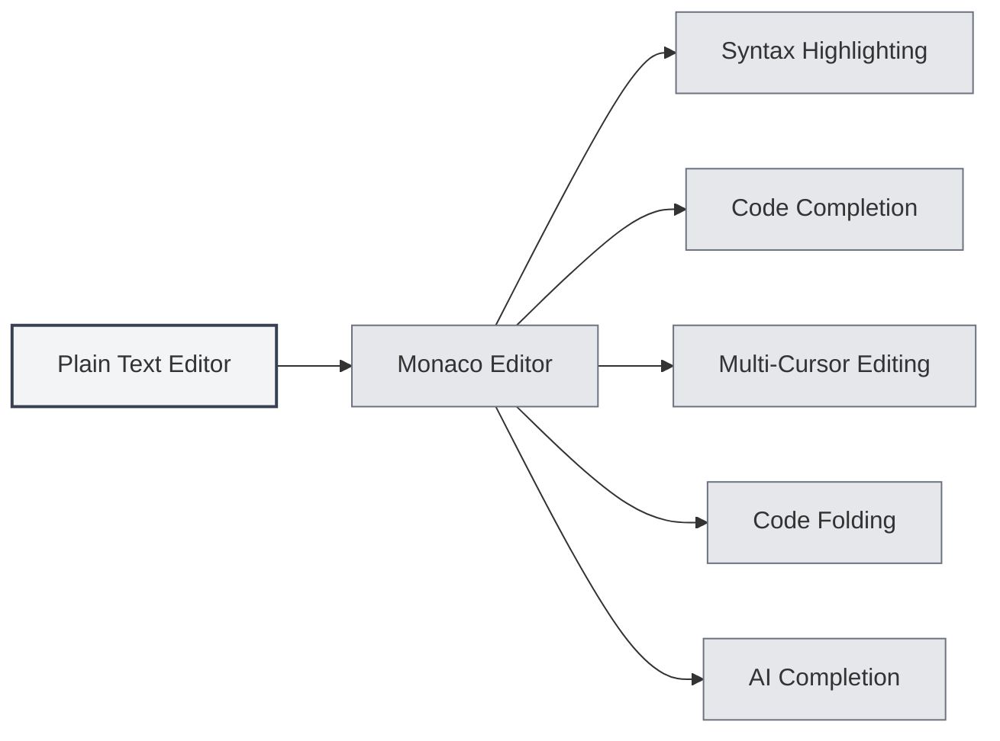
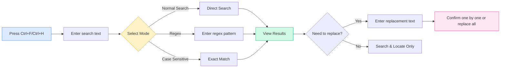

# Plain Text Editor

## Overview

The plain text editor is used for editing plain text files and code files. MetaDoc's plain text editor is based on the Monaco Editor, providing a professional code editing experience with features such as syntax highlighting, code completion, and AI-assisted completion.

The plain text editor supports various file formats, including code files (`.js`, `.py`, `.java`, etc.) and configuration files (`.json`, `.yaml`, `.ini`, etc.). It automatically detects the language based on the file extension and applies the corresponding syntax highlighting.

## Monaco Editor Features

<LaTeXEditorDemo mode="demo" />

<SearchReplaceMenu mode="demo" :position='{"top": 100, "left": 200}' :adapter='null' />

<MenuItemsDemo mode="demo" :items='[{"id": "file"}]' />

<ViewMenuItemsDemo mode="demo" :items='["editor", "outline"]' />

### Editor Introduction

The plain text editor uses the Monaco Editor, which has the following characteristics:

- **Professional Code Editing**: Provides an editing experience similar to Visual Studio Code.
- **Syntax Highlighting**: Automatically applies syntax highlighting based on file type.
- **Code Completion**: Supports intelligent code completion.
- **Multi-Cursor Editing**: Supports editing with multiple cursors simultaneously.
- **Code Folding**: Supports folding code blocks.

### Supported File Formats

The plain text editor supports the following file formats:

**Code Files**:

- JavaScript/TypeScript: `.js`, `.jsx`, `.ts`, `.tsx`
- Python: `.py`
- Java: `.java`
- C/C++: `.c`, `.cpp`, `.h`, `.hpp`
- C#: `.cs`
- Go: `.go`
- Rust: `.rs`
- Swift: `.swift`
- Kotlin: `.kt`
- Others: `.php`, `.rb`, `.scala`, `.dart`, `.lua`, etc.

**Configuration Files**:

- JSON: `.json`
- YAML: `.yaml`, `.yml`
- XML: `.xml`
- TOML: `.toml`
- INI: `.ini`, `.conf`
- SQL: `.sql`

**Script Files**:

- Shell: `.sh`, `.bash`, `.zsh`
- PowerShell: `.ps1`
- Others: `.vim`, `.diff`, `.patch`, `.log`

### Automatic Language Detection

The editor automatically detects the language based on the file extension:

- **File Extension**: Selects the corresponding language mode based on the file extension.
- **Syntax Highlighting**: Automatically applies the appropriate syntax highlighting rules.
- **Code Completion**: Enables code completion for the corresponding language.

If a file has no extension or the extension is not recognized, the editor will use plain text mode.

## Code Highlighting

### Syntax Highlighting

The editor automatically applies syntax highlighting based on the file type:

- **Keyword Highlighting**: Language keywords are displayed in different colors.
- **String Highlighting**: Strings are displayed in a specific color.
- **Comment Highlighting**: Comments are displayed in gray.
- **Function Highlighting**: Function names are displayed in a specific color.

Syntax highlighting makes the code structure clearer, facilitating reading and editing.

### Theme Synchronization

The code highlighting theme follows the editor theme:

- **Light Theme**: Uses light syntax highlighting in light theme.
- **Dark Theme**: Uses dark syntax highlighting in dark theme.
- **Automatic Synchronization**: Automatically syncs with the editor theme settings.

## Line Number Display

### Displaying Line Numbers

Line numbers are displayed on the left side of the editor, helping you:

- **Locate Code**: Quickly navigate to a specific line.
- **Reference Code**: Easily reference specific code lines in documentation.
- **Debug Code**: Quickly locate error positions.

### Configuring Line Numbers

Line number display can be configured in the settings:

1. Open the settings page.
2. Find "Line Number Display" in the "Editor Settings" section.
3. Toggle the switch to enable or disable line numbers.

Line number settings affect all Monaco editors (plain text editor, LaTeX editor, etc.).

<MenuItemsDemo mode="demo" :items='[{"id": "file", "items": ["new", "open", "save"]}]' />

<ViewMenuItemsDemo mode="demo" :items='["editor", "outline"]' />

<MainTabs mode="demo" />

<AISuggestionGhost mode="demo" />

<LaTeXEditorDemo mode="demo" />

## File Preview and Statistics

### File Statistics

The editor displays file statistics:

- **Character Count**: Shows the total number of characters in the file.
- **Line Count**: Shows the total number of lines in the file.
- **Word Count**: Shows the total number of words in the file (if applicable).

Statistics are displayed in the status bar or at the bottom of the editor.

### File Preview

When opening a file, the editor will:

- **Load Content**: Quickly load the file content.
- **Apply Highlighting**: Apply syntax highlighting based on the file type.
- **Display Statistics**: Show the file's statistical information.

### File Format Detection

The editor automatically detects the file format:

- **Extension Detection**: Identifies the format based on the file extension.
- **Content Detection**: If the extension is ambiguous, attempts to identify based on content.
- **Manual Selection**: Allows manual selection of the file format.

## AI Completion Feature

### AI Auto-Completion

The plain text editor supports AI auto-completion:

- **Auto-Trigger**: Automatically triggers completion after stopping typing.
- **Manual Trigger**: Use `Shift+Tab` to manually trigger completion.
- **Intelligent Completion**: Generates completion suggestions based on context.

The AI completion feature can help you:

- **Generate Code**: Generate code based on comments or context.
- **Complete Functions**: Complete function definitions or calls.
- **Generate Comments**: Generate code comments.

### Completion Settings

AI completion settings are the same as for the Markdown editor:

- **Enable/Disable**: Can be enabled or disabled in settings.
- **Trigger Keys**: Can configure trigger keys (Enter, Space, `;`, `,`).
- **Completion Mode**: Can choose between full generation or partial generation.
- **Max Tokens**: Can set the maximum number of tokens for completion.

For details, see [[ai.completion|AI Auto-Completion]].

## Editor Features

### Code Folding

The editor supports folding code blocks:

- **Fold Code Block**: Click the fold icon to the left of the line numbers.
- **Expand Code Block**: Click the fold marker to expand.
- **Shortcuts**: `Ctrl+Shift+[` to fold, `Ctrl+Shift+]` to expand.

Code folding allows you to focus on the currently edited section.

### Find and Replace

The editor supports powerful find and replace functionality to help you quickly locate and modify content in code:

**Basic Operations**:

- **Find**: `Ctrl+F` opens the find dialog; enter the text to find.
- **Replace**: `Ctrl+H` opens the find and replace dialog; enter the search and replacement text.
- **Replace One by One**: Replace after confirming each match.
- **Replace All**: Replace all matches at once.

**Advanced Options**:

- **Regular Expressions**: Use regex for complex pattern matching.
- **Case Matching**: Case-sensitive search.
- **Whole Word Matching**: Match only complete words.

**Use Cases**:

- Batch rename variables.
- Find specific function calls.
- Replace strings in code.
- Perform complex replacements using regular expressions.

The find and replace panel interface is as follows:

<SearchReplaceMenu mode="demo" :position='{"top": 100, "left": 200}' :adapter='null' />

### Multi-Cursor Editing

The editor supports editing with multiple cursors simultaneously:

- **Add Cursor**: `Alt+Click` to add a new cursor at the clicked position.
- **Add Cursor Above**: `Ctrl+Alt+↑` to add a cursor above.
- **Add Cursor Below**: `Ctrl+Alt+↓` to add a cursor below.
- **Select Same Word**: `Ctrl+D` to select the next occurrence of the same word.

Multi-cursor editing allows modifying multiple positions at once, improving editing efficiency.

## Integrated Terminal

The plain text editor provides an integrated terminal panel at the bottom, powered by xterm.js and node-pty for a real terminal environment. It supports interactive programs (e.g. vim, python) and shell switching.

<ConsoleTerminal mode="demo" consoleKey="plaintext" :history='[]' />

### Terminal Features

- **Real Terminal**: Uses node-pty PTY for persistent sessions; supports vim, python, and other interactive programs.
- **Shell Switching**: Switch between cmd, PowerShell, bash, or other shells.
- **Working Directory**: Terminal starts in the directory of the currently open file.
- **Clear / Copy / Save**: Clear screen, copy output, or save logs to file.

Click the terminal icon in the toolbar to show or hide the terminal panel.

## Usage Tips

<LaTeXEditorDemo mode="demo" />

### Efficient Editing

1. **Use Shortcuts**: Master common shortcuts to improve editing efficiency.
2. **Use Code Folding**: Fold code blocks you don't need to view.
3. **Use Multi-Cursor**: Use multiple cursors to edit multiple positions simultaneously.

### Code Completion

1. **Enable AI Completion**: Enable AI completion for intelligent suggestions.
2. **Use Manual Trigger**: Use `Shift+Tab` to manually trigger completion when needed.
3. **Adjust Settings**: Adjust completion settings according to your needs.

### File Management

1. **Identify Format**: Ensure the file extension is correct for automatic format recognition.
2. **View Statistics**: Check file statistics to understand file size.
3. **Save Files**: Save files promptly to avoid losing changes.

## Frequently Asked Questions

### Q: Syntax highlighting is incorrect?

A: Check if the file extension is correct. If the extension is incorrect, the editor may not recognize the file type. You can manually select the file format.

### Q: Code completion is not showing?

A: Ensure the AI completion feature is enabled. Some file types may not support code completion.

### Q: How to switch file format?

A: The file format is automatically recognized based on the file extension. If you need to change it, you can rename the file or manually select the format.

### Q: Line numbers are not showing?

A: Check if the "Line Number Display" option is enabled in the settings. Line number settings affect all Monaco editors.

### Q: File is too large to edit?

A: For very large files, the editor may limit certain features. It is recommended to use a dedicated text editor for handling extremely large files.

## Related Documentation

- [[core.editor-basics|Editor Basic Operations]]
- [[core.editor-settings|Editor Settings]]
- [[latex.editor|LaTeX Editor User Guide]]
- [[ai.completion|AI Auto-Completion]]
