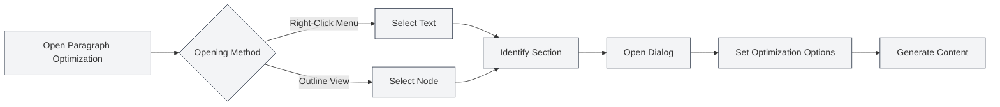

# Paragraph Optimization Feature

## Overview

The Paragraph Optimization feature allows you to use AI to optimize specific paragraphs or sections within a document. You can open the Paragraph Optimization feature from the right-click context menu or the outline view to generate or optimize paragraph content.

## Opening Paragraph Optimization

### Opening from the Right-Click Menu

You can open Paragraph Optimization via right-click in the editor:

1.  **Select Text**: Select the text you wish to optimize in the editor.
2.  **Right-Click Menu**: Right-click on the selected text.
3.  **Choose Optimization**: Select "Paragraph Optimization" or a similar option from the right-click menu.
4.  **Open Dialog**: The Paragraph Optimization dialog will open.

### Opening from the Outline

You can open Paragraph Optimization from the outline view:

1.  **Select Node**: Select the node you wish to optimize in the outline tree.
2.  **Right-Click Menu**: Right-click on the node.
3.  **Choose Optimization**: Select "Paragraph Optimization" or a similar option from the right-click menu.
4.  **Open Dialog**: The Paragraph Optimization dialog will open.

You can access the outline view via the sidebar:

<ViewMenuItemsDemo mode="demo" :items='["outline"]' />

<ViewMenuItemsDemo mode="demo" :items='["chat"]' />

<AIChat mode="demo" />

The Paragraph Optimizer interface is as follows:

<SectionOptimizer mode="demo" title="Example Section" path="1" :tree='{"text": "Example Section", "children": []}' language="markdown" :adapter='null' />

### Automatic Section Recognition

Paragraph Optimization automatically identifies the current section:

-   **Cursor Position**: Identifies the current section based on the cursor position.
-   **Selected Text**: If text is selected, uses the selected text.
-   **Outline Node**: If opened from the outline, uses the corresponding outline node.

## Optimization Options

### Optimization Mode

You can choose different optimization modes:

-   **Generate Content**: Generate new paragraph content.
-   **Optimize Content**: Optimize existing paragraph content.
-   **Append Content**: Append new content after the existing content.
-   **Replace Content**: Replace existing paragraph content.

### Context Mode

You can choose a context mode:

-   **Full Document Context**: Use the entire document as context.
-   **Section Context**: Use only the current section as context.
-   **No Context**: Do not use context information.

### Custom Prompt

You can input a custom prompt:

-   **Optimization Goal**: Describe the optimization goal.
-   **Content Requirements**: Specify content requirements.
-   **Style Requirements**: Specify the writing style.

### Preset Prompts

You can use preset prompts:

-   **Expand Content**: Expand paragraph content.
-   **Condense Content**: Condense paragraph content.
-   **Rewrite Content**: Rewrite paragraph content.
-   **Supplement Content**: Supplement paragraph content.

## Generating Content

### Generation Process

The process for generating content:

1.  **Analyze Section**: Analyze the structure and content of the current section.
2.  **Construct Prompt**: Build the optimization prompt based on the selected options.
3.  **Call AI**: Invoke the AI to generate optimized content.
4.  **Display Result**: Display the generated content in the dialog.

### Generation Result

The generated content is displayed in the dialog:

-   **Preview Content**: You can preview the generated content.
-   **Edit Content**: You can edit the generated content.
-   **Apply Content**: You can apply the content to the document.

### Generation Options

You can set options during generation:

-   **Streaming Output**: Display the generation process in real-time.
-   **One-Time Generation**: Wait for generation to complete before displaying.
-   **Cancel Generation**: You can cancel the generation process at any time.

## Applying Content

### Application Method

You can apply the generated content to the document:

-   **Replace**: Replace the original paragraph content.
-   **Insert**: Insert content at a specified position.
-   **Append**: Append content to the end of the paragraph.

### Application Position

You can specify the application position:

-   **Current Position**: Apply at the current cursor position.
-   **Section Start**: Apply at the beginning of the section.
-   **Section End**: Apply at the end of the section.

## Conversation Feature

### Continue Conversation

You can continue the conversation after generating content:

1.  **Open Conversation**: Click the "Continue Conversation" button.
2.  **Enter Conversation**: Enter the AI conversation interface.
3.  **Continue Optimization**: You can continue optimizing or modifying the content.

### Conversation Context

The conversation includes the following context:

-   **Original Content**: The original paragraph content.
-   **Generated Content**: The generated content.
-   **Optimization History**: The history of optimizations.

## Best Practices

1.  **Define Goal**: Clearly define the optimization goal and use clear prompts.
2.  **Choose Context**: Select the appropriate context mode based on the situation.
3.  **Preview Content**: Preview the content after generation to ensure it meets requirements.
4.  **Edit and Adjust**: You can further edit and adjust the content after generation.
5.  **Multiple Optimizations**: You can optimize multiple times to gradually refine the content.

## Notes

1.  **Section Recognition**: Ensure sections are correctly identified to avoid optimizing the wrong content.
2.  **Context Usage**: Use context appropriately to avoid excessively long content.
3.  **Content Quality**: Generated content requires manual review and adjustment.
4.  **Token Consumption**: The optimization feature consumes tokens; be mindful of usage.
5.  **Save Document**: Remember to save the document after applying content.

## Related Documentation

-   [[outline.basics|Outline View Feature]]
-   [[ai.chat|AI Conversation Feature]]
-   [[ai.completion|AI Auto-Completion]]

<Outline mode="demo" />

<CompletionSettingsPanel mode="demo" />

<MenuItemsDemo mode="demo" :items='[{"id": "ai"}]' />

<ViewMenuItemsDemo mode="demo" :items='["chat"]' />