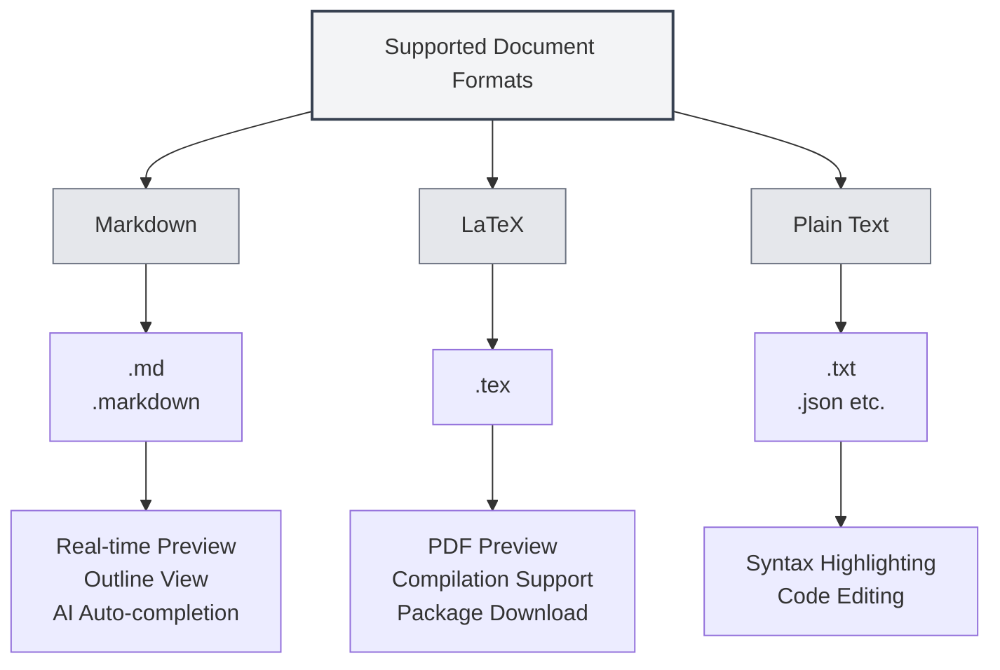

# Supported Document Formats

## Overview

MetaDoc supports multiple document formats, including Markdown, LaTeX, and plain text. The system automatically detects the file format, and manual format selection is also supported.

<MenuItemsDemo mode="demo" :items='[{"id": "file"}]' />

<MenuItemsDemo mode="demo" :items='[{"id": "edit"}]' />

<MenuItemsDemo mode="demo" :items='[{"id": "view"}]' />

<ViewMenuItemsDemo mode="demo" :items='["home", "outline", "chat"]' />

<MainTabs mode="demo" />

## Supported Formats

### Markdown Format

**File Extensions**: `.md`, `.markdown`

**Features**:

- Supports standard Markdown syntax
- Supports extended syntax (tables, code blocks, mathematical formulas, etc.)
- Supports real-time preview
- Supports outline view
- Supports AI auto-completion

**Use Cases**:

- Technical documentation writing
- Blog post creation
- Note-taking
- Document authoring

### LaTeX Format

**File Extension**: `.tex`

**Features**:

- Professional academic paper writing format
- Supports mathematical formulas, tables, charts
- Real-time PDF preview
- Supports automatic package downloads
- Supports compilation error prompts

**Use Cases**:

- Academic paper writing
- Technical report writing
- Book typesetting
- Complex document layout

### Plain Text Format

**File Extensions**: `.txt`, `.json`, etc.

**Features**:

- Simple text editing
- Syntax highlighting support
- Code editing functionality
- Does not support preview and outline

**Use Cases**:

- Code file editing
- Configuration file editing
- Simple text editing
- Data file editing

## File Format Detection

### Automatic Detection

MetaDoc automatically detects the file format:

1. **Extension Detection**: Primarily detects format based on file extension
   - `.md`, `.markdown` → Markdown format
   - `.tex` → LaTeX format
   - `.txt`, `.json`, etc. → Plain text format

2. **Content Detection**: If the extension cannot determine the format, the file content is detected
   - LaTeX content is preferentially recognized as LaTeX format
   - Other content is recognized as Markdown format by default

3. **Default Format**: If detection fails, Markdown format is used by default

### Detection Priority

Format detection follows this priority order:

1. **File Extension**: Uses extension detection first
2. **File Content**: If the extension is inconclusive, content is detected
3. **Default Format**: Uses the default format if detection is impossible

### Detection Rules

- **Markdown Detection**: Recognized as Markdown when the extension is `.md` or `.markdown`
- **LaTeX Detection**: Recognized as LaTeX when the extension is `.tex` or the content contains LaTeX commands
- **Plain Text Detection**: Recognized as plain text for other extensions or when the format cannot be determined

## Manual Format Selection

### Selecting When Opening a File

You can manually select the format when opening a file:

1. **Open File Dialog**: In the open file dialog
2. **Format Selection**: Select the file format (if automatic detection is incorrect)
3. **Confirm Open**: Open the file in the selected format after confirmation

### Selecting When Creating a New File

You can select the format when creating a new file:

1. **New Document**: Click the "New Document" button
2. **Select Format**: Choose the format in the format selection dialog
3. **Create Document**: Create a document of the specified format

### Switching Formats

You can switch the format of an already opened document:

1. **Open Document**: Open the document whose format you want to switch
2. **Format Menu**: Find the format switch option in the menu
3. **Select Format**: Choose the new format
4. **Confirm Switch**: Confirm the format switch

**Notes**:

- Switching formats may affect document content
- Some format-specific features may not be convertible
- It is recommended to back up the document before switching

## Format Feature Comparison

### Feature Support

| Feature         | Markdown | LaTeX    | Plain Text |
| --------------- | -------- | -------- | ---------- |
| Real-time Preview | ✅       | ✅ (PDF) | ❌         |
| Outline View    | ✅       | ✅       | ❌         |
| AI Auto-completion | ✅       | ✅       | ✅         |
| Mathematical Formulas | ✅       | ✅       | ❌         |
| Table Support   | ✅       | ✅       | ❌         |
| Code Highlighting | ✅       | ✅       | ✅         |
| Metadata Support | ✅       | ✅       | ❌         |

### Editor Features

| Feature         | Markdown | LaTeX | Plain Text |
| --------------- | -------- | ----- | ---------- |
| Syntax Highlighting | ✅       | ✅    | ✅         |
| Auto-completion | ✅       | ✅    | ✅         |
| Error Hints     | ✅       | ✅    | ❌         |
| Folding         | ✅       | ✅    | ✅         |
| Multi-cursor Editing | ✅       | ✅    | ✅         |

## Format Conversion

### Export Formats

Documents can be exported to other formats:

- **Markdown → PDF**: Export as a PDF document
- **Markdown → HTML**: Export as an HTML document
- **Markdown → DOCX**: Export as a Word document
- **LaTeX → PDF**: Compile to a PDF document
- **LaTeX → Markdown**: Convert to Markdown format

### Conversion Notes

Pay attention to the following during format conversion:

- **Content Compatibility**: Some format-specific features may not be convertible
- **Style Loss**: Some styles may be lost after conversion
- **Content Adjustment**: Manual content adjustment may be needed after conversion

## Best Practices

1. **Choose the Appropriate Format**: Select the suitable format based on the document type
2. **Use Standard Extensions**: Use standard file extensions for easier automatic detection
3. **Format Consistency**: Use a unified format within the same project
4. **Back Up Documents**: Back up the original document before format conversion
5. **Test Conversion**: Check if the content is correct after conversion

## Notes

1. **Format Detection**: Automatic detection may be inaccurate; manual selection is available
2. **Format Switching**: Switching formats may affect document content
3. **Compatibility**: Different formats support different features
4. **File Extensions**: It is recommended to use standard extensions
5. **Format Conversion**: Some content or styles may be lost during conversion

## Related Documents

- [[markdown.basics|Markdown Syntax]]
- [[latex.basics|LaTeX Syntax]]
- [[editor.plain-text|Plain Text Editor]]
- [[core.file-operations|File Operations]]
