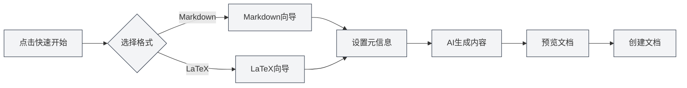

# Home Page Features

## Overview

The home page serves as the entry interface for MetaDoc, providing quick start, new document creation, file opening, and other functions. Designed to be clean and aesthetically pleasing, it helps you get started with MetaDoc quickly.

## Quick Start

### Quick Start Wizard

Click the "Quick Start" button to launch the quick start wizard:

1.  **Select Format**: Choose the document format (Markdown or LaTeX)
2.  **Set Metadata**: Enter document title, author, and other information
3.  **AI-Generated Content**: Use AI assistance to generate document content
4.  **Preview Document**: Preview the generated document content
5.  **Create Document**: Confirm to create the document

The format selection interface of the quick start wizard is as follows:

<QuickStartPanel mode="demo" />

### Markdown Quick Start

After selecting the Markdown format:

-   **Template Selection**: You can choose a Markdown template
-   **Content Generation**: AI can generate Markdown content
-   **Quick Editing**: Start editing immediately after creation

The wizard interface entered after selecting Markdown:

<QuickStartMarkdown mode="demo" />

### LaTeX Quick Start

After selecting the LaTeX format:

-   **Document Type**: You can choose the document type (article, book, etc.)
-   **Content Generation**: AI can generate LaTeX content
-   **Compile & Preview**: Compile and preview PDF after creation

The wizard interface entered after selecting LaTeX:

<QuickStartLatex mode="demo" />

## New Document

### Create a Blank Document

Click the "New Document" button to quickly create a blank document:

1.  Click the "New Document" button
2.  Select the document format (Markdown/LaTeX/Plain Text)
3.  The document will open in a new tab

**Shortcut**: You can also use `Ctrl+N` (Windows/Linux) or `Cmd+N` (macOS) to create one quickly.

## Open File

### Open an Existing File

Click the "Open File" button to open an existing file:

1.  Click the "Open File" button
2.  Select the file in the file selection dialog
3.  The file will open in a new tab

**Shortcut**: You can also use `Ctrl+O` (Windows/Linux) or `Cmd+O` (macOS) to open quickly.

### Supported File Formats

-   **Markdown** (.md)
-   **LaTeX** (.tex)
-   **Plain Text** (.txt)
-   **JSON** (.json)

## User Manual

### Open the User Manual

Click the "User Manual" button to open the user manual:

1.  Click the "User Manual" button
2.  The user manual will open in a new tab
3.  You can browse and learn about various features

**Shortcut**: You can also press the `F1` key to open the user manual quickly.

## Recent Documents List

### View Recent Documents

The home page displays a list of recently opened documents:

-   **Display Count**: Shows up to 12 recent documents
-   **Document Cards**: Each document is displayed as a card
-   **Quick Open**: Click a card to quickly open the document

### Recent Document Actions

-   **Open Document**: Click a document card to open it
-   **Delete Record**: Click the delete button on a card to remove its record
-   **Right-Click Menu**: Right-clicking a card may reveal more options

### Recent Document Management

-   **Auto-Update**: The list updates automatically after opening a document
-   **Record Saving**: Recent document records are saved
-   **List Sorting**: Sorted in reverse chronological order of opening time

## User Profile Dialog

### Open User Profile

The home page may display a user profile dialog:

-   **First Use**: May prompt to set up user profile upon first use
-   **Profile Setup**: You can set user persona and usage preferences
-   **AI Optimization**: User profile helps AI better understand your needs

### User Profile Content

The user profile may include:

-   **Basic Information**: Name, occupation, etc.
-   **Usage Preferences**: Editing habits, frequently used features, etc.
-   **User Persona**: Helps AI understand your usage scenarios

## Home Page Interface

### Interface Layout

The home page uses a centered layout:

-   **Top**: MetaDoc title and subtitle
-   **Middle**: Action button area
-   **Bottom**: Recent documents list

### Visual Design

The home page features a clean, modern design:

-   **Dynamic Background**: Animated dynamic background effect
-   **Grid Decoration**: Minimalist grid decoration
-   **Card Design**: Action buttons use a card design

## Best Practices

1.  **Quick Start**: It is recommended to use the quick start wizard for first-time use.
2.  **Shortcuts**: Master the use of shortcuts to improve efficiency.
3.  **Recent Documents**: Utilize the recent documents list for quick access to frequently used documents.
4.  **User Profile**: Set up your user profile for a better AI experience.
5.  **User Manual**: Consult the user manual when encountering issues.

## Notes

1.  **Home Page Display**: The home page is only displayed when no documents are open.
2.  **Quick Start**: The quick start wizard can be closed at any time.
3.  **Recent Documents**: The recent documents list displays a maximum of 12 items.
4.  **User Profile**: User profile setup is optional.
5.  **Interface Language**: The home page interface language follows the system language settings.

## Related Documents

-   [[quick-start.guide|Quick Start Guide]]
-   [[core.file-operations|File Operations]]
-   [[user.profile|User Profile]]
-   [[views.types|View Types]]

<MenuItemsDemo mode="demo" :items='[{"id": "file"}]' />

<MenuItemsDemo mode="demo" :items='[{"id": "edit"}]' />

<MenuItemsDemo mode="demo" :items='[{"id": "view"}]' />

<ViewMenuItemsDemo mode="demo" :items='["home", "outline", "chat", "agent"]' />

<MainTabs mode="demo" />

<UserProfileView mode="demo" />