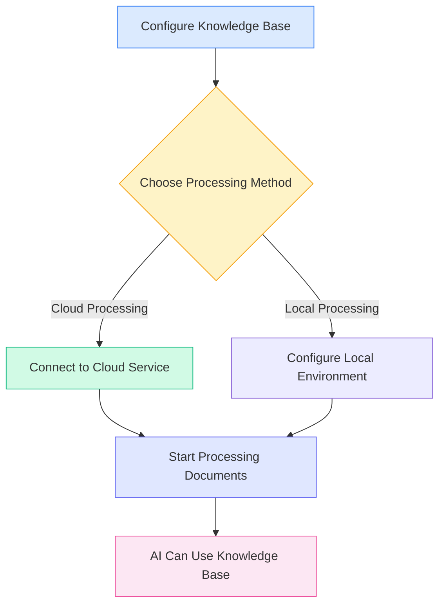
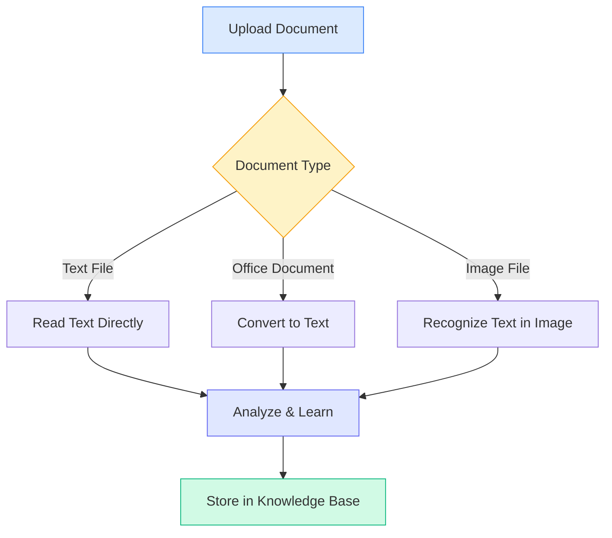

# Knowledge Base Configuration

## Overview

The Knowledge Base is MetaDoc's intelligent document management system. By "learning" your documents into the knowledge base, the AI can understand and reference this content, providing you with more accurate answers and suggestions.

This guide will help you configure the knowledge base to better serve your needs.

## Enabling the Knowledge Base Feature

On the Knowledge Base settings page, you first need to enable the knowledge base feature:

1.  Locate the "Enable Knowledge Base" toggle.
2.  Switch the toggle to the "Enabled" state.
3.  Configure the relevant knowledge base parameters.

You can access knowledge base management via the top menu bar:

<KnowledgeBase mode="demo" />

The image above shows the main functional areas of the knowledge base management interface:

-   **Left Panel**: Knowledge base list and search functionality.
-   **Central Area**: List of added documents.
-   **Right Details**: Detailed information and processing status of the selected document.
-   **Bottom Toolbar**: Action buttons such as Add Document, Start Processing, Delete, etc.

## Choosing the Processing Method

### Introduction to the Two Methods

MetaDoc provides two methods for processing documents:

**Cloud Processing (Recommended)**

-   Sends documents to cloud services for analysis.
-   Fast processing speed, no local resource consumption.
-   Requires an internet connection.

**Local Processing (Under Development)**

-   Processes documents directly on your computer.
-   Data stays completely local, protecting privacy.
-   Requires a relatively powerful computer configuration.

The current version only supports the cloud processing method. You can select it in the settings:

<MenuItemsDemo mode="demo" :items='[{"id": "settings"}]' />

### Advantages of Cloud Processing

For most users, we recommend using cloud processing:

-   **Quick Start**: No need to configure a complex local environment.
-   **Time-Saving**: Faster when processing large volumes of documents.
-   **Resource-Efficient**: Does not consume your computer's memory and processor.
-   **Easy Maintenance**: Automatic updates, no manual management required.

### When to Use Local Processing

You can wait for the local processing feature to become available if you have the following requirements:

-   Processing highly sensitive confidential documents.
-   Frequently working in environments without internet access.
-   Possessing a high-performance computer configuration (with a dedicated graphics card).
-   Needing to process massive amounts of documents (exceeding 10GB).

<SettingKnowledgeBaseSection mode="demo" />

## Understanding How the Knowledge Base Works

### How Documents Are "Learned"

<RAGToolDisplay mode="demo" />

When you add a document to the knowledge base, MetaDoc performs the following steps:

1.  **Reads Document Content**

    -   Extracts text from formats like PDF, Word, images, etc.
    -   Preserves the document's structure and formatting information.

2.  **Understands Document Meaning**

    -   Converts text into a "semantic representation" that the AI can understand.
    -   This is like adding intelligent tags to the document.

3.  **Builds an Index**

    -   Creates an index for fast lookup.
    -   Allows the AI to find relevant content instantly.

4.  **Stores Knowledge**
    -   Saves the processing results in the local database.
    -   Ready to be called upon at any time.

<KnowledgeBase mode="demo" />

## Supported Document Types

### Formats That Can Be Processed Directly

The MetaDoc Knowledge Base supports various common document formats:

**Text-based**

-   Markdown documents (.md) – The preferred format for technical documentation.
-   LaTeX documents (.tex) – A common format for academic papers.
-   Plain text files (.txt) – Simple text records.

**Office Documents**

-   PDF files (.pdf) – The most universal document format.
-   Word documents (.docx) – Microsoft Office format.

**Image-based**

-   PNG images (.png) – Screenshots, charts.
-   JPEG images (.jpg, .jpeg) – Photos, scanned documents.

### Processing Methods for Different Documents

MetaDoc processes different types of documents in different ways:

**Text Documents** (Markdown, LaTeX, TXT)

-   Reads text content directly.
-   Preserves heading structure and formatting.
-   Fastest processing speed.

**Office Documents** (PDF, Word)

-   First converts them to plain text.
-   Extracts structure like headings, paragraphs.
-   Preserves the logical hierarchy of the document.

**Image Documents** (PNG, JPG)

-   Uses OCR technology to recognize text within the images.
-   Suitable for processing scanned paper documents.
-   Relatively longer processing time.

<RAGToolDisplay mode="demo" />

## Intelligent Retrieval Mechanism

### How the Knowledge Base Finds Relevant Content

When the AI needs to use the knowledge base, MetaDoc employs an intelligent retrieval strategy:

**Semantic Matching**

-   Not only matches keywords but also understands the meaning of the question.
-   For example: Searching for "how to install" can also find related content like "installation steps" or "deployment guide".

**Hybrid Retrieval**

-   Combines semantic understanding with keyword matching.
-   Ensures both accuracy and improves recall rate.
-   Automatically ranks results, showing the most relevant content first.

**Fast Response**

-   Uses efficient indexing algorithms.
-   Millisecond-level response, ensuring smooth conversation flow.

<KnowledgeBase mode="demo" />

## Chunking Explanation

### Why Chunking is Needed

For more efficient retrieval, MetaDoc splits long documents into smaller chunks:

**Benefits of Chunking**

-   **Precise Localization**: Can locate specific paragraphs within a document.
-   **Increased Speed**: Smaller chunks process and retrieve faster.
-   **Context Preservation**: Overlap between adjacent chunks prevents semantic breaks.

**Default Settings**

-   Each chunk is approximately 500 characters (about 250 Chinese characters).
-   Adjacent chunks overlap by 50 characters.
-   This setting strikes a balance between accuracy and efficiency.

### Chunking Example

Assume there is a long article:

Original Text: [Opening paragraph... Middle paragraph... Closing paragraph...]

After chunking:

-   Chunk 1: Opening paragraph + part of middle content.
-   Chunk 2: Part of middle content (overlap area) + more middle content.
-   Chunk 3: More middle content + closing paragraph.

This way, even if a question only involves "middle content", the relevant part can be accurately found.

<SettingKnowledgeBaseSection mode="demo" />

## Configuration Recommendations

### Recommended Settings for First-Time Use

If you are using the knowledge base for the first time, we recommend the following settings:

-   **Processing Method**: Cloud Processing (default).
-   **Retrieval Sensitivity**: Medium (default value).
    -   Too high sensitivity: May return too many irrelevant results.
    -   Too low sensitivity: May miss some relevant content.
    -   Medium setting: Balances both.

### For Different Types of Documents

**Technical Documentation/Manuals**

-   Suitable for creating a dedicated knowledge base.
-   AI can accurately answer technical questions.
-   Supports retrieval of code snippets.

**Academic Papers**

-   Preserves complete citation information.
-   Supports cross-document knowledge association.
-   Suitable for literature reviews and research.

**Daily Notes**

-   Build a personal knowledge base.
-   Quickly retrieve past records.
-   Supports reference during creative writing.

### Usage Suggestions

**1. Regular Maintenance**

-   Delete outdated or no longer needed documents.
-   Update new versions of existing documents.
-   Keep the knowledge base tidy and accurate.

**2. Reasonable Categorization**

-   Group documents on related topics together.
-   Set clear names for knowledge bases.
-   Facilitates management and use.

**3. Privacy Considerations**

-   Be cautious when uploading confidential documents.
-   Understand how your data is processed.
-   Choose the appropriate processing method.

<RAGToolDisplay mode="demo" />

## Important Notes

### Things to Know Before Use

1.  **Processing Time**

    -   Small documents (1-10 pages): A few seconds.
    -   Medium documents (10-50 pages): Tens of seconds.
    -   Large documents (50+ pages): May take several minutes.
    -   Please wait patiently for processing to complete.

2.  **Storage Space**

    -   The knowledge base occupies some hard drive space.
    -   Roughly 2-3 times the size of the original documents.
    -   Regularly cleaning up unused documents can free up space.

3.  **Network Requirements**

    -   An internet connection is required when adding documents.
    -   Retrieval does not require a network (stored locally).
    -   Unstable networks may affect processing speed.

4.  **File Format**
    -   Ensure uploaded files are in the correct format.
    -   Corrupted files may fail to process.
    -   Encrypted PDFs need to be decrypted first.

### Frequently Asked Questions

**Q: Is the data in the knowledge base secure?**
A: The vector data from processed documents is stored locally. If using cloud processing, the original document is sent to the cloud service for processing and is deleted afterward. It is recommended not to upload highly sensitive content.

**Q: How large of a document can be processed?**
A: It is recommended that a single document does not exceed 100MB. Very large documents can be split into multiple smaller documents for processing.

**Q: Can processed documents be modified?**
A: The content in the knowledge base is a "snapshot" of the original document. If a document is updated, it needs to be re-added to the knowledge base.

**Q: Why can't some content be retrieved?**
A: Possible reasons: 1) The document has not finished processing; 2) The content is in an image and OCR recognition failed; 3) The search terms differ significantly from how the content is expressed in the document.

## Related Documentation

-   [[knowledge-base.management|Knowledge Base Management]] - Learn how to add, delete, and manage documents in the knowledge base.
-   [[knowledge-base.usage|Knowledge Base Usage]] - Understand how to use the knowledge base in AI conversations.
-   [[ai.chat|AI Chat Feature]] - Explore the advanced features of AI conversations.
