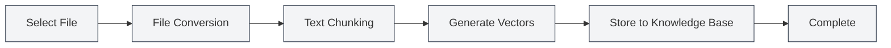

# Knowledge Base Management

## Overview

<KnowledgeBase mode="demo" />

Knowledge base management is the core function of the MetaDoc RAG (Retrieval-Augmented Generation) system, allowing you to add documents to the knowledge base and provide contextual information for AI conversations through vector search. The knowledge base helps AI better understand your document content and provide more accurate answers.

## Enabling the Knowledge Base

### Enabling the Knowledge Base Feature

On the knowledge base settings page, you first need to enable the knowledge base feature:

1.  Locate the "Enable Knowledge Base" toggle.
2.  Switch the toggle to the "Enabled" state.
3.  Configure the relevant knowledge base parameters.

You can access knowledge base management via the top menu bar:

<MenuItemsDemo mode="demo" :items='[{"id": "settings"}]' />

### Knowledge Base Settings

<SettingKnowledgeBaseSection mode="demo" />

Before enabling the knowledge base, you can configure related parameters on the settings page:

The image above shows the main options of the knowledge base settings interface:

-   **Enable Knowledge Base**: Turn the knowledge base feature on or off.
-   **Embedding Mode**: Choose cloud processing or local processing (under development).
-   **Confidence Threshold**: Controls the relevance filtering of retrieval results.
-   **Maximum Retrieval Count**: Limits the maximum number of results returned per retrieval.

### Knowledge Base Management Interface

<KnowledgeBase mode="demo" />

After enabling the knowledge base, you can add and manage documents in the knowledge base management interface:

The knowledge base management interface provides the following functions:

-   **Document List**: View all documents added to the knowledge base.
-   **Add Document**: Supports various formats like PDF, Word, images, Markdown, etc.
-   **Processing Status**: Displays the processing progress of documents in real-time.
-   **Search Test**: Test the retrieval effectiveness of the knowledge base.

After enabling the knowledge base, AI features (such as AI Chat, AI Completion) will automatically use information from the knowledge base to enhance answer quality.

**Important Notes**:

-   After enabling the knowledge base, AI features will retrieve content from it, which may affect response speed.
-   The knowledge base requires files to be added first to be effective.
-   It is recommended to enable the knowledge base after adding files.

<RAGToolDisplay mode="demo" />

## Confidence Threshold Setting

### Understanding the Confidence Threshold

The confidence threshold (Score Threshold) controls the filtering criteria for knowledge base retrieval results:

-   **Low Threshold (0.1-0.3)**: Returns more results but may include irrelevant content.
-   **Medium Threshold (0.4-0.6)**: Balances relevance and quantity; recommended for general use.
-   **High Threshold (0.7-0.9)**: Returns only highly relevant results but may miss related information.

### Setting Recommendations

-   **General Scenarios**: Recommend 0.5 to balance accuracy and coverage.
-   **High-Precision Needs**: Recommend 0.7-0.8 to ensure highly relevant results.
-   **Exploratory Search**: Recommend 0.3-0.4 to obtain more related information.

The threshold setting affects all AI features that use the knowledge base, including AI Chat, AI Completion, etc.

<SettingKnowledgeBaseSection mode="demo" />

## Knowledge Base File Management

### Adding Files to the Knowledge Base

1.  On the knowledge base management page, click the "Add File" button.
2.  Select the file(s) to add (multiple formats supported).
3.  The system will automatically process the file(s):
    -   Convert the file to text.
    -   Split the text into chunks.
    -   Generate vector embeddings.
    -   Store them in the knowledge base.

**Supported File Formats**:

-   Markdown (.md)
-   LaTeX (.tex)
-   PDF (.pdf)
-   Word (.docx)
-   Images (.png, .jpg, etc., recognized via OCR)
-   Plain Text (.txt)

### File Processing Flow

### File List Management

<KnowledgeBase mode="demo" />

The knowledge base management page displays all added files:

-   **Filename**: Shows the name of the file.
-   **Status**: Shows whether the file is enabled.
-   **Chunk Count**: Shows the number of chunks the file was split into.
-   **Vector Count**: Shows the number of vectors generated.
-   **Actions**: Provides file management operations.

### Enabling/Disabling Files

You can temporarily disable a file without deleting it:

1.  Find the file you want to operate on in the file list.
2.  Click the "Enable" or "Disable" button.
3.  Once disabled, the file will not be retrieved, but its data remains stored.

**Use Cases**:

-   Temporarily exclude certain files.
-   Test the effect of different file combinations.
-   Keep a file but not use it for the time being.

### Deleting Files

1.  Find the file you want to delete in the file list.
2.  Click the "Delete" button.
3.  Confirm the deletion operation.

Deleting a file will:

-   Delete the file record.
-   Delete all related data chunks.
-   Delete all related vectors.
-   The operation is irreversible.

**Important Notes**:

-   The delete operation is irreversible; please proceed with caution.
-   Deleting large files may take some time.
-   Files need to be re-added to be restored after deletion.

### Renaming Files

1.  Find the file you want to rename in the file list.
2.  Click the "Rename" button.
3.  Enter the new filename.
4.  Confirm the rename.

Renaming only changes the display name and does not affect the file content or vector data.

### Previewing Files

You can preview the content of files in the knowledge base:

1.  Find the file you want to preview in the file list.
2.  Click the "Preview" button.
3.  View the text content of the file.

The preview feature can help you:

-   Confirm if the file content is correct.
-   Check if the file was processed correctly.
-   Understand the text structure of the file.

### Downloading Files

You can download files from the knowledge base:

1.  Find the file you want to download in the file list.
2.  Click the "Download" button.
3.  Choose the save location.

The downloaded file is a copy of the original file and can be used for backup or sharing.

<RAGToolDisplay mode="demo" />

## Vector Rebuilding

### Rebuilding Vectors

If there is an issue with a file's vector data, or if the Embedding model has been updated, you can rebuild the vectors:

1.  Find the file you want to rebuild in the file list.
2.  Click the "Rebuild Vectors" button.
3.  Wait for the rebuild to complete.

Rebuilding vectors will:

-   Re-process the file text.
-   Re-generate vector embeddings.
-   Update the vector index.

**Use Cases**:

-   Changed the Embedding model.
-   Vector data is corrupted.
-   Need to update the vector representation.

### Rebuilding All Vectors

If you need to rebuild vectors for all files:

1.  Click the "Rebuild All Vectors" button.
2.  Confirm the operation.
3.  Wait for all files to finish rebuilding.

Rebuilding all vectors may take a long time, especially when there are many files.

<KnowledgeBase mode="demo" />

## Knowledge Base Search Test

### Testing the Search Function

You can test the search function on the knowledge base management page:

1.  Enter query text in the search box.
2.  Click the "Search" button.
3.  View the search results.

Search results will display:

-   Matched text snippets.
-   Similarity score.
-   Source file.
-   Contextual information.

### Search Parameters

You can adjust the following during a test search:

-   **Query Text**: Enter the content to search for.
-   **Return Count**: Set the number of results to return.
-   **Threshold**: Set the minimum similarity threshold.

<RAGToolDisplay mode="demo" />

## Clearing the Knowledge Base

### Clearing All Data

If you need to clear the entire knowledge base:

1.  Click the "Clear Knowledge Base" button.
2.  Confirm the operation.
3.  Wait for the clearing to complete.

Clearing the knowledge base will:

-   Delete all file records.
-   Delete all data chunks.
-   Delete all vectors.
-   The operation is irreversible.

**Important Notes**:

-   The clear operation is irreversible; please proceed with caution.
-   It is recommended to back up important files before clearing.
-   Files need to be re-added after clearing.

## Best Practices

1.  **File Organization**: Organize files by topic or project for easier management.
2.  **Regular Updates**: Rebuild vectors promptly after file content is updated.
3.  **Threshold Adjustment**: Adjust the confidence threshold based on actual usage effectiveness.
4.  **File Cleanup**: Regularly delete files that are no longer needed to keep the knowledge base tidy.
5.  **Backup Important Files**: It is recommended to back up important files before adding them to the knowledge base.

## Important Notes

1.  **File Size**: Processing large files takes longer; please be patient.
2.  **Storage Space**: The knowledge base occupies a certain amount of storage space.
3.  **Processing Time**: Adding files and processing vectors takes time; do not interrupt the process.
4.  **File Format**: Ensure the file format is correct; otherwise, it may not be processed.
5.  **Network Connection**: Using API mode to generate vectors requires a network connection.

## Related Documentation

-   [[knowledge-base.config|Knowledge Base Configuration]]
-   [[knowledge-base.usage|Knowledge Base Usage]]
-   [[settings.llm|LLM Configuration]]
-   [[ai.chat|AI Chat Function]]